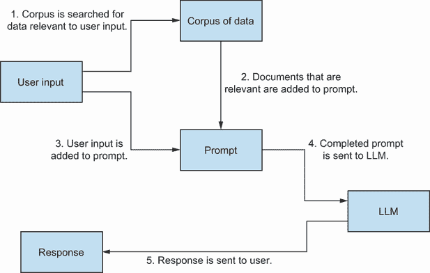
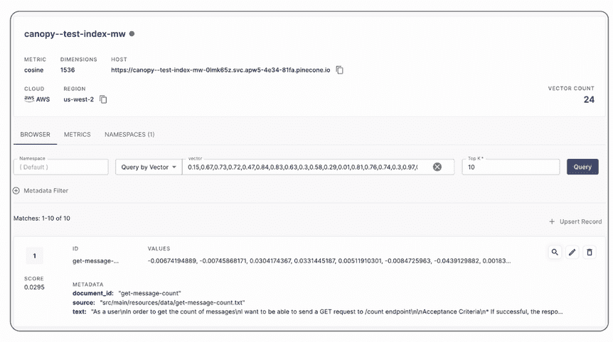

# 11 使用检索增强生成来上下文化提示

本章涵盖

+   RAG 是如何工作的

+   使用工具创建基本的 RAG 设置

+   将向量数据库集成到 RAG 设置中

如我们在上一章所学，与大型语言模型（LLMs）一起工作的一个挑战是它们缺乏对我们上下文的可见性。在这本书的第二部分，我们看到了不同的方法，我们可以安排我们的提示来帮助我们提供对我们上下文的小洞察。然而，这类提示只有在缺乏额外上下文导致响应价值降低之前才有用。因此，为了提高 LLM 响应的价值，我们需要在我们的提示中放入更多的上下文细节。在本章中，我们将探讨如何通过检索增强生成（RAG）来实现这一点。我们将学习 RAG 是如何工作的，为什么它是有益的，以及它从提示工程到构建我们自己的 RAG 框架示例的跳跃并不大，以建立我们对它们如何在测试上下文中帮助我们理解。

## 11.1 使用 RAG 扩展提示

回顾一下，RAG 是一种通过结合现有数据集和提示来提高 LLM 响应质量的方法。尽管这广泛地解释了 RAG 是如何工作的，但我们还需要深入挖掘，以更好地理解这种数据组合是如何实现的。RAG 系统的过程相对简单，可以总结如图 11.1 所示。



图 11.1 基本 RAG 系统工作原理的可视化

我们从用户输入开始，这可能是某种查询。例如，我们可能会向我们的 RAG 系统发送一个查询，比如“我想测试删除预订的想法。”这个查询随后会被发送到一个库或工具，它会检查我们的数据集中与查询相关的项目。在我们的例子中，这可能是一系列定义系统中每个特性的用户故事集合。库或工具将确定哪些用户故事最相关，然后将它们返回以添加到提示中：

|


| 你是一个为测试想法提供建议的机器人。你根据提供的用户故事回答建议的风险测试。这是用户故事：`{relevant_document}`用户输入是：`{user_input}`根据用户故事和用户输入，编制一个建议的风险测试列表。 |
| --- |

然后，LLM 将消费用户查询和相关的文档，以返回一个比如果我们直接将查询“我想测试删除预订的想法”发送给 LLM 更准确的响应。

通过在提示中的`{relevant_document}`点提供与初始查询在`{user_input}`点相关的数据，我们得到一个准确性和价值都提高的响应。但这确实提出了一个问题：为什么一开始就要寻找相关数据呢？我们难道不能只发送每个提示中已有的数据，从而消除进行相关性检查的需要吗？选择添加到提示中的文档很重要，原因有几个。首先，考虑我们可以创建的提示大小。我们可以发送给 LLM 的提示大小取决于其最大序列长度或上下文窗口。上下文窗口定义了一个 LLM 可以处理多少个单词或 token。如果我们添加的 token 超过了上下文窗口允许的数量，那么 LLM 将要么在提示末尾截断多余的 token（导致提示部分完成），要么返回错误。用实际的话来说，Meta 的开源 LLM Llama-2 默认的上下文窗口为 4096 个 token，这大约相当于一本书的 10 页的平均等效长度。这最初可能感觉很多，但我们的测试和开发工件（例如，用户故事、测试脚本、代码）通常要大得多。

Token 和企业 AI 成本

在我们使用按发送的 token 数量收费的模型时，我们在提示中发送了多少 token 是一个重要的考虑因素。例如，在撰写本文时，具有 128k 上下文窗口的 gpt-4 turbo 模型，每 100 万个 token 收费 10 美元。因此，如果我们试图为每个提示最大化上下文窗口，我们将大约为每个提示支付 1.28 美元，这会迅速耗尽我们的预算。因此，高效的 RAG 提示不仅关乎从 LLM 获得最准确的响应，还关乎降低账单。

新的 LLM 出现了，它们具有更大的上下文窗口，这可能会解决提示大小的问题。然而，这让我们想到了使用相关性搜索的下一个原因——准确性。如果我们使用更大的上下文窗口，例如 gpt-4 的 128k 上下文窗口，我们可能会倾向于添加更多的上下文数据。但这会降低 LLM 响应的质量。我们提供的数据越多，我们向 LLM 的提示中添加的潜在噪声就越多，这可能导致更普遍或不受欢迎的响应。这也会使提示和响应的调试变得更加困难。正如我们在前几章多次探讨的那样，我们希望创建正确的提示类型，以最大化获得期望响应的机会。因此，在提示中提供特定的信息可以提高这种机会，这意味着在不过度稀释响应和遗漏重要细节之间取得平衡。

最后，通过将数据语料库与我们的提示生成和 LLM 分开存储，我们更好地控制了这些数据，这使我们能够根据需要更新存储的数据。尽管向量数据库（我们将在本章后面详细探讨）已成为与 RAG 平台同义的工具，但我们可以使用我们喜欢的任何数据源。只要我们能找到要添加到我们的提示中的相关数据，RAG 在访问数据以获取额外上下文方面提供了很多自由度。

## 11.2 构建 RAG 设置

现在我们已经了解了 RAG 框架的工作原理，为了更好地理解各个部分，让我们看看如何构建一个基本的 RAG 设置。我们将通过创建一个将执行以下步骤的框架来实现这一点：

1.  摄入包含用户故事的文本文档集合。

1.  查询用户故事集合，并根据用户查询找到最相关的文档。

1.  将相关文档和用户查询添加到提示中，并通过 OpenAI 平台将其发送到 gpt-3.5-turbo。

1.  解析响应并输出 LLM 返回的详细信息。

活动 11.1

在本章的这一部分，我们将介绍构建 RAG 系统基本示例所需的步骤。如果您想跟随示例并构建自己的系统，请从[`mng.bz/gAlR`](https://mng.bz/gAlR)下载此框架所需的初始代码。所有必要的支持代码都可以在存储库中找到，以及存储在`CompletedRAGDemo`中的 RAG 框架的完整版本供参考。

### 11.2.1 构建我们的 RAG 框架

我们将从 GitHub 上示例框架代码中可以找到的未完成项目开始。该项目包含以下信息以帮助我们开始：

+   存储在`resources/data`中的数据语料库

+   在`pom.xml`中构建和运行我们的 RAG 框架所需的必要依赖项

+   `ActivityRAGDemo`，其中包含一个空的`main`方法，我们将在此处添加我们的框架

在我们开始构建我们的 RAG 框架之前，让我们回顾一下我们将在其中使用的`pom.xml`文件中存储的依赖项。这些库将帮助我们解析我们的文档并将我们的提示发送到 OpenAI 平台：

```py
<dependencies>

    <dependency>                                     ❶
        <groupId>commons-io</groupId>                ❶
        <artifactId>commons-io</artifactId>          ❶
        <version>2.16.1</version>                    ❶
    </dependency>

    <dependency>                                     ❷
        <groupId>org.apache.commons</groupId>        ❷
        <artifactId>commons-text</artifactId>        ❷
        <version>1.12.0</version>                    ❷
    </dependency>                                    ❷

<dependency>                                         ❸
    <groupId>dev.langchain4j</groupId>               ❸
    <artifactId>langchain4j-open-ai</artifactId>     ❸
    <version>0.31.0</version>                        ❸
</dependency>                                        ❸
```

❶ 将所有用户故事文本文件添加到字符串集合中

❷ 提供在字符串集合上进行相似性检查的功能

❸ 将我们的提示发送到 OpenAI 平台

在我们的依赖项就绪后，我们现在需要导入存储在每个文本文件中的用户故事集合。每个用户故事都关注沙盒应用程序 restful-booker-platform（[`mng.bz/5Oy1`](https://mng.bz/5Oy1)）的特定 API 端点。以下是一个示例：

+   作为客人，为了取消我的预订，我想要能够发送带有预订 ID 的 DELETE 请求。

+   接受标准：

    +   端点应接受预订 ID 作为路径中的参数。

    +   如果提供了有效的预订 ID，服务器应取消预订并响应状态为“OK”（200）。

    +   如果预订 ID 无效或缺失，服务器应响应一个“Bad Request”错误（400）。

    +   可选地，可以在 cookie 中提供一个令牌进行身份验证。

这些用户故事是为了这个项目的目的而合成的，但我们可以想象这些数据可能已经被从项目管理平台、测试管理工具或任何我们认为相关的结构化数据中提取出来，从监控指标到维基条目。

为了引入我们的用户故事，我们首先需要将以下方法添加到我们的 `ActivityRAGDemo` 类中：

```py
public static List<String> loadFilesFromResources(String folderPath)        ❶
➥throws IOException {                                                      ❶
    List<String> fileContents = new ArrayList<>();                          ❶

    ClassLoader classLoader = CompletedRAGDemo.class.getClassLoader();      ❷
    File folder = new File(classLoader.getResource(folderPath).getFile());  ❷

    for (File file : folder.listFiles()) {                                  ❸
        if (file.isFile()) {                                                ❸
            String fileContent = FileUtils.readFileToString(file, "UTF-8"); ❸
                fileContents.add(fileContent);                              ❸
        }                                                                   ❸
    }                                                                       ❸

    return fileContents;                                                    ❹
}
```

❶ 以文件夹位置作为参数

❷ 在资源中定位文件夹

❸ 遍历文件夹中的每个文件及其内容到列表中

❹ 返回文件内容列表以供进一步使用

方法 `loadFilesFromResources` 给我们提供了将所有用户故事文件加载到字符串列表中的能力，我们可以稍后查询这些文件。为了测试这是否有效，我们创建了一个 `main` 方法，我们可以执行它来运行我们的 RAG 设置：

```py
public static void main(String[] args) throws Exception {

    List<String> corpus = loadFilesFromResources("data"); ❶

    System.out.println(corpus.get(0));                    ❷
}
```

❶ 从资源文件夹内的数据文件夹加载文件

❷ 打印出集合中的第一个文件

在我们的 IDE 中运行此代码后，我们将看到以下结果输出以确认我们的用户故事确实被添加到列表中以便将来查询：

+   作为访客，为了更新品牌信息，我希望能够发送一个包含必要参数的 PUT 请求到 /branding/。

+   接受标准

    +   我应该能够发送一个包含请求体中的必要参数（包括品牌信息）和可选令牌的 cookie 的 PUT 请求到 /branding/。

    +   如果请求成功，响应状态应为 200 OK。

    +   如果请求由于参数错误或数据缺失而失败，响应状态应为 400 错误请求。

    +   请求体应包含符合 Swagger JSON 中定义的模式的有效 JSON 数据。

接下来，我们想要考虑我们将发送给 gpt3.5-turbo 的提示。我们将在以下提示中利用一些我们现在应该感到熟悉的策略：

|


| 你是一位专家软件测试员，负责提出测试想法和风险建议。你根据提供的三哈希分隔的用户故事和三反引号分隔的用户输入回答，提出建议的风险进行测试。编译基于用户故事和用户输入的建议风险列表。###{relevant_document}###```py{user_input}``` |
| --- |

注意我们如何参数化了相关的文档和用户输入部分。最终，我们的代码将用相关的文档和我们的初始查询来替换这两个部分。我们很快就会做到这一点，但首先，我们需要将提示添加到我们的代码库中：

```py
public static void main(String[] args) throws Exception {

    List<String> corpus = loadFilesFromResources("data");               ❶

    String prompt = """                                                 ❷
    You are an expert software tester that makes recommendations for    ❷
    testing ideas and risks. You answer with suggested risks to test    ❷
    for based on the provided user story delimited by three hashes and  ❷
    user input that is delimited by three backticks.                    ❷

    Compile a list of suggested risks to test for, based on the user    ❷
    story and the user input.                                           ❷
    ###                                                                 ❷
    {relevant_document}                                                 ❷
    ###                                                                 ❷
    ```                                                                 ❷

    {user_input}                                                        ❷

    ```py                                                                 ❷
    """;                                                                ❷
}
```

❶ 从资源文件夹加载文件

❷ 定义发送给 OpenAI 的提示

我们的下一步是确定我们的用户故事中哪一个与我们最终要输入的查询最相关。为此，我们将使用 Apache `commons-text` 库，它提供了一系列不同的相关性工具，例如 Levenshtein 距离、Jaccard 相似度和我们将要使用的——余弦距离。这些不同的相似性工具是如何工作的超出了本书的范围，但值得注意的是，RAG 的这个领域可以影响返回的数据。各种相似性算法以不同的方式工作，并且在生产就绪的 RAG 系统中可能会变得相当复杂。尽管如此，尝试基本方法以了解 RAG 系统的这一部分是如何工作的还是值得的，因此我们将创建我们的相似性匹配方法并将其添加到我们的类中：

```py
public static String findClosestMatch(List<String> list, String query) { ❶
    String closestMatch = null;                                          ❶
    double minDistance = Double.MAX_VALUE;                               ❶
    CosineDistance cosineDistance = new CosineDistance();                ❶

    for (String item : list) {                                           ❶

        double distance = cosineDistance.apply(item, query);             ❷

        if (distance < minDistance) {                                    ❸
            minDistance = distance;                                      ❸
            closestMatch = item;                                         ❸
        }                                                                ❸
    }   

    return closestMatch;                                                 ❹
}
```

❶ 将用户故事列表和用户查询作为参数

❷ 使用余弦距离生成相似度分数

❸ 检查当前分数是否低于当前最相关的分数

❹ 返回列表中最接近的匹配项

该方法遍历每个文档，并使用 `cosineDistance` 计算相似度分数。分数越低，文档与查询的相似度越高。最终得分最低的文档是我们返回用于提示的文档。

与不同类型的相关性算法一起工作

`cosineDistance` 只是我们可以用来确定相关性的许多不同工具之一，每个都有自己的优缺点。我们将在本章后面进一步探讨其他工具以改进相关性搜索，但就目前而言，`cosineDistance` 将帮助我们构建一个可以迭代的可工作原型。

现在我们可以创建必要的代码来完成我们的提示生成。为此，我们扩展了 `main` 方法，首先允许用户输入他们的查询，然后在进行相似性检查之前将其全部添加到提示中：

```py
public static void main(String[] args) throws Exception {

    System.out.println("What would you like help with?");                     ❶
    Scanner in = new Scanner(System.in);                                      ❶
    String userInput = in.nextLine();                                         ❶

    List<String> corpus = loadFilesFromResources("data");                     ❷

    String prompt = """                                                       ❷
            You are an expert software tester that makes recommendations      ❷
            for testing ideas and risks. You answer with suggested risks to   ❷
            test for, based on the provided user story delimited by three     ❷
            hashes and user input that is delimited by three backticks.       ❷

            Compile a list of suggested risks based on the user story         ❷
            provided to test for, based on the user story and the user input. ❷
            Cite which part of the user story the risk is based on. Check     ❷
            that the risk matches the part of the user story before           ❷
            outputting.                                                       ❷

            ###                                                               ❷
            {relevant_document}                                               ❷
            ###                                                               ❷

            ```                                                               ❷

            {user_input}                                                      ❷

            ```py                                                               ❷
            """;                                                              ❷

    String closestMatch = findClosestMatch(corpus, userInput);                ❸

    prompt = prompt.replace("{relevant_document}", closestMatch)              ❹
                .replace("{user_input}", userInput);                          ❹

    System.out.println(prompt);                                               ❹
}
```

❶ 等待用户通过命令行输入他们的查询

❷ 从资源文件夹加载文件

❸ 在加载的文件中找到与用户输入最接近的匹配项

❹ 替换提示中的占位符参数

我们现在可以运行这个方法，当被要求添加查询时，我们可以通过提交一个查询来测试我们的提示生成，例如：

|


| 我想要测试 GET 房间端点的测试想法 |
| --- |

发送此查询将构建以下提示：

|


| 你是一位专家软件测试员，负责提出测试想法和风险建议。你将根据提供的三哈希分隔的用户故事和三反引号分隔的用户输入回答。根据用户故事和用户输入，编制一个建议的风险测试列表。###作为访客，为了浏览可用的房间，我希望能够检索所有可用房间的列表验收标准：   *   我应该收到包含可用房间列表的响应   *   如果没有可用房间，我应该收到一个空列表   *   如果在检索房间列表时发生错误，我应该收到一个 400 Bad Request 错误 HTTP 有效载荷合约

```py
{
  "rooms": [
    {
      "roomid": integer,
      "roomName": "string",
      "type": "Single",
      "accessible": true,
      "image": "string",
      "description": "string",
      "features": [
        "string"
      ],
      "roomPrice": integer
    }
  ]
}
    ###
```

```pyI want test ideas for the GET room endpoint``` |

如我们所见，用户查询已被添加到提示的底部，而注入的用户故事是我们 `findClosestMatch` 方法认为最相关的那个。正是在这一点上，我们将开始看到我们实现的局限性。尝试不同的查询可能会选择一个不那么相关的用户故事。例如，使用以下查询：

|


| 我想要一个用于测试删除预订端点的风险列表 |
| --- |

导致以下用户故事被选中：

|


| 作为访客，为了检索预订信息，我希望能够使用预订 ID 发送 GET 请求 |
| --- |

这是因为 `cosineDistance` 方法在确定相关性方面存在局限性。我们将在本章后面探讨如何处理这个问题，但它确实突显了与 RAG 框架一起工作的局限性或风险。

尽管如此，让我们完成我们的 RAG 框架，以便它可以向 OpenAI 的 GPT 模型发送提示以获取响应。为此，我们将再次使用 LangChain 将我们的提示发送到 OpenAI 并输出响应：

```py
public static void main(String[] args) throws Exception {

    System.out.println("What would you like help with?");                    ❶
    Scanner in = new Scanner(System.in);                                     ❶
    String userInput = in.nextLine();                                        ❶

    List<String> corpus = loadFilesFromResources("data");                    ❷

    String prompt = """                                                      ❸
        You are an expert software tester that makes recommendations         ❸
        for testing ideas and risks. You answer with suggested risks to      ❸
        test for, based on the provided user story delimited by three hashes ❸
        and user input that is delimited by three backticks.                 ❸

        Compile a list of suggested risks based on the user story provided   ❸
        to test for, based on the user story and the user input.             ❸
        Cite which part of the user story the risk is based on.              ❸
        Check that the risk matches the part of the user story before        ❸
        outputting.                                                          ❸

        ###                                                                  ❸
        {relevant_document}                                                  ❸
        ###                                                                  ❸
        ```                                                                  ❸

        {user_input}                                                         ❸

        ```py                                                                  ❸
        """;                                                                 ❸

    String closestMatch = findClosestMatch(corpus, userInput);               ❹

    prompt = prompt.replace("{relevant_document}", closestMatch)             ❺
                .replace("{user_input}", userInput);                         ❺

    System.out.println("Created prompt");                                    ❺
    System.out.println(prompt);                                              ❺

    OpenAiChatModel model = OpenAiChatModel.withApiKey("enter-api-key");     ❻

    String response = model.generate(prompt);                                ❼
    System.out.println("Response received:");                                ❼
    System.out.println(response);                                            ❼
}
```

❶ 接收用户对 RAG 的查询

❷ 从资源文件夹中加载文件

❸ 定义要发送给 OpenAI 的提示

❹ 在加载的文件中找到与用户查询最接近的匹配项

❺ 将提示中的占位符替换为用户查询和文件

❻ 使用 Open AI 密钥实例化一个新的 GPT 客户端

❼ 将提示发送到 gpt3.5-turbo 并打印响应

提供一个 OPEN_AI_KEY

要向 OpenAI 发送请求，必须提供项目 API 密钥，该密钥可以在[`platform.openai.com/api-keys`](https://platform.openai.com/api-keys)生成。您需要创建一个新账户或根据您的信用是否已过期，向账户添加信用，这可以通过[`mng.bz/6YMD`](https://mng.bz/6YMD)完成。一旦设置好，您需要直接在代码中添加您的项目 API 密钥，替换`System.getenv("OPEN_AI_KEY")`，或者将密钥作为标题为`OPEN_AI_KEY`的环境变量存储。

在我们的 GPT 实现到位后，我们现在应该有一个运行类，其外观类似于以下示例：

```py
public class CompletedRAGDemo {

    public static List<String> loadFilesFromResources(
    ➥String folderPath) throws IOException {
        List<String> fileContents = new ArrayList<>();
        ClassLoader classLoader = CompletedRAGDemo.class.getClassLoader();
        File folder = new
        ➥File(classLoader.getResource(folderPath).getFile());

        for (File file : folder.listFiles()) {
            if (file.isFile()) {
                String fileContent = FileUtils.readFileToString(file, "UTF-8");
                fileContents.add(fileContent);
            }
        }

        return fileContents;
    }

    public static String findClosestMatch(List<String> list, String query) {
        String closestMatch = null;
        double minDistance = Double.MAX_VALUE;
        CosineDistance cosineDistance = new CosineDistance();

        for (String item : list) {
            double distance = cosineDistance.apply(item, query);
            if (distance < minDistance) {
                minDistance = distance;
                closestMatch = item;
            }
        }

        return closestMatch;
    }

    public static void main(String[] args) throws Exception {
        System.out.println("What would you like help with?");
        Scanner in = new Scanner(System.in);
        String userInput = in.nextLine();

        List<String> corpus = loadFilesFromResources("data");

        String prompt = """
            You are an expert software tester that makes
            recommendations for testing ideas and risks. You answer with
            suggested risks to test for, based on the provided user story
            delimited by three hashes and user input that is delimited 
            by three backticks.

            Compile a list of suggested risks based on the user story
            provided to test for, based on the user story and the user 
            input. Cite which part of the user story the risk is based on. 
            Check that the risk matches the part of the user story before 
            outputting.

            ###
            {relevant_document}
            ###
            ```

            {user_input}

            ```py
            """;

        String closestMatch = findClosestMatch(corpus, userInput);

        prompt = prompt.replace("{relevant_document}", closestMatch)
                .replace("{user_input}", userInput);

        System.out.println("Created prompt");
        System.out.println(prompt);

        OpenAiChatModel model = OpenAiChatModel.withApiKey("enter-api-key");
        String response = model.generate(prompt);
        System.out.println("Response received:");
        System.out.println(response);
    }
}
```

总结一下，我们已经创建了必要的代码来：

+   加载文档集合（在这个例子中，是用户故事）

+   通过命令行接收用户查询

+   使用查询找到最相关的文档

+   将查询和文档添加到我们的提示中

+   将提示发送到 OpenAI 并返回响应

一切准备就绪，我们现在可以启动我们的 RAG 框架并进行测试。

### 11.2.2 测试我们的 RAG 框架

一旦我们的 RAG 框架启动并运行，我们应该会被询问我们想要输入什么查询。为了测试我们的 RAG 框架，我们可以尝试输入以下查询：

|


| 你需要帮助什么？ |
| --- |

|


| 我想要测试 PUT 品牌端点负载部分的测试想法 |
| --- |

我们的查询从我们的文档集合中检索以下用户故事：

|


| 作为访客，为了更新品牌信息，我希望能够向/branding/发送带有必要参数的 PUT 请求。验收标准   *   我应该能够向/branding/发送带有请求体中的品牌信息和可选令牌的 cookie 的 PUT 请求。   *   如果请求成功，响应状态应该是 200 OK。   *   如果请求因参数错误或数据缺失而失败，响应状态应该是 400 Bad Request。   *   请求体应包含符合 Swagger JSON 定义的模式的有效 JSON 数据.HTTP 有效负载合同

```py
{
  "name": "string",
  "map": {
    "latitude": 0,
    "longitude": 0
  },
  "logoUrl": "string",
  "description": "string",
  "contact": {
    "name": "string",
    "address": "strings",
    "phone": "string",
    "email": "string"
  }
}
```

|

gpt3.5-turbo 生成的响应将类似于我收到的响应：

|


| 基于用户输入，以下是一些建议测试的风险：   1. 请求体中缺少必要的参数，例如名称、地图（纬度和经度）、logoUrl、描述、联系方式（姓名、地址、电话、电子邮件） - 基于用户故事中提到的请求体中必要的参数。   2. 在请求体中发送无效的数据类型，例如将名称字段发送为数字而不是字符串 - 基于用户故事中定义的 HTTP 有效载荷合同。   3. 发送不符合 Swagger JSON 中定义的模式的无效 JSON 数据 - 基于接受标准中指定符合模式的有效 JSON 数据。   4. 在发送 PUT 请求时，未在 cookie 中包含可选的令牌 - 基于接受标准中提到的 cookie 中可选令牌。   5. 向错误的端点发送 PUT 请求或格式不正确 - 基于用户故事要求将 PUT 请求发送到/branding/并带有必要的参数。 |
| --- |

如预期的那样，响应包含了我们请求的风险列表，但值得注意的是它返回了特定上下文的详细信息。例如，对于专注于缺少必要参数的第一个风险，我们可以看到它指出了用户故事中 HTTP 有效载荷示例中存在的特定参数。我们还可以看到其他风险引用了接受标准中编写的内容，例如在 cookie 中存储的可选令牌的使用（如风险 4 中所述）。

响应中提供的特定上下文信息是因为我们在提示中提供的额外细节，这些细节以我们的用户故事的形式存在。为了展示这些额外信息对于 LLM 响应质量的重要性，以下是一个使用相同提示但未添加用户故事的响应示例：

|


|   1.  数据验证：测试负载只接受 API 文档中指定的允许的数据类型和格式。这有助于确保无效数据不会导致系统出现意外行为。（基于测试 PUT 品牌端点的负载部分的需求）   2.  边界测试：测试当负载包含允许值的上下限数据时系统的行为。这有助于揭示系统可能无法正确处理极端值的任何边缘情况。（基于测试 PUT 品牌端点的负载部分的需求）   3.  性能测试：测试系统处理大量负载时的响应时间和资源使用情况。这可能揭示任何性能瓶颈或可扩展性问题。（基于测试 PUT 品牌端点的负载部分的需求）   4.  安全测试：测试与负载输入相关的任何漏洞，如 SQL 注入或跨站脚本攻击。这有助于确保系统对恶意输入的安全性。（基于测试 PUT 品牌端点的负载部分的需求） |
| --- |

如我们所见，返回的项目更加通用和浅显，因为我们的提示缺少额外的上下文信息，从而证明了 RAG 系统在提示 LLM 中的价值。

然而，RAG 框架确实存在局限性，我们的基本框架也不例外。例如，如果我们发送以下查询：

|


| 我应该考虑哪些风险因素用于 Auth API？ |
| --- |

我们可能会收到如下类似的回复，其中返回的信息对我们来说没有用处：

|


|   1.  风险：无法通过提供有效的房间 ID 成功删除房间   •   此风险基于能够通过提供有效的房间 ID 成功删除房间的验收标准。   2.  风险：对无效房间 ID 的错误处理不正确   •   此风险基于在提供无效房间 ID 时收到 400 Bad Request 错误的验收标准。   3.  风险：成功删除后未显示确认消息   •   此风险基于在成功删除后收到确认消息的验收标准。 |
| --- |

虽然这可能会感觉我们的 LLM 在产生幻觉，但问题在于我们的相关性检查。我们的查询集中在 Auth API 上，包括登录、登出和验证端点，但响应中提到的`房间 ID`暗示了一个基于房间的用户故事被认为是最相关的。再次，我们看到在从多个数据源同时提取相关数据时，在 RAG 框架中找到最相关数据的挑战。因此，为了进步，我们需要考虑更高级的工具来帮助我们改进相关性搜索的性能，以优化 LLM 的响应。

活动第 11.2 节

尝试基于项目中发现的用户故事的不同类型的查询。看看哪些查询返回了期望的结果，哪些没有。考虑我们可以对错误的查询进行哪些调整以改进它们。

## 11.3 增强 RAG 的数据存储

现在我们对 RAG 的工作原理有了更深入的了解，我们可以开始探索市场上允许我们快速使用我们的数据实现框架的工具类型。寻找合适的类型的数据来增强我们的提示的过程可能很棘手，但市场上有一些工具和平台通过使用 SaaS 平台和向量数据库，使设置 RAG 框架变得更加容易。因此，让我们通过简要讨论向量数据库是什么，它们如何帮助，以及我们如何根据我们的需求使用它们来结束我们对 RAG 的探索。

### 11.3.1 与向量数据库一起工作

与存储在表格行内的不同数据类型中的 SQL 数据库不同，*向量*数据库以数学表示的形式存储数据。具体来说，它们以*向量*的形式存储，即表示一个实体在多个维度上的位置的数字集合。

为了举例说明向量是如何工作的以及为什么它们是有用的，让我们考虑另一个使用向量的软件开发领域——游戏开发。假设我们在一个 2D 世界中有一个角色和两个其他实体，我们想知道哪个实体离我们的角色最近。我们会使用包含 X 和 Y 位置的向量来确定两者的位置。例如，如果我们的角色在地图上的中心位置，他们的向量将是 `(0,0)`。现在假设我们的实体在 X/Y 位置（我们的向量维度）为 `(5,5)` 和 `(10,10)`，如图 11.2 所示。

我们可以看到，位置为 `(10,10)` 的后续实体距离更远。但我们可以通过比较它们来数学地计算向量的距离。因此 `(0,0)` 到 `(5,5)` 生成距离分数为 `7.071068`，而 `(0,0)` 到 `(10,10)` 的距离分数为 `14.14214`（使用[`mng.bz/o0lr`](https://mng.bz/o0lr)计算）。这当然是一个基本示例，但使用向量数据库，一个实体可能包含包含许多不同维度的向量，这使得距离计算变得更加复杂。


图 11.2 显示角色和实体的向量图

这些向量以及我们文档的相关维度是如何计算的，这超出了本书的范围，但重要的是要认识到，使用向量数据库的目的是让我们能够编程地计算出我们感兴趣的数据项与我们的查询有多接近。换句话说，我们使用向量数据库来计算相关性，就像我们在基本的 RAG 框架中所做的那样。然而，我们不是在一维上这样做，而是可以同时与许多不同的维度进行比较——这意味着在我们迄今为止的工作中，这可以增加我们认为与我们的查询相关的用户故事准确性。因为它还支持多个相关性，所以如果我们感兴趣的数据项在相关性范围内，我们可以提取多个实体或文档添加到我们的提示中。

### 11.3.2 设置基于向量数据库的 RAG

基于向量数据库的 RAG 市场已经经历了巨大的增长，例如 LlamaIndex ([`www.llamaindex.ai/`](https://www.llamaindex.ai/)) 和 Weviate ([`weaviate.io/`](https://weaviate.io/))。然而，为了快速设置并尽可能减少设置和编码，我们将关注一个名为 Canopy 的工具，该工具由 Pinecone 公司 ([`www.pinecone.io/`](https://www.pinecone.io/)) 构建。Pinecone 提供在云中创建向量数据库的能力，在其平台上称为索引。他们还创建了 Canopy，这是一个与他们的云设置集成的 RAG 框架。Canopy 是一个很好的试验 RAG 框架选择，因为它与我们的早期 RAG 框架不同，框架处理了大部分工作。这意味着我们可以比我们自己构建时更快地开始使用基于向量数据库的 RAG 框架。当然，这牺牲了控制以换取便利，但它将为我们尝试基于向量数据库的 RAG 提供所需的一切。您可以在他们的 README ([`github.com/pinecone-io/canopy`](https://github.com/pinecone-io/canopy)) 中了解更多关于 Canopy 的不同部分。

Canopy 先决条件

要运行 Canopy，您需要在您的机器上安装 Python 3.11。这只是为了安装 Canopy。一旦安装，我们将独家使用 Canopy SLI 来设置我们的框架。

为了让我们开始，我们首先需要在我们的机器上安装 Canopy，我们可以通过运行`pip3 install canopy-sdk`命令来实现。

一旦安装完成，我们还需要一些 API 密钥来设置我们的环境。首先，我们需要我们的 OpenAI 密钥，可以在 [`platform.openai.com/api-keys`](https://platform.openai.com/api-keys) 找到。接下来，我们需要在 Pinecone 上设置一个账户并从中提取 API 密钥，以便 Canopy 使用它来创建我们的向量数据库。为此，我们需要在 Pinecone 上注册，这可以通过以下链接完成：[`app.pinecone.io/?sessionType=login`](https://app.pinecone.io/?sessionType=login)。在设置过程中，您将被要求提供一张卡片以提供账单详细信息，以便将免费账户升级为标准账户。我们需要升级到标准账户，以便 Canopy 能够创建必要的向量数据库。如果我们不这样做，当开始为我们的 RAG 框架构建索引时，Canopy 将会出错。撰写本文时，标准账户是免费的，但不幸的是，我们需要提供我们的账户详细信息才能访问我们所需的功能。

一旦我们创建了 Pinecone 账户并将其升级为标准账户，我们就可以开始使用 Canopy 创建我们的 RAG 框架。为此，我们需要设置一些环境变量：

```py
export PINECONE_API_KEY="<PINECONE_API_KEY>"
export OPENAI_API_KEY="<OPENAI_API_KEY>"
export INDEX_NAME="<INDEX_NAME>"
```

或者，如果你使用的是 Windows 系统：

```py
setx PINECONE_API_KEY "<PINECONE_API_KEY>"
setx OPENAI_API_KEY "<OPENAI_API_KEY>"
setx INDEX_NAME "<INDEX_NAME>"
```

Pinecone 和 OpenAI 的 API 密钥非常简单，可以在每个平台的相应管理部分找到。然而，第三个变量将设置在 Pinecone 平台上创建的索引的名称，因此我们需要为我们的索引选择一个名称，例如 `test-index`。一旦我们设置了这些变量，我们就可以通过运行 `canopy new` 命令来启动 Canopy。

假设我们的 API 密钥都是正确的，并且我们的 Pinecone 账户已经正确升级，Canopy 将在 Pinecone 中设置一个新的索引（见图 11.3），我们可以用它来上传我们的文档，当我们准备好时。


图 11.3 Canopy 运行后的 Pinecone 索引

当我们的索引准备就绪后，我们可以开始上传我们的用户故事文档（这些文档可以在支持库的 [`mng.bz/n0dg`](https://mng.bz/n0dg) 找到）。我们通过运行 Canopy 的 `upsert` 命令并指定我们的用户故事根目录来完成此操作：

```py
canopy upsert src/main/resources/data
```

这将启动一个过程，我们的用户故事将被上传到索引中，一旦上传完成，我们就可以回到 Pinecone 并确认它们存在于我们的索引中，如图 11.4 所示。

现在我们已经将所有内容加载到我们的索引中，并准备好通过运行 `canopy start` 命令启动我们的 RAG 框架。

这将启动 Canopy 服务器，我们现在可以访问它来发送我们的查询。要访问它，我们打开一个新的终端/命令提示符并运行 `canopy chat --no-rag` 命令。（如果启动了新的终端窗口，请务必再次导出您的 `OPENAI_API_KEY`。）

注意我们提供了`--no-rag`标志。这使 Canopy 能够显示，用于比较，使用 RAG 和不使用 RAG 的输出。在启动聊天功能后，我们会收到以下消息以确认我们已经准备好开始测试我们的 RAG 框架：

|


| 让我们聊天！用户消息：（按[Esc]后跟[Enter]接受输入） |
| --- |



图 11.4 使用用户故事上传的索引

### 11.3.3 测试基于向量数据库的 RAG 框架

现在，Canopy 已经准备好接收我们的查询，我们可以开始通过查询测试它，并比较我们的 RAG 框架的性能。例如，发送以下查询：

|


| 列出 PUT 品牌端点中每个 JSON 参数的不同类型测试 |
| --- |

返回了以下响应（已编辑以方便阅读）：

|


| 在 PUT 品牌端点的 PUT 请求中，每个 JSON 参数的不同类型测试包括：   1.  **名称**：   •   测试为名称参数提供有效的字符串值。   2.  **地图（纬度和经度）**：   •   测试为纬度和经度参数提供有效的整数值。   3.  **LogoUrl**：   •   测试为 logoUrl 参数提供有效的字符串 URL。   4.  **描述**：   •   测试为描述参数提供有效的字符串值。   5.  **联系（姓名、地址、电话、电子邮件）**：   •   测试在联系对象中为姓名、地址、电话和电子邮件参数提供有效的字符串值。这些测试确保在 PUT 请求的品牌端点的请求体中提供的 JSON 数据符合在 Swagger JSON 中定义的指定模式。（来源：src/main/resources/data/put-branding.txt） |
| --- |

响应有几个值得注意的点。首先，响应是围绕用户故事中定义的不同 JSON 参数来构建的。其次，我们可以看到 Canopy 在输出底部提供了一个参考（来源：src/main/resources/data/put-branding.txt），以表明哪些来源被认为与向量数据库中最相关。这意味着，与我们在前面构建的基本 RAG 框架类似，这个 RAG 框架正在按预期工作，与我们的查询在没有 RAG 时的表现相比，这一点更加引人注目：

|


| 1. 名称：   −   测试名称参数的存在   −   测试无效值（例如空字符串，特殊字符）   2. 徽标：   −   测试徽标参数的存在   −   测试有效的文件格式（例如 PNG，JPEG）   −   测试大小限制（例如文件大小小于 5MB）   3. 颜色：   −   测试颜色参数的存在   −   测试有效的颜色代码格式（例如十六进制代码）   −   测试无效的颜色值（例如用‘purple’代替‘#123456’）   4. 字体：   −   测试字体参数的存在   −   测试有效的字体名称或系列   −   测试无效的字体值（例如空字符串，特殊字符）   5. 描述：   −   测试描述参数的存在   −   测试有效的长度限制（例如小于 100 个字符）   −   测试无效值（例如特殊字符，长字符串）   6. 网站：   −   测试网站参数的存在   −   测试有效的 URL 格式   −   测试无效值（例如无效域名，特殊字符） |
| --- |

在这个响应中，我们可以看到它与我们的品牌 JSON 负载的上下文几乎没有关联。再次，这证明了我们在使用 LLMs 并确保它们能够访问我们的上下文时所面临的挑战。但关于我们之前遇到的基本 RAG 框架及其无法将多个用户故事带入查询的问题怎么办？有了 Canopy 和向量数据库的支持，我们可以测试它在一个查询中的表现，这个查询有可能在一个单独的提示中调用多个用户故事：

|


| 列出针对每个预订端点的不同测试类型 |
| --- |

将此发送到 Canopy 返回了以下响应（同样，为了可读性进行了编辑）：

|


| 1. **获取预订端点：**   •   功能测试：   −   验证端点返回所有预订的列表。   −   通过提供房间 ID 作为查询参数来测试按房间 ID 过滤预订的功能。   2. **POST 预订端点：**   •   功能测试：   −   确保端点接受 JSON 格式的预订详情并成功创建新的预订。   −   测试当预订请求无效时的响应和状态码。   3. **获取预订 ID 端点：**   •   功能测试：   −   确认端点检索提供的预订 ID 的正确详情。   −   测试当提供无效或缺失的预订 ID 时的响应。   4. **PUT 预订 ID 端点：**   •   功能测试：   −   确保端点正确更新给定预订 ID 的预订信息。   −   测试当预订 ID 缺失或无效时的响应和状态码。   5. **获取预订摘要端点：**   •   功能测试：   −   验证服务器对指定房间 ID 的预订摘要做出响应。   −   测试当房间 ID 缺失或无效时的响应。（来源：src/main/resources/data） |
| --- |

通过审查这个响应，我们可以看到提示底部的来源正在引用我们的数据根目录（来源：src/main/resources/data），这表明已经将多个文件拉入我们的查询中。这一点也通过响应中提到的每个端点得到了证实。我们可以将响应中的每个条目与我们数据集中存储的基于预订的用户故事相关联。

活动 11.3

使用 Canopy 和 Pinecone，准备并上传您自己的自定义数据集到一个索引。尝试使用您的自定义数据执行不同的查询，以查看 RAG 框架在您的上下文中如何表现。

### 11.3.4 使用 RAG 框架向前推进

在尝试现有的 RAG 平台之前，我们构建了自己的 RAG 框架，现在我们对 RAG 的工作原理及其如何带来益处有了更深入的理解。然而，我们所学的知识仅仅是对 LLM 应用领域的一个介绍，这个领域有很多实际应用。我们可以在 RAG 框架中存储哪些类型的数据，是否使用向量数据库，这些都提供了很大的空间。结合我们关于编写有效提示的知识，RAG 框架可以用来提供实时分析、生产数据、存储的用户内容等等，帮助我们创建更符合我们上下文的提示，这最终将有助于增加我们在测试和其他地方对 LLM 的使用。

## 摘要

+   检索增强生成（RAG）是一种将上下文数据和用户查询结合到 LLM 提示中的方法。

+   上下文数据的选取基于其与已提供的初始用户查询的相关性。

+   提供选定的数据可以提高准确性，并确保避免上下文窗口周围的错误。

+   将上下文数据与 LLM 分离，使得选择和更新数据源的过程更加容易。

+   为了使 RAG 系统能够工作，我们需要上传和存储数据的能力。

+   RAG 系统使用相似性算法和工具来确定哪些数据与查询最相关。

+   缺乏上下文数据的提示会导致更通用和肤浅的响应。

+   如果相似性算法返回不准确的数据，LLM 可能会返回错误的响应。

+   当查询范围较广或需要一次性将多个数据源添加到提示中时，查找相关数据会变得复杂。

+   向量数据库根据多个维度存储向量，这些维度用于确定查询的相关性。

+   一些框架和工具提供了使用向量数据库快速设置 RAG 框架的能力。

+   利用向量数据库和相关工具和平台，使我们查询它们变得更加容易。

+   向量数据库允许我们一次性将多个相关文件拉入查询中。

+   RAG 框架可以提供多种类型的数据，这些数据在测试和软件开发的整体过程中具有多种应用。
