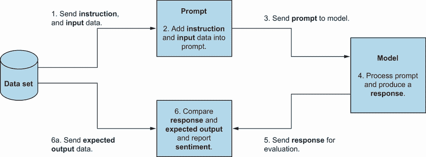

# 12 使用商业领域知识微调 LLMs

本章涵盖

+   LLM 的微调过程

+   准备用于微调的数据集

+   使用微调工具更好地理解过程

尽管大型语言模型（LLMs）在各个行业中的影响在主流媒体中得到了广泛的报道，但 LLMs 的普遍性和受欢迎程度已经为 AI 开源社区带来了一场静悄悄的革命。通过开放协作的精神和大型科技公司的支持，微调 AI 模型的能力越来越容易为 AI 爱好者所获得。这个机会产生了一个充满活力的社区，该社区正在尝试和分享各种过程和工具，这些过程和工具可以更好地理解微调是如何工作的，以及我们如何自己或团队合作来调整模型。

微调的主题非常广泛，深入探讨每个重要细节可能需要一本整本书。然而，通过利用开源社区创建和为开源社区创建的模型、数据集、平台和工具，我们可以对微调过程有一个欣赏。这些开源资源可以为我们准备一个未来，在那个未来中，我们可能会在我们的组织中微调我们的模型，以帮助构建基于上下文的 LLMs。然而，微调不仅关乎我们采取的方法，也关乎我们使用的工具。因此，在本章中，我们将详细了解微调过程的每个重要部分，并学习如何微调我们的模型。

## 12.1 探索微调过程

在我们学习更多关于微调工具之前，我们首先应该讨论微调包含的内容，并反思我们希望实现的目标。正如我们将看到的，微调涉及一系列步骤，这些步骤在更广泛的过程中发挥着重要作用。了解我们希望实现的目标不仅有助于我们评估微调后的模型，而且还能指导我们的微调方法。微调过程的每一步都包括不同的活动和挑战。尽管我们可能无法涵盖所有细节，但我们将学习到足够多的知识，以了解我们在微调模型时会发生什么，以及我们可能面临的挑战。

### 12.1.1 微调过程的地图

正如我们在第十章中发现的，微调是将已经经过某种训练的现有模型（称为基础模型）进一步使用额外的数据集进行训练的过程

+   使模型更能适应上下文信息

+   改变模型的声音

+   帮助它响应特定的查询或指令

就像基础模型需要经过一系列步骤进行训练一样，在微调会话期间也有一系列步骤需要遵循。图 12.1 总结了这些步骤以及它们是如何相互关联的。


图 12.1 精调过程中所采取的不同步骤的视觉表示

图 12.1 不一定涵盖微调的每一个细微之处，但它捕捉了我们通常期望成功创建一个微调模型的核心步骤。在本章中，我们将更详细地检查每个步骤，但首先让我们反思一下这个过程可能最重要的部分，即确定我们希望通过微调实现的目标。

### 12.1.2 目标设定

在微调 LLM 时，我们可能犯的最大错误之一就是没有明确的想法，不知道我们希望微调后的 LLM 做什么。未能为微调模型应该帮助解决的问题设定明确的目标可能会影响微调过程的各个方面，从数据准备到测试。鉴于 LLM 的不确定性，这并不意味着围绕我们期望从 LLM 中获得的具体信息来设定目标。但我们必须问自己我们想要什么类型的行为，以及它如何融入更广泛的背景。

为了说明这一点，让我们考虑两个不同的目标。一个是创建一个代码补全工具，该工具已经在我们的代码库上微调，以使用 LLM 的生成能力，同时不向第三方泄露知识产权。另一个是一个基于问答/聊天的 LLM，它为用户提供支持，该 LLM 已经在支持文档和客户数据上微调，以帮助回答问题。根据我们想要追求的目标，我们需要考虑以下细节：

+   *使用什么数据集？* 对于我们的代码补全场景，我们可能希望创建一个由逻辑部分组成的代码数据集，以微调我们的模型。我们也可能对使用包含开源代码的其他数据集感兴趣。这与问答聊天场景不同，在问答聊天场景中，我们会创建一个包括帮助指南和文档的数据集。

+   *使用什么模型？* 在撰写本文时，Hugging Face，一个 AI 开源社区网站，目前托管了 500,000+个不同的模型，这些模型都旨在服务于不同的目的，如生成、分类和翻译。在考虑我们的微调目标时，我们需要选择适合我们需求的模型。在我们的代码场景中，我们可能会选择一个已经在大量代码数据集上训练过的模型，这使得它更容易与我们的代码库进一步微调。在我们的问答/聊天 LLM 场景中，我们可能会想要一个已经训练成能够作为有能力的基于聊天的 LLM 的模型。

+   *使用多大的模型？* 我们需要问自己的另一个问题是我们需要多大型的模型？根据我们想要的模型大小，通常由其参数大小定义，也将决定我们的硬件需求。这里有一个必须考虑的权衡。如果我们希望我们的模型在响应时准确，那么就需要大量的硬件来托管和运行更大的模型。如果我们预算有限，或者我们部署模型的位置性能不佳，那么我们可能需要考虑一个可能不那么准确或对我们的请求响应不那么快的较小模型。

什么是 Hugging Face？

Hugging Face 是一个 AI 开源社区的平台，允许成员托管、部署和协作他们的 AI 工作。值得注意的是，Hugging Face 提供了一个托管数据集和模型的地方，以及通过其空间功能让其他人部署和交互 AI 应用的机会。还有其他付费功能，如自动训练，旨在使微调更容易，以及增加硬件空间以部署更复杂和资源密集型模型。类似于 GitHub 除了提供托管代码的能力外，还允许团队协作，Hugging Face 提供了一个分享和从 AI 社区成员那里学习的地方，并共同参与未来的 AI 项目。

这绝对不是考虑因素的详尽列表，随着我们进一步探索微调，我们将了解到我们需要决定的不同选项。幸运的是（如果你有预算），已经创建并实施了许多工具，使微调模型的实验更容易、更快。因此，尽管在开始微调之旅时有一个目标是很不错的，但我们仍然可以自由地更换模型、数据集等，以了解如何为特定情境创建最优化微调模型。

## 12.2 执行微调会话

考虑到微调模型目标的重要性，在本章中，我们将尝试使用项目的代码库来微调一个模型，以创建一个可以支持未来分析的支持模型。在实际情况中，这意味着拥有一个模型，当被问及我们的代码库时，可以给出与我们的项目相关的上下文敏感的回答。为此，我们将使用开源项目 restful-booker-platform 的代码（[`mng.bz/vJRJ`](https://mng.bz/vJRJ)）。

### 12.2.1 准备训练数据

尽管微调不需要像预训练模型那样大量的数据，但微调的成功在很大程度上依赖于我们使用的数据的大小和质量，这引出了我们需要什么类型的数据的问题。为了帮助我们理解数据集的大小、范围和格式，我们可以从像 Hugging Face 这样的网站中学到很多，那里存储着开源数据集（[`huggingface.co/datasets`](https://huggingface.co/datasets)）。在撰写本文时，一些值得注意的数据集包括：

+   *堆栈*—从 GitHub 等开源项目上抓取的 5.46 亿行代码示例（[`huggingface.co/datasets/bigcode/the-stack`](https://huggingface.co/datasets/bigcode/the-stack)）

+   *羊驼*—使用现有的大型语言模型（LLM）生成的 52,000 行合成数据（[`huggingface.co/datasets/tatsu-lab/alpaca`](https://huggingface.co/datasets/tatsu-lab/alpaca)）

+   *OpenOrca*—290 万行问题和回答数据（[`huggingface.co/datasets/Open-Orca/OpenOrca`](https://huggingface.co/datasets/Open-Orca/OpenOrca)）

查看这些数据集的每一个，我们可以看到它们包含不同类型的信息，从代码示例到问题和回答，以不同的方式创建。例如，The Stack 这样的数据集是基于从互联网上抓取的真实信息，而 Alpaca 是由人工智能合成的。我们还可以看到，与列表中的其他数据集相比，Alpaca 是一个规模较小的数据集，但这并不意味着它没有用。

什么是合成数据？

在人工智能训练和微调的背景下，合成数据是指人工生成看起来像真实用户数据，但实际上并非基于真实生活数据的过程。使用合成数据是训练和微调人工智能的有用技术，因为它可以提供进行训练或微调所需的数据。尽管如此，使用合成数据也存在副作用。首先，生成测试数据会有成本。例如，gretel.ai、mostly.ai 和 tonic.ai 等工具提供数据生成工具，但它们是有价格的。其次，也许更重要的是，研究表明，在纯合成数据上训练模型可能会影响模型响应的质量。这很有道理，因为真实数据将具有难以在人工智能生成数据中模拟的变异性随机性。

因此，在制定我们的要求时，我们需要考虑我们想要什么，目前有什么可用，以及我们可能需要自己构建什么。让我们回到我们的代码助手和问答模型示例。对于我们的代码助手 LLM，我们可能需要一个主要以代码为基础的数据集，而我们的问答模型则需要以自然语言编写的数据，并包含以键值格式（问题作为键，答案作为值）编写的问题和答案。正如我们所看到的，我们的目标指导我们关于所需数据类型的决策，但随之而来的是更多的问题，例如数据从何而来以及我们将如何格式化它。

我们已经看到，来自 Hugging Face（Kaggle 的网址[`www.kaggle.com/datasets`](https://www.kaggle.com/datasets)也是一个优秀的数据集来源）等网站上有许多公开的数据集。但如果我们试图微调一个模型，使其更符合我们的上下文，那么我们很可能会希望使用属于我们组织的数据来调整它。因此，在决定如何将其转换为适合训练的格式之前，我们需要进行一项关于可用数据、其质量以及我们如何获取它的练习。考虑 Alpaca 数据集的结构格式([`huggingface.co/datasets/tatsu-lab/alpaca`](https://huggingface.co/datasets/tatsu-lab/alpaca))。该数据集包括以下四个列：指令、输入、输出和文本。正如我们将在下一步学习的那样，根据我们微调模型的方式，我们将需要数据集的不同方面。例如，如果我们想微调一个问答模型，我们至少需要指令和输出列，以帮助调整它，使其能够回答预期的问题类型和回答类型。

挑战在于将原始数据转换为像我们在 Alpaca 数据集中看到的那种结构化格式。例如，如果我们考虑我们的问答模型场景，我们可能希望用我们的文档和支持文档来训练它。其中一些原始数据可能以问答格式存在，例如常见问题解答（FAQs），但我们的大部分数据可能不会这么直接。因此，我们需要找出一种方法来解析我们的数据，使其适合我们的数据集结构。更复杂的是，我们还需要自动完成这项工作，以生成足够的数据量，使其有用。手动完成也是一项选择，但可能会很昂贵。

数据准备案例研究

我们将要用于微调会话的数据集展示了我们在构建小型数据集时可能遇到的挑战。在我们的微调会话中，我们将使用一个之前创建的数据集，该数据集可以在 Hugging Face 上找到，网址为[`mng.bz/4pXa`](https://mng.bz/4pXa)。该数据集是一个 JSONL 格式的文档，包含 restful-booker-platform (RBP)的 Java 部分的解析部分，以及生成的指令，其中一部分如下所示（为了便于阅读，已添加换行符）：

```py
{"instruction": "What is the class declaration for
➥BrandingServiceIT","output": "@ExtendWith
➥@SpringBootTest
➥@ActiveProfiles
public class BrandingServiceIT { }"}
{"instruction": "How does the method setup Restito work for
➥BrandingServiceIT?","output": "
➥@BeforeEach
➥public void setupRestito(){
➥whenHttp(server).match(post("/auth/validate"))
➥.then(status(HttpStatus.OK_200));
➥}"}
```

这段代码片段将为我们提供调整所需的所有数据，但在我们开始之前，让我们探索一下它是如何制作的。考虑以下类，然后问问自己你会如何以逻辑的方式将这段代码拆分以进行微调？

```py
package com.automationintesting.api;

import com.automationintesting.db.BrandingDB;
import com.automationintesting.model.db.Branding;
import com.automationintesting.model.service.BrandingResult;
import com.automationintesting.requests.AuthRequests;
import com.automationintesting.service.BrandingService;
import org.springframework.beans.factory.annotation.Autowired;
import org.springframework.http.HttpStatus;
import org.springframework.http.ResponseEntity;
import org.springframework.web.bind.annotation.*;

import javax.validation.Valid;
import java.sql.SQLException;

@RestController
public class BrandingController {

    @Autowired
    private BrandingService brandingService;

    @RequestMapping(value = "/", method = RequestMethod.GET)
    public ResponseEntity<Branding> getBranding() throws SQLException {
        Branding branding = brandingService.getBrandingDetails();

        return ResponseEntity.ok(branding);
    }

    @RequestMapping(value = "/", method = RequestMethod.PUT)
    public ResponseEntity<?> updateBranding(@Valid @RequestBody
    ➥Branding branding, @CookieValue(value ="token", required = false) 
    ➥String token) throws SQLException {
        BrandingResult brandingResult = 
        ➥brandingService.updateBrandingDetails(branding, token);

        return ResponseEntity.status(brandingResult.getHttpStatus())
        ➥.body(brandingResult.getBranding());
    }

}
```

你会选择按文件逐个微调、按行逐个微调，还是其他方式？在尝试测试基于 RBP 代码库的模型微调的第一尝试中，我选择了逐行的方法。它创建了一个脚本，该脚本将遍历项目中的每个文件，并将文件的每一行添加到其行中，从而生成一个类似于以下示例表的数据表：

```py
id, content
1,  @RequestMapping(value = "/", method = RequestMethod.GET)
2,  public ResponseEntity<Branding> getBranding() throws
3,  SQLException {
4,  Branding branding = brandingService.getBrandingDetails();
5,  return ResponseEntity.ok(branding);
6,  }
```

这种方法的缺点是，尽管解析和存储数据很容易，但我最终得到的条目缺乏上下文，这意味着我调整的是像`}`或`@Autowired`这样的条目。这些条目并没有提供很多关于 RBP 项目的上下文或细节，并且引发了一个新的问题。可以与这些类型的条目配对的指令类型是什么？如果你还记得，在基于指令的微调过程中，我们会发送一个指令（有时附带额外的输入数据），然后比较响应与我们的预期输出。我们添加到像`}`这样的条目中的指令类型将不包含任何关于我们上下文的提示，并可能对微调模型产生响应异常和不希望的方式。这正是我在尝试基于逐行材料调整模型时发生的情况。

相反，我选择的方法（并在数据集中可以找到）是将代码分解成逻辑部分。这意味着，而不是逐行切割事物，一个文件将基于 Java 类中的不同属性进行切割。例如，从之前分享的类中选择的切片在示例表中看起来如下：

```py
id, content
1,  @RestController
public class BrandingController { }
2,  @Autowired
    private BrandingService brandingService;
3,  @RequestMapping(value = "/", method = RequestMethod.GET)
    public ResponseEntity<Branding> getBranding() throws SQLException {
        Branding branding = brandingService.getBrandingDetails();

        return ResponseEntity.ok(branding);
    }
```

与数据集中的每个条目都是一行代码不同，每个条目可能包含如何声明类、在类中声明的变量、类中的每个方法及其包含的代码的详细信息。目标是保持足够详细，以便微调的结果是一个对代码库有更高意识的模型，但又不至于过于细化而完全失去上下文。结果是更成功的调整，但解析过程变得更加复杂。这需要创建额外的代码，该代码将遍历每个文件，使用 JavaParser ([`javaparser.org/`](https://javaparser.org/)) 读取代码，构建语义树，然后查询该树以提取数据集所需的信息（代码可以在[`mng.bz/QVpw`](https://mng.bz/QVpw)找到）。

当谈到为微调（或训练）准备数据集时，这个例子是一个非常基础的例子。然而，经过反思，我们可以清楚地看到，从头开始组织和准备即使是简单数据集也有其复杂性和挑战。这个数据集的原始数据可以用合适的工具轻松解析，但我们如何管理结构多样或一开始就没有明显结构的数据呢？对数据集的这种探索突出了识别和创建数据集是一个复杂的过程。我们如何组织数据以及我们放入其中的内容对于微调模型的成功至关重要，这也是微调和实验 LLMs 的大部分工作所在。因此，确保我们有必要的流程和工具非常重要，这样我们就可以快速实验不同的数据集，看看它们如何影响微调模型的结果。

### 12.2.2 预处理和设置

在我们的数据集就绪后，我们接下来需要在微调之前预处理我们的数据，并准备好我们的微调工具。我们将很快介绍工具设置，但首先，为了了解微调的预处理活动，我们需要稍微跳一下，谈谈微调会话期间发生的事情。考虑到数据集的大小，微调会话由一个特定的循环组成，如图 12.2 所示，这个循环在微调过程中会多次运行。

在可视化过程中，我们首先从我们的数据集开始。假设它以与我们之前查看的 `_Alpaca_` 数据集类似的方式组织（它包含一个指令、输入和输出的列），指令和输入列中存储的数据将被添加到一个提示中。然后，这个提示被发送到我们正在微调的模型，模型会返回一个响应。我们随后将模型的响应与数据集中存储的输出进行比较，以确定*情感*。情感表示响应与我们的预期输出之间的匹配程度。然后，情感分数被用来告知需要调整模型参数以微调模型以实现我们希望模型如何响应。如果情感分数表明响应是可取的，那么变化将很小。另一方面，如果情感分数表明响应不可取，那么将进行更大的调整。



图 12.2 微调过程中的可视化

整个过程都是通过不同的工具以编程方式完成的，并在数据集中的每个条目上多次运行。数据集本身通常也会多次迭代，这被称为一个*epoch*。通过在微调过程中迭代多个 epoch，模型被调整到我们希望它如何响应的方式。这种调整方法被称为基于指令的微调，在我们执行微调之前理解它的工作方式非常重要，因为我们需要在调整开始之前采取一些步骤。首先，我们需要设计我们想要发送给模型的提示类型。其次，我们需要确定我们如何将我们的提示编码化，以便我们的模型可以读取它。类似于我们选择数据集，我们在这两个步骤中做出的选择也可能对我们的微调结果产生重大影响。

提示设计

一旦我们知道了数据集的格式，我们需要创建一个指导提示，使其能够与数据集中的数据以及我们想要添加的任何附加指令一起工作。例如，考虑 deeplearning.ai 课程《微调大型语言模型》中的这两个指导提示（[`mng.bz/XV9G`](https://mng.bz/XV9G)）。第一个提示接受一个指令和一个输入：

|


| 下面是一个描述任务的指令，配有一个提供更多上下文的输入。请编写一个响应，以适当地完成请求。### Instruction:{instruction}### Input:{input}### Response: |
| --- |

第二个提示只包含一个指令：

|


| 下面是一个描述任务的指令。请编写一个响应，以适当地完成请求。### Instruction:{instruction}### Response: |
| --- |

注意到每个提示都包含静态的、指导性的文本，它为发送的信息提供了上下文，然后是像`{instruction}`这样的标签来注入数据集中的数据。根据我们想要使用的 RBP 数据集，我们可以这样配置我们的提示以进行微调：

|


| 下面是一个由三个井号分隔的指令，它询问关于 restful booker 平台代码库的问题。请提供必要的代码来回答问题。在输出之前检查代码是否正确编译。###{instruction}### |
| --- |

这个提示遵循我们在前面章节中探讨的一些提示策略。我们可以使用这些策略来帮助我们清楚地指导模型在提示中期待什么，以及我们希望它做出什么响应。为了更好地理解微调循环，让我们想象我们在数据集中有以下条目：

```py
{
  "instruction" : "How does the method initialiseMocks work for
  ➥BrandingServiceTest?"
  "output" : "@BeforeEach public void initialiseMocks() { 
  ➥MockitoAnnotations.openMocks(this); }"
}
```

在微调过程中，这个数据集的指令部分将被注入到提示中，以创建以下提示

|


| 下面是一个由三个井号分隔的指令，询问关于 restful booker 平台代码库的问题。请提供必要的代码来回答问题。在输出之前检查代码是否正确编译。###`initialiseMocks`方法对`BrandingServiceTest`是如何工作的？### |
| --- |

这可能会导致模型以如下方式响应一个代码示例：

|


|

```py
use Tests\TestCase;
use App\Services\BrandingService;

class BrandingServiceTest extends TestCase {

  protected function setUp(): void { // Initialize mocks

  $this->brandingService = new BrandingService();

}
```

|

然而，我们数据集中的输出如下：

|


|

```py
@BeforeEach public void initialiseMocks() { 
    MockitoAnnotations.openMocks(this);
}
```

|

这意味着两组数据之间的情感得分是中等水平，因为尽管响应是代码，并且它与我们的预期输出在解决方案上有些相似，但代码并不完全相同。这个情感得分将随后被考虑进需要调整模型参数以使当我们的数据集中的特定行再次出现时，结果更接近预期。我们使用的提示模板会影响微调模型的结果，我们添加的指令也会产生影响。然而，我们需要意识到我们添加到提示模板中的内容不仅会影响微调的结果，还会影响最初发送给模型的内容。这带我们来到了如何将基于文本的提示转换为模型理解的语言。

Tokenization

一个 *token* 是一个单词、短语或字符的数值表示。我们在第十章中讨论了 token 的概念。那么，为什么我们需要在微调过程中意识到 tokenization 的重要性呢？首先，在数据预处理阶段，有许多不同的 tokenizer 可以使用，它们将以不同的方式对文本进行 tokenization。我们使用的模型类型将影响 tokenizer 的类型。选择一个与我们正在微调的模型不匹配的 tokenizer 会导致我们的提示被转换成与我们在微调的模型内部参数不匹配的 token 标识符。简单来说，这就像是一个用不同或完全虚构的语言授课的老师在教你课程。

第二个原因与我们的微调提示和数据集相关，是上下文长度。上下文长度是指模型一次可以处理的 token 总数。这很重要，因为如果我们创建了一个包含大量 token 的提示，或者尝试使用每个条目中包含大量 token 的数据进行微调，那么我们的提示可能会超出上下文长度限制，这意味着我们的提示将被截断。超过上下文长度限制的每个 token 将简单地被丢弃或忽略，结果将是基于部分完成的提示进行微调的模型，这可能会产生意外或不希望出现的副作用。

因此，在整理我们的数据集和设计微调提示时，我们需要考虑我们的上下文长度。这可能意味着从数据集中移除任何可能超出我们上下文长度的条目，编写具有明确指令但不会超出令牌计数的提示，或者寻找包含更大上下文长度的新的模型。

工具和硬件

由于处理数据和执行微调过程需要许多步骤，因此必须具备必要的工具来执行每个阶段。幸运的是，微调工具最近取得了很大的进步。最初，这可能需要使用 Python 等工具以及 PyTorch、Tensorflow 或 Keras 等库的丰富经验。尽管这些工具旨在尽可能易于使用，但学习曲线可能相当陡峭，需要我们从零开始构建微调框架。如果我们对这种类型的方法感到舒适，或者与有这些类型工具经验的人一起工作，那么使用它们是值得的。然而，随着微调兴趣的增长，基于上述工具的新工具已经开始出现，使微调更加容易访问。例如 Axolotl 这样的框架和 Hugging Face 这样的平台允许我们快速设置微调，而无需进行大量的工具开发。权衡的是，这些框架要么具有偏见，例如选择我们应该使用的标记化器，要么是有成本的。

不仅围绕 AI 微调的工具看到了增长，支持它的基础设施也是如此。训练模型是一项硬件密集型的工作，需要访问图形处理单元（GPU）。这意味着要么购买具有大量 CPU、RAM 和 GPU 的硬件用于微调，要么从云服务提供商那里获取计算资源。对于许多团队来说，后者是更受欢迎的选择，并且是一个快速增长的领域，因为它降低了硬件需求成本，确保了访问更新的 GPU。不出所料，像谷歌、微软和亚马逊这样的大型云计算公司都提供了专门的服务，这些服务是为微调和 LLM 托管而设计的。但一些替代方案已经开始出现，例如 RunPod、Latitude.sh 和 Lambda Labs，它们是专业的 GPU 云服务提供商。这些是可以与我们所选择的微调工具结合使用的选项，但一些服务同时提供微调框架和运行微调的计算资源。

我们可以用于微调的市场环境和可以运行微调的地方是一个快速发展的领域。但这也突显了需要进行研究，以确定哪些工具和基础设施最适合我们团队的经验和可用于微调的预算类型。

设置我们的微调工具

有许多微调工具可供选择，它们提供了不同级别的微调过程控制，PyTorch 是一个流行的选择。但如前所述，设置和使用这些工具存在一个学习曲线。如果我们在一个希望对提示、分词器和微调工具有完全控制的上下文中工作，我们可能会选择这些更细粒度的工具。但对于像我们这样的新手，我们乐于使用那些为了易用性而牺牲意见的工具，我们再次可以转向 AI 开源社区。因此，对于我们的微调会话，我们将使用 Axolotl，这是一个*专门设计用于简化各种 AI 模型微调的工具，提供对多种配置和架构的支持*。

我们可以将 Axolotl 视为一个微调框架，其中包含执行微调所需的所有工具和流程。这意味着对于我们的微调会话，提示方法和分词器已经为我们处理好了，使我们能够快速进入微调，而不需要巨大的学习曲线。

使用 Axolotl 的硬件要求

在我们开始之前，重要的是要注意，为了进行微调会话，你需要一个可以访问 GPU 的系统。然而，如果你没有访问 GPU 的权限，有一些成本效益高的云平台被设计用来支持 AI 微调。Axolotl 的 ReadMe 文件包含了两个提供商的链接：RunPod 和 Latitude.sh。

作为没有访问 GPU 的人，我发现 RunPod 很容易设置，并且价格合理，每次训练会话不到 10 美元。如果你想采取这种方法，以下是一些设置步骤：

1.  创建一个账户并通过[`www.runpod.io/console/user/billing`](https://www.runpod.io/console/user/billing)为其添加信用。我发现最低交易额 10 美元就足够了。

1.  前往 GPU 云[`www.runpod.io/console/gpu-cloud`](https://www.runpod.io/console/gpu-cloud)，点击页面顶部的“选择模板”，找到`winglian/axolotl-runpod:main-latest` Docker 镜像，并选择它。

1.  接下来，选择一个要部署的 Pod。根据一天中的时间和需求，你会看到哪些可以部署，哪些不能。在撰写本文时，1x RTX 4090 足以满足我们的微调练习。然而，如果我们希望微调更快，我们可以选择更多的 GPU 或更大的盒子。

1.  点击“部署”并完成设置向导以启动 Pod 的创建。前往[`www.runpod.io/console/pods`](https://www.runpod.io/console/pods)并等待 Pod 部署。

1.  一旦部署了 Pod，点击“连接”以显示详情，然后通过 SSH 进入你的 Pod（这需要你在连接之前添加一个 SSH 公钥，这可以在以下链接完成：[`www.runpod.io/console/user/settings`](https://www.runpod.io/console/user/settings)。）

一旦你登录到 Pod，你会发现 Axolotl 已经安装并准备好使用。

我们将首先在我们的选择机器上设置 Axolotl（如果您选择了 RunPod 选项，则可以跳过这一步）。Axolotl 的文档和代码可在[`mng.bz/yoRG`](https://mng.bz/yoRG)找到，其中包含关于如何安装应用程序的全面说明，提供直接在我们的机器上或通过 Docker 安装的选项。

### 12.2.3 使用微调工具

一旦 Axolotl 设置完成，我们就可以开始配置我们的会话。如前所述，我们将使用 RBP 数据集，该数据集可在 Hugging Face 上找到（[`mng.bz/M1M7`](https://mng.bz/M1M7)）。对于我们的模型，我们还将使用 Meta 的 Llama-2 模型版本，该模型包含 70 亿个参数和 4k 的上下文窗口。与提示和分词器类似，模型设置已在 Axolotl 项目`examples/llama-2/lora.yml`中的示例文件中处理完毕。然而，为了在我们的数据集上训练模型，我们需要在 YAML 文件中更新`dataset.path`：

```py
datasets:
  - path: 2bittester/rbp-data-set
    type: alpaca
```

使用`path`指定在 Hugging Face 上找到数据集的位置（即从哪里下载）以及`type`设置我们想要使用的模板提示。查看 YAML 文件顶部，我们还可以看到将要使用的模型和分词器的引用。同样，如果我们想尝试其他方法，这些也可以进行修改：

```py
base_model: NousResearch/Llama-2-7b-hf
---
tokenizer_type: LlamaTokenizer
```

文件中还有其他一些设置，但超出了本章的范围，但有两个我们想要强调：`sample_packing`和`num_epochs`。

```py
sample_packing: false
---
num_epochs: 4
```

对于`sample_packing`，我们将其设置为`false`，因为数据集不够大，不足以将其分为训练集和测试集（关于这一点稍后会有更多说明）。`num_epochs`决定了我们想要遍历数据集的次数。默认值为`4`，这意味着微调过程将在完成之前将整个数据集循环四次。在 YAML 文件中做出这些更改后，我们可以保存、退出并开始我们的微调。

### 12.2.4 启动微调运行

在我们的配置就绪后，我们可以开始微调。为此，我们将遵循 Axolotl 的 ReadMe 中找到的步骤。首先，我们将触发一个预处理步骤：

```py
CUDA_VISIBLE_DEVICES="" python -m axolotl.cli.preprocess
➥ examples/llama-2/lora.yml
```

预处理步骤会下载数据集并通过分词器进行处理，将数据从文本转换为标记，以便进行微调。

LORA 是什么？

你可能已经注意到，我们一直在配置并现在用于启动微调会话的 YAML 文件名为 lora.yml。LORA 是一种微调方法，它不是直接尝试调整模型内的参数，而是创建一个较小的参数子集来近似模型的参数，并进行微调，从而创建一个 LORA 适配器。这意味着当我们部署微调后的模型时，模型内部将加载 LORA 适配器，以提供我们期望的微调行为。它之所以变得流行，是因为它加快了微调过程，并允许社区和团队共享他们的适配器。

预处理完成后，我们就准备好开始微调过程了。请注意，根据所使用的硬件，这个过程可能需要从 30 分钟到 4 小时或更长时间，所以请选择一个可以在你处理其他任务时让微调运行的时间。要触发微调，我们运行以下命令：

```py
accelerate launch -m axolotl.cli.train examples/llama-2/lora.yml
```

这将导入我们编辑过的 YAML 文件并启动微调过程。随着微调的开始，我们将开始看到关于微调进度的详细信息，如下例所示：

```py
{'loss': 1.0936, 'learning_rate': 0.00019999154711147226, 'epoch': 0.02}
{'loss': 1.3172, 'learning_rate': 0.00019999135609452385, 'epoch': 0.02}
{'loss': 1.0351, 'learning_rate': 0.0001999911629434316, 'epoch': 0.02}
```

控制台中的每个条目都详细说明了以下内容：

+   *损失*——这个分数表示我们数据集中预期输出与模型输出的对齐程度。分数越低，预期和实际响应的对齐程度越好。在这个例子中，损失分数相对较高，因为它是微调开始时取的。随着微调的进行，我们希望看到损失分数降低。

+   *学习率*——这是对模型参数所做的步长变化的数值表示。较小的步长意味着微调中的变化更渐进。步长的大小由情感分数以及学习率超参数决定。在人工智能训练的背景下，超参数是在微调开始之前可以设置的配置选项，它会影响训练或微调的结果。因此，在学习率的情况下，我们可以增加步长范围，这可能导致模型有更显著的变化。这又可能或可能不会导致更优的微调。

+   *纪元*——之前，我们学习了如何在微调期间多次迭代数据集，并且每次迭代都被称为一个纪元。控制台输出中显示的纪元值只是简单地告诉我们我们处于给定纪元的哪个阶段。

这些指标有助于我们了解微调会话的质量和进度。根据数据集的大小，支持微调的模型和硬件将决定微调可能需要多长时间。然而，由于微调所需的工作量很大，微调可能需要多个小时并不罕见。这就是为什么经验丰富的模型微调员会设置流程和工具，以便在微调完成后可以同时微调多个模型以进行比较。

### 12.2.5 测试微调的结果

一旦我们的微调完成，我们将想要检查我们所做的更改是否与我们在微调过程开始时设定的目标一致。如果你还记得，在微调过程中，一条指令被发送给模型，然后它返回一个输出。情感分析随后确定模型的输出和我们的预期输出之间的匹配程度，这有助于确定对模型参数的调整。因此，模型内部的参数现在应该更多地偏向我们的上下文。因此，为了测试模型是否已被成功微调，我们想要检查当我们要求模型提供与微调时不同的新指令时会发生什么。我们可以通过以下两种方式之一来完成这项工作：推理和/或人工验证。

推理

由于模型内部有众多参数和指令发送选项以及接收输出的选项，推理采用了一种自动化的方法来测试模型的输出。推理的工作方式与微调非常相似。我们要么从更大的数据集中取出一部分，要么使用一个新的数据集，该数据集的结构与用于微调的数据集相同，包含与原始微调数据不同的指令和输出。然后我们将这些指令集发送给模型，捕获响应，然后使用情感分析来比较我们期望模型做出的响应与它实际做出的响应。（调整和推理之间的关键区别在于情感分析之后。调整会改变模型，而在推理的情况下，模型保持不变）。如果返回的情感分数很高，我们可以假设模型已被调整以满足我们的目标。如果它没有，那么我们可以开始考虑在未来的微调会话中下一步应该做什么。

人工验证

尽管情感分析很有用，但它基于数学模型来确定一致性。因此，手动探索模型输出，通过人工验证也是合理的。这可能通过使用推理数据集中保存的提示并评估响应来完成，或者通过生成新的提示来测试不同的响应，以查看模型如何反应。为了获得与推理测试相同的范围和覆盖范围，对于团队来说可能过于昂贵，但它可以提供更符合人类视角的视角，可以识别推理无法识别的差异和/或幻觉。

| 根据我们从两方面学到的知识，推理的自动化流程和我们的实验将指导我们的下一步决策。也许微调的结果产生了一个可接受的模型，我们可以将其发布以供更广泛的使用。然而，我们通常会得出结论，微调后的模型不适合我们。这将触发进一步的分析，以确定我们的下一步行动。也许我们的数据集需要改变，或者我们想要进一步修改我们的提示，或者也许可以将分词器替换掉。无论如何——再次强调，这是一个超出本章范围的决策过程——这表明微调项目需要多次实验以发现最佳结果。这就是为什么那些在微调（或一般训练）方面有成熟流程的团队会同时运行多个微调实验，同时调整多个模型，使用略有不同的参数来比较结果。|

测试我们的微调会话

返回到我们的微调模型，尽管我们没有足够的数据来运行推理测试会话，但我们可以手动测试我们的模型。为此，我们运行以下命令：

```py
accelerate launch -m axolotl.cli.inference examples/llama-2/lora.yml \
    --lora_model_dir="./lora-out" –gradio
```

使用此命令，我们正在加载 Llama-2 模型，并加载我们作为微调的一部分创建的 LORA 适配器。命令 `--gradio` 允许我们使用 gradio 库（[`www.gradio.app/`](https://www.gradio.app/））托管我们的模型用户界面，这样我们就可以通过网页浏览器开始测试我们的模型。

当我们的模型运行时，我们可以开始检查微调会话的结果。首先，我们可以通过从我们的数据集中选择一个指令和输出集来检查微调，例如：

|


| 说明：`initialiseMocks` 方法在 `BrandingServiceTest` 中是如何工作的？输出：|

```py
@BeforeEach public void initialiseMocks() { MockitoAnnotations.openMocks(this); }
```

|

使用微调会话中的提示，我们可以向我们的微调模型发送以下请求：

|


| 以下是一个描述任务的说明。写一个适当的响应来完成请求。### 说明：`initialiseMocks` 方法在 `BrandingServiceTest` 中是如何工作的？### 响应： |
| --- |

发送此请求后，我们会收到如下响应：

|


| 以下是一个描述任务的说明。写一个适当的响应来完成请求。### 说明：`initialiseMocks` 方法在 `BrandingServiceTest` 中是如何工作的？### 响应：|

```py
@BeforeEach public void initialiseMocks()
{
   MockitoAnnotations.openMocks(this);
}
```

|

如我们所见，模型已经微调到根据我们发送的说明返回一个强烈对齐的响应。现在我们可以关注模型如何处理新的未经测试的提示，例如这个基本的示例提示：

|


| `BrandingResult` java 类中发现了哪些注释？ |
| --- |

将此发送到示例微调模型会返回如下响应：

|


| 在`BrandingResult` java 类中发现了哪些注释？

```py
public class BrandingResult {
   private HttpStatus brandingHttpStatus;
   private Branding branding;

   public HttpStatus getBrandingHttpStatus()
   {
       return brandingHttpStatus;
   }

   public void setBrandingHttpStatus(HttpStatus brandingHttpStatus)
   {
       this.brandingHttpStatus = brandingHttpStatus;
   }

   public Branding getBranding()
   {
       return branding;
   }

   public void setBranding(Branding branding)
   {
       this.branding = branding;
   }
}
```

|

将此响应与微调模型所基于的原始代码进行比较（可以在[`mng.bz/aVlz`](https://mng.bz/aVlz)找到），我们可以看到模型在列出`BrandingResult`类的某些方面（如使用的变量和 getter/setter 方法）方面取得了一些成功。然而，它也遗漏了诸如类构造函数等细节，并且错误地得到了变量的名称（尽管它在代码中至少是一致的）。也可以认为提示没有正确回答，因为我们要求的是关于注释的细节，而不是整个类的信息。

因此，总结来说，我们在这次调整会话中取得了一些成功，但还需要更多的工作。调整过程以某种方式重新平衡了模型内部的参数，使得我们的上下文在其中变得更加突出。然而，缺失的项目和错误细节意味着需要进一步调整微调过程。也许我们可以考虑提高数据集中指令的质量，或者重新考虑我们用于调整的提示。同样，我们可以关注调整的更多技术方面，例如选择具有更多参数的模型，或者调整超参数，如我们用于训练的 epoch 数量或学习率。

### 12.2.6 通过微调学到的经验

本章让我们领略了微调过程的工作方式。起初，这可能看起来是一项令人望而生畏的活动。但尽管存在特定的工具和术语需要理解，通过逐步进行微调过程，我们可以逐个应对出现的挑战。最终，微调在很大程度上是关于实验。我们使用的数据、调整的模型、使用的工具以及设置的超参数，它们都会影响结果。

在撰写本文时，实验的成本并不是可以忽视的事情。想要进行微调会话的团队需要大量的财务支持以获取资源和经验。但随着私营公司和开源社区的不断发展，微调将变得更加容易获得，硬件的价格可能会降低，这使得微调在组织内成为一个不断增长的空间，并为团队提供高质量模型带来挑战，这些模型可以帮助我们和我们的组织。

## 摘要

+   微调是进一步训练现有模型的过程，有时也称为基础模型。

+   微调过程涉及多个步骤，如目标设定、数据准备、处理、调整和测试。

+   明确设定我们希望微调的 LLM 要完成的任务的目标，这指导我们如何进行微调过程。

+   微调模型需要指定和准备数据。

+   数据集极大地影响了微调模型的结果。这意味着找到与我们目标相关的数据，并以有助于最大化微调后模型输出的方式对其进行格式化。

+   微调依赖于反复发送嵌入训练数据的提示，以获得我们希望偏向于与预期输出对齐的响应。

+   模型需要提示才能转换为机器可读的语言。这是通过分词过程实现的。

+   分词是将数据切割成更小令牌的过程。

+   模型有一个上下文长度，即它一次可以处理的令牌的最大数量。一次性发送太多令牌，其中一些将被丢弃，影响微调过程。

+   在微调时，我们既可以构建自己的框架，这需要经验，也可以利用现有的框架，这些框架可能具有主观性，或者使用它们需要付费。

+   鳄鱼是针对微调的出色框架，对于经验有限且希望开始的人来说易于访问。

+   微调模型的测试可以通过自动化的方式完成，使用推理或手动进行。

+   微调正变得越来越容易为团队使用，用于人工智能助手工具。
