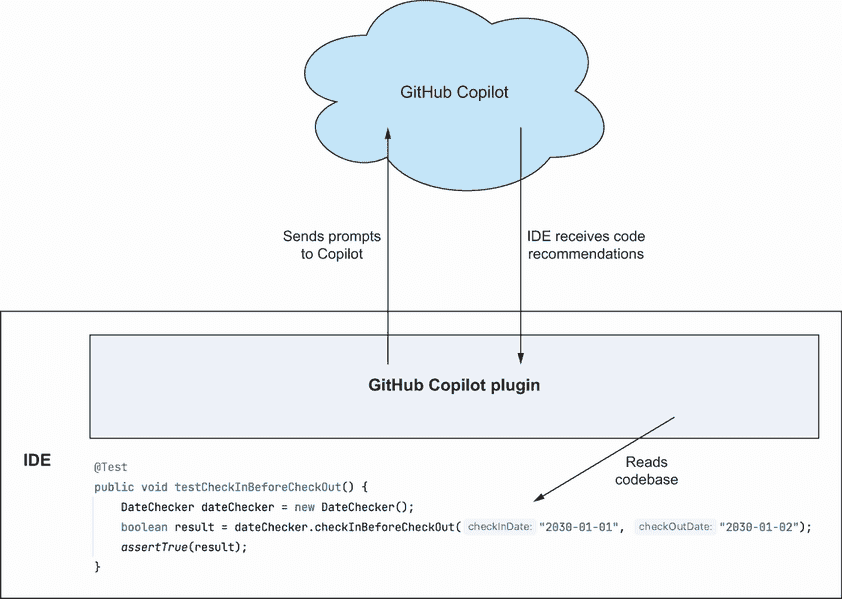
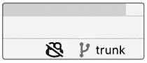
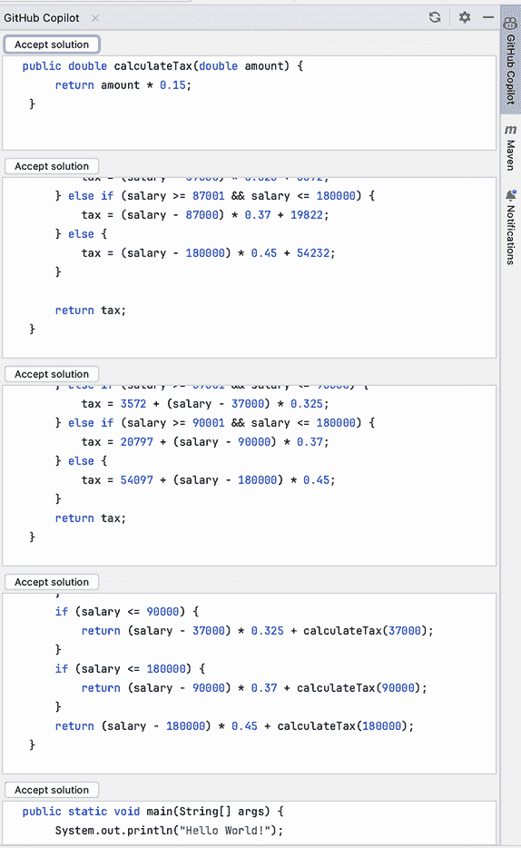

# 附录 B. 设置和使用 GitHub Copilot

## B.1 设置 Copilot

为了更好地了解设置 Copilot 的过程，让我们简要讨论一下该工具的工作原理。由于 Copilot 依赖于需要快速分析我们的工作并提出代码片段的 GPT 模型，因此它需要大量的资源来快速响应。因此，当使用 Copilot 时，我们不会在我们的机器上安装 AI 系统；相反，我们安装插件，使我们能够将我们的工作片段发送到 Copilot 进行处理，并接收推荐的代码，如图 B.1 所示。

如图表所示，我们在 IDE 中安装一个插件，并授予其访问权限，以便插件可以监控我们输入的内容，将其发送到 Copilot，然后处理并显示 Copilot 的推荐。由于这种结构，Copilot 可以与各种 IDE 一起工作，包括 JetBrains 产品、Visual Studio、VS Code 等。在我们的例子中，我们将使用 IntelliJ Community Edition，但无论选择的 IDE 如何，设置 IDE 以用于 Copilot 的过程在很大程度上是相同的。

寻找 GitHub 支持

如果您需要更多具体细节来在您的机器上设置 Copilot，更多信息可在 [`mng.bz/gAll`](https://mng.bz/gAll) 获取。

图 B.1 展示了 IDE、插件和 Copilot 之间连接的流程图

### B.1.1 设置 Copilot 账户

第一步是设置一个 Copilot 账户。在撰写本章时，Copilot 提供了两种计划：

+   个人用户每月 10 美元

+   商业用户每月 19 美元

虽然 Copilot 账户是付费的，但 GitHub 提供了 30 天的免费试用。需要提供付款详情，但可以通过账单页面 ([`github.com/settings/billing`](https://github.com/settings/billing)) 取消账户。

Copilot 也要求我们拥有一个 GitHub 账户，因此在设置 Copilot 之前，我们需要确保我们已经创建了一个免费的 GitHub 账户。一旦完成，或者如果您已经有了账户，请前往 [`github.com/features/copilot`](https://github.com/features/copilot) 以完成 Copilot 测试版的设置过程。

### B.1.2 安装 Copilot 插件

一旦我们将 Copilot 添加到我们的 GitHub 账户中，我们就可以设置我们的 IDE 以访问它。对于 IntelliJ，我们通过其插件服务来完成此操作，无论是通过“欢迎使用 IntelliJ IDEA”窗口选择“插件”还是转到“首选项”>“插件”。一旦打开插件窗口，搜索 Copilot 并安装插件。如果因为任何原因返回了更多 Copilot 插件的结果，请查找由 GitHub 编写的插件。最后，重启 IntelliJ 以完成插件安装。

### B.1.3 授予对您的 Copilot 账户的访问权限

安装插件后，重新打开 IntelliJ，我们会看到一个位于右下角的小弹出窗口，其外观如图 B.2 所示。

图 B.2 该弹出窗口会要求您登录 GitHub。

或者，如果没有弹出窗口出现（或者不小心关闭了），我们可以通过带有贯穿其面部粗线的 Copilot 小图标访问登录过程，如图 B.3 所示。

图 B.3 IntelliJ 中 Copilot 插件的定位

点击弹出窗口后，我们会看到一个窗口，其中描述了登录 GitHub 并授予 Copilot 访问我们 IDE 的过程，如图 B.4 所示。

图 B.4 这个对话框详细说明了如何通过我们的 IDE 登录 GitHub。

要完成注册过程，我们取出设备代码并前往网页[`github.com/login/device`](https://github.com/login/device)。要从 IDE 中输入设备代码，我们可以在表单中键入或粘贴，然后提交。GitHub 随后会要求我们授予 Copilot 访问权限，一旦确认，就会完成登录过程。当我们返回到 IDE 并看到一个新弹出窗口通知我们已连接时，我们可以确认我们已经登录，如图 B.5 所示。

图 B.5 这个弹出窗口确认我们已连接到 Copilot。

当我们开始编辑代码并看到一个弹出窗口分享关于它在 IDE 中如何工作的详细信息时，我们也会看到 Copilot 插件已安装的确认，如图 B.6 所示。

图 B.6 这个弹出窗口描述了 Copilot 在 IDE 中的工作方式，并指定了要使用的快捷键。

现在我们已经安装并设置了插件，我们可以开始使用 Copilot 作为我们的助手进行开发。

## B.2 与 Copilot 一起工作

一旦设置好 Copilot，它就会在我们开始在 IDE 中编写代码时开始反应并提供建议。例如，我们可以创建一个名为`TaxCalculator`的空类，输入关键字`public`，几秒钟后就会收到如图 B.7 所示的类似建议。

图 B.7 来自 GitHub Copilot 的建议代码

注意建议的代码被灰色显示。为了确认我们想要将代码添加到我们的类中，我们通过按 Tab 键来完成。这样就会插入代码并将光标移动到已添加代码的末尾。

### B.2.1 探索建议

如果建议的代码不满意，我们可以查看 Copilot 的其他建议以确定它们是否更适合。为此，我们需要打开位于 IDE 右侧的 GitHub Copilot 窗口，如图 B.8 所示。

图 B.8 在 IDE 右侧找到的 GitHub Copilot 菜单项

选择该菜单项将打开一个新窗口，其中显示可以添加到我们的类中的其他建议代码列表。面板可能会要求您点击刷新以从 Copilot 请求建议代码，但一旦完成，您将看到类似于图 B.9 的内容。

图 B.9 来自 Github Copilot 的替代建议

要完成此过程，我们点击我们想要看到插入到我们班级中的代码片段上方的“接受解决方案”按钮，然后关闭建议框。
