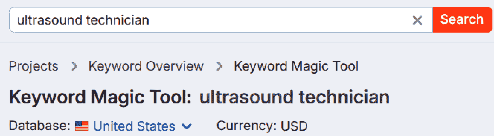
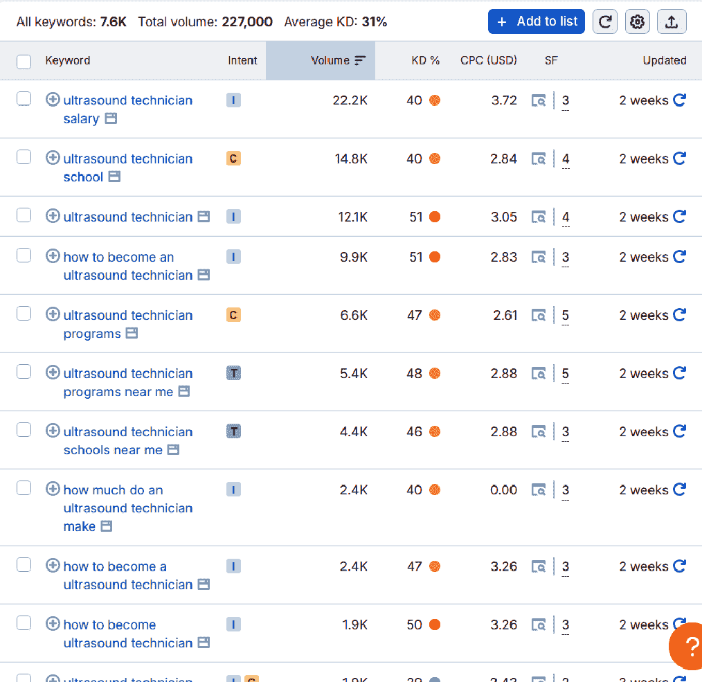
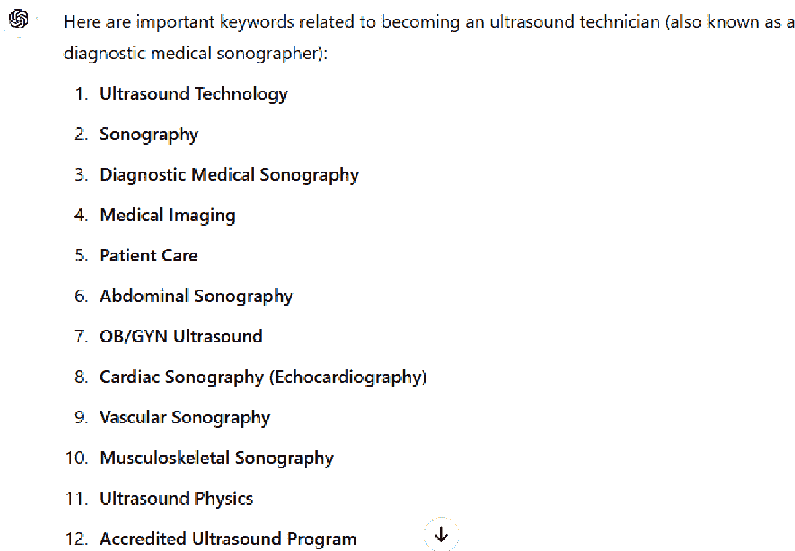
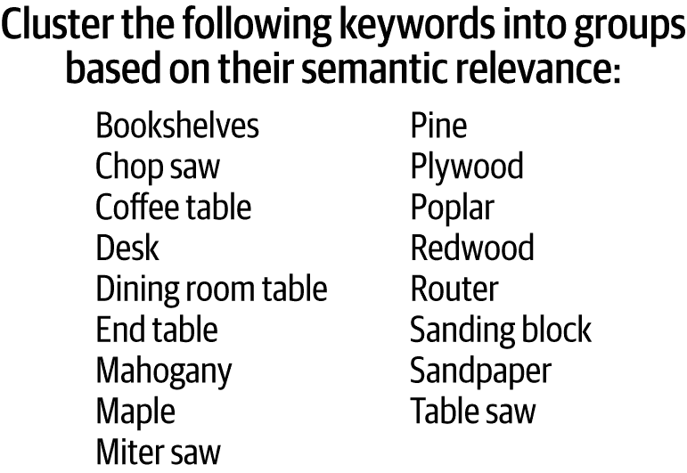
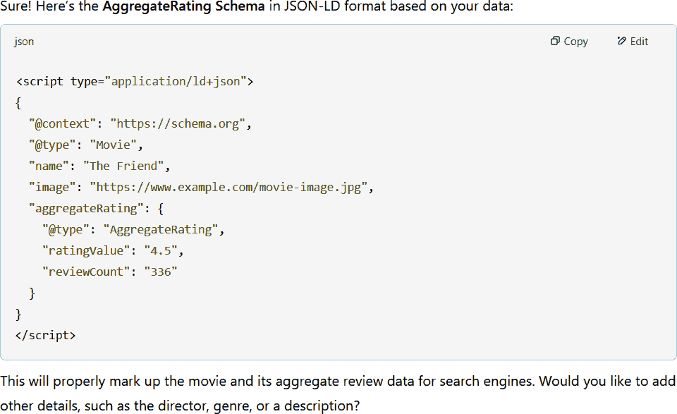
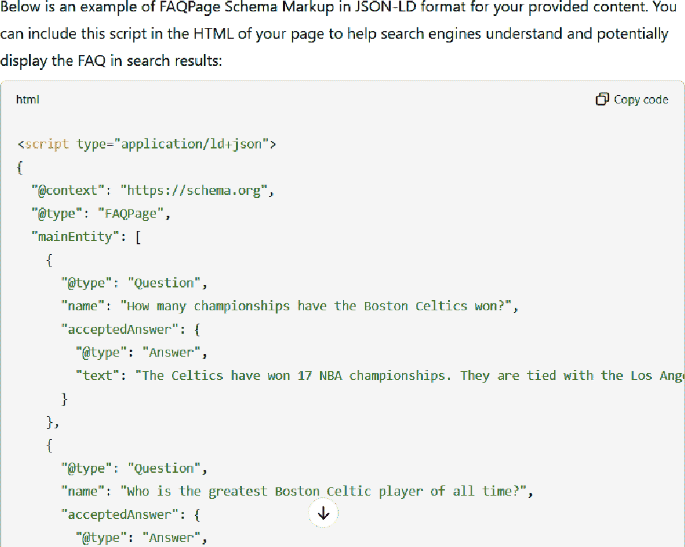
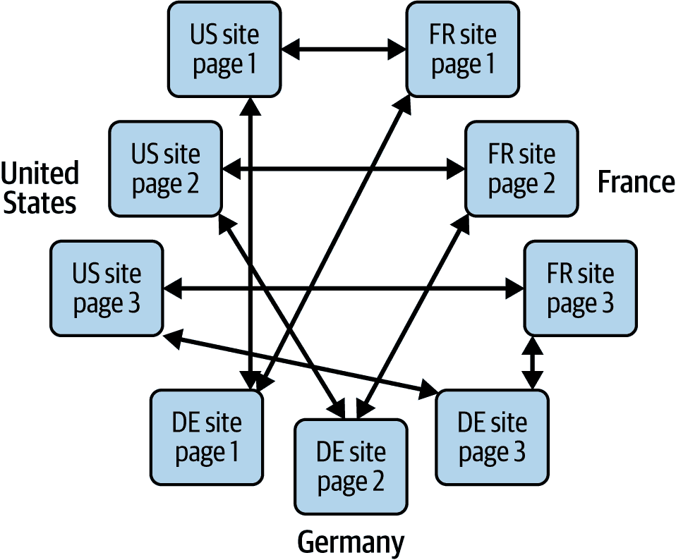
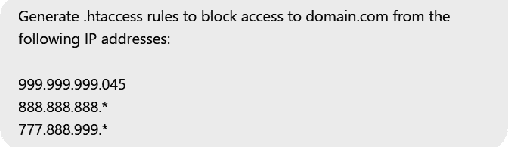

# 第五章\. 使用 AI 辅助技术 SEO

在第四章中，我们讨论了许多生成式 AI 可以帮助你创建新内容的方法。我们还讨论了如何将生成式 AI 作为你的作家和行业专家的头脑风暴伙伴，这可以帮助他们更有效地工作。

在本章中，我们将遵循一个类似的主题。你的 SEO 团队有很多工作要做，技术 SEO 任务可能很耗时。你可以使用生成式 AI 使他们的工作变得更简单，并提高他们工作的质量。与创建内容一样，你需要检查你生成式 AI 工具的输出。例如，你可能让一个开发者审查你的工具编写的代码，或者让一个经验丰富的 SEO 从业者审查你的工具推荐的关键词。

在本章中，我们将向您展示许多提高技术 SEO 工作效率和赋予员工更多效率的方法。使用生成式 AI 完成这项工作的好处包括提高工作完成的吞吐量、降低成本，甚至可能减少错误。考虑到需要对生成式 AI 的输出进行彻底审查，使用 AI 减少错误的想法可能看起来有些不合逻辑，但你的 SEO 团队和开发者也可能犯错误。同时采用生成式 AI 和人类可以增加减少这些任务中总错误数量的可能性。

# 关键词研究

关键词研究是一项常见的 SEO 技术任务，涉及研究人们正在搜索的内容。这可以帮助你决定需要创建的新内容或对现有内容进行改进。你可以使用 Semrush、Ahrefs、seoClarity、BrightEdge、Conductor 和其他工具来获取有关你网站潜在关键词的数据。

## 建议关键词

关键词研究工具通常要求你提供一个初始种子关键词作为输入，然后给你一个与种子关键词密切相关的关键词列表及其估计的搜索量。然而，这些工具在提供建议时往往过于狭隘，并且它们并不总是提供与你的种子关键词密切相关概念的观点。例如，图 5-1 显示了在给 Semrush 的关键词魔法工具提供种子关键词“超声技师”后的输出。

###### 图 5-1\. 将示例种子关键词输入到 Semrush 的关键词魔法工具中

示例输出显示在图 5-2 中。注意所有结果都包括种子关键词——例如，你不会看到任何基于*超声*变体的关键词，*超声*是*超声波*的同义词。看到这样的变体可能会促使你的内容团队考虑其他对网站访客有很大兴趣的话题。生成式 AI 可以使发现这些变体变得容易得多。

假设你正在为一家为医务人员提供培训课程的公司工作。你想创建内容以增加公司在搜索培训提供商时的可见性。使用 Semrush 的关键词魔法工具等工具是一个很好的开始。但让我们考虑当你决定创建一些内容来帮助你推广成为超声诊断师培训材料时会发生什么。参考图 5-1 了解在 Semrush 的关键词魔法工具中输入种子关键词，以及图 5-2 了解工具提供的输出。

###### 图 5-2\. Semrush 关键词魔法工具的示例输出

图 5-2 中的列表包括许多原始种子关键词的简单衍生关键词。这是非常有价值的数据，但可能无法涵盖相关主题的完整范围。Semrush 有一个功能可以让你看到扩大这一范围的相关关键词，这也是非常有用的。除了这个列表，你可能还想获取更多数据来扩大关键词列表。这就是生成式 AI 工具可以发挥作用的地方，我们将在下一部分说明如何使用它们。

让我们用一个简单的示例提示：“建议与成为超声诊断师相关的重要关键词。” 图 5-3 显示了 ChatGPT-4o 对此提示的响应的一部分。

###### 图 5-3\. ChatGPT 输出片段

图 5-3 中的完整响应包含了 30 个关键词建议。你会注意到一系列相关的关键词，比关键词魔法工具提供的列表更广泛。关键词魔法工具对 SEO 实践者非常有用，你应该从你选择的 SEO 工具中获取这些数据，但生成式 AI 通过更广泛的建议来补充这项研究。

###### 注意

关键词研究对于在生成式 AI 工具中排名帮助不大，但在传统的 SEO 搜索结果中仍然很有帮助。

## 按搜索意图分组关键词

一旦你有了页面的关键词列表，你可以通过按搜索意图对关键词进行分类来进一步深入研究。了解用户的意图可以帮助你确定应该创建什么类型的页面来满足他们的需求并吸引他们到你的页面。

例如，具有商业搜索意图的关键词，如“波士顿凯尔特人装备”，表明用户可能希望找到一个帮助他们浏览和购买波士顿凯尔特人商品网页。具有交易意图的关键词，如“波士顿凯尔特人门票”，表明用户希望直接进入购买某物的过程。具有信息搜索意图的关键词，如“波士顿凯尔特人选秀”，表明用户希望看到一篇关于球队最近选秀的文章。

这就是生成式 AI 可以提供帮助的地方。你可以提示一个生成式 AI 工具，将现有的关键词列表分组，根据搜索意图分组。图 5-4 展示了一个提示生成式 AI 工具根据搜索意图分组关键词的例子。

###### 图 5-4\. 提示生成式 AI 根据意图分组关键词

我们在 Microsoft Copilot 中测试了这个提示，图 5-5 展示了结果。

###### 图 5-5\. Copilot 输出根据意图分组关键词

结果大多准确，尽管有些项目我们可能会质疑。例如，“波士顿凯尔特人队网站”可能不属于交易类别。我们还在其他主要生成式 AI 工具中看到了类似的错误。这个错误再次强调了人工审查生成式 AI 输出的重要性，但在这个例子中审查是快速且容易的。

## 根据语义相关性分组关键词

你还可以使用生成式 AI 工具帮助你将关键词分类到逻辑分组中。在你整理好了一长串关键词列表，并希望在将它们交给内容团队创建新内容或增强现有内容之前按类别排序时，这可能很有用。根据语义相关性对关键词集进行分组可以使将关键词分配给正确的人员以及让人员更容易看到相关关键词在一起变得更容易。想象一下，例如，如果你正在处理一千个关键词的这项练习！使用生成式 AI，这可以设置为一个自动化的流程，以拉取关键词数据并将其分类。

图 5-6 展示了一个提示生成式 AI 工具根据相关性分组关键词的例子。

###### 图 5-6\. 提示生成式 AI 根据相关性分组关键词

我们用 Claude AI 测试了这个提示，图 5-7 展示了结果。

###### 图 5-7\. Claude 输出根据相关性分组关键词

任务完成后，你可以进行快速的人工审查，然后将分类后的关键词转交给你的 SEO 或内容团队进行进一步分析。你还可以要求生成式 AI 工具解释其分类的理由。当被问及时，Claude 如下解释了其分类：

> 这个聚类根据关键词之间的关系进行分组：
> 
> 可建造的家具项目
> 
> 可用于木工的木材类型
> 
> 在木工中常用的电动工具
> 
> 专门用于打磨和抛光的工具

总体来说，它在这项任务上做得非常出色。生成式 AI 工具在执行这类分类任务时出错的可能性较小，但你仍然应该审查输出。

# Schema 标记

编写架构标记代码是另一种常见的 SEO 技术任务。如果你不熟悉架构、它做什么以及它是如何工作的，你可以从 [Schema.org 网站](https://schema.org) 上了解更多信息。使用不同类型的架构会导致 Google 通过特殊功能增强你的 SERP 列表，这可能导致 CTR 更高。

图 5-8 展示了一个通过显示详细评论信息（图像中下划线处）增强的电影搜索结果的示例。这不仅看起来很漂亮，而且已经证明它可以增加包含此标记的搜索列表的 CTR。

###### 图 5-8\. 架构如何改善 SERP 外观的示例

正如我们在 第一章 中所看到的，SERP 中的 CTR 可以影响你的排名，因此，在 Google 使用它来增强你的搜索列表的内容中实施架构应该是优先考虑的。你可以在 [Google 搜索文档](https://oreil.ly/Z7pGe) 中了解更多关于影响 Google 搜索列表的架构类型的信息。

## 生成 AggregateRating 架构标记

在 图 5-8 中，你看到了一个高度流行的架构标记增强 Google 的 SERP 列表的示例。这种类型的架构显示了电影所有评论的聚合评分。IMDb 示例显示，在 1,201 条评论中，平均评分为 6.6 分（满分 10 分）。接下来，让我们看看如何实现它。图 5-9 展示了一个示例提示，包括一些评论数据，以请求你选择的生成式 AI 工具实现你需要放入网页中的代码，以实现这一功能。请注意，在这个例子中，我们在 AggregateRating 架构的命名上犯了一个错误，但 AI 仍然理解了这个提示。

###### 图 5-9\. 请求 AggregateRating 架构的提示

图 5-10 展示了当我们把该提示输入到 ChatGPT-4o 时会发生什么。

###### 图 5-10\. ChatGPT-4o 提供的 JSON-LD 架构代码示例

一旦你有了这段代码，并且你的团队中的开发者已经审查过它，下一步就是将代码发布到你的网站上的适当页面。由于这段特定的代码是 JSON-LD 格式，它应该放置在页面的 head 部分。请注意，你还可以在提示中提供你想要的架构标记代码类型。潜在的架构代码类型包括 JSON-LD、microdata 和 RDFa。你使用哪种类型的架构代码是开发决策，但生成式 AI 工具可以帮助你以任何这些格式编写代码。

## 从问答中生成 FAQPage 架构标记

在你的网站上拥有的一种流行内容形式是常见问题解答（FAQ）部分。目前，Google 仅对政府或健康相关的网站显示 FAQ 的丰富列表。即使你不运营这类网站，FAQPage 架构也能帮助 Google 更好地理解你的内容。

创建此代码可能有点棘手，但生成式 AI 可以通过编写代码草案来帮助你。让生成式 AI 工具为你创建 FAQPage 架构代码的一种方法是将你已编写的 FAQ 问题答案输入给它。图 5-11 展示了一个请求创建 FAQPage 架构标记的示例提示。

###### 图 5-11\. 请求为现有 FAQPage 架构标记的提示

我们将这个提示输入到 ChatGPT-4o 中以获取我们的代码。图 5-12 展示了我们收到的输出。

###### 图 5-12\. 从现有 FAQ 生成的 FAQPage 架构标记

代码可能看起来很简单，但当你有很多这样的任务要做时，从草案代码开始可以大大简化你的开发者的工作（以及任务的繁琐性）。当然，在代码上线前，让开发者检查代码的正确性。

## 从内容生成 FAQPage 架构标记

现在你已经看到了如何为现有 FAQ 生成 FAQPage 架构标记，让我们更进一步，让 ChatGPT-4o 从一段内容中生成 FAQPage 架构代码。图 5-13 展示了我们的提示看起来是什么样子。

###### 图 5-13\. 从内容请求 FAQ 和 FAQPage 架构标记的提示

图 5-14 展示了 ChatGPT4-o 的部分响应。

###### 图 5-14\. 从内容生成的 FAQ 和 FAQPage 架构标记

就像我们之前的 FAQPage 架构示例一样，生成式 AI 可以将可能需要你的开发者花费 30 分钟到 1 小时才能完成的任务，在几分钟内提供一个草案作为起点。然后你的开发者可以对代码进行最终审查，一旦验证无误，他们就可以提交代码以在你的网站上发布。

## Hreflang

许多组织创建和发布旨在服务于多个语言或国家的网络内容。例如，大型品牌可能在十几个或更多国家提供他们的产品或服务。他们可以在网站上以多种方式组织各种语言/国家。他们可能组织这些内容的示例包括：

+   在一个独立的网站上

+   在主域名的子域名下

+   在主域名的子文件夹中

对于 Google 来说，解析所有这些变体可能会很困难，存在 Google 将它们视为重复内容的危险（这意味着 Google 不会对它看到的重复页面进行排名）。hreflang 标签的目的是帮助 Google 正确解析所有这些页面，并消除这种情况发生的可能性。

然而，hreflang 标签的实施可能会有些棘手。这些标签的一个重要方面是，您可以单独使用语言标签，或者同时使用语言和国家标签，但不允许仅使用国家标签。同时，使用正确的语言和国家代码标准也很重要：

+   语言代码：ISO 639-1

+   国家代码：ISO 3166-1

图 5-15 展示了正确的 hreflang 实施方式。

###### 图 5-15\. Hreflang 实施

如您所见，每个国家页面都需要包含 hreflang 标签，指向相同内容的所有替代语言（和国家）版本。例如，如果您有英文、法语和德语的销售产品页面，那么您需要在这三个页面上创建指向彼此的 hreflang 标签。这包括每个页面都有一个指向自身的自引用标签。

编写这些代码可能会很繁琐，而且很容易出错。但是，您可以使用生成式 AI 在您开发者所需时间四分之一的时间内编写代码草稿，然后您的开发者可以审查代码并纠正他们发现的任何问题。这可能会将您的开发时间缩短一半——这是一大节省！

对于我们的示例，我们将尝试以下 Gemini 提示：

> 为以下页面生成 hreflang 标签：
> 
> Yourdomain.com，美国，英语
> 
> Yourdomain.com/uk/，英国，英语
> 
> Yourdomain.com/ger/，德国，德语
> 
> Yourdomain.com，瑞士，德语
> 
> Yourdomain.com/che/，瑞士，法语
> 
> Yourdomain.com/che/，瑞士，意大利语
> 
> Yourdomain.com/che/，瑞士，罗曼什语

图 5-16 展示了 Gemini 的回复。

###### 图 5-16\. Gemini hreflang 输出示例

您会注意到 Gemini 只提供了一套标签。这是因为相同的标签应该放置在每个页面上。Gemini 在关键点部分解释说，每个页面还需要一个自引用的 hreflang 标签。

一旦您创建了 hreflang 代码草稿并且它已被开发者验证，您就可以将代码实时推送到您的网站上。记住，您需要为所有在其他语言和国家语言变体中重复的网站页面实施 hreflang 代码。如果您有一个大型或非常大的网站，这可能非常耗时，但生成式 AI 可以使这个过程变得更快！

# .htaccess 文件

生成式 AI 工具可以帮助编写*.htaccess*文件的代码。这些文件位于 Apache Web 服务器上，并且在管理您网站上的流量方面非常有帮助。

## .htaccess 301 重定向

您可以使用生成式 AI 在您的网站上实施重定向。您可能想删除一个文件夹并希望重定向到网站上的另一个文件夹，或者您可能想将所有 *.asp* 文件重定向到 *.html* 文件（例如，如果您更改了 CMS）。您的提示可能看起来像 图 5-17。

###### 图 5-17\. *.htaccess* 301 重定向的示例提示

在我们的例子中，我们使用了 ChatGPT-4o，图 5-18 展示了我们收到的响应。

###### 图 5-18\. *.htaccess* 301 重定向的示例响应

注意，ChatGPT 的 *.htaccess* 指令中包含注释来解释每个指令的用途。它进一步解释了每个部分，但我们为了简洁起见，在 图 5-18 中省略了详细说明。

审查完代码后，您需要将其添加到您的 *.htaccess* 文件中，并将修改后的文件发布到您的 Web 服务器。请注意，*.htaccess* 文件中的重定向是分层的，因此您在文件中放置代码的位置可以改变其影响。确保您的开发人员完全了解这些规则，以便您可以将新代码放置在文件中的正确位置。然后测试它以确保重定向正常工作，并验证您没有无意中重定向其他内容。

## .htaccess 阻止 IP 地址

*.htaccess* 文件另一个很好的用途是阻止 IP 地址或 IP 地址范围访问您的网站。您可能想知道为什么要这样做，但有时这样做是有意义的，例如：

+   阻止爬取您网站的竞争网站

+   阻止声称是 Googlebot 但不来自 Googlebot 所用 IP 地址范围的用户代理

+   保护您的网站免受攻击（例如，账户接管或暴力破解认证）

*.htacess* 文件提供了一种阻止 IP 地址的高效方法，您可以使用生成式 AI 为您起草此代码。图 5-19 展示了您可以与您选择的生成式 AI 工具一起使用的示例提示。

###### 图 5-19\. *.htaccess* 阻止 IP 地址的示例提示

再次尝试，我们使用了 ChatGPT-4o，图 5-20 展示了我们收到的响应。

与 *.htaccess* 301 重定向一样，您的开发人员需要审查此代码以确保其结构正确。然后您应该检查日志文件以验证您没有阻止您希望允许的其他爬虫。

###### 图 5-20\. *.htaccess* 阻止 IP 地址的示例响应

# 结论

在本章中，我们展示了生成式 AI 工具如何使完成技术 SEO 任务变得更加容易的许多方法。这使得您的团队能够减少工作中的错误，并转向更复杂的任务，这对生产力和员工满意度都是有益的。

在第六章，我们将迈出下一步，开始讨论更高级的方法，这些方法可以帮助生成式 AI 工具扩展您的 SEO 项目。
