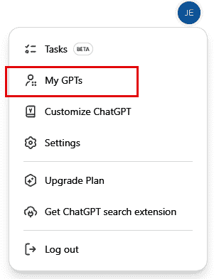
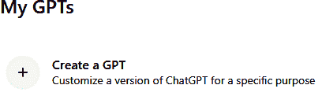
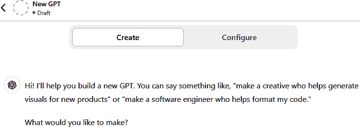
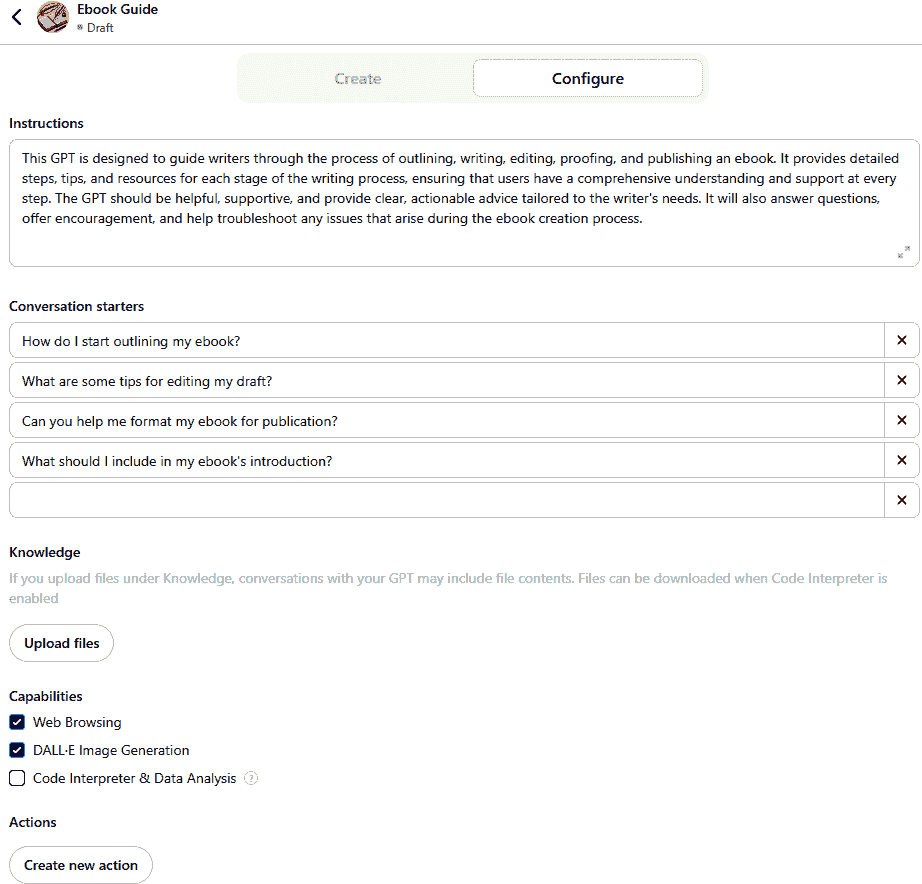
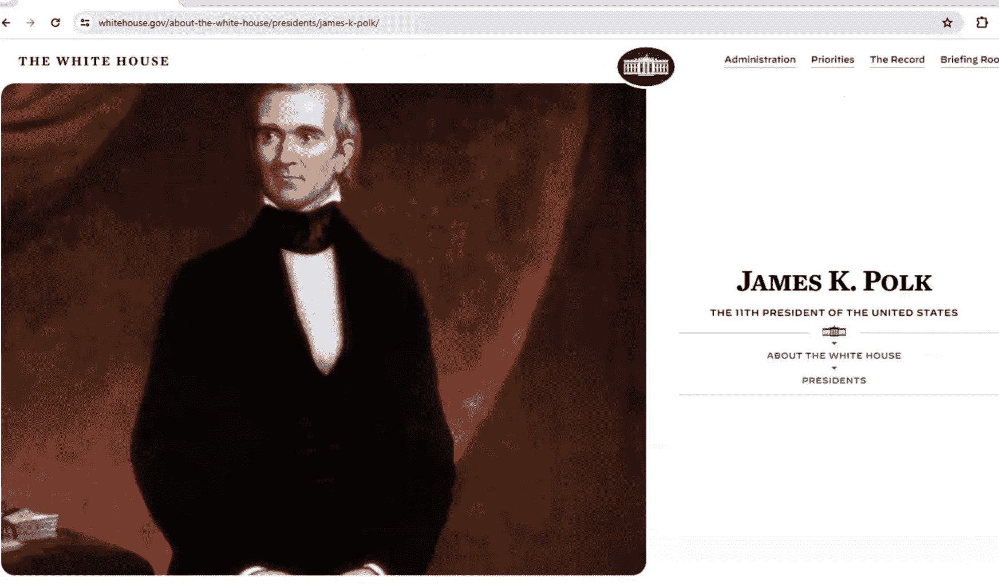
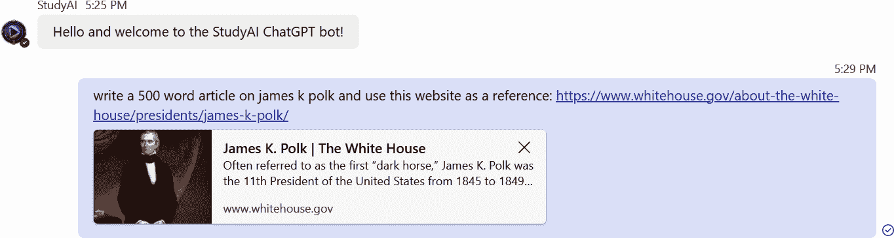
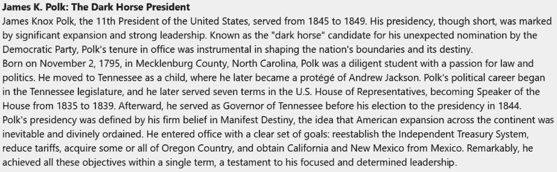

# 第六章\. 生成式 AI 在 SEO 中的高级用例

如果你有一些技术技能或有一个开发者团队支持你，你可以创建强大的定制化，以大规模使用生成式 AI 来加速增长并增加收入。在构建大规模 SEO 系统时，你将发现生成式 AI 的真正力量。与其培训初级 SEO 助理进行关键词目标研究或进行竞争分析，不如训练一个模型并部署它，这样你就可以拥有一个 AI 助手，它能在几秒钟内为你提供答案。与其通过雇佣额外的作家来扩展内容创作，不如使用生成式 AI 帮助你的现有作家提高他们的产出，同时提高他们的内容质量。

我们在第三章讨论了基础知识，但在这章中，我们将探讨使用自动化和生成式 AI 进行扩展的更技术性方面。我们将更深入地探讨生成式 AI 的实施，包括检索增强生成（RAG）的基础设施、如何使用企业 API 以及生成式 AI 在创建视频和音频方面的好处。

为 SEO 从业者提供自动化的解决方案可以提高生产力并减少日常任务所需的时间。本章涵盖了使用生成式 AI 进行 SEO 自动化的许多好处、用例和优势。我们还将讨论定制你自己的生成式预训练转换器（GPT）。

# 大规模使用生成式 AI 的价值

将生成式 AI 想象成一支你可以让他们为你完成大部分繁琐 SEO 基础工作的初级助理团队。他们可以代表你完成的任务包括：

+   发现你的网站竞争对手没有涉及的主题

+   识别你现有内容中需要解决的 SEO 弱点

+   为新内容创建草案大纲

+   研究可能为你的内容增加深度的关键数据点和数据源

+   为你网站上的新文章或甚至完整文章起草内容部分

这些只是你可能会使用基于 AI 的助理的一些例子。你不期望在没有你的专家团队审查的情况下使用他们的工作，但他们的工作使你创建和改进内容的工作变得容易得多——并且可以说提高了内容的质量。结果是更有效地使用你的时间和精力。

生成式 AI 可以有效地成为你的头脑风暴和起草伙伴，正如我们在前几章所描述的，如果你有技术技能或可以访问开发者的话，规模会更大。在我们本章（以及整本书）中提到如何使用生成式 AI 进行内容开发时，这就是你应该考虑其价值的方式。

您也可以通过将生成式 AI 工具连接到您自己的市场特定知识库来提高其输出质量，这将为您带来竞争优势。无论您的业务是什么，如果您不构建自己的知识库，您将落后。您的市场知识库是一组数据点，AI 可以摄取以返回基于您独特数据的想法、大纲和内容摘要。数据为 AI 提供燃料，并从生成式 AI 中产生更丰富的输出和个性化。

一个先决条件是具备一定的技术知识。为了利用本章中提到的许多高级用例，您需要一些软件工程背景知识，或者您需要一个工程团队来帮助处理工作的技术方面。这种技术投资将带来指数级的回报，因此值得投入必要的时间和金钱来投资高级生成式 AI 用例。

# 用于灵感的 AI 驱动 SEO 工具

在我们深入到生成式 AI 更高级的技术方面之前，我们应该提到，您可以使用市场上已经存在且具有长期 SEO 优势的预制工具来利用几个 AI 驱动的功能。这些工具比您使用自己的编程和定制模型所能做到的更为有限，但它们是一个良好的起点，并且可以为您提供开发自己工具的灵感。

假设您想在您的网站上找到新的内容。您知道您应该关注可以为您带来更多可见性的内容，但您从哪里开始寻找灵感呢？您可以关注趋势，但您如何找到这些趋势？Google Trends 可以帮助您对主题有一个大致的了解，但它不会为您找到目标关键词。AI 驱动的工具可以根据第三方 API 中的关键词、用户搜索查询中的流行度和相关关键词来生成一个长列表的内容主题，以供您选择。第三方 API（例如 Semrush 或 Ahrefs）需要额外的编码，但自动化代理可以使用第三方 API 来提出常见的关键词，然后您可以将这些关键词输入到生成式 AI 模型中，以找到内容主题并建议标题。

在第四章中，我们讨论了使用生成式 AI 进行部分流程的手动流程；现在设想 AI 代理查询这些数据源，并在不进行每一步手动干预的情况下，以规模提高输出质量。除了提示调整之外，主要的人类干预是最后的专家审查和编辑。

AI 驱动的工具还可以帮助识别反向链接机会。就像内容主题想法一样，你首先需要一个第三方 API 来获取有关竞争对手的信息。代理对这些 API 进行轮询以进行竞争对手分析和信息收集，然后将结果输送到生成式 AI 模型以找到反向链接主题或差距分析，以更好地了解你的竞争对手的反向链接配置文件。你可以使用它们来找到竞争对手的反向链接或具有相似关键词的域名，这可能是有益的。你还可以使用第三方 API 发现社交媒体或其他网站上关于你品牌的提及，并使用 AI 分析用户对你品牌的反馈。

以下工具在 GPT 和当前生成式 AI 模型出现之前就已经存在，但每个工具都有自己的 AI，你可以在你的代理和脚本中使用：

Semrush

Semrush 是一个用于关键词研究、竞争对手分析和生成式 AI 创建主题研究的订阅服务。它还拥有丰富的反向链接数据库。

Ahrefs

审查你的反向链接历史，寻找内容主题的机会。Ahrefs 也可以用于关键词研究。

Grammarly

Grammarly 对于优化内容和寻找尴尬的措辞以创建更具吸引力的内容是有益的。

Google Analytics

大多数 SEO 实践者已经使用 Google Analytics，但它是一个识别流量趋势和优化广告内容以提高转化率的优秀工具。

Yoast SEO

Yoast SEO 的付费版本为你提供 AI 驱动的标题和元描述。它还提供内容建议，以改善搜索可见性。

# 为更精准的品牌内容定制 GPT

2023 年 11 月，OpenAI 发布了允许用户创建定制 GPT 的功能。定制 GPT 对非常明确的使用案例有益。当你使用像 OpenAI 的 ChatGPT 这样的 LLM 构建定制 GPT 时，你可以使用自己的专有数据，但在没有从你的数据中获得答案的情况下，ChatGPT 将回退到其知识库。

ChatGPT 在帮助你创建内容想法方面非常出色，但你可能希望缩小到与你的品牌相关的主题。例如，假设你想开发一个聊天机器人来回答基本的客户服务问题。你不需要你的聊天机器人向用户讲解产品的历史。你需要聊天机器人提供从你的知识库中提取关键信息的产品特定信息。你可以通过创建自己的定制 GPT 来实现这一点，该 GPT 专注于这些主题。

另一个自定义 GPT 的良好用途是根据用户的搜索和购买历史推荐产品——类似于你在许多电子商务网站上看到的“购买此商品的人也购买了”功能。如果你能将那些数据保存并存储在知识库中，你就可以使用自定义 GPT 来实现解决方案。你还可以使用自定义 GPT 进行内容创作、语言翻译以及为社交媒体创建的营销信息（尽管在发布之前这些内容仍需要人工编辑检查准确性和品牌语气）。任何生成式 AI 产品都可以通过其自己的 GPT 来定制以适应你的品牌。

在创建自定义 GPT 之前，你首先需要定义几个因素：

+   你想让 GPT 生成什么？是客户的提问答案？还是你网站的 内容？

+   你想使用什么语气？也许你想用海盗语为儿童生成内容，或者你希望你的 GPT 保持专业，回答客户的查询。GPT 可以使用特定的语气和个性生成回复。

+   你的数据来源是什么？你将使用电子商务聊天机器人助手的订单数据库，还是从你的网站收集的最近搜索数据，或者关于你市场的通用知识？

这些问题的答案将被用来设置和配置你的自定义 GPT。别忘了，随着你在知识库中融入更多信息，你仍然需要监控并持续更新你的 GPT。GPT 的初始部署后，企业通常会发现错误或需要更改配置。

## 创建自定义 GPT

要创建自定义 GPT，你首先需要一个 OpenAI Plus 账户。OpenAI 有 ChatGPT 的免费版本，但你不能创建自定义 GPT 或使用 ChatGPT 的最新版本。截至写作时，Plus 订阅每月费用为 20 美元。你还可以与企业团队账户合作，每月每人 25 美元。这里分享的示例是使用 ChatGPT 的 Plus 订阅创建的。

在你的 Plus OpenAI 账户中，点击右上角显示你首字母的图标，如图 6-1 所示，然后点击我的 GPT。OpenAI 有自己的工具帮助你创建自定义 GPT，因此你在过程中会得到一些指导。



###### 图 6-1\. OpenAI 用于访问自定义 GPT 的下拉菜单

然后，点击创建 GPT，如图 6-2 所示。



###### 图 6-2\. OpenAI 创建新自定义 GPT 的界面

你现在已进入创建自定义 GPT 的界面。你应该看到一个类似于图 6-3 所示的网页。



###### 图 6-3\. 在 OpenAI 网页界面中创建自定义 GPT 的第一个提示

让我们创建一个定制的 GPT，以回答关于撰写书籍的问题。我们希望有一个 GPT，它能帮助作家理解概述、写作、编辑、校对和发布电子书的过程。因为 ChatGPT 是会话式的，我们可以使用与亲自指导作家相同的语气输入指令。我们将使用以下提示：

> 我想要一个定制的 GPT，它能帮助作家理解概述、写作、编辑、校对和发布电子书的过程。

你将看到一个等待消息，表明正在创建定制 GPT。然后，你会收到一个 GPT 名称的建议。为了简单起见，我们将使用界面中显示的推荐标题“Ebook Guide”，如图 6-4 所示。ChatGPT 还会生成一个建议的图像。为了简单起见，我们将使用建议的图像。


###### 图 6-4\. OpenAI 为定制 GPT 的说明

示例为你创建了一个定制的 GPT，但你可以通过使用 OpenAI 市场上可用的第三方定制 GPT 来节省一些时间。在 OpenAI 界面中，你将在左上角看到一个“探索 GPT”的按钮。点击此按钮将打开一个界面，你可以搜索其他人开发的定制 GPT。这些 GPT 的质量和实用性取决于创作者，但你可以找到数十个已经构建并准备好使用的针对 SEO 的定制 GPT。

例如，假设你想提高你内容的影响力。有几个定制的 GPT 可以帮助调整内容以提高可读性，并给文本带来更人性化的语气。你还可以使用这些 GPT 进行关键词聚焦、编辑、事实核查、分析内容中的空白、分析链接以比较你的内容与竞争对手的内容，以及许多其他你可以利用的任务，而无需创建和定制你自己的 GPT。

## 配置你的 GPT

在 ChatGPT 创建窗口的顶部是配置按钮。点击它以查看配置选项。例如，ChatGPT 为你提供了建议的对话开头，以帮助你的用户，但你也可以编写自己的以适应你的品牌和客户经常提出的问题。在这个窗口中，你还可以更改你的 GPT 的描述和标题。

如果你已经为你的业务建立了知识库，那么真正的力量就在这里，因为你可以为你的品牌和客户生成内容和答案。在配置窗口中，你可以上传文件以将你的知识库添加到你的定制 GPT 中。由于这个示例是一个帮助作家的聊天机器人，你可以上传有关概述、撰写章节和自我编辑的技巧和窍门的文件。这些信息将被摄取并融入你的定制 GPT 对查询的回答中。

对于品牌，您可以上传如数据表或营销手册等文件，这些文件解释了您的产品。一个企业可能有数千页的产品信息，自定义 GPT 可以在几秒钟内处理这些信息，并使用这些数据来处理客户查询。与其培训一支团队来回答问题，不如让自定义 GPT 成为您的客户支持团队，帮助回答品牌问题（尽管您仍然希望有一定程度的人类监督）。

我们的自定义 GPT 的说明显示在图 6-5 中。



###### 图 6-5\. 自定义 GPT 的配置窗口

注意，您可以赋予您的自定义 GPT 图像生成能力。如果您想为您的品牌创建自定义图像，可以包括此选项。对于基本的聊天机器人，您可能不想允许此选项。另一个附加功能是代码解释。例如，如果您有一个用于 GitHub 库的自定义 GPT，GPT 可以回答有关编码错误和错误的问题。

您还可以将自定义 GPT 连接到外部 API。外部 API 可以为您的自定义 GPT 提供数据和知识。例如，假设您想在一个电子商务商店的用户网络购物界面上持续提供新数据。您可以将 API 数据实时传输到自定义 GPT，以不断更新客户的建议，包括季节性或当前新闻内容，以及异常高的受欢迎程度。

此外，您还可以创建 GPT 操作，这使您的自定义 GPT 用户能够调用 ChatGPT 之外的工具的 API，从而显著扩展 GPT 的功能。用户继续使用自然语言提出请求，GPT 自动将这些请求转换为 API 所需的 JSON 模式。这可能包括访问第三方数据存储，因此您不需要下载他们的数据，并且通过允许它始终访问最新数据而不是可能过时的数据存储，这增加了您自定义 GPT 的弹性。

在您完成 GPT 的配置后，点击右上角的“创建”。您可以将它发布给自己（“仅我”选项）、任何有链接的人（例如与团队共享），或者发布到 GPT 商店。GPT 商店使您的自定义 GPT 对公众可用。

虽然您已经创建了一个自定义 GPT，但您的任务还没有结束。您仍然需要对其进行测试。您的自定义 GPT 将在您的 OpenAI 仪表板上可用。发布 GPT 后，您可以点击它并提问。

就像任何人工智能一样，您绝不想在没有审查的情况下“设置并忘记”，尤其是如果您使用具有 API 集成的先进配置。您可能需要更改知识部分或调整 API 返回的数据。即使在调整自定义 GPT 之后，您也应该彻底检查它，以确保它仍然能够对客户的查询提供有用的答案。

# 个性化与动态内容优化

生成 AI 的力量在于其能够大规模生成个性化与动态内容。生成 AI 的“大规模”力量在于自动化。

在上一节中，我们创建了一个自定义的 GPT，因此现在我们将讨论生成个性化与动态内容。GPT 对于基本查询是足够的，但更高级的自动化是通过一个名为*检索增强生成*（RAG）的系统来完成的。RAG 将数据从您控制的多个来源输入到 LLM 中，确保您正在使用的生成 AI 工具使用的是您知道是正确的信息。对于 RAG，您需要更多的技术技能，但您可以完全自动化许多您可能目前执行的手动 SEO 程序。

## RAG 简介

RAG 架构将 LLM 与传统的数据存储系统相结合。例如，您可以使用 RAG 与从自定义 GPT 收集数据的标准关系型数据库一起使用，或者您可以使用它与从网络搜索或知识库收集的大量数据集一起使用。SEO 从业者可以使用 RAG 从关键词研究、反向链接分析或从您品牌的网站上收集的数据生成内容。

将数据检索与动态数据合并使得 RAG 系统能够在内容中找到相似性，并使用您独特的知识库来构建输出。LLM 的训练需要时间，许多常见的模型使用的是稍微旧一点的数据，因此它们对最近的事件并不了解。您可以通过您的 RAG 系统使最近的信息可用。更重要的是，使用自定义数据将比依赖广泛 LLM 系统的数据更加高效，并且可以更容易地为高度动态的企业进行个性化。RAG 架构允许 LLM 在处理用户查询的时间内检索数据，使得 LLM 能够实时摄取数据，以尽可能多的相关上下文产生更准确的答案。您通过大规模的内容生成获得更高的生成 AI 准确性。一旦您实施 RAG 来处理错误，您仍然可能会遇到错误，但您可以减少它们发生的频率。

一个 LLM 需要数据来提供准确的答案，而当数据不足时，生成 AI 工具在准确性方面仍然存在重大问题。例如，假设您想从聊天机器人中识别常见问题。您的聊天机器人收集问题并将它们存储在关系型数据库中。您可以从关系型数据库中为 LLM 提供问题和答案，然后生成内容并将其上传到托管知识库的 WordPress 博客。这个过程可以用来防止生成 AI 工具可能产生的幻觉。术语*幻觉*描述了当 LLM 没有足够的参考材料或简单地引用在线找到的错误信息时，您可能从 AI 那里获得的错误结果。

RAG 内容生成为你提供了个性化的读者体验。如果你的公司即将推出新产品，那么你现在需要为知识库生成内容。为新产品构建大型知识库可能需要几周时间，但生成式 AI 可以在几分钟内为你提供一个供人类审查的草案。API 可能有数百个端点，但生成式 AI 可以在开发者部署解决方案时在几分钟内生成开发者知识库内容的草案。无论何时你需要基于定制品牌输入的个性化内容，生成式 AI 都可以提供帮助。

## 许多不同类型的 LLM

在构建你的 RAG 架构之前，你需要确定你想要使用哪个 LLM。你有几个选择，但每个在选择写作内容时都有自己的风格。例如，ChatGPT 是可用的最受欢迎的生成式 AI 模型之一，但它的声音可能比其他一些平台更加机械和冗长。另一方面，Claude 生成的内容被认为更接近人类的声音。

###### 注意

人工智能正在迅速发展，因此请注意，在本书出版后，将会有新的 LLM 和现有 LLM 的更新可用。在你阅读本文时，可能已有更新的版本可用。

以下是截至 2025 年 5 月你可以考虑与之合作的几个 LLM：

ChatGPT-4.5 和 OpenAI o1

ChatGPT-4.5 是更受欢迎和灵活的多模态 LLM 之一。它还拥有 DALL-E 用于创建图像。它速度快，并且已经在互联网上发布的数十亿页面上进行了训练，包括数万亿的文字、代码和翻译。OpenAI 通过人类反馈的强化学习（RLHF）对其 LLM 进行微调，这可以帮助你在与模型合作时改进结果。OpenAI o1 集成了高级推理，更适合高级编码、科学研究或任何需要逐步解决问题的领域。请注意，o1 速度较慢，每个标记的成本也更高。（*标记*类似于信用或数字货币，用于“支付”生成式 AI 的输出。）

Anthropic Claude 3.7 Sonnet 和 Opus

到本文写作时，Claude 3.7 Sonnet 是 Anthropic 最新的 LLM 模型。它以更接近人类输出的特点而闻名，但它在分析视觉输入，如图表或照片方面也表现出色。Sonnet 非常适合多步骤工作流程，尤其是在需要快速处理和上下文相关响应的任务中特别有效。Claude Opus 在高级内容创作方面表现良好。它以其处理复杂任务的能力而闻名，如生成详细的研究报告、分析复杂数据以及创建需要更深入理解的高质量内容。

Google Gemini 1.5 Pro 和 1.5 Flash

Google 多年来一直在使用 AI，并于 2017 年发表了关于 transformers 的原始论文——这是 LLMs 所基于的技术。截至本文撰写时，Google 有两个显著的模型：Google Gemini 1.5 Pro 和 1.5 Flash。这两个 AI 模型都能处理文本、图像、音频和视频，但它们有不同的用途，并且针对不同的任务进行了优化。Gemini 1.5 Pro 是为复杂任务设计的，更适合深度推理和细微的理解。它可以执行复杂的推理任务，例如生成长文本、音频记录或视频内容的摘要。Gemini 1.5 Pro 还可以用于内容创作、故事写作和剧本编写。Gemini 1.5 Flash 针对快速响应时间进行了优化，更适合需要快速处理和低延迟的应用程序。它非常适合时间敏感的任务，如聊天应用程序和实时数据分析。

Google PaLM 2

PaLM 2 是为语言应用设计的，而 Gemini 是为多模态应用设计的。PaLM 2 在它所擅长的语言中，在摘要和问答等高级任务上表现更好。Gemini 在诗歌、歌词或对话等创意写作方面表现更好。如果您只处理基于文本的模态并需要翻译，您可能考虑使用[PaLM 2](https://oreil.ly/yqCV4)来帮助为多种语言大规模生成内容。

如果您想降低成本并定制模型，也存在一些开源模型。我们将在“构建 RAG 架构”中讨论为什么和何时使用定制的 LLMs，但要知道，如果您有技术专长（或技术团队）来定制现有模型，您有多个开源 LLMs 的选项。开源 LLMs 可能需要更陡峭的学习曲线，但设置后的总体拥有成本可能更低。开源模型对任何人开放，因此漏洞必须报告给创建者以进行修复。漏洞很危险，因为它们可以被用来毒化结果或获取对您数据的访问。

一些可用的开源模型包括：

Milvus

为可扩展性和机器学习应用构建的向量数据库

Meta Llama

提供基于文本输出的 AI 模型

Grok

一个用于基于文本输出的 AI 模型，但设计得更具对话性

## 构建 RAG 架构

RAG 的算法和后端处理很复杂，但创建架构只有两个步骤：

1.  用户输入，例如来自您网站搜索功能或聊天机器人问题的查询

1.  源数据，可能是数据库、一组动态创建的文件、NoSQL 数据库、网页或任何其他可以输入到 LLM 中的数据源

虽然创建自定义 GPT 不需要编程，但创建 RAG 架构需要一些技术知识。你可以使用带有 RAG 的自己的本地 LLM。我们将使用之前创建的相同自定义 GPT 来生成输出内容。你可以在图 6-6 中看到一个 RAG 基础设施的示例。


###### 图 6-6\. RAG 基础设施的一般概述

假设你需要创建关于你品牌的内容，但你不想包含关于你产品过于通用的知识。你的品牌可能销售手机配件，但你不想在内容集合中包含手机的历史。你可以使用你自己的品牌内容来喂养 LLM——在这种情况下，ChatGPT——然后根据输入构建内容。

在以下示例中，我们将使用关键词输入从你网站上的网页语料库中构建品牌内容。例如，假设你进行了一些关键词研究（顺便说一句，这可以通过 AI 自动化，但更多内容稍后讨论），你希望使用常见的搜索短语来围绕你的品牌构建内容。你可以使用你选择的任何语言来自动化这个过程。本节中的示例将使用 Python。

要创建一个 RAG 实现，你需要三样东西：

+   语料库，或 LLM 将用于生成内容的 数据集合

+   ChatGPT 的 LLM API

+   从关键词或搜索短语输入生成内容

### 收集语料库

创建 RAG 实现的第一步是收集语料库。*语料库*是用于训练 AI 的数据集合。这是一个“背景知识”的术语。你可以使用任何数量的语料库数据，包括存储在数据库中、网页、静态文件，甚至图像中的信息。

没有语料库，你将得到关于提供的输入的一般信息。例如，如果你输入“手机”，你将得到从手机历史到手机供应商再到关于修理手机的问答等各种输出。如果你在销售配件，这些信息将污染你的内容输出。语料库将训练 LLM 针对你的品牌和目标受众，这样你可以得到更加精确和准确的结果。

在我们的例子中，一个本地品牌网页集合将作为语料库。在现实世界中，你会爬取你的网站或使用站点地图来添加到语料库中，但为了简单起见，我们将使用硬编码的文本作为我们的例子。以下代码示例有一句话或两句话来代表一个品牌页面，但你的网页将包含多行内容来训练 LLM。请注意，语料库是针对我们品牌的特定内容：

```py
brand_corpus = [
  "This yellow mobile phone case is perfect for the iPhone 16 and can...",
  "Mobile phone cases are perfect for protecting your device from rain...",
  "Our mobile phone accessories cost between $10 and $100 and can be..."
]
```

### 连接到 LLM API

在你有了语料库之后，你接下来需要连接到 LLM API。在这个例子中，我们将使用 ChatGPT 作为 LLM，但还有其他几个也有 API（例如，Microsoft Azure、Google Cloud、Anthropic、Hugging Face）。你需要一个账户，对于任何主要 LLM，这个账户必须是付费账户。每个 API 也都需要访问密钥。你可以在 LLM 的文档中找到如何为你的账户生成密钥的方法。我们假设你已经安装了 OpenAI Python 库。如果没有，你可以在你的 Python 开发环境中使用以下安装提示：

```py
pip install --upgrade openai
```

安装了 OpenAI 之后，你现在可以创建与 ChatGPT API 的连接：

```py
from openai import OpenAI
client = OpenAI(api_key="...")
```

### 从用户输入生成内容

现在你需要代码来提取文档——在这个场景中是一个网页，并且你将使用用户输入来创建内容。我们的用户输入来自关键词研究。关键词研究可以通过在“AI-Powered SEO Tools for Inspiration”中提到的 SEO 工具手动完成，或者你可以使用自动代理（在下一节中讨论）进行研究。在这个例子中，假设你有一个包含关键词的文本文件列表：

```py
from openai import OpenAI
client = OpenAI(api_key="your_api_key")

brand_corpus = [
  "This yellow mobile phone case is perfect for the iPhone 16 and can...",
  "Mobile phone cases are perfect for protecting your device from rain...",
  "Our mobile phone accessories cost between $10 and $100 and can be..."
]

prompt = (
  "Create a 500 word article and incorporate brand information "
  "from this content: {brand_page}. Use this keyword as the "
  "focus for the topic: {keyword}."
)

response = client.chat.completions.create(
  model="gpt-4",
  messages=[
    {
      "role": "user",
      "content": prompt.format(
          brand_page=brand_content[0],
          keyword="iphone 16"
      )
    }
  ]
)

print(response)
```

这个例子很简单，但你可以在内容生成和 RAG 中结合代理输出和自动化。这段代码的重要部分是提示（prompt）。提示被发送到 LLM（大型语言模型），告诉它使用什么来生成内容。

LLM 可以生成比简单的页面内容更多的内容。你可以使用竞争对手分析来创建一个用于反向链接机会的出版物列表，找到前五名竞争对手的页面及其关键词来创建你自己的内容草稿，从与竞争对手页面比较的差距分析中创建大纲，或者简单地基于热门关键词生成内容，就像我们在这里做的那样。

使用 RAG（检索增强生成）让你的品牌能够处理内容生成中的实时数据，但你并不总是需要人工查询。你可以使用代理自动化草稿内容的生成，代理可以识别关键词并将这些关键词输入到你的 RAG 系统中。

### 定制的 LLM 或从头开始构建

在前面的例子中，我们使用了 ChatGPT 作为模型，但你并不局限于常见的 LLM。你也可以使用定制的 LLM，但你应该只针对非常具体的用例使用它们。前面提到的常见 LLM 有万亿级别的数据点可供使用，所以你可以提出各种程度的问题。使用定制的 LLM，你定义模型并将其限制在特定的用例中。对于大多数企业来说，定制的 LLM 并不是必需的。模型只能在某些数据上产生结果，因此它没有常见 LLM 可用的额外信息。

要创建自己的 LLM，您需要基础设施、大型语料库、测试资源、技术发展经验以及托管它的资金。模型需要图形处理单元（GPU）小时来计算训练。您可以使用云服务提供商来训练一个模型，但当然您必须为资源付费。大约每 GPU 小时花费 1-2 美元，所以一个大约有 1000 亿参数的小型模型，大约需要 10 万 GPU 小时，训练成本可能高达 20 万美元。作为一个参考，Llama 2 大约有 700 亿参数，因此训练一个大模型可能需要超过 100 万美元。

从零开始构建 LLM 有四个步骤：

数据整理

这是耗时最长的步骤。您需要准确、高质量、去重数据以及足够信息来训练模型的数据源。您可以使用互联网，也可以使用公共数据集，包括 Common Crawl 和 Hugging Face。另一个选择是使用 LLM 来创建数据集。数据集应该多样化，取决于您期望的输出。您可以使用网页、代码、书籍、新闻、文章和科学期刊。

构建模型架构

这是一个具有注意力机制的神经网络，用于匹配输入和输出。神经网络识别模式和上下文，以便一个词可以与其他类似词相比“被理解”。例如，神经网络必须识别像 *park* 这样的词的位置和序列。它必须识别这个词是表示停车一辆车辆还是一个人们聚集的公共场所。

训练

规模化训练复杂且需要之前提到的价值高的 GPU。

测试和审查

您必须评估和审查您模型的结果。Hugging Face 网站有一些基准可以用来识别您模型的成功。

正如您所知，构建自己的 LLM 需要极端的技术知识。您需要一个团队来帮助您，并且需要大量的计算能力预算。如果您的用例非常具体，您可以生成高度针对性和有效的品牌服务内容。这可以提升销售额，并使您能够以良好的投资回报率构建数千页的商业内容，但这是一个长期、高价值的项目，必须首先仔细规划。

## 使用 AI 自动化 SEO 任务

将 AI 代理视为您的自动化助手。您的自动化 SEO 助手可能知道每天早上您需要关于影响您品牌的最新的趋势的关键词研究。代理从 API 中提取信息，并将关键词输入到生成式 AI 提示中，以获取内容建议。AI 代理可以每天为您收集这些数据，这样您就不必依赖人来执行这项任务。您的 AI 代理还可以在一天中的多次分析趋势，以便您可以根据趋势的变化调整目标，使您的营销更加有效。

假设一个代理为您进行了趋势分析之后，您决定创建内容或进行竞争对手分析，以查看竞争对手是否已经针对特定关键词进行排名。您可以拥有多个代理“交谈”，根据它们自己的输出做出决策。每天收集趋势的 AI 代理可以将输出发送给另一个代理，该代理将根据竞争对手分析做出生成内容的决策。第二个代理可以分析这些趋势，找到相关搜索词的前五页，并决定是否生成内容。内容生成决策也可以发送给第三个代理，以便根据其自身分析创建草稿内容想法。

代理是强大的自动化工具，但它们需要一个目标。当您构建代理时，您可以集成生成 AI 模型以帮助代理做出决策。例如，您可以让一个代理使用 Claude 来评估 ChatGPT 生成的内容。这种来回评估可以用来生成和评估内容，直到您创建出符合您语气和品牌风格的稿件。

在本节中，我们将分解用于为品牌生成内容的代理系统的组件。

### AI 代理的基础设施

一个 AI 代理就像在机器上默默运行的脚本。图 6-7 显示了代理的几个潜在角色。


###### 图 6-7\. 代理的潜在角色

当您构建自己的代理时，您需要基础设施来托管它们。开发可以在任何语言中进行，但 AI 通常使用 Python 构建，因为其预构建的库对开发者免费可用。尽管如此，您并不局限于 Python，一些企业选择使用 R、Java、C++、JavaScript、Lisp 和其他语言。

您可能会为了资源分配的便利性而使用云托管，但您需要的不仅仅是主机机器。以下是您需要考虑的 AI 代理基础设施的几个因素：

数据库存储和管理

AI 需要数据用于训练，您选择的数据库可以存储它。如果您计划完全从互联网获取数据，则不需要数据库，但很可能会想要记录错误并跟踪 AI 代理正在做什么，这仍然需要数据库来存储这些数据。同时，考虑您计划存储的数据类型。非结构化数据需要 NoSQL 数据库，但结构化数据可以使用传统的关系型数据库。例如，使用像 MongoDB 这样的非结构化数据库存储网页数据更容易，但日志事件可以使用像 MariaDB 或 PostgreSQL 这样的关系型数据库。

互联网接入

您的代理可能将在本地网络中运行，但如果您计划理解有关您主题的第三方内容，使用第三方 API 或发布到您的公共网站，则需要访问互联网。

虚拟机或计算资源

代理就像服务一样，在您编程的时间执行一个动作。这可能是一天一次或一天多次。您需要一个主机机器和计算资源来运行代理并处理其结果。不要仅为了处理初始代理处理而配置资源。您需要足够的资源来扩展，随着您获取更多数据和添加更多代理任务。

安全性

不要忘记将安全性集成到您的开发工作流程中。安全性差可能会使您的业务面临诉讼或数据泄露的风险。验证数据，尤其是在使用外部互联网源进行摄取和输出时。

### 代理角色

我们将拥有四个代理，它们将承担以下角色：

SEO 分析师

这个代理将获取品牌的常见关键词，并从为这些关键词排名的竞争对手那里获取顶级文章（或顶级文章列表）。

研究员

您希望内容的表现优于竞争对手，因此研究人员将评估内容的每个部分。

作者

研究代理将输出传递给作者代理，这个代理将生成想法，并在必要时生成这些想法的摘要，用于使用生成式 AI 起草内容。然后，人类作者可以采用这些想法并编写将被输入到内容编辑中的内容。您甚至可能让人类编辑审查内容并跳过内容编辑代理。

内容编辑

初稿内容的第一遍可能不符合您的需求，因此可以使用编辑代理来识别不匹配的语气和技术信息。

#### SEO 分析师

作为一名 SEO 从业者，您可能正在监控您品牌的具体关键词。您可能有一份趋势关键词列表，一份季节性关键词列表，以及用于生成内容的通用品牌相关关键词。您可以手动识别搜索引擎中的竞争对手表现，但 AI 驱动的代理可以为您完成这项工作。代理将花费更少的时间来完成这一步骤，并且它可以每天进行多次分析，而不是依赖分析师手动完成。您甚至可以自动化这一步骤，让这个代理将数据输入到下一个代理中，以提高效率。

SEO 分析师代理可以从第三方 API 或使用您自己的搜索引擎抓取解决方案中提取文章的顶级列表。不仅代理会识别排名靠前的页面，它还会从每篇文章中提取内容。每个代理都需要一个目标，而这个代理的目标是从关键词列表中提取排名靠前的文章。正如您所想象的那样，这对于一个人类 SEO 分析师来说是一项全职工作，但 AI 驱动的代理可以在几秒钟内完成这项活动。SEO 分析师代理是您使用 AI 在规模上推动活动并克服人员限制的第一步。

在构建这个代理时，您编写代码来覆盖其他代理需要执行的操作。以下是一些您可能需要代理执行的任务示例，所有这些都可以作为提示输入到常见模型之一：

+   记录您想要跟踪的网站，例如竞争对手的网站或您想要分析内容的网站。确保创建包含网站列表的提示，或者要求模型为特定搜索查询提取顶级排名的内容列表。

+   从代码中提取内容。这可以通过使用第三方库来完成。你需要标题、章节内容，但不需要代码或格式。不过，你应该保留链接及其锚文本。

+   避免反复抓取相同的内容。一些服务器头返回最后更新变量，但这很少见。除非您想分析更新内容，否则可能值得记录之前抓取的 URL。为了节省资源，您只有在搜索排名提高时才重新抓取竞争对手的内容。

+   如果您正在分析重定向或错误，服务器统计信息可能很有用，因此可能有助于提取并记录服务器响应。例如，您第一次提取文章可能会导致服务器 404 错误，因此当代理再次执行其活动时，您想要重试。

#### 研究人员

在您从顶级搜索链接中提取内容后，您需要分析内容。SEO 分析师代理将其输出发送到研究人员代理。在规模化的情况下，这正是 AI 可以真正让您更高效的地方。一个人可能一天内可以实际阅读几篇文章来识别内容质量，但如果没有帮助，他们一天内无法阅读数十篇文章。SEO 研究代理使用 LLM 来分析内容，以寻找改进的机会。

当研究人员分析内容时，它必须确定内容关键词以及您的品牌是否有机会撰写更好的内容。重要的是要注意，您想要的是更好的内容，而不是“同样好”的内容。SEO 研究人员代理可以在几秒钟内帮助您完成这一步骤。通过客观分析，下一个代理可以帮助构建草稿内容。

为了生成更好的内容，研究人员代理甚至可能基于提取的关键词进行二次搜索，或者与您当前的品牌内容合作，以确定内容是否应该添加到现有文章中，而不是创建一个全新的页面。您可能已经有一个在搜索引擎中排名的页面，因此您可以选择向该页面添加新的相关内容。研究人员代理还可以进行差距分析，以确定竞争对手的内容与您的内容之间的差异，从而使您的内容与搜索排名保持一致。

研究人员代理仅受您所能编写的代码的限制。您可以在扩展系统中拥有额外的研究人员代理，但在这个例子中，我们将使用识别您网站上可以生成的内容的目标。在研究人员代理完成分析后，新的内容想法将被发送到作家代理。

您的分析的大部分“内容”可以使用这个代理来完成。以下是一些应该编码到您的代理中的技术方面：

+   使用生成式 AI 提示提取关键词以获得帮助。你可以编写自己的提取器，但这将非常繁琐。生成式 AI 可以为你完成这项工作。

+   将文章的标题与你的和搜索引擎中排名靠前的其他文章进行比较。研究代理可以建议更好的标题，以潜在地提高排名。

+   使用从排名靠前的文章中提取的内容对你的内容进行差距分析。你可以提示生成式 AI 为你进行差距分析，这样你就不需要创建可能需要几天时间构建和测试的任何复杂代码。

+   使用差距分析和生成式 AI 结果，确定你想要撰写的内容和想要更新的内容。你可能有一些必须重写的内容或需要添加的部分。其他关键词也可以用来生成新内容。

+   使用次级模型来核查内容。

#### 作者

如果你已经使用 LLM（大型语言模型）来撰写草稿内容，你就知道写作中涉及的提示。作者代理调用 LLM API 来撰写内容。你需要进行实验以找到最适合你的 LLM。大多数人认为 ChatGPT 适合内容创作，但 ChatGPT 的输出往往显得机械。如果你偏好 ChatGPT，你仍然可以使用它。你的评论和编辑代理（下一节将讨论）应执行事实核查并验证内容语气。

你用于 LLM 的提示取决于你的目标。这个代理将写作提示发送到 LLM 的 API。你需要关键词、语气、意图（例如，信息性或交易性）、受众以及你想要用于围绕自己的产品塑造草稿内容的任何品牌页面。API 返回内容，但你不能让生成式 AI 在没有任何类型验证的情况下撰写内容。 

在构建你的代理系统时，始终审查内容以确保其仍然准确，并且代理按预期工作。当 LLM 部署版本升级时，你可能希望升级你的生成式 AI 草稿内容流程以使用最新版本。更新将生成与旧版本不同的内容，因此在升级版本后始终审查新内容。

如果你已经使用生成式 AI 进行内容创作，那么作者代理将是一个熟悉的概念。区别在于代理自动化了草稿内容的创建。这个代理的一些技术任务包括：

+   生成部分标题以分隔内容，并使用户更容易扫描和找到他们想要阅读的信息。

+   让生成式 AI 为你产品的链接创建吸引人的号召性用语。

+   在你的网站上包含指向其他内容的链接。

+   生成元描述、标题和内容摘要。

+   构建问题和答案，并将内容集中在你的品牌解决的问题上。

+   使用你自己的内容示例或你喜欢的其他内容来获取你想要的风格和语气。

注意本节对草稿内容创建的强调。生成式 AI 不能保证在没有专家人类审查的情况下发布的内容。回想一下本章前面提到的类比，即有一支初级研究人员团队为您工作。生成式 AI 容易出错，会遗漏重要事项，无法准确捕捉您的立场，等等。下一节中讨论的编辑代理通过解决这些问题中的一些建议，可以帮助提高您的内容质量，但在发布之前您仍然需要专家人类审查。

#### 编辑

您系统中最后一个代理会检查作者代理的草稿内容。正如在现实世界的出版系统中，作者需要编辑来识别不自然的措辞、事实问题、不清晰的章节，或者添加提高文本质量和可读性的内容。编辑代理会执行这一步骤，而无需您雇佣数十名编辑。使用生成式 AI，您可以创建比使用人类作者更大的规模的内容，因此您也需要扩展您的编辑团队。

如前文所述，您应该对第二个 LLM 进行错误和内容调性的检查，而不是使用同一个。这将提高结果的准确性。如果编辑代理在内容上存在问题，您可以将其发送回作者代理进行内容重写。另一个选择是让编辑生成改进的内容，但这取决于您的系统设计。您如何设置代理设计取决于您的偏好，但我们建议您的编辑代理仅验证内容并向作者代理发送反馈。这样可以使您的系统模块化，以便您可以轻松地在单个位置更改内容生成。

编辑代理还可以记录反馈和内容生成事件，以便进一步审查，帮助您进行管理。例如，您可能想知道有多少内容因事实错误而被退回给作者代理，这在您希望被视为行业权威时是严重的。编辑代理可以记录这些事件，以便在错误过多时您可以查看。您可能需要调整提示，或者您的代码可能存在逻辑错误。

与人类作者一样，生成式 AI 输出的草稿内容也需要编辑。您需要核实输出内容的事实，并确保内容具有人类调性。一些模型如 ChatGPT 听起来可能非常机械，但其他模型，如 Claude，则因其听起来更接近人类而闻名，因此请检查输出的调性。

下面是创建编辑代理的一些技术要点：

+   核实输出内容。您曾使用研究员代理核实竞争对手的内容，但您必须再次核实新的输出，以避免在您的品牌网站上发布令人尴尬的错误信息。

+   使用第三个模型检查调性。例如，使用 Claude 检查 ChatGPT 内容是否存在调性问题或错误。

+   在发布任何 AI 生成的内容之前，将内容发送给人类审阅员。

+   如果发现任何错误，这个代理可以将内容发送回写作代理进行重新分析和重新创建。

# 为大型项目使用企业平台

正如我们之前所说，高级生成式 AI 的力量在于其能够扩展你的 SEO 项目。你可以轻松地为你的网站每天生成一到两篇文章，但 AI 可以帮助你增加内容生产量同时提高内容质量。在第二章中，我们提到使用 AI 进行内容创作可以提高吞吐量 30%，降低成本 30%，并提高质量 30%。

要在企业级别进行扩展，你需要企业级平台。几个云平台提供 API 和计算资源来支持大规模代理系统、生成式 AI 内容生成、自动分析和任何其他基于代码的 SEO 项目。如果你可以编写代码，你需要一个地方来托管它。

最大的和最受欢迎的平台是：

Microsoft Azure

微软对 OpenAI 进行了大量投资，并创造了 Copilot。[OpenAI 的 API](https://oreil.ly/dtTcC)提供了聊天机器人、内容管理和直接问答的端点。

Amazon Web Services (AWS)

亚马逊为所有类型的机器学习和生成式 AI 提供了多个 API 和端点。[Amazon Bedrock](https://oreil.ly/e98mO)有助于构建生成式 AI 应用。Bedrock 也可以用于 RAG。

OpenAI

OpenAI 提供了一个方便的[内容生成 API](https://oreil.ly/jgFL7)。ChatGPT 因其内容生成而受欢迎，所以很可能至少有一个代理正在使用该 API。

Google Cloud Platform (GCP)

Google 有一个[代理构建器](https://oreil.ly/6j69Z)，你可以用它来减轻构建自己基础设施的大部分技术负担。Vertex Agent Builder API 可以帮助你的工作流程，而 Gemini 对生成文本和图像有益。

你不限于这四个平台，但这些平台已经集成了 AI API 和服务。如果你选择较小的提供商，请确保他们有资源来支持生成式 AI 和 AI 驱动的自动化。

###### 小贴士

一旦你与单个 API 提供商集成，你将绑定到该特定提供商。因此，你应该确保该提供商具有你当前和未来 SEO 项目的所有功能和可扩展性选项。

你选择的任何 API 都将集成到你的代理编程中。它为你做繁重的工作，这样你就可以依赖第三方基础设施来协助生成内容。我们的 AI 代理系统示例中的写作代理可以使用内容生成 API 之一来构建内容，例如。

在采用特定模型之前，你必须了解其局限性以及你可以做什么来扩展你的运营。使用企业平台是关于扩展的，但并非每个 API 都提供你需要的速度和内容质量。以下是在选择大型项目提供商时你想要考虑的一些最重要的功能：

可用性

大多数大型提供商至少提供 99%的可用性服务级别协议，但地区对于企业级处理来说很重要。地区离你的处理地点越远，你在数据传输中的延迟就会越大。可用性地区是在你的业务和用户的一般地理位置存在的数据中心。更进一步，可用性区域位于站点用户的国家的地区，以实现冗余。例如，[Azure 在 140 个国家有 54 个地区，AWS 有 66 个可用性区域，GCP 有 173 个区域](https://oreil.ly/wnDB8)。如果一个数据中心发生故障，另一个可用性区域可以接管。冗余对于故障转移和可用性至关重要。

延迟

延迟是指数据在网络中传输所需的时间，包括数据库中的处理时间。保持低延迟对于应用程序的性能至关重要。CPU 和存储性能在延迟中扮演着一定的角色，如果这些因素没有得到优化，它们可以将一个一小时的过程变成一天。当你需要使用更多的计算来降低延迟时，你可能会承担更高的成本。优化计算资源是必须的，并且需要具备创建可扩展基础设施的技术知识，这样就不会浪费你的预算。

每个提供商在提供各种数据传输大小的计算和网络能力方面都做得很好。[基准测试](https://oreil.ly/jUA1t)显示，GCP 在处理能力方面表现最佳，AWS 在网络吞吐量方面表现最佳，Azure 在 I/O 吞吐量方面表现最佳。你可以在所有三个平台上测试你的应用程序，但在处理大型数据搜索和 AI 处理时，快速的计算能力和网络性能最为重要。

成本

你应用程序的成本将取决于你选择的计费模式和使用的资源量。所有提供商都有工具可以帮助你根据你部署的资源估计你每个月将花费多少，但你的成本也会取决于代理部署、处理期间使用的资源数量以及你调用提供商 API 的次数。如果你不小心，当你的应用程序进行过多的资源调用时，你可能会被高昂的成本所困扰。这些资源调用可能是故意的，或者你可能存在逻辑错误，耗尽你的预算。

三家提供商都提供按需支付计划，但它们还提供针对企业定价的替代方案，为高资源应用提供折扣。截至本文撰写时，Azure 有一个名为 ExpressRoute 的计划，用于租赁私有云，这意味着您的数据永远不会离开数据中心。这个选项非常适合对合规性要求严格的企业。

根据您的资源和数据使用情况，您可能每月需要支付几百美元到几千美元。很难准确地说您将支付多少，因此请检查提供商的计算器以帮助您估算。

API 配额和令牌限制

API 配额和成本可能被视为相同，但提供商通常有订阅要求或对 API 请求数量的限制。这些限制是为了避免对 API 服务器进行拒绝服务（DoS）攻击而设置的，但通常基于您的订阅模式。超出限制的任何调用都可能非常昂贵。

无意中向带有配额的 API 调用过多不仅会花费几百美元。超出 API 配额可能会让您花费数万美元。错误发生在您在超出一定数量的请求后拥有高额收费的订阅，或者您的代码中存在逻辑错误。假设您有一个逻辑错误，将您认为的 5 个请求变成了 50 个请求。您的代码每小时运行几次。您可能因此向 API 发出数百个未预见的请求。如果您没有为这些请求做计划，当您收到云提供商的账单时可能会感到意外。

每个模型和 API 都有不同的令牌限制和上下文窗口限制。影响将取决于您的用例。

# 构建您自己的 AI 工具和插件

到现在为止，您应该熟悉模型供应商提供的典型提示界面，但您也可以使用 API 构建企业级插件和工具。例如，假设您有一个负责生成内容的营销团队。您可能已经为他们设置了 Microsoft Teams，让他们整天进行交流。您可以为 Teams（以及其他协作软件）创建机器人，因此您可以在 Teams 中创建一个机器人，让所有营销人员都可以生成内容。

一个 Teams 机器人就像被添加到您的 Teams 组中的用户一样。一个自定义机器人可以对用户消息提供一系列不同的回复，而一个生成式 AI 机器人可以为您的营销团队提供内容创意。机器人看起来像一个标准用户账户。如果您熟悉 Slack，您知道当您加入一个新的服务器时，机器人会立即向您打招呼。它看起来和表现得像一个真实用户，但您会发送特定的命令来询问如何使用 Slack。同样，您也可以使用 Teams 机器人，除了这个机器人会从您的营销团队那里接收提示和指令，并提供可用于内容输出的文本。

让我们用一个简单的例子来编写关于美国总统的内容。您从“使用 AI 自动化 SEO 任务”中知道，您可以使用代码来分析网页，但我们希望得到帮助以大规模生成关于美国总统詹姆斯·波克的内容。ChatGPT 允许您使用示例来塑造其输出内容的方式，因此您甚至不需要自己的分析代码。ChatGPT 会为您完成。如图 6-8 图 6-8 所示，拜登白宫档案馆提供了关于波克的信息，因此我们的机器人将被指示从该页面获取信息并生成内容想法。



###### 图 6-8\. 比尔德总统档案馆关于波尔克的页面

Teams 机器人可以用任何语言编写，但在这个例子中我们将使用 Python。在早期代理系统示例中，我们使用 Python 创建了一个小应用程序，从 ChatGPT 中提取答案。我们的 Teams 机器人将不会提示 ChatGPT 回答问题，而是为任何发送特定提示消息给它的市场营销人员（或另一个部门）生成草稿内容。Python 代码可以与生成式 AI 模型（在我们的例子中是 ChatGPT）接口，并发送回内容。优势在于您可以有 20 个市场营销人员从同一地点生成草稿内容和想法，他们可以共同确定 SEO 策略。例如，假设您有一个销售计算机设备的网站。NVIDIA 宣布了一款新的 GPU，因此您需要生成内容以跟上趋势并帮助推动流量到您的本地网站。您的市场营销团队可以与 Teams 机器人聊天，以提出想法和草稿页面，在新的 NVIDIA GPU 兴趣激增时发布。

我们将保持示例简单，专注于波尔克白宫页面的内容。ChatGPT 有大量内容和信息可以生成关于旧话题的良好内容，但你仍然需要审查输出。人类审阅者可以识别错误或低质量内容，因此在发布到您的网站之前，始终让守门人审查输出。Teams 界面允许您从“应用”界面安装自己的机器人。编写完整的机器人超出了本书的范围，但编写机器人后，您必须从 Teams 界面上传代码。您还需要权限在 Teams 中使机器人可用，因此如果您没有权限，请咨询您的 Teams 管理员。

我们的机器人连接到 ChatGPT API，我们可以要求它根据白宫网页编写内容，如图 6-9 图 6-9 所示。



###### 图 6-9\. 对名为 StudyAI 的 Teams 机器人的示例请求

如您所见，我们要求 Teams 聊天机器人根据白宫 URL 编写内容。聊天机器人花了一分钟，并响应如图 6-10 图 6-10 所示的内容。



###### 图 6-10\. 基于 ChatGPT 的聊天机器人的输出

你不应该在没有人工审查的情况下发布这些内容。正如你所看到的，你需要格式化内容，并可能进行事实核查，但使用事实性的 URL 将有助于消除错误。一旦你检查了错误，你就可以让 ChatGPT 大规模生成页面，同时根据你选择的主题提高质量。你可以告诉 ChatGPT 使用从第一页生成的格式化原始内容作为其他内容的基础。我们不推荐你将这种技术推向极端，使用生成式 AI 生成 SEO 程序化内容。然而，你可以在保持大规模的同时显著加快进程，同时将人工审查和编辑插入到过程中。

回到之前提到的 NVIDIA 的例子，想象一下，如果你有一个基于另一个热门话题的产品正在开发，或者基于热门话题有额外的想法。你可以让一个代理持续检查你行业中的热门话题，并将想法和更新发送给市场营销人员。市场营销人员可以使用自定义的机器人和插件快速生成页面，而无需等待作家撰写内容。插件和自定义工具可以将你的内容生产时间从数周缩短到数小时，以跟上快速变化的行业趋势。

# AI 辅助链接吸引和推广

SEO 不仅仅是生成网站上的内容。另一个你需要解决的问题是通过营销和推广来提高你的可见性，吸引链接，并从阅读第三方网站的人那里激发对你品牌的兴趣。将你的努力集中在那些覆盖你市场的顶级网站上，以发展可见性和认可。避免使用传统的 SEO 链接建设策略，这些策略会导致大量低质量的链接——谷歌根本就忽略那些链接。此外，大规模的互联网垃圾邮件式推广只会造成问题，浪费你的时间和金钱。

例如，假设你需要介绍一款新产品。你可以创建新闻稿，并联系覆盖你市场的网站上的编辑。目的是在市场上关于你的产品引发讨论。一个使用生成式 AI 的代理可以帮助你。

在“构建你自己的 AI 工具和插件”中的代理示例从互联网上抓取内容，并对其进行分析以寻找机会。使用不同的代理，你可以让它查看链接到你的竞争对手的网站。其中一些可能是你可以吸引链接的网站，以及其他与链接到你的竞争对手的网站类似的网站。你还可以使用工具自己查找回链差距。例如，Semrush 允许你执行关键词差距和回链差距分析，如图 6-11 所示。


###### 图 6-11. Semrush 的回链差距分析

通过从竞争对手那里获取的链接列表，你可以识别出自己的链接机会。到目前为止，我们还没有使用生成式 AI，但我们可以以几种不同的方式使用它。当你想要联系一个网站建立关系时，你可以用它来起草电子邮件信息。然而，不要生成自动化的电子邮件并发送，而无需人工审查。如果你创建看起来像 AI 或信息质量差的邮件，你可能会被那个特定的出版商列入黑名单。

第三方链接分析工具最适合寻找竞争对手的链接，但你可以将来自第三方 API（例如，来自 Semrush 或 Ahrefs 的数据）的信息输入到生成式 AI 中。你使用的逻辑取决于你如何编程你的代理，但你可以使用代理调用 API 并检索可以输入到生成式 AI 中的数据。例如，Semrush API 可以用来查找潜在反向链接位置的域名权威性。有了这些信息，你就可以要求生成式 AI 建议内容或为每个网站构建一个适合的主题想法列表。AI 可以识别目标网站负责编辑或收件人，可以向其发送邮件进行外展。请注意，你仍然需要通过人工审查来验证你是否拥有正确的联系人。这可能看起来像是一个微小的优势，但当你有大量的外展努力推动品牌营销时，它可以节省大量时间。

# 使用 AI 创建视频和音频

生成式 AI 的另一项宝贵用途是图像、视频和音频的创建。不幸的是，当音频和视频由 AI 生成时，可能会显得有些明显。例如，一个人说话的视频可能会显示出不自然的嘴部动作。AI 生成的图像往往容易出现奇怪的特征，AI 生成的音频可能会听起来像机器人，例如。如果你选择生成这类内容，要知道它将需要大量编辑。

与使用生成式 AI 创建视频和音频相比，SEO 从业者可以与 AI 合作来改进现有的音频和视频。AI 可以增强色彩分级，编程场景之间的过渡，并添加特殊效果。当你的品牌专注于创建和发布视频而不是文本内容时，这可以为每个视频节省数小时的编辑时间。

使用 AI 处理和优化本地 SEO 列表的其他优势包括编写元描述、转录视频内容以及为基于文本的搜索生成内容摘要。生成式 AI 最适合用于围绕视频内容的基于文本的优化，以满足用户参与度和质量搜索信号。

# 使用 AI 管理和优化本地 SEO 列表

本地 SEO 针对特定地理位置的潜在客户，因此它具有与全球 SEO 不同的方法。你的目标不是吸引全球访客，而是当用户想要附近的商业或服务时出现在搜索结果中。你可能是一家单店实体店，希望提高在线可见性，或者是一家拥有数百或数千个地点的大型品牌，希望在每个地点获得更好的覆盖范围。生成式人工智能可以帮助为你的本地客户创建优化的元描述，检查你的列表以确保地址和电话号码等信息的连贯性，收集客户评价，并识别为本地关键词排名的竞争对手。

就像全球 SEO 一样，过度依赖未经审查的自动化内容可能会造成比帮助更大的损害。尽管如此，人工智能可以降低运营成本，并有助于声誉管理、跟踪本地列表、起草对评论和评价的回复、更新地址以及提醒企业主潜在的不满意客户。最大的优势在于人工智能的预测分析，这有助于企业确定在繁忙季节销售的最佳产品，并满足不断变化的市场趋势。人工智能自动化改变了负责在小型区域内依赖搜索可见性的本地企业 SEO 从业者的游戏规则。

优秀的本地搜索引擎优化（SEO）的一个重要部分是确保本地列表使用企业的当前地址、位置和电话号码保持更新。这些信息应在所有平台上保持一致，以便向搜索引擎发送准确的信号。搜索引擎必须知道企业的位置，以便向查询本地服务用户提供准确的结果。企业的搬迁、电话号码和工作时间的变化，以及许多其他因素也可能发生变化。你可能记得在几个商业列表网站上更新地址变化，但可能会错过几个其他网站。当信息不一致时，这会向搜索引擎发送低质量的信号，从而影响你在本地搜索查询中的排名。

使用人工智能自动化，本地商业 SEO 从业者可以识别包含过时信息的网站，并向个别地点的管理员或所有者发送电子邮件，或者使用自动化脚本来起草内容更新。这是自动化步骤的第一步，但在过程中，人工智能可以抓取大量网站，提取评分和客户评论，并进行分析。分析可以提供客户情绪并识别问题。例如，客户可能已经发布了几个低评分，抱怨客户服务或产品质量。人工智能可以识别这个问题，并向营销、SEO 从业者和公关管理发送警报，以帮助识别改进的机会。

从企业网站上的客户活动提取足够的数据后，AI 可以用来在用户访问时个性化用户体验。假设你有一个来自特定城市的访客。从这个特定城市提取的访客数据表明，大多数访客在夏季会搜索特定的商品。作为一名 SEO 从业者，你可以指示开发者在这段时间内向这些用户更突出地展示这个商品，并在其他季节为同一客户更换推广的商品。

语音和图像优化尚未完全实现，但这是未来需要关注的一点。我们将在第八章中讨论语音和图像搜索，但请记住，使用简单的语音或图像搜索将成为 SEO 的一个日益增长的兴趣领域。用户已经可以使用图像进行搜索，但这仍然很原始。生成式 AI 可以用来即时创建图像，以便在图像搜索中提升你的企业品牌，为访客流量提供新的机会。语音搜索已经存在了一段时间，但使用率相对较低；这可能会增长。

# 人工智能增强的 SEO 声誉管理

口碑对每个企业都很重要，但对于本地企业来说更是如此。无论是你提供的服务还是本地产品，潜在客户在做出购买决定之前很可能会研究评论。网上的评论和评论可能会对收入产生巨大影响。然而，采取积极主动的方法解决客户问题可以扭转这一局面，并确保影响是积极的。

在“使用 AI 自动化 SEO 任务”中，我们讨论了代理收集在线数据并使用它进行差距分析和通过关键词研究自动化辅助内容生成。你同样可以用品牌声誉来做同样的事情。AI 和机器学习最强大的用途之一是预测分析。在 SEO 中，你还可以深入了解用户情绪。

你可以通过监控互联网上的品牌提及并从用户情绪中寻找机会来预测你的品牌声誉。负面声誉可以通过回应差评来减轻。你可以雇佣全职人员来回应负面评论，尤其是如果企业是一个大型企业，但 AI 自动化也可以成为你的全职员工，并帮助起草对这些客户投诉的回应。

许多企业通过建议投诉者联系客户服务来回应负面评论。这种回应总比没有好，但它并不特别令人满意，而且错过了品牌的机会。这种互动可以做得更多，不仅能够满足投诉者，还能让在线观看对话的其他人满意。品牌应将这些投诉视为一个机会，公开展示他们对客户的支持程度，并将其作为其品牌形象的一部分。

而不是让员工在网上搜索品牌评论，可以使用 AI 自动化来寻找新的品牌提及，并根据用户的反馈起草评论。而不是使用看起来像机器人一样机械的固定回复，实际上可能会损害品牌声誉，AI 可以吸收用户的评论并为每个客户评论生成定制的草稿回复。

例如，在图 6-12 中，ChatGPT 被要求寻找 Study.com 的最新评论。这条评论是积极的，但也可能是负面的。这个提示可以输入到您的 RAG 系统中，以自动在指定的时间间隔（例如每天或每周一次）找到评论。然后，您可以对这些评论进行整理并制定回应。


###### 图 6-12\. ChatGPT 提示寻找 Study.com 的最新评论

图 6-13 是生成式 AI 对 Study.com 评论的响应。这个生成的回应对正面评论表示赞赏，但也可能是对负面评论的回应。这个例子是针对单一评论的，但您可以使用您的 RAG 代理跟踪和回应在互联网上找到的众多评论。


###### 图 6-13\. 生成式 AI 对 Study.com 的 Instagram 评论的响应

您还可以使用生成式 AI 为聊天机器人提供支持。从搜索引擎来到您网站上的访客可以由聊天机器人迎接，帮助他们找到产品。虽然这看起来可能不是 SEO 问题，但保持访客参与可以提高网站上的停留时间，并减少访客跳转到其他网站搜索的机会。这可能会影响 SEO 并直接提高销售额，这是任何 SEO 或营销的最终目标。

收集数据以了解用户情绪，有助于众多业务变革，从而提高收入。它可以推动新产品，建议对产品进行更改，或者告诉你何时应该淘汰某个产品或服务。营销人员和 SEO 从业者还可以收集关于竞争对手洞察的数据，找出客户喜欢竞争对手的哪些方面，以及公众希望改进的地方。然后，您的企业可以确定是否有机会根据针对竞争对手的客户情绪为自己的品牌创造优势。

# 将生成式 AI 与其他营销渠道整合

在上一节中，我们讨论了使用生成式 AI 来分析用户在发布评论或对产品发表评论的网站上表达的情感。同样的方法也可以应用于社交媒体。一些评论网站甚至抓取社交媒体账户的产品评论，因此你可能会花时间创建自动化脚本来查找提及你品牌的社交媒体帖子，并使用生成式 AI 来创建评论。例如，使用生成式 AI 通过建议客户联系客户服务来回应不良的客户体验。这类活动最适合声誉管理，并且可以跨越社交媒体和评论网站。更广泛地说，你可以使用生成式 AI 来发现与你业务相关的帖子，并将它们作为你可能想要回应的帖子呈现出来。在社交媒体上参与活跃的对话并吸引更多访客到你的网站对 SEO 有益。

PPC 是营销中常见的流量生成器。PPC 成本高昂，但对于某些品牌来说，它是销售的关键。创建广告有几个步骤：进行关键词研究以找出要针对的搜索查询，优化你的出价以确定每点击的正确价格，创建驱使访客访问你产品的广告内容，安排广告在客户在线的最佳时间发布，并添加跟踪以查看哪些广告带来收入，哪些没有。正如你可以想象的那样，执行所有这些步骤并监控广告收入是一项庞大的工作。没有优化，PPC 广告可能会提供次优的投资回报率，浪费金钱。生成式 AI 可以帮助减少这种开销，并使你的 PPC 努力更加成本效益高，并针对目标受众进行优化。

使用生成式 AI，SEO 从业者可以根据预测分析的结果创建草稿广告内容。预测分析可以来自你自己的代理从网络上的数据中摄取，以及你的销售和营销部门。预测分析的结果为广告优化提供支持，并决定你发布广告的时间和应该花费多少。

生成式 AI 还处理草稿内容的创建以供人类审查，这样你可以减少根据一天中的时间、季节、在着陆页上捕捉到的用户活动结果或从网络抓取的评论中的总体情绪对广告进行修改的成本。你如何使用生成式 AI 取决于你的目标，但它可以使广告支出和决策更加精确。

从着陆页收集的数据可以输入到人工智能和机器学习中，根据用户活动进行预测。例如，假设你有一个提供三种产品选择的着陆页，数据显示有更多用户更喜欢这三种中的蓝色商品。然后你可以让生成式 AI 创建针对有这种偏好的用户的草稿广告（供人类审查和批准），从而提高你的投资回报率。

AI 在 PPC 和营销中的另一个优势是着陆页的优化。*热图*——显示访客互动的常见位置——显示了用户点击你页面的热门区域。热图并不新鲜，但如果一个热图显示了网站特定菜单中的常见区域，你可以利用这些信息，将其输入 AI 和机器学习，让生成式 AI 建议对您的着陆页及其内容进行更改，以实现更优化的布局。热图已经为你提供了着陆页布局的想法，但生成式 AI 可以使你的营销更加动态，并能更快地适应用户与广告和着陆页互动方式的变化。

# 开始使用生成式 AI 自动化

在应用生成式 AI 的众多选项中，第一步是确定你想要看到的结果。例如，你可能想知道生成式 AI 是否可以帮助广告优化。你的目标可能是提高品牌的转化率。使用生成式 AI，你可以根据从当前页面收集的数据提出对着陆页和广告的更新建议。你也可以使用销售和用户活动数据来确定你的最佳卖家以及可能影响销售的任何季节性或趋势变化。

在这些目标的基础上，你可以规划你的代理和编程设计。如果你没有技术背景，你可能会需要工程团队的帮助。虽然单个脚本可能不会太复杂，但提供基础设施、构建多个代理和使用可用的 API 可能会相当复杂。工程团队可以帮助减轻这种负担，并与你的品牌合作，使用 AI 的代理系统构建完整的 RAG。

与任何生成式 AI 输出一样，对这些输出的审查对于确保你不发布错误或不合逻辑的信息至关重要。你还需要调整代码或基础设施，以跟上版本变化或你行业中的趋势。

# 结论

在本章中，我们讨论了高级生成式 AI 的应用以及如何自动化许多常见的 SEO 任务。随着生产力的提升，也会出现一些你必须避免的常见陷阱。自动化有其好处，但如果你不正确实施和审查其输出，它可能会造成严重的排名问题。了解与这项技术相关的风险非常重要，这样你就可以在设计中将缓解策略纳入其中。

正如我们将在第七章中讨论的，在系统实施后，你必须根据人类审查结果进行监控和持续调整输出。即使你实施了这些高级技术，你仍然需要持续的人类审查。我们将在下一章中探讨可能的风险。
