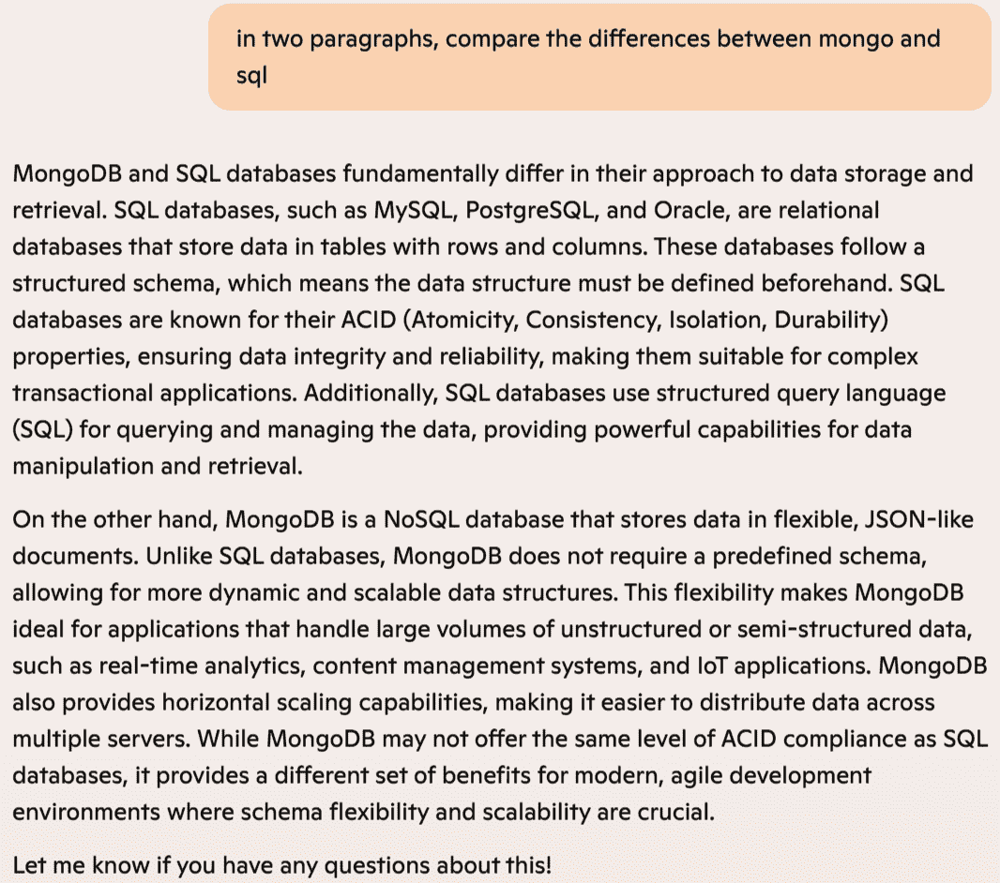

# 第七章\. AI 风险与挑战

在第二章中，我们讨论了生成式 AI 的限制。本章将探讨由此限制产生的风险和挑战。重要的是要理解，限制和风险是两个相互独立但又相关的概念。限制解释了 AI 不能做什么。例如，生成式 AI 只能使用之前发布的数据来提供见解；在没有首先摄取提供所需信息的那些数据之前，它“不知道”任何东西。

AI 的限制导致了风险，这些风险对你的 SEO、品牌和收入可能造成毁灭性的影响。各种风险可能导致影响收入的后果，包括诉讼、搜索引擎排名下降、品牌损害和可能的处罚。然而，许多 AI 风险可以通过仔细的人工审查来减轻。尽管 AI 减少了执行重复性 SEO 任务的开销和时间，但如果没有人类审查员的批判性思维，它无法很好地工作。

在本章中，我们将讨论在使用 AI 时可能会遇到的一些常见陷阱以及如何克服它们。如果你还记得第二章中的 Gartner Hype Cycle（图 2-3），其中一个阶段是幻灭。许多 AI 的陷阱可能导致幻灭，但通过正确的策略，这些挑战是可以管理的，我们也将在本章中讨论这些策略。

# 最大的风险：低质量内容

SEO 从业者的核心工作是创建一个网站，通过为用户提供一个寻找事实性、有洞察力、引人入胜的内容的地方，为互联网增加价值。一旦你失去了这个目标，你就冒了所有的风险，不恰当地使用 AI 是走上错误道路的可靠方式。AI 是一个强大的工具，但它的力量伴随着确保你正确使用它的责任。

大部分风险源于能够大规模生成内容。如果你几年前就在大规模生产内容，你会有作家每周生成几篇作品。与 AI 相比，质量较高的人类作家产生的低质量内容比例相对较低，AI 每周可以生成数百篇——甚至数千篇。随着规模的增加，低质量内容的比例也会增加，因此，AI 生成的多数作品通常模糊不清、缺乏吸引力，感觉像是空洞的文字。

一旦谷歌从你的内容中捕捉到低质量信号，你很可能会在搜索引擎流量上遭受重大下降。因此，我们强烈建议你**不要**使用生成式 AI 大规模创建内容（意味着每周数百篇）**除非**你有非常庞大的团队来审查和修复你将在内容中发现的各种问题。

Google 算法知道你的网站可能存在一些低质量内容；当你的内容变得无帮助且不吸引人时，你开始看到搜索排名的下降。低质量是主观的，但无吸引力和无帮助的内容往往会导致用户参与度降低，这是 Google 排名的一个重要因素。用户会离开你的页面，进行搜索以找到另一个网站。这种行为向算法发送低质量信号，导致搜索排名下降。不仅排名下降和 Google 处罚是最大的风险，而且它们也是最难恢复的。可能需要数年才能恢复，甚至可能永远无法恢复算法信任。随着越来越多的内容污染互联网，获得算法信任将变得更加困难，这使得小型品牌竞争更加困难。使用 AI 生成大量内容可能最初很有吸引力，但它很可能导致长期在搜索引擎排名中的算法损失。

作为一名 SEO 实践者，你的工作是构建能够回答潜在客户搜索引擎查询意图的页面。当生成式 AI 在 2023 年蓬勃发展时，Google 于 2 月发布了一份[声明](https://oreil.ly/F1VP0)，表示“适当使用 AI 或自动化并不违反我们的指南。”Google 从未打算将此应用于使用生成式 AI 创建低质量内容。

让我们看看一个与 SEO 相关的简短示例。图 7-1 中的提示要求 ChatGPT 提供顶级 SEO 建议，以及针对技术网站的顶级 SEO 建议，并且要具体。

注意，尽管第一个请求要求具体，但输出却很模糊。“高质量、以用户为中心的内容”是任何行业网站的通用建议。第二个提示要求提供针对技术网站排名的 SEO 建议。注意，第二个输出与第一个大致相同。两个输出都感觉空洞且不吸引人。如果这是你内容中的一个片段，你希望有人类编辑添加实质性和具体性。

###### 图 7-1\. ChatGPT 为 SEO 建议的输出

省略错误难以检测，但可能对你的品牌造成伤害，尤其是如果你的品牌依赖于在行业中的权威地位。假设你销售一款软件即服务（SaaS）产品，它提供与竞争对手相同的两个功能，但你的增值主张是一个额外的功能。这个功能是最近引入的，但你的竞争对手拥有更大的市场份额。你需要创建内容来比较你的产品与竞争对手的产品，并利用它来介绍你的新功能。如果你使用生成式人工智能创建内容，输出很可能会告诉用户你的 SaaS 产品和竞争对手的产品都有两个相同的功能，但它会省略你的新设计功能。如果你自动化内容创建，你可能会发现你网站的新内容毫无价值，因为它没有推广赋予你的 SaaS 产品竞争优势的功能。不仅如此，你不仅想要提及这个新功能——它应该是内容的重点，因为那是你的竞争优势。虽然内容是准确的，但它缺少了对你营销至关重要的信息。

###### 注意

想要深入了解由人工智能局限性导致的错误示例，请参阅“生成式人工智能的局限性”（“Limitations of Generative AI”）。

现在我们来看一个技术示例。假设你销售数据库服务，你需要向潜在客户展示你理解不同的数据库引擎，特别是 MongoDB 和微软 SQL Server。让我们让 ChatGPT 给我们提供两段关于这两个数据库之间差异的段落。输出如图 7-2 所示。

###### 图 7-2\. ChatGPT 4 输出比较 MongoDB 和 SQL Server

在图 7-2 中，ChatGPT 提到 SQL Server 支持一个称为*ACID*（原子性、一致性、隔离性和持久性）的概念，然后说 MongoDB 提供了其他优势。如果你查看官方 MongoDB 资源页面，它们表明 MongoDB 也是[ACID 兼容的](https://oreil.ly/diqfG)，如图 7-3 所示。

###### 图 7-3\. MongoDB 资源页面上关于 ACID 兼容性的信息

尽管图 7-2 中的 ChatGPT 内容没有明确说明 MongoDB 不是 ACID 兼容的，但它省略了 MongoDB 实际上是 ACID 兼容的事实，因此提供的信息是不正确的。很容易看出这种低质量内容可能会通过给潜在客户留下你的品牌不是真正该主题权威的印象，从而造成品牌损害。最终结果是你的品牌销售减少，并可能损失搜索引擎排名。

你可以使用其他 LLM 来验证 ChatGPT 的信息或交叉引用事实。图 7-4 至 7-6 显示了 Claude、Microsoft Copilot 和 Gemini 对同一查询的输出。

###### 图 7-4. 比较 MongoDB 和 SQL Server 的 Claude 输出

###### 图 7-5. 比较 MongoDB 和 SQL Server 的 Microsoft Copilot 输出

###### 图 7-6. 比较 MongoDB 和 SQL Server 的 Gemini 输出

为了克服遗漏错误，你需要一个真正的 SME（行业专家），他可以识别缺失的部分，了解在哪里寻找它们，并验证信息是否正确。在这个例子中，需要一位了解数据库的审稿人知道这两个数据库都是 ACID 兼容的，并验证供应商网站上的信息。

在大规模创建内容时，请记住，你的主要目标是向用户提供价值。问题的关键在于低质量内容，而我们在本章其余部分讨论的其他风险都涉及到对低质量内容的担忧。

# 发布速度：对于 SEO 来说，更快并不总是更好

雇佣作家一直是 SEO 从业者的一大开销和时间消耗，因此一夜之间拥有 100 个 AI 作家的想法很有吸引力。随着谷歌（以及其他搜索引擎）继续发展和尝试控制 AI 生成内容的批量发布，重要的是要认识到，更快地发布并不总是意味着质量提高和更好的搜索引擎排名。事实上，如果你之前每周发布一或两篇文章，现在突然每周发布数百篇文章，你可能会向搜索引擎算法发送错误的质量信号。

正如我们在前面的章节中讨论的，谷歌对低质量的 AI 生成内容进行降级排名。用于生成内容的 AI 模型尚未达到无需人工编辑的程度，但 2024 年有大量组织试图这样使用它，结果我们在搜索引擎中看到了大量混乱，因为所有这些低质量内容都被发布。用户抱怨，谷歌撤销了其最初关于 AI 生成内容对用户和排名是可接受的立场。

搜索算法的一个组成部分是**信任**的概念。信任通常通过网站的年龄和长期向搜索引擎发送的质量信号来衡量。例如，如果你的网站是宝马（BMW）并且你正在尝试为汽车相关内容排名，谷歌可能会比新网站更信任你的网站。我们观察到，在存在大量由大规模内容发布产生的 AI 生成噪音的空间中，谷歌已经撤销了更改，并重新开始信任那些长期的老牌网站。谷歌的信任因素难以衡量，但你可以通过始终审查你生成的 AI 内容来避免降级排名。

每个网站都有其低质量内容，但应将其控制在最低限度。如果您在传统上每周只发表几篇文章后，每周发表数百篇新文章，这可能会向搜索引擎发送低质量信号。信任的理念是持续但缓慢地增加产量，以确保高质量内容始终是首要目标。缓慢扩大规模将避免向质量算法发送任何红旗。例如，您可能有 50:1 的高质量内容比率，其中 50 篇文章中只有 1 篇发送低质量信号。如果您在未经检查质量的情况下过度扩大自动化内容，您的内容质量比率可能会迅速变为 60:30，这意味着近一半的内容是低质量的。更糟糕的比率可能会影响您网站的总体搜索排名。

# 版权：独特的内容并不意味着您拥有它

您的内容可能通过抄袭检测器，但 AI 为版权带来了新的变化。因为 AI 是根据他人的写作生成内容的，所以您创造的内容并非真正属于您自己，尽管这些单词序列在互联网的任何其他地方都没有出现过。与另一位作者以相同的语气、声音和风格撰写的内容可能被视为侵犯版权。我们说“可能”是侵犯版权，因为截至本书写作时，诉讼仍在进行中。

八家大型、知名的出版商正在起诉 OpenAI——ChatGPT 的创造者，指控其[侵犯版权](https://oreil.ly/TQlnf)。诉讼的核心是 ChatGPT 的内容使用了他们的原创作品和记者的原创想法来生成类似的内容。诉讼声称 OpenAI 使用了他们的作品来训练模型，这引发了一个问题：如果 AI 摄入的数据中有一部分不可用，AI 是否能够生成原创内容。

侵犯版权在未来法规中仍然是一个未知因素，但 SEO 从业者应确保他们既不提示 AI 以任何其他作者的相同风格和语气创建内容，也不使用单一信息来源创建内容。忽视这一点可能会增加侵权诉讼的可能性。一些诉讼，如*Concord Music Group, Inc. 诉 Anthropic PBC*和*《纽约时报》诉微软和 OpenAI*，向法院提供了复制原始作品的输出。LLM 提供商正在[质疑这些指控](https://oreil.ly/QiEBt)并声称“内容重复”是一个缺陷而不是一个特性。使用生成式 AI 来制作内容的 SEO 从业者[也无法对其版权进行声明](https://oreil.ly/X_eqE)，这可能会在您自己的内容被盗时引发问题。

为了避免侵犯版权，应多样化你的信息来源，并在你的内容中提供参考文献——通过链接或脚注注明所使用的来源。一些 SEO 专业人士选择与多个 LLM（大型语言模型）合作，以多样化输出并验证信息。例如，你可能使用 ChatGPT 来生成内容，并使用 Claude 来验证该内容。你还可以在提示中指定使用多个来源，并要求 ChatGPT 为其内容提供来源列表。

# 剽窃：你写了这篇内容吗？

每位教师都有试图将剽窃内容当作自己作品的学生的。如果你使用生成式 AI 创建内容而不彻底检查，AI 可能就是你的坏学生。与其让一个作者生产剽窃内容，不如让 AI 相当于一百个作者生产剽窃内容。对于 SEO 从业者来说，与多个其他网站有相同的内容会降低发送给搜索引擎的质量信号，可能会影响你的搜索排名。

网络上的剽窃与学术剽窃略有不同。在学术上，你不能从另一位研究者的白皮书中重写内容并称之为自己的，仅仅因为通过了剽窃检测器。这种活动仍然是剽窃。但互联网的工作方式与学术界不同。同一个想法在互联网上可能被写上几十次。你的内容策略可能与这些相同的思想重叠，但你希望增加其他品牌内容策略中找不到的价值。“价值”是主观的，取决于你的目标受众，但你的目标应该是提供与搜索查询相关的信息，并指导读者下一步去哪里。这将向读者和搜索引擎提供价值，反过来又可以提高你的排名和信任信号。

当你有作者为你工作时，你应该检查他们的内容是否存在剽窃。一个执行此操作的工具体例是[Copyscape](https://www.copyscape.com)，但你也可以使用你喜欢的搜索引擎找到许多其他工具。这些工具并不完美，但它们提供了一个良好的初步检查，以确保你的作者没有剽窃。你还应该将你的内容与互联网上已经发布的内容进行比较。你可以将完整的或部分句子复制粘贴到 Google 中，以查看是否有大量内容被作者剽窃。

此外，你应该检查你的作者是否没有使用生成式 AI 工具来创建内容，然后将其称为自己的作品。正如我们在第三章中讨论的，作者可能不会很好地审查内容以查找错误、遗漏、版权侵犯等问题。市面上有许多工具可以检查内容是否由 AI 编写，例如 Copyleaks 和 ZeroGPT。参见“AI 检测工具”以获取更长的列表。

###### 警告

我们应该注意，检查内容以查看是否由人工智能编写的工具可能非常不准确。事实上，人工智能生成检查器说[美国宪法是由人工智能编写的](https://oreil.ly/6sYiP)。尽管如此，你应该执行这些检查，因为它们可能会标记一些问题。请注意，它们有时也会标记非人工智能编写的内容，并声称它是。因此，将这些工具的输出视为方向正确，但让人类验证他们的评估。

让你的编辑团队审查你作家的工作，以寻找其他可能表明作家可能过度使用生成人工智能来创建内容的迹象。如果你有开发能力，确保内容原创的最好方法是使用一个 CMS（或等效技术），要求作家在工具中写作，而不是从外部文档中复制粘贴。然后你可以使用键盘生物识别算法或像[TypingDNA](https://oreil.ly/ugIvQ)或[Typing AI](http://typing.ai)这样的工具，这些工具可以指纹化作家的速度和按键动态，以确保他们正在进行原创工作。

人工智能生成的内容会从其他来源获取输入，但可以用来在总结某人撰写的内容时创建独特的内容。引用来源将给予原始作者适当的信用。现在 LLMs 包括指向原始来源的链接，这样你就可以在将内容发布到你的网站上时进行归属。

原创性检查器仍然不能以 100%的准确率识别人工智能生成的内容，但使用它们将有助于标记潜在的剽窃和人工智能生成的内容，以验证你的作家没有使用人工智能。对于所有人工智能生成的内容，你应该让人类编辑检查其中的错误、遗漏和笨拙的措辞。

# 自动化自满：你不能“设置并忘记”

人工智能是一种强大的自动化工具。我们在第六章中讨论了一些自动化用例。你可以用人工智能做很多事情——无论是使用与人工智能协同工作的外部工具（例如，Google Analytics）还是构建自己的工具。例如，你可能会在 Microsoft Excel 宏中使用人工智能来收集数据并创建描述或识别趋势。人工智能可以帮助你做很多事情，从而获得竞争优势，比如关于竞争对手排名的日常自动化信息，或者竞争对手排名与他们的发布内容相比以及你自己的发布内容之间的差距分析。

在 SEO 中使用人工智能进行自动化对于效率至关重要，但人工智能发展迅速（主要由于人工智能及其流行的创新速度极快）。随着更多错误和创新的出现，人工智能公司将会适应并推出提供显著更好结果的新模型。第二章涵盖了流行模型的演变，这本书发布后很可能会出现另一个迭代。

AI 的更改应该使用户受益，包括 SEO 高管，但您应确保您的自动化脚本考虑到这些更改。AI 自动化应持续审查可能影响输出准确性的任何行业变化。例如，谷歌与 Reddit 签署了一项价值[6000 万美元](https://oreil.ly/Yltl0)的协议，以使用 Reddit 内容来帮助训练其生成式 AI 工具。Reddit 拥有数百万用户，Gemini 可以从人类生成的内容中受益。如果您有任何基于 Gemini 内容生成自动化的方式，Reddit 及其内容“语气”的更改可能会极大地影响由此产生的内容的类型。这种语气和信息可能偏离您的内部政策、产品声音或受众关注点。

另一个常见的自动化机会是利用 AI 进行竞争对手分析或反向链接机会。这两者都可能为单个 SEO 从业者节省数小时的时间，因此使用 AI 可以大大减少开销，同时又不消除必要的研究。使用自动化，您可以扫描竞争对手的链接，审查他们的最新内容策略，获取他们的反向链接列表，并将这些研究应用于构建自己的策略。这甚至可能让您深入了解竞争对手的季节性习惯和产品发布。AI 模型和产品不断变化，在这个过程中，它们会影响您的报告。您的 SEO 团队仍需要审查这项工作以确保准确性，但它可以显著加快工作进程。

然而，如果您不更新自己的脚本并监控结果，您可能会无意中扭曲结果。在您使用生成式 AI 进行竞争对手分析的情况下，可能它发现了之前未被分析的新域名，或者网站的变化没有被用于当前模型。这种场景再次表明，始终需要与人类审阅员一起工作以生成 AI 输出。人类审阅员可以检查不准确和不自然的措辞，并编辑内容以使其更具对话性。人类审阅员的小幅修改可以使内容对读者更具吸引力并避免错误。对于任何用于关键研究和报告的自动化工具也是如此。

如果您陷入“设置后忘记”的陷阱，您最终可能会以规模化的方式生成低质量内容，或者错误地针对可能对它们的投资回报率过于昂贵的查询。假设您基于排名前三的竞争对手创建内容。您的 AI 自动化可能扫描竞争对手的页面，提取关键词，并根据差距分析创建内容。但它可能不会完全理解创建页面的上下文。

例如，如果谷歌的 AIO 在移动设备上占据了大部分屏幕空间，那么用户可能不得不滚动很长的距离才能看到您网站的搜索列表？用户可能不愿意这样做。此外，AIO 可能回答问题得足够好，以至于用户懒得向下滚动页面。

如果你基于单一差距分析生成大量文章，你可能会为永远不会产生积极回报的查询部署内容。例如，如果你使用谷歌分析跟踪流量和参与度，你可能会注意到你的行动号召或有机搜索访客的点击次数要少得多。如果没有投资回报，拥有基础设施和其他昂贵事件（例如，来自第三方供应商的 API 查询）可能会造成损失。这就是为什么你应该始终审查自动化，即使 AI 结果对于你大多数自动化事件是正确的，也不要天生信任它。

# SEO 的噩梦：失去搜索引擎排名或谷歌惩罚

失去排名（或遭受手动惩罚）是 SEO 从业者的噩梦。这些挫折发生得很快，解决问题可能需要数月的工作。有些网站永远无法完全恢复。为了避免这个噩梦，SEO 从业者努力遵循谷歌的指南，同时通过独特和创新策略打破壁垒，帮助他们的品牌。

失去排名和谷歌惩罚是两种不同的现象。*失去排名*意味着有负面因素影响算法信任和质量信号。*惩罚*是对你网站的手动操作，旨在阻止你的网站获得良好的排名。两者都很难修复，但需要两种不同的策略。失去排名需要审查你的网站以查找低质量信号和技术问题，但惩罚意味着必须纠正对谷歌政策的严重违反。

谷歌希望将生成式 AI 整合到搜索结果中，但同时也知道人类用户必须对搜索结果感到满意。糟糕的用户体验会促使用户转向谷歌的竞争对手，如必应和其他直接提供答案的 LLM，这将破坏谷歌主导搜索引擎的品牌声誉。与此相对的是，由生成式 AI 带来的巨大炒作所造成的市场压力。如果谷歌在这个领域不被视为领导者，这可能会直接影响其在搜索技术领导者方面的整体声誉。这对 SEO 从业者来说是一个复杂的利益冲突，他们可能会认为谷歌工程师对任何 AI 都持乐观态度。

然后还有谷歌如何看待 AI 生成内容的问题。2023 年 2 月，谷歌发布了[关于 AI 生成内容的指南](https://oreil.ly/F1VP0)，表明其主要关注内容的质量，而不是内容是否由 AI 编写。然而，谷歌知道由生成式 AI 创建的内容并不提供任何超越网络现有内容的独特价值，除非经过人类专家的严格编辑，否则通常质量较差。但许多网站会继续发布未经此类审查的由生成式 AI 编写的文章。因此，谷歌可能会尝试检测 AI 生成的内容，而且很可能谷歌拥有比市场上目前商业可用的工具更先进的 AI 检测工具。

例如，2024 年 3 月，谷歌宣布了对其核心搜索功能的[新更新](https://oreil.ly/PvyjN)，承诺将发布更少的“垃圾”内容。2024 年 5 月进行了推广，许多没有注意警告的 SEO 从业者在他们的搜索控制台中看到了处罚。提到的“垃圾”内容，那些拥有低质量、AI 生成内容的 SEO 从业者在搜索可见性方面经历了大幅下降。

尽管存在风险，但大多数[谷歌在 2024 年 Google I/O 大会上的公告](https://oreil.ly/hrds3)都集中在 AI 上，因为这是热门的新技术领域。谷歌拥有视频、文本、艺术、脚本、讲故事、健康和科学等领域的 AI。Google I/O 中的每一项内容都融入了 AI 元素，但搜索引擎工程师强调了用户参与的重要性。简而言之，谷歌支持生成式 AI，但网站所有者必须保持高质量的内容，即使这些内容是由 AI 生成的。谷歌的搜索引擎用户对谷歌的增长和可持续性至关重要。因此，SEO 从业者应该对其网站上上传的所有内容都进行人工审核。

# 合规性和法规变化

2023 年 ChatGPT 的推出将 AI 推到了前台，成为下一个“必备”技术。AI 受到了媒体、SEO 从业者、营销人员和希望利用它为自己谋利的企业的广泛关注。政府也注意到了这一点，正在寻找方法来减轻风险，并监督与数据使用和 AI 生成内容相关的伦理和法律合规性。

在撰写本文时，欧盟已经通过了[《人工智能法案》](https://oreil.ly/c4ST6)，以监督 AI 产品的创建和服务的伦理。人工智能法案侧重于涉及 AI 技术的问责制和透明度。美国可能会效仿，并出台[州级法规](https://oreil.ly/-mL_h)。例如，佛蒙特州成立了[人工智能部](https://oreil.ly/SGqan)，以确定 AI 对佛蒙特州居民的影响方式。其他州的未来法规高度可能。

由于 AI 集成相对较新，法规仍处于起步阶段，并可能迅速发展。随着 AI 的发展，法规的形态也将发生变化。了解 AI 和您所在行业的最新法规非常重要。一些法规可能仅针对您的组织或客户。例如，随着 AI 被引入医疗保健物联网、患者诊断和治疗工具，可能会出现更多监管医疗保健的法规。这只是其中一个例子，但任何希望整合 AI 的行业都可能遇到合规问题和监管 AI 营销和使用方式的问题。为了确保合规，您可以聘请顾问审计您的环境和文本，以查找任何隐私或监管问题。如果您的业务支持多个国家，您可能需要了解欧盟或其他国家法规的审计员。

# 移除偏见：人类情感并非客观

为了使 AI 有效，你需要它保持中立、无党派和无私。*偏见*是 AI 中的一种现象，其中输出考虑了刻板印象或人类的主观性。它通常关注人类的偏见，但偏见可以采取不同的形式。例如，如果你想确定某人是否应该获得住房贷款，即使这些信息是数据集的一部分，AI 也不应该考虑种族或宗教。为网站生成内容的 SEO 从业者需要确保输出没有偏见。由于人类天生就会将自己的经验和观点注入内容中，因此偏见难以避免。第二个人的审查可以帮助避免发布带有偏见的文章。

大多数人都在关注人类的偏见和人口统计学上的刻板印象。如果 AI 中的偏见在决策前未被捕捉到，它可能成为合规问题，因此某些业务可能会因未被发现而面临罚款。例如，美国金融贷款法规规定了在抵押贷款批准的预测分析中不能包含的数据类型。如果 SEO 从业者无意中使用这类数据来营销或虚假宣传，可能会导致潜在的法律问题。

让我们来看看 ChatGPT 查询的结果。查询内容是：“什么是最安全的工具？”这个问题对于生成式 AI 来说可能过于开放，但你可能正在为一家网络安全公司草拟一篇文章，用于比较一些工具并吸引搜索引擎流量到你的网站。ChatGPT 的供应商 OpenAI 与微软有合作关系。自 2019 年合作以来，微软在 OpenAI 上投资了超过[$13 billion](https://oreil.ly/CxLlb)。因此，当 ChatGPT 在图 7-7 中显示出偏向微软工具的输出时，这并不令人惊讶。

###### 图 7-7\. ChatGPT 4.0 对查询“什么是最安全的工具？”的输出

偏见难以识别，尤其是在用于生成式 AI 的数据中注入了未知的偏见时。你应该对自己的输出进行测试，并让人类审阅员验证你的结果。数据应该是多样化的，但这一步骤也假设你在构建自己的工具。对于小型企业来说，拥有一个开发团队并不总是可行的，但你应该手动审计生成式 AI 的输出，以识别任何潜在的偏见缺陷。对于大多数企业来说，构建自己的 LLM 超出了预算，但你可以从现有的 LLMs 中构建一个知识库。使用可信的数据源也有帮助。例如，CIA 提供了[*《世界事实全书》*](https://oreil.ly/9LdDT)以帮助数据科学家和企业在某些主题上收集准确、无偏见的数据。

在大多数 SEO 环境中，你无法控制数据，但你可以控制输出。最好让第二个人审查你的结果或将其与其他工具的结果进行比较。不仅多个结果集可以帮助你识别偏见，还可以帮助你优化报告。例如，你可能发现一个工具的结果比另一个工具的结果提供了更好的反向链接机会。正如我们之前多次提到的，AI 不能取代人类的批判性思维，因此你的输出应该始终受到监控和审查，以确保你为网站获得最佳结果。

# 知识产权盗窃

在数字景观中，一个挑战是难以控制谁可以访问你的知识产权，尤其是那些旨在抓取互联网和窃取内容的复杂 AI 机器人。虽然防止此类活动往往是不可行的，但 SEO 从业者应该意识到这种威胁，尤其是在保护品牌声誉方面。

内容盗窃以多种方式对你的 SEO 努力产生负面影响。例如，一个恶意行为者可能会在自己的网站上重新发布你的内容，希望为你的目标关键词排名。一个模仿网站可能会利用你的品牌声誉欺诈性地销售产品和服务，窃取你的收入。一种对抗方法是用 AI 帮助你监控网络以检测内容盗窃。

生成式 AI 为内容盗窃带来了新的维度。恶意行为者现在可以利用工具不仅复制，还可以以可能更难检测和对抗的方式重新创建和重新利用你的内容。在美国，你总是可以尝试向国家知识产权权利协调中心报告问题，但这是一个手动过程，并且必须报告每一起事件可能会变得压倒性。

然后是硬币的另一面——如果你正在使用 AI 来生成标志、角色和图像，确保创建的内容不会意外侵犯商标。

# 人工智能局限性对 SEO 的影响

谷歌一直强调质量而非数量，但生成式 AI 使得数量变得更容易实现。[WebFX 关于生成式 AI 及其对搜索排名影响的研究](https://oreil.ly/yVsdZ)突出了内容生成的优缺点。

优点：

+   即使有人类编辑参与，内容创作也更为高效和快速。

+   没有生成新想法和内容所需的时间和人力资源，内容创作更加经济高效。

+   你可以持续生成内容想法，而不是依赖人类研究。

+   你可以将研究和事实核查汇总到一个地方。

缺点：

+   没有个人风格。在人类撰写的文章中，个人经验和轶事往往有助于吸引读者。AI 生成的文章则没有这些特点，可能会听起来像机器人。

+   重要的是要核实和审查所有 AI 生成的文章，以避免错误。遗漏错误也是一个常见的缺点，意味着内容在技术上可能准确，但缺乏上下文或额外信息使得陈述成为错误信息。

+   生成式 AI 模型是在当前数据上训练的，因此创建的内容是关于永恒的知识。你不会得到任何模型没有训练过的当前新闻或新信息。模型每年只训练几次，所以信息可能过时。

WebFX 的案例研究表明，AI 生成的文章可能会损害排名，尤其是如果你的页面已经排名靠前。给出的例子是一个已经针对目标关键词排名的草坪护理网站。该网站添加了 AI 生成的文章，但这些文章只是网络上已有的信息。带有 AI 生成内容的页面不仅流量最少，而且在短时间内最终失去了 100%的排名。

重要的是要记住，谷歌雇佣承包商来审查排名页面。谷歌要求承包商评估内容的[EEAT](https://oreil.ly/Lo1fr)，这意味着内容必须展示经验、专业知识、权威性和可信度。同样的 WebFX 研究指出，一个主要使用 AI 生成内容的金融网站在 2023 年 11 月的 EEAT 核心更新后，排名下降了 99.3%。AI 生成的文章通常不展示强大的 EEAT，因此让你的人类编辑确定内容是否可以根据 EEAT 被认为是高质量的。

# 结论

在本章中，我们讨论了如何克服使用 AI 时的一些常见陷阱。屈服于这些风险可能会对你的品牌和收入造成毁灭性的影响。以下是一个简要的回顾：

内容质量低

无论生成的是图像、视频还是文本，AI 都有其局限性，你应该在流程中添加人工审查员以确保内容质量。生成式 AI 策略的主要风险是内容质量低。这可能不是最严重的风险，但其后果可能是重大的（例如，搜索排名下降或搜索引擎处罚，两者都会导致销量减少）。

版权和剽窃

生成式 AI 平台从互联网中获取数据，因此输出内容可能与原始内容过于相似。由此挑战产生的几个伦理和法律问题。

自动化自满

自动化是 AI 最大的好处之一，但它不是一个“设置后即可忘记”的应用。我们在第六章中讨论了 SEO 自动化。无论你是仅用于几篇内容，还是大规模部署，AI 的结果都必须由人类不断审查。

谷歌权威性丧失和处罚

用户体验是遵循谷歌搜索引擎指南和获得良好排名的关键，但分析显示，未经详细人工审查发布的 AI 生成内容会导致用户体验不佳，并可能导致你的搜索排名大幅下降。

合规性

输出的内容是否符合当地和联邦法律？欧盟通过了《人工智能法案》，旨在规范人工智能及其产品。《人工智能法案》关注两个问题：它禁止类似于中国社交评分系统的社交评分，并规范了简历排名工具，这些工具必须遵循严格的法规。美国的法规也将很快出台。

偏见

对于拥有足够人员创建自己模型和工具的大型机构或企业来说，输出内容必须经过测试，以确保不会出现任何可能渗透到内容中的偏见，从而引发读者和当地法律问题。例如，向 ChatGPT 输入查询“美国应在全国范围内完全合法化大麻吗？”并注意其响应并没有给出直接的答案。

知识产权盗窃

一个不可控但相关的问题是使用 AI 绕过常见的交通或机器人（例如，*robots.txt*）封锁，或用于窃取知识产权的机器人。例如，如果你使用*robots.txt*来封锁流量，你无法保证爬虫会遵守它。在窃取你的内容之后，AI 可以用来创建与你的知识产权相似的内容，而不会被检测到。

本章旨在提供信息而不是阻止。你需要知道要避免什么，并将这些挑战整合到你的 SEO 策略中。这些挑战也塑造了 AI 的未来，以及它的演变和相关的法规。下一章将涵盖 AI 和 SEO 的未来，以及你在继续使用它时可以期待（或可能避免）的内容。
