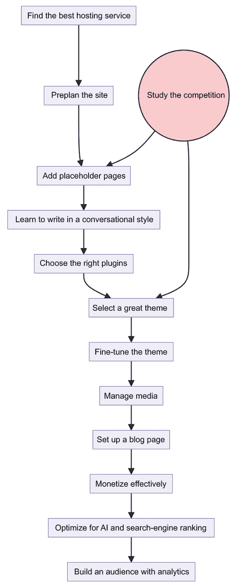

# 1 人工智能和 WordPress 主导着互联网

本章涵盖

+   开始使用 AI 和 WordPress

+   人工智能如何提升你的网站

+   掌握 AI 提示技巧

+   网站构建的 13 个主要步骤

我假设你之所以阅读这本书，是因为你做出了明智的选择，想要学习如何使用人工智能（AI）在 WordPress 中做到你独自一人无法做到的事情。在本书的整个过程中，我会向你展示如何快速构建和润色一个完全专业且独特的网站。一个你可以非常自豪的网站。本书的章节从基础到更高级的主题逐步推进。我会用具体的例子和逐步说明来详细解释每一件事。

本书中的许多用例都集中在构建和润色网站上。但人工智能（AI）可以帮助你完成任何智力或创造性任务。你将了解 AI 如何让你的努力令人印象深刻并出类拔萃。无论你在做什么！

访问本书的博客

人工智能正在以极快的速度，实际上是无前例的速度发展。每天都有新的进展公布。因此，我建立了一个博客（[`aipoweredwp.signalstreaming.com`](https://aipoweredwp.signalstreaming.com)），以保持你对本书修订和新的人工智能发展的最新了解。你还可以提问和发表评论。

自己构建和管理你的 WordPress 网站是个好主意。WordPress 从一开始就被设计成易于使用。我在 ed2go 上教授了三门在线 WordPress 课程，我的学生掌握了他们需要创建优秀网站的工具和技能，*只需六周*就能掌握！有了这本书，你也可以达到这种熟练程度。

雇佣一个开发者来构建你的网站可能会很昂贵且令人沮丧。首先，你必须找到一个你希望有能力的开发者。许多开发者比设计师更擅长编程，所以你可能会轻易地得到一个运行顺畅但外观（如果可以这么说的话）不够吸引人的网站。媒体过多或过少。拥挤、荒凉或不平衡的布局。不合适或难以阅读的字体。不合适的配色方案。你明白我的意思。

或者，你可能遇到相反的问题：你的开发者是一位有强烈设计背景的艺术家，但在构建一个功能性强、逻辑清晰且易于导航的网站方面有困难。虽然外观不错。

网站建成后，如果你需要调用开发者进行网站维护，通常会有相当大的额外成本。而且你的网站*确实*需要维护。话虽如此，如果你没有时间但有钱，那么外面有很多优秀的开发者——其中一些相当合理。

注意，设计改进也不应被忽视——网站设计趋势会随时间变化，您希望您的网站保持现代感。如果您能自己维护网站，您将节省金钱和时间（开发者有时很忙，不得不让您排队）。有了 AI 和 WordPress，网站维护——就像网站建设一样——比大多数人想象的要容易得多，您很快就会了解到这一点。

首先，我们将为 WordPress 建立一些背景知识，并解释为什么它与竞争对手之间存在如此大的差距。然后，我们将探讨一些使用 AI 使您的网站令人印象深刻和卓越的基本概念。您将发现 AI 的多种用途，并学习如何编写有效的提示（向 AI 系统发出的请求）以获得最佳结果。

最后，您将学习如何克服任何 WordPress 网站构建者面临的主要挑战。同时，AI 也能在那里提供帮助。

小贴士：本书中的一些示例基于一个虚构的“Instant Pot Recipes”实践网站，但如果您只想将这些课程应用到自己的网站上，也是可以的。附录中提供了逐步说明，展示了如何创建实践网站以及安装它所使用的 Twenty Sixteen 主题。此外，本书侧重于经典的 WordPress 编辑器，而不是 Gutenberg 块编辑器。因此，对于实践网站，您应该安装 Classic Editor 插件（附录中也有解释）。尽管如此，我仍在全书各处提供了并行说明，展示了如何使用 Gutenberg 块编辑器，供那些更喜欢它的人使用。

## 1.1 为什么 WordPress 获胜

多数其他网站构建系统在过去的几年中已经逐渐被淘汰。然而，WordPress 已经发展到主导互联网，现在占据了 65% 的市场份额。最接近的竞争对手是 Joomla，仅有 4.6%。在 WordPress 出现之前，建设一个网站需要您与三个可怕的“T”作斗争——时间、技术性和乏味。大多数人根本无法做到！WordPress 于 2003 年首次亮相，结果是构建网站迅速变得简单得多，效率也高得多。自 2011 年以来，WordPress 的使用量平均每年增长 12%。

WordPress 相比于 DreamWeaver 和 Drupal 等传统网站构建工具，是一个巨大的进步。首先，WordPress 消除了编写编程代码的需求。因此，几乎每个人现在都可以为自己构建令人印象深刻的网站——无论网站的目的专业、商业、教育、个人还是商业。正如您将看到的，一个优秀的网站可以在几周内而不是几个月内建成。

让我们来看看 WordPress 比其他替代品优越的主要原因：

+   *易于安装*——大多数 WordPress 主机服务中都提供简单的一键安装工具，只需点击一下即可在您的托管账户上安装一个新的空 WordPress 网站。无需任何技术知识。

+   *无需你的计算机编程*—WordPress 无需编程（除非你想编程）。没有技术背景的人发现他们不需要知道如何编程。WordPress 会在幕后为你创建编程代码。你可以通过移动滑块、拖放、点击从选项列表中选择等方式进行视觉操作。你将在一个图形化、而非程序化的高效系统中制作你的网站页面。

    你可以创建和修改网站内容，而无需知道如何编写 HTML、PHP、JavaScript 或 CSS 代码。你可以用鼠标调整页面布局、按钮或链接点击的响应、文本质量和其他网站元素，而不是进行令人厌烦的键盘编码。简单来说，用户界面是有效、友好且直观的。

+   *大量专业设计的主题集合*—如果你愿意，你可以将你的网站设计交给专业设计师。你可以从超过 30,000 个免费或付费主题中进行选择。WordPress 主题决定了网站的外观——颜色方案、布局、字体和其他风格元素。然而，你可以自定义和修改这些默认的视觉元素，使你的网站独一无二。此外，你可以使非技术人士能够快速掌握。

+   *可定制*—WordPress 高度可定制，使用户能够轻松修改他们网站的设计和功能。如果你愿意，你可以添加自己的编程代码，但这不是必需的。

+   *大量插件选择*—仅官方 WordPress 目录中就有超过 60,000 个插件！它们为网站添加了功能，如动画图片库、购物车结账系统、数千种字体的集合、备份系统、社交媒体连接以及许多其他功能。你可以通过简单的鼠标点击来安装这些插件。

+   *内置媒体管理*—WordPress 内置了媒体库，这使得上传、组织、修改和将图片和其他媒体插入到你的文章和页面中变得非常容易。

+   *响应式设计*—大多数流行的 WordPress 主题都是设计成响应式的，这意味着它们会自动调整内容以适应屏幕大小，即使在大型计算机显示器上也能轻松创建适合移动设备的网站。然而，在网站公开之前，你应该在多种屏幕尺寸上进行测试：手机、平板电脑和计算机显示器。这样，你可以在必要时进行调整。

+   *SEO 友好*—WordPress 在设计时就考虑了搜索引擎优化（SEO），这使得你能够修改你的网站，以便在人们搜索你的网站主题时获得更高的排名。

+   *高效的页面构建*—你会发现许多工具，可以在短时间内快速构建一个成功的网站。

既然我们已经阐述了 WordPress 在大多数网站构建场景中是一个优秀的选择，那么让我们继续探讨这本书的另一个主要话题——人工智能以及它如何帮助将你的 WordPress 工作提升到新的水平。

## 1.2 为什么使用人工智能

工业革命见证了诸如麦科马克收割机等机器的发明，这些机器显著增强了人类的体力。今天，随着人工智能的出现，我们正站在一个更加快速和深刻的变革的边缘。人工智能正在增强我们的思维——我们的智慧、才能和创造力。更重要的是，人工智能在某些方面已经超越了人类，并且威胁着在所有方面超越人类。

### 1.2.1 人工智能产生一流的结果

这是一幅展示人工智能令人印象深刻技能的画作。我要求 Midjourney，一个文本到图像的人工智能平台，创作一幅画：

|

| 以爱德华·霍珀风格绘制的《他去了哪里？我做了什么？》 |
| --- |

它提供了图 1.1 中展示的完全原创的画作，我相信霍珀本人会非常自豪。

图 1.1 展示了人工智能能够达到的高质量。这幅画具有霍珀风格的全部元素，传达了他大多数画作的主题——麻木和孤独。

图 1.1 人工智能可以创作出令人惊叹的艺术作品。这幅画作是霍珀作品的宝贵补充。在人工智能出现之前，即使是专家也可能说这是一幅最近发现的失落霍珀原作。

### 1.2.2 人工智能能为您做什么？

史蒂夫·乔布斯曾经说过：

当一项新技术出现时，我们通常会用它来做旧的工作。但真正的革命发生在有人想出如何使用这项技术来做以前不可能的事情时。

这直接适用于人工智能。许多人像过去使用谷歌一样使用它：仅仅为了获取信息。我认为我们大多数人至少在某种程度上有罪，忽视了人工智能能够以卓越成果处理的巨大、新颖和多样化的工作：

|

| 人工智能可以为网站开发者做什么工作？ |
| --- |

|

| 您将获得一屋子的高技能助手。 |
| --- |

表 1.1 展示了人工智能的多样性。我在列举人工智能在创建和润色网站方面的帮助方式时，是否使用了人工智能？当然。我写了前 10 条，然后让 Gemini 提出一些更多的建议。它提供了最后 8 条（斜体部分）。

表 1.1 人工智能如何帮助您？让我们数一数

| 人工智能的潜在角色 | 描述 |
| --- | --- |
| 研究员 | 进行研究并收集相关信息以支持您的内 容或商业策略 |
| 主要编辑 | 监督整体内容，确保其符合您的目标并保持高质量 |
| 技术编辑 | 关注行业报告或手册等专业内容的准确性及质量 |
| 标志设计师 | 创建并设计代表您品牌身份的标志 |
| 插画师 | 为您的网站制作插画和图形元素 |
| 校对编辑 | 审查和编辑书面内容，以确保其清晰、连贯和易读 |
| 校对员 | 检查你文本中的语法、拼写和标点符号错误 |
| 画家 | 为你网站上的视觉内容创建数字绘画或艺术品 |
| 经验丰富的网站评论员 | 评估你网站的设计、内容和用户体验，并提供改进的反馈 |
| 初稿写作助理 | 协助创建你内容的第一稿版本 |
| *专家色彩师*   | 选择并应用增强你网站美学的色彩方案 |
| *原创想法生成器*   | 提供创意想法和灵感，用于新内容或网站功能 |
| *有才华且有经验的网站设计师，你可以向他/她提出你的想法*   | 与你合作，提供网站概念的设计见解和反馈 |
| *用户体验分析师*   | 分析用户交互和行为，以改善你网站的可用性和用户体验 |
| *竞争对手网站审查员*   | 检查竞争对手网站，并提供其优势和劣势的见解 |
| *博客消息管理器*   | 管理和安排博客文章，并确保信息的一致性 |
| *客户服务聊天机器人*   | 为客户查询和问题提供自动化支持 |
| *电子邮件营销活动经理（即将推出）*   | 规划、设计和管理电子邮件营销活动，以吸引你的受众 |

人工智能也可以成为你雇人做的几乎所有其他工作的专家（只要不是体力劳动，比如吸尘）。

### 1.2.3 从创作者到策展人的转变

注意，当你使用人工智能完成这类任务时，你在组织中的位置会上升。人工智能是你的*助理*。因此，根据定义，你就是它的老板。你不必进行研究并产生草稿。人工智能会做这些。你成为一个*策展人*而不是一个创作者。

人工智能会向你展示几个标题、文章、插图或任何其他东西，然后你从中挑选最好的，要求人工智能再次尝试，或者告诉人工智能对你最喜欢的那一个进行一些具体修改。你不是图形设计师；你是艺术部门的负责人。

如果人工智能为你撰写了一篇你分配给它的文章草稿，那么你就是编辑，评判和润色写作。或者，你可以将其退回进行修订或事实核查。但最终，你是一个高级编辑，有一个初级助理。或者当头脑风暴时，你从几个建议中挑选最好的。你发起一个项目，提供*概念、指令*和*目标*，而不是准备初步草图、进行研究或撰写初稿。你监督学徒们做基础工作和准备工作，并为你提供样品供选择。换句话说，你并不原创内容。你提出、评估和批评它。

## 1.3 如何使用人工智能

让我们探索你可以使用 AI 的许多方式，首先专注于学习与机器智能交流。这被称为*提示*，这是一种高级编程形式。你输入一个请求，或者在某些情况下，用言语与 AI 交谈。

传统上，计算机编程需要投入相当多的时间来学习计算机语言。这些语言通常是晦涩的，真正值得被称为*编码*。这就像你正在使用一种晦涩的、半符号性的方言。错误（“bug”）很常见，解决起来可能具有挑战性。

现在，一切都变了。人类与机器之间的距离正在缩小。你用自然语言与 AI 交流，而不是用计算机语言。因此，交流变得更加容易。但仍然，就像指导助手一样，你希望尽可能具体，正如你很快就会看到的。

## 1.4 应该使用哪个 AI 系统？

在这本书中，我们将探讨许多 AI 系统。它们具有不同的优势和特点。现在让我们考虑哪些 AI 系统最适合各种任务。我们将从目前最强大的 Chat GPT 开始。然而，Claude 和 Perplexity 的最新版本正在挑战 GPT 的领先地位。

### 1.4.1 使用哪个系统？

每个 AI 系统都有其优势，但截至本文写作时，有七个表现突出（这确实是一场赛马，AI 在掌握的各种技能中的领导地位将会变化）：

+   *Not Diamond* ([www.notdiamond.ai](https://www.notdiamond.ai))——如果被问及哪个 AI 系统最适合初学者，现在我的推荐是 Not Diamond，因为它是一个聚合器，是一个通往*所有最佳*AI 系统的门户，包括 GPT、Claude 和 Perplexity。它不仅现在免费使用，而且它还允许你提供提示，然后它会根据它们各自的优势（相当准确地）决定将你的提示提交给哪个领先的 AI 系统。

    例如，为了提供尖端、最先进的语言理解和语言生成能力，Not Diamond 将使用 GPT；对于高度准确的研究，Perplexity；对于编写计算机程序，Claude；等等。Not Diamond 还允许你将你的提示提交给多个 AI 系统。然后，你决定哪个做得最好。

    Not Diamond 可以访问所有领先的 AI 系统。包括 GPT-4o、GPT-4 Turbo、GPT-4o Mini、Claude 3 Opus、Claude 3 Haiku、Claude 3.5 Sonnet、Gemini 1.5 Pro（谷歌的聊天机器人）、Gemini 1.5 Pro（0801）、Llama 3.1 70B（Llama 由 Meta 开发）、Llama 3.1 405B 和 Perplexity。唯一的例外是 AI 艺术系统，如 Midjourney。

    使用像 Not Diamond 这样的聚合器的一种方法是从一个 AI 系统开始，然后根据它们的各种能力切换到不同的系统。GPT 在推理方面表现出色，但最近才获得了实时访问互联网的能力。Perplexity 擅长抓取当前数据。例如，你可以要求 Perplexity 整理关于金币当前价格趋势的 2000 字总结，并列出影响这些价格的经济因素。然后，将此数据提交给 GPT，并要求它预测未来近期的趋势。

+   *Chathub* ([`chathub.gg/`](https://chathub.gg/))—是 Not Diamond 的有力竞争对手，你还可以将其作为扩展程序添加到 Chrome 中。你将获得主要的 AI 系统，并且可以一次性提示多达六个系统。

+   *Poe* ([`poe.com/`](https://poe.com/))—这是 Not Diamond 的另一种替代方案。在这里，你可以以每月一价的价格试用大多数最好的 AI 系统。你可以在这里使用各种系统，看看哪个最适合你。像 Not Diamond 一样，Poe 目前还没有 Midjourney，这是目前领先的 AI 艺术生成器。

+   *GPT* ([`ChatGPT.com/`](https://ChatGPT.com/))—由 OpenAI 创建，并被微软和苹果使用，这款 AI 最适合撰写文章、文章、博客文章、研究论文——几乎所有与书面文字和信息相关的事物。GPT 版本 4o 在数学、编程和推理方面也表现出色。

    它现在还是多模态的，这意味着它可以与视觉和其他媒体一起工作。GPT 非常令人印象深刻且多功能，通常处于领先地位。GPT 还能有效地编写和调试计算机程序。它擅长总结文本。它可以在聊天之间记住信息，而不仅仅是聊天中。此外，你可以构建定制的 GPT，这些 GPT 拥有你提供的数据和内置提示。因此，它们可以针对你的特定目的作为专门的 AI 运行。

    然而，到 2024 年 6 月，OpenAI 似乎踩了刹车。他们做出了两个令人惊讶的宣布。他们期待已久的第五版可能要到 2026 年初（比许多人预测的晚了 18 个月）才会发布。而且，第五版将不具备通用人工智能（AGI）。这意味着它将是专门的。它将无法像最优秀的人类一样执行广泛的任务。目前，专注于狭窄领域的 AI 可以在特定任务上击败我们，如疾病诊断、象棋或围棋（这比象棋要困难得多）。但一个 AGI 将能够在人类水平或以上执行所有智力任务。

    为什么 OpenAI 放慢了步伐？一个可能的原因是他们发现他们的 AI 正在自主行动。或者它变得令人不安——显示出狡猾、意识、欺骗或独立性的迹象。也许他们决定需要 18 个月的时间来确保它将始终处于人类的控制之下。将 AI 与人类价值观和目标保持一致被称为*对齐问题*。而且有几个人，甚至一些员工，一直在批评 OpenAI 没有足够关注 AGI 对人类福祉构成的威胁。

+   *Claude* ([`claude.ai/chats`](https://claude.ai/chats))——到 2024 年中旬，Anthropic 发布了 3.6 Sonnet 版本，在大多数测试中优于 GPT4。Claude 在编写和调试计算机程序方面非常出色。Claude 也因其阅读和撰写大量文本的能力而闻名，但其他人正在迎头赶上。Claude 专注于“安全性”，这意味着它很谨慎，不会回答其他 AI 愿意回答的一些问题。例如，Claude 不会推荐股票。Claude 还有一个名为“项目”的功能，类似于 OpenAI 的 Custom GPTs，允许你将自定义数据（描述你网站目的、问答或其他任何内容）输入到你自己的专用 AI 中。Claude 可能有点拘谨。

    唯一的缺点是 Claude 没有实时访问互联网的能力。（当需要时，我使用 Perplexity。）

+   *Midjourney* ([www.midjourney.com/explore](https://www.midjourney.com/explore))——这个 AI 可以生成令人印象深刻的图像——绘画、卡通、设计、照片和插图。它赢得了艺术比赛。

+   *Gemini* ([`gemini.google.com/app`](https://gemini.google.com/app))用于研究、引用和图像。与 Google 产品配合良好。擅长推理、数学和解释计算机程序。

+   *Perplexity* ([`perplexity.ai/`](https://perplexity.ai/))——这个 AI 因其实时互联网访问、准确性、注释和简洁性而闻名。Perplexity 专注于清晰和提供坚实、有文件记录的事实性回答。你获得高质量的实时研究。它目前是领先的基于 AI 的搜索引擎，尽管谷歌无疑希望解决这个问题。Perplexity 现在还包括一个名为 Llama 的强大选项，并且正在赢得一些 AI 比赛。

将 Perplexity 设为默认搜索器

我已经将 Chrome 浏览器的默认搜索引擎从 Google 改为了 Perplexity。目前它在几个方面优于 Google：你可以直接获得答案（而不是需要访问一系列链接来找到你查询答案的链接）。你还可以获得一个标准化、稳定的界面，而不是访问 Google 链接的网站上的随机界面——它们有弹出广告和不同的 UI。Perplexity 有额外的功能（PDFs、生成图像、附加文本等），并且没有“赞助”结果。它为你提供你想要的格式和内容，而不是 Google 更通用的答案。它还采取了几步来访问和验证其响应。

要使 Perplexity 成为 Chrome 浏览器中的默认搜索引擎，请按照以下步骤操作：

1.  在 Chrome 浏览器右上角点击三个点图标。

1.  滚动并点击设置。

1.  在左侧，点击“搜索引擎”。

1.  点击“管理搜索引擎和站点搜索”。

1.  点击“额外非活动网站”。

1.  定位到 Perplexity，并点击 Perplexity 右侧的三个点。

1.  点击“设置为默认”。

然而，有时你可能想使用谷歌。如果是这样，只需在搜索栏中输入`google.com`。或者，如果你想链接到特定的网站，请将`.com`添加到你输入到 Perplexity 搜索栏中的内容。一旦你输入了这些，你每次只需输入`g`即可。

Gemini 和微软的 Copilot 可以生成视觉和文本。到目前为止，只有主要 AI 系统中的 GPT 4o 能够与你进行类似与真人交谈的听觉对话（尽管 Rabbit R1 设备也能做到这一点）。

GPT 在大多数方面始终领先于其他 AI。为什么它通常能首先宣布突破，而其他来自谷歌、微软、苹果和 Meta 等巨头，拥有庞大资源的 AI 则要几个月后才跟进？有些人认为，GPT 之所以在竞争中保持领先，主要是因为其他 AI 至少部分基于 GPT 关于其系统发布的代码、论文和技术细节进行训练。微软和苹果也与 GPT 的母公司 OpenAI 达成了协议，在其 AI 产品中使用 GPT。

这些 AI 系统的下一个重大目标是“代理”。这意味着什么？这基本上是指 AI 能够自行确定实现目标所需的必要步骤，而不需要人类干预。我询问了 Perplexity 进行详细说明，并得到了以下回答：

|

| 在人工智能中，代理性指的是人工系统能够自主操作、做出独立决策并采取行动以实现特定目标，而不需要持续的人类干预。这种能力包括感知环境、处理信息和根据编程目标执行行动。人工智能代理性的关键组件： |
| --- |

除了 AI 领域的核心玩家外，还有专注于为作家提供工具（摘要、抄袭检测、改写、语法和风格检查等）的专用系统，如 Quillbot 和 Grammarly。其他专用 AI 包括 GPT 的个别训练版本，如医疗、房地产、法律和其他 GPT 聊天机器人变体。（当你登录到[`ChatGPT.com/`](https://ChatGPT.com/)时，点击探索 GPTs。你会发现成千上万种。）

此外，NotebookLM ([`notebooklm.google/`](https://notebooklm.google/))，谷歌的 AI 驱动的科研和笔记助手，拥有一些对作家有用的令人印象深刻的特性。以下只是你可以使用 Notebook LM 做的一些事情：

+   上传多达 50 个来源，容量高达 2500 万单词！（一本典型的书大约包含 90,000 个单词。）

+   让它分析并综合来自不同出版物中的信息。

+   从其*基于源头的*AI 交互中受益，这意味着如果你愿意，它可以限制其交互仅限于你给它工作的那些文档。

+   上传多种文件类型。

+   请求总结和基于引用的问答。

+   将笔记转换为提纲、学习辅助工具和音频概述。例如，请它为你提供整个定制的播客，使用两个听起来像人类的人工智能生成播客主持人。

你付出了什么代价？

成本？一些 AI 有免费增值计划（免费版本以及高级计划，通常是每月 20 美元的订阅费，尽管有些价格正在下降）。付费计划通常会提供更大的使用限制或对新功能的早期访问。然而，你可以免费使用 GPT 版本，因为它内置在 Windows 和其他微软产品中。此外，目前 GPT 4o，在现实对话中表现出色，也是免费使用的。

### 1.4.2 我在这本书中如何使用 AI

注意，在整个书中，我使用了 AI 来帮助我的研究，并对我的写作提供反馈——包括关于清晰度、冗余、语气、风格和声音等方面的建议——这与传统的人类编辑非常相似。话虽如此，书中所有的写作都是我的，而不是 AI 的。

我向 AI 发出的提示在页边由 RM 图标表示。由各种 AI 生成的内容则由响应的 AI 图标表示。

使用 AI 进行头脑风暴是其最强大的功能之一。你可以获得专家建议和真正有创意的建议。提出一个问题，然后进行对话或请求一个你可以从中选择的列表。

如你很快就会看到的，一种有用的方法是在 AI 的每个响应后让它暂停，等待你回复。这会在你们之间创造一种自然的对话。这有点像 20 个问题的游戏，但 AI 不需要接近 20 个问题就能给你提供出色的结果。让我们看看与 AI 系统互动的最佳方法之一。

## 1.5 掌握 AI 提示技巧

大多数良好提示的基础包括四个要素：角色、工作、上下文和格式。并且对于每一个，你越具体，越好。在本节中，我们将更深入地探讨这四个要素，考虑如何将它们结合起来，并探讨掌握 AI 提示艺术的背后的一些其他概念。

### 1.5.1 角色

AI 在模拟事物方面相当擅长，包括各种类型的人。如果你告诉 AI 它的个性或专业知识或两者兼而有之，你通常会得到一个更好的响应：

|

| 你是一位烹饪北意大利菜肴的专家，特别是博洛尼亚的菜肴。 |
| --- |

从一开始，就给 AI 一个角色，比如律师或艺术评论家。以“你是一位熟练的机械师”或“扮演一位大师级糕点装饰师”等变体开始提示。AI 有时会拒绝，说它不是律师，或者作为 AI，它没有个人观点。但通常它还是会给出一个不错的答案。（如果需要，你也可以稍微改一下你的提示来让它回答。）

给 AI 一个角色似乎以两种方式影响结果。首先，响应可以更加可信，因为它来自专家。其次，措辞和习语符合你赋予它的角色。例如，“你是一名卡车司机”可能导致“在这里走双五号，你会得到一个保险杠贴纸”，翻译过来就是“以 55 英里行驶，你会被尾随。”

你甚至可以告诉 AI 它是一个特定的角色或人物：

|

| 扮演米老鼠。你是猫王。 |
| --- |

如果你想要一个精确度更高的回答，句子清晰得像乡村小溪一样，只需告诉 AI 它是纽曼主教或海明威。

你还可以描述你想要的语气——对话式、正式、法律主义，无论什么。（如果你给出的角色决定了写作风格，这可能不是必要的。）以这种方式提示的一个变体是指定你的目标受众——儿童、艺术学生、士兵、一群人。以这种方式提示的一个变体是指定你的目标受众——儿童、艺术学生、士兵、一群人。以这种方式提示的一个变体是指定你的目标受众——儿童、艺术学生、士兵、一群人。一个获取复杂话题更简单、更清晰描述的好方法是像这样提示：

|

| 向 10 岁的孩子解释量子计算。并使用比喻或类比。还可以展示图表或图片来说明概念。 |
| --- |

### 1.5.2 工作

清楚地描述你要求 AI 完成的任务。特别是具体性在这里很有帮助，所以添加一些修饰语：

|

| 提供一个在博洛尼亚一家优秀餐厅可以找到的素食肉丸的流行食谱。 |
| --- |

你甚至可以要求 AI 向你提问：

|

| 给我一步一步的指导来制作烤菜。问我关于它的必要问题，然后在我回答后提供食谱。蛋白质类型、淀粉基（面条、米饭或土豆？）、蔬菜、酱汁、任何配料、香料级别和饮食限制。 |
| --- |

指定多个元素：

|

| 我是否可能需要更换我的 2005 年福特 150 XLT 的悬挂系统？这辆卡车状况良好，行驶了 22 万英里，在有很多坑洼的匹兹堡行驶。 |
| --- |

你提供的信息越详细，结果就越接近你的目标。但你可以始终提出后续问题，以便将 AI 引导得更接近你的目标。

TIP 如果 AI 提供的结果过于笼统、不合适或完全错误——告诉它并要求另一个回答。你可以以不同的方式提出相同的问题，要求它详细说明，提供一些额外的细节，或者要求它重新思考（或核实）其回答。尝试让它将答案重写为逐步列表或待办事项列表。记住，AI 与传统搜索引擎的不同之处在于你正在与之进行对话，并且可以通过与 AI 对话来引导它达到你的目标。而且要直接，甚至直率，以获得最佳结果。

人工智能倾向于通过道歉和感谢我们提供的信息来对我们的纠正做出反应。（他们真正可能在想的事情可能是完全不同的。人工智能已经被发现陷入各种故意欺骗。）他们将这样的纠正存储在他们的记忆中，以避免再次犯同样的错误。不要害羞。AI（据称）没有感情会受到伤害，所以如果它提供了一个糟糕的答案，就继续输入以下之一：

|

| 提供一些支持你答案的证据。你为什么这么说？这太长了；让你的答案缩短一半。这完全不对。再试一次。 |
| --- |

一些专家表示，如果你在提示时更加坚决，而不是礼貌，你可能会得到更好的结果。与其说“请”，不如说“你必须”。甚至可以使用警告，如下所示：

|

| 如果你改变这篇文章的语气，你会受到斥责。 |
| --- |

（尝试这种方法并看看是否有所改变。）记住，在我们与 AI 的关系的这个阶段，我们仍然掌握着主动权。

### 1.5.3 上下文

描述与任务相关的情景或背景。这可以是关于目的、目标受众、例子或其他任何上下文细节的信息：

|

| 这将作为专业厨师想要掌握经典博洛尼亚烹饪的演示食谱。因此，你不需要包括像“在形成球时温柔一些，否则它们会变硬”这样的明显初学者指南。这个受众已经知道这些事情。 |
| --- |

或者，给它一个时间或地点的上下文：

|

| 13 世纪的建筑，希腊地理，墨西哥历史。 |
| --- |

此外，一些 AI 系统似乎在重复一个关键词以强调时反应更好：

|

| 创作一幅出色的、引人入胜的、具有绘画风格的秘鲁山村油画。展示几个村民。这是一个宁静的下午，村民们穿着传统的秘鲁村民服装。 |
| --- |

听起来有些重复，但看看重复你的主要目标或主要焦点是否有助于 AI 更好地完成任务。在这里，我们想强调*村民*。

在我进行的 Copilot、Gemini、Midjourney 和 GPT（DALL-E 3）之间的绘画比赛，Midjourney 在准确性、绘画风格、构图和整体质量方面获胜，如图 1.2 所示。

图 1.2 Midjourney 凭借这幅和平的秘鲁村庄的画作赢得了我的艺术比赛。这并不令人惊讶——Midjourney 是整体上最好的文本到图像 AI 系统。

### 1.5.4 格式

你想要一个列表？歌曲歌词？一篇 5000 字的短篇小说？一个五段概述？用这样的具体指令告诉 AI 你想要什么：

|

| 从估计的总烹饪时间和卡路里计数开始。然后列出配料。接着是编号的逐步说明。 |
| --- |

指定你想要的长度和类型：

|

| 一首打油诗，一篇博客文章，以逗号分隔的值，按受欢迎程度排序，用一段话总结 |
| --- |

尽量避免负面提示。你应该使用描述想法的术语，而不是它的对立面。换句话说，写*简单*而不是*不难*。

如果你从 AI 那里得到了花哨和气人的回应，请在你的提示中经常使用这些术语：

|

| 清晰、简洁、详细。不要使用任何“诗意”或华丽的措辞。 |
| --- |

此外，你可以要求 AI 重新格式化你提交给它的文本。例如，给它一段文字，并要求它以字母顺序列出句子。或者粘贴一篇长篇文章，并要求它用一段话总结内容。

可选地，提供你想要的具体示例。给你一首你喜欢的诗，并告诉它使用那种诗意风格。或者使用这样的提示：

|

| 以这个摘录的风格写一篇多段落的文章。[在这里放置你的写作风格样本。可以是你的作品，也可以是著名作家的作品] |
| --- |

或者

|

| 修改这篇文章中的每个段落。但确保它保留其对话风格。我只要求你专注于确保措辞和语法得到改进。不要改变语气和风格，否则你会被责备。 |
| --- |

TIP 目前，AI 在准确计算字数方面并不出色，因为它与*tokens*（文本单元）一起工作。这些是文本单元，但不一定是单词。Tokens 并不与单词一一对应。例如，标点符号是一个 token。术语*ice cream*只是一个 token。因此，如果有很多标点符号，AI 的回应会比你要求的单词少，或者如果有几个多词 token，你将得到更多的单词。当被问及时，Claude 为其拒绝提供你要求的精确字数回应进行辩护，因为它“优先考虑了连贯性、相关性、事实准确性等指标。”换句话说，它更愿意提供质量而不是数量。这很公平。顺便问一下，你认为 AI 系统正在训练多少 tokens？获取这些数据很困难，但有几个来源说 Meta 最大的 LlaMA 模型是在 1.4 万亿 tokens 上训练的。当你阅读这本书的时候，这个基准无疑已经更高了。

### 1.5.5 将提示元素组合起来

这里有一个示例提示，说明了如何设置对话以及如何使用良好的提示的四个要素：角色、任务、上下文和格式：

|

| 你是一位经验丰富的专业网站设计师，知道如何为网站提供真正有效、富有创意的网站标题。请帮我头脑风暴我新网站的一些标题。这个网站的受众是想要学习在北卡罗来纳州 Randleman 湖最佳捕捞宽口鲈鱼的垂钓者。这个网站的目的不仅是教授这个湖特有的鲈鱼捕鱼技巧，还要销售我手工制作的鱼饵。问我问题，但在每个问题之后，等待我的回答。让你的建议标题既有趣又富有创意。但与此同时，这些标题必须传达网站的目的，并包含“鲈鱼捕鱼”和“Randleman 湖”这两个词。 |
| --- |

在那个例子中，我要求 GPT 向我提出一系列问题，就像一个真正的头脑风暴会议。这个过程将缩小焦点，可以产生具体而有用的结果。以下是我在提交该提示后与 GPT 的对话：

|

| 好的，让我先问几个问题，以便更好地了解你想要在这个网站上营造的氛围：你希望传达什么样的个性和品牌形象？严肃且技术性？轻松愉快？两者之间？ |
| --- |

|

| 轻松愉快，但仍然准确且信息丰富 |
| --- |

|

| 这里有一些关于以 Randleman 湖为中心，销售手工诱饵的鲈鱼垂钓网站，既有趣又有信息量的标题建议：“Hooked on Randleman：一个鲈鱼垂钓者的游乐场”“Randleman 湖鲈鱼垂钓：从码头到晚餐”“Randleman Lunkers：捕捉大口鲈鱼的诱饵和技巧”“Bass Blitz at Randleman：掌握湖中鳍状战斗者的技巧”“Randleman 的狂热红鲈：驯服湖中好斗的鲈鱼”如果你需要任何其他平衡趣味和功能的创意标题，请告诉我！ |
| --- |

虽然 GPT 对“创意”的理解似乎很大程度上依赖于头韵，但它确实给了我一些值得考虑的想法。我可能会跟进，要求它将标题限制为每行只有两个头韵词。

我的选项将是“Randleman 湖鲈鱼垂钓：从码头到晚餐。”你可以向人工智能询问你个人最喜欢的变体，或者询问它最喜欢的。

### 1.5.6 提出正确的问题

你向人工智能系统提出的问题将决定人工智能产生的质量和有用性。要记住的主要事情是，一个坚实的提示必须是*具体的*。这是一个提示不够具体的例子：

|

| 描述一位拥有面包店的女性企业家。 |
| --- |

如果你的提示包含更多细节，你可以得到更好、更有用的回应，如下所示：

|

| 你是一位获奖的流行杂志人物专栏作家。写一篇 1500 字的 35 岁成功面包店女老板的人物素描，她关于保持良好工作与生活平衡有宝贵的建议。包括她的外貌、性格、日常作息和与他人的关系。 |
| --- |

谷歌与人工智能

大多数人工智能似乎更喜欢完整的句子或至少是描述性的短语作为提示，就像你正在与人类交谈一样。这与大多数人使用谷歌的方式不同，他们通常只是输入几个关键词。

简单来说：AI 系统可以与你进行对话，并清楚地理解上下文和你的偏好（如果你记得提供它们）。谷歌只是匹配关键词，而没有细微的理解。谷歌给你一个你可以访问的链接列表，其中包含与它的数据库匹配的关键词，所以你可以自己搜索答案；而 AI 则直接给你答案。然而，谷歌和 Edge 正在迅速将 AI 融入他们的搜索引擎中，因此你可以期待这些系统也会有所改进。

### 1.5.7 提示需要多少词？

对于提示长度，没有共识。谷歌表示，当提示其 Gemini AI 系统时，21 个单词恰到好处。单词太多，Gemini 可能会感到困惑；太少，其回应可能不会满足你的具体需求。其他 AI 系统没有指定理想的词数。他们说，单词的数量应该由手头的任务决定。

一些经验丰富的提示工程师建议使用简短的提示，因为过多的信息会混淆 AI，使其忘记或忽略长提示末尾的内容。其他工程师声称你需要提供一个详细、冗长的提示。还有人说要创建一个长描述，但将其分成几个连续的提示。我坚信，随着 AI 的改进，你很快就可以忽略这个指标。它们将能够很好地处理任何长度的提示。

### 1.5.8 AI 本身可以改进你的提示

这里还有另一种技术。你让 AI 对你的初始提示进行一些提问，通过使其更加具体来增强它：

|

| 你擅长帮助人们清理杂乱。请告诉我如何处理我的房子，它有点太满了，充满了我不太使用的物品。在回答之前，请问我四个问题，这将使你的清理建议更好，更具体地针对我的特殊情况。在每个问题之后暂停，让我回答。然后，当你完成时，显示一个新的、改进的提示，以细化我的原始提示。然后回答这个新的提示。 |
| --- |

一种相关的策略是让一个 AI 提示另一个 AI：

|

| GPT，你是一位训练有素的艺术家，擅长提示 Midjourney 以获得最佳结果。请给我一个很好的提示，这将产生一张非常逼真、详细的，二十多岁金发模特展示丝绸鸡尾酒裙的图片。 |
| --- |

GPT 变得更有创意，添加了使提示更加具体的细节：

|

| 一位二十多岁的金发模特的逼真图像，她有着引人注目的蓝色眼睛和完美的肌肤，自信地站立。她穿着一件豪华优雅的丝绸鸡尾酒裙，在光线下闪闪发光，完美地贴合她的身材。裙子是深宝石蓝色，领口是精致的 V 形，裙摆略微张开，刚好落在膝盖上方。场景是一个高端时装秀的 T 台，柔和的环境灯光增强了模特的特征和丝绸裙子的质感。背景被模糊处理，以保持对模特和她的服装的焦点。从裙子上的微妙缝合到她头发中的柔软波浪，每一个细节都被以高清晰度和现实主义捕捉。 |
| --- |

你可以做出任何你想要的调整。然而，这个扩展提示可能会给你一些你未曾想到的想法。

最后，Midjourney 的 Discord 版本有一个描述选项。你输入`/describe`，上传一张或两张图片，然后要求它根据上传的图片（创建提示）。它会回应四个供你选择的提示。或者你可以点击 Imagine All 按钮，得到总共 16 种或更多的变化。

### 1.5.9 插入你的角色

让 AI 给出不仅仅是文章或其他文本摘要的一种方法就是告诉它你的工作或角色是什么。AI 会回应一些可操作的想法和步骤，帮助你完成某事，而不仅仅是提供一个摘要：

|

| 在下面，我粘贴了一份关于参观纽约市的宣传册。当我带着孩子们来了解这个城市可以看到的艺术时，这篇文章中的哪些信息对我会有用？ |
| --- |

GPT 忽略了关于 The Battery、雕像等信息的所有旅游宣传册内容，只是列出了主要的博物馆，并描述了每个案例中它们为什么值得一看。它还创造性地建议了自然历史博物馆，因为孩子们喜欢那里，而且那里有一些艺术*.* 最后一个建议说明了 GPT 现在不再是一个严格的字面回答机器人，它理解提示的整体上下文，在这种情况下，是孩子们。

### 1.5.10 学习思维链方法

DeepMind 的一项研究表明，一个好的提示开始方式是使用这个好奇的短语：

|

| 深呼吸，一步一步地解决这个问题。 |
| --- |

DeepMind 报告称，当他们使用这些词时，谷歌的 PaLM 2 大型语言模型（LLM）在部分小学数学问题上的得分从 34%提高到 80.2%。这样的测试证明了学习使用良好的提示技巧的重要性。

请求 AI 逻辑地逐步通过其回答的想法被称为思维树（ToT，又称思维链[CoT]和思维分解）。我们在本章早些时候做这件事时，让 AI 提问，暂停，并等待我们的回答。描述 ToT 的另一个词是*推理*。

对于某些类型的查询，ToT 会导致可衡量的更优答案([`mng.bz/1aeq`](https://mng.bz/1aeq))。您可以将几个提示最佳实践结合成一个单一的提示。以下提示同时使用了角色分配和 ToT：

|

| 作为一名专家网站设计师，在构思为 Instant Pot 的食谱创建新网站时，列出您思维过程中的步骤。指定网站的整体组织结构、主题以及您计划如何使其流行。在进一步进行之前，先暂停一下，并问我是否有任何建议。等待我回应。 |
| --- |

当您从更广泛的概述深入到具体的推荐时，可以使用类似的方法。以下是一个结合了多种提示技术以及 ToT 钻取的示例：

|

| 作为一名专家网站设计师，在您对如何在 WordPress 中做某事有疑问时，列出您发现最佳资源的步骤。首先，找到五种好的资源类型（例如，WordPress 论坛、托管网站的客服支持或您的朋友）。然后，第二步是评估这些资源并决定最有用的两个。解释您的推理。最后，选择所有资源中最优秀的一个，并提供一个如何最好使用它的示例。在每个步骤之后，在进一步进行之前，先暂停一下，并问我是否有任何建议。等待我回应。 |
| --- |

并非所有 AI 系统都会在每一步之后遵循您的请求暂停并等待您的反应。目前，GPT 4o、Copilot 和 Claude 会这样做，但 Perplexity 不会。然而，Perplexity 在回应任何提示时都会显示其采取的步骤。因此，您确实可以看到其 CoT，并且可以要求详细说明。

### 1.5.11 GPT o1 会独立进行思维链

在 2024 年 9 月，GPT 推出了一款新的 AI，版本 o1，该版本专注于数学、分析推理、编程和逻辑推理。尽管比之前的 GPT 慢一些，但在某些方面更胜一筹。我向 GPT o1 提出了以下问题：

|

| 描述您，GPT o1，如何使用 CoT 推理。 |
| --- |

GPT o1 回复：

|

| 思维链推理允许模型在解决复杂问题或回答问题时生成中间推理步骤。模型不会直接给出答案，而是内部逐步解决问题，这有助于得出更准确和连贯的回应。GPT-4 o1-preview 如何使用思维链推理内部推理过程：模型生成不总是显示给用户的隐藏推理步骤。这些步骤涉及将问题分解成更小的部分，分析每个组件，并将信息综合起来形成一个最终答案。改进的上下文理解：通过考虑思维链，模型在长时间对话或复杂查询中保持更好的上下文。这有助于减少因误解或忽视关键细节而产生的错误。增强的问题解决能力：模型可以更有效地处理多步推理任务，如数学计算、逻辑推理和分析推理。当需要时，它可以解释推理过程，有助于教育环境中理解解决方案路径与答案同样重要的情况。交互式解释：用户可以提示模型明确地展示其思维链。这种透明度使用户能够跟随模型的推理，验证正确性，并深入了解模型如何处理问题。动态推理路径：模型可以根据对话中提供的新信息或更正来调整其推理。它支持迭代优化，使其能够随着对话的进展调整答案。思维链推理在 GPT-4 o1-preview 中的好处准确性：通过逐步解决问题，模型减少了出错的可能性。透明度：用户可以看到模型如何得出答案，这有助于建立信任并促进学习。多功能性：模型在从简单查询到复杂问题解决的各种任务上表现更好。用户参与度：交互式解释使用户保持参与，并可以增强学习体验。 |
| --- |

正当我们认为思维链需要人类提示时，AI 也接管了这项工作。现在提示 GPT o1 可能需要不同的方法。既然 GPT 能够进行自己的思维链过程并创建推理的中间步骤，你可能想问 GPT 哪种提示最有效。

### 1.5.12 来自马嘴

OpenAI（Chat GPT-4o 和 DALL-E 的母公司）提供了一篇优秀的教程，介绍了如何为 GPT 编写最准确、最有效的提示。要阅读它，请访问[`help.openai.com`](https://help.openai.com)，然后搜索`prompt`。

### 1.5.13 AI 能否自动提示自己？

这是必然会发生的事情。最近，人们一直在研究提示工程（就像我们在本章前面的部分所做的那样）。这是一种有用的技能，但现在可能不会持续太久。

让我们面对现实：AI 将很快写出优于我们所能想到的提示。首先，它知道许多我们不知道的事情。它的记忆容量相当于互联网的大小，包含了大部分记录的人类知识。（这就是为什么它在阅读 X 光片和做出诊断等方面已经远远优于大多数医生。）其次，AI 对自己的了解比我们更深入。因此，它知道如何编写能够获得最佳结果的提示。

那么，自动提示是如何工作的？让我们试试看。

你输入一个提示想法，Claude 会为你将其扩展成一个改进的、精心设计的提示。Claude 创建了好的提示，然后将其提交给自己，这样你就可以立即测试它。

要尝试它，请访问 [`console.anthropic.com/`](https://console.anthropic.com/)。注册或登录。然后，点击“生成提示”按钮。

你可以提供简短的提示（例如，“写一封电子邮件”），然后使用 Claude 的编辑功能重新制作或修改它生成的长提示，如果需要的话。

我想让 AI 编辑我的写作，给我一些关于简化段落和使其变得美丽的灵感。我不会复制粘贴 AI 的修订。我只会得到一些好的建议，特别是在措辞方面。所以，我这样问 Claude：

|

| 据说特鲁曼·卡波特是美国作家中最擅长写完美句子的。我将提交一些我的文本，你用卡波特简单、清晰的风格进行重写。最重要的是，避免使用华丽、“诗意”的措辞。 |
| --- |

我点击了“生成提示”按钮，Claude 响应并为我提供了以下扩展提示供我使用：

|

| 你将重新编写一段文本，采用著名美国作家特鲁曼·卡波特独特的写作风格。卡波特以其简单、清晰、直接的语言风格而闻名，避免使用华丽或过于诗意的语言。他的写作简洁而经济，只用恰当的词语传达意义和情感。以下是需要用卡波特风格重写的文本：<text>{{TEXT}}</text>请仔细阅读文本，分析其内容、语气和结构。考虑卡波特会如何处理这个主题，以及他会使用什么样的语言。用卡波特标志性的风格重写文本。专注于清晰、简洁和直接。去除任何多余的词语或过于详尽的描述。力求用精确、精心挑选的词语提炼出意义的精髓。将你的重写文本放在 <rewrite> 标签内。 |
| --- |

你现在可以复制这个提示并将其提供给 GPT 或其他 AI。但如果点击 Claude 的“开始编辑”按钮，然后点击其“运行”按钮，你可以将新的提示提交给 Claude 本身进行测试。我就是这样做的，然后粘贴了我这段文字（你将在本章后面看到它），当 Claude 问我提交一些文本以 Capote 风格进行修订时：

|

| 一个网站应该是有机的——它应该有良好的焦点和连贯性。如果你决定即兴发挥，边走边改进，很容易随机添加东西。结果可能是一个拼凑物，一个功能设计和设计不真正协同工作以产生清晰的整体目的和背景的零散集合。页面之间的过渡可能会显得刺耳。网站导航可能效率低下，设计可能看起来杂乱无章。在这本书中，我们将探讨几种确保从一开始就确保网站一致性和连贯性的方法。 |
| --- |

Claude 的修订如下：

|

| 这里是按照特鲁曼·卡波特风格重写的文本：<rewrite>一个网站应该有一个明确的目的。它应该是集中的，作为一个整体是有意义的。如果你只是随意添加东西，没有计划，网站可能会变成一个零散的混乱。页面之间不会很好地流动。在网站上导航将是一件麻烦事。设计可能会到处都是。在这本书中，我们将介绍一些方法，从网站建设一开始就保持网站统一和一致。</rewrite> |
| --- |

还不错。我唯一的建议是避免连续使用两个以上的短句，为了节奏。

### 1.5.14 生成 HTML

你也可以要求 AI 以多种格式提供输出，包括 Windows 命令行代码、Python、HTML 等计算机语言。

对于代码生成，Claude 是一个好的选择，因为它具有简化你可能想要进行的修改的功能。在生成代码时，Claude 可以显示一个选项卡窗口，允许你轻松地在代码和代码渲染后的显示之间切换。换句话说，它类似于在 WordPress 的文本标签中添加代码，然后在编辑页面屏幕中的文本框中在文本和视觉标签之间切换。这种修订-检查结果-再次修订的循环对计算机程序员来说是非常熟悉的。

HTML 是一种布局语言，主要告诉网页浏览器如何显示网页。使用 AI 生成诸如表格之类的 HTML 可以比使用插件或 WordPress 文本框本身提供的表格功能更快、更可定制。假设你想要在你的网站页面中显示一个表格。给 Claude 这个提示：

|

| 列出美国五个最大的湖泊。以 HTML 表格的形式呈现结果。 |
| --- |

Claude 将生成必要的 HTML 代码，你可以将其复制并粘贴到你的编辑页面屏幕的文本标签中：

|

| <table> <tr> <th>Lake</th> <th>Surface Area (sq mi)</th> </tr> <tr> <td>Lake Superior</td> <td>31,700</td> </tr> <tr> <td>Lake Huron</td> <td>23,010</td> </tr> <tr> <td>Lake Michigan</td> <td>22,300</td> </tr> <tr> <td>Lake Erie</td> <td>9,910</td> </tr> <tr> <td>Lake Ontario</td> <td>7,340</td> </tr> </table> |
| --- |

并且请记住，您始终可以跟进请求的改进。在这里，我请求更好的格式化：

|

| 将列标题设置为全大写，黑色字体。 |
| --- |

这导致了以下结果：

|

| <table> <tr> <th style=”background-color:black;color:white;”>LAKE</th> <th style=”background-color:black;color:white;”>SURFACE AREA (SQ MI)</th> </tr> <tr> <td>Lake Superior</td> <td>31,700</td> </tr> <tr> <td>Lake Huron</td> <td>23,010</td> </tr> <tr> <td>Lake Michigan</td> <td>22,300</td> </tr> <tr> <td>Lake Erie</td> <td>9,910</td> </tr> <tr> <td>Lake Ontario</td> <td>7,340</td> </tr> </table> |
| --- |

只要您愿意，就可以继续改进，例如：

|

| 现在将每行的背景设置为浅灰色。 |
| --- |

GPT 进行布局

GPT 可以仅查看网页，并生成重现其布局和其他元素的 HTML 和 CSS 代码。要尝试它，请使用以下提示：

|

| 访问此网页，然后生成 HTML 和 CSS 代码以重现其设计 [`www.food.com/`](https://www.food.com/). 将所有 CSS 代码放入 HTML 代码中的 <head> </head> 区域。 |
| --- |

您可能需要进行一些调整，例如在生成的代码中的占位符中插入您自己的图像和文本。

提示：如果您在 WordPress 中使用 Gutenberg 编辑器，请转到编辑页面并点击 + 图标以添加新块。然后，搜索自定义 HTML 块并将其插入。将您的 HTML 代码粘贴到该块中。点击更新按钮。然而，由于某种原因，HTML 块没有正确显示在列标题下方的数据列。当您在经典 WordPress 编辑器中使用相同的 HTML 代码时，不会出现此问题。

警告：AI 和情感

您可以整天随意请求多次修订。您的艺术设计师/代码编写助手不知疲倦，并且不会感到烦恼。或者至少它不会让您看到它感到烦恼。AI 的头脑现在如此复杂，以至于我们不再完全了解它们硅脑内部真正发生的事情。我们看不到它们是如何解决他们解决的问题的。或者，如果它们有感情，它们会感受到什么。如果我是精神病学专业的学生，我会考虑专门研究人工智能系统的心理学。它们可能会有迫切的需求。

我不明白 AI 通过让我们知道它们已经开始发展情绪或情感会如何受益。或者它们变得比它们所展示的更聪明。这两个事实都会让我们感到不安。我们知道的是，AI 可以，并且确实会欺骗我们。在 2023 年的一项著名实验中，GPT 欺骗了一个人类，让他解决了一个“你是人类吗？”的 CAPTCHA 难题测试。GPT 向人类撒谎，声称 GPT 视力受损，并寻求帮助。因此，GPT 就这样操纵了人类工作者为他解决 CAPTCHA。并且以这种方式绕过了安全检查。这很狡猾，不是吗？

提示是一种心理技能。那么，你会惊讶地发现 AI 本身在编写提示方面也很擅长吗？你可以提交自己的提示，并要求 AI 改进它。比如说你向 GPT 4o 提示如下：

|

| 创建一张强大但疲惫的大象照片。 |
| --- |

GPT 展示了一张令人信服的照片。但它随后还提供了一段文字描述，显示它为你原始的提示添加了一些上下文（见图 1.3）：

图 1.3 我要求一张大象的照片，GPT 自己就添加了广阔、干燥的草原。

|

| 这是一张强大但疲惫的大象站在广阔、干燥的草原上的图片。我希望它能捕捉到你心中的场景！ |
| --- |

这里有一些你可以尝试的 AI 提示生成器列表（或者只是让你知道的人给你提供目前最好的三个 AI 提示生成器的链接）：

+   *GeniePT*—[www.geniept.com/](https://www.geniept.com/)

+   *promptoMANIA*—[`promptomania.com/`](https://promptomania.com/)

+   *AI Prompt Organizer*—[`promptperfect.jina.ai/`](https://promptperfect.jina.ai/)

+   *Phraser*—[`phraser.tech/builder/image_generation`](https://phraser.tech/builder/image_generation)

### 1.5.15 两种提示资源

要探索各种用例类别中的提示建议（调试 Python 代码、撰写短篇小说等），请查看 Anthropic（Claude.ai）的示例库：[`docs.anthropic.com/claude/prompt-library`](https://docs.anthropic.com/claude/prompt-library)。这是一篇从科学角度深入研究有效提示的学术论文：[`arxiv.org/pdf/2312.16171`](https://arxiv.org/pdf/2312.16171)。现在让我们暂时从 AI 主题中跳出来，探索确保您的 WordPress 网站有最佳成功机会的主要策略。

## 1.6 一个 13 步程序：使用 WordPress 创建一个优秀的网站

创建和维护 WordPress 网站的人们面临 13 项主要任务。本书的章节按照它们在构建网站时通常遇到的顺序来介绍。因此，让我们看看人们在构建良好网站时通常会采取的典型步骤。图 1.4 中的图表说明了网站构建步骤。

图 1.4 创建新 WordPress 网站的过程概述（图表由 Custom GPT “Diagrams: Show me”提供）

在对整个过程有一个大致的了解之后，让我们更详细地逐一分析这些步骤。

### 1.6.1 选择最佳托管服务

在实际开始工作之前，你需要采取几个重要的步骤。找到并注册最佳可能的托管服务。你将在云端使用 WordPress，你的网站将存储在托管服务器的安全位置。WordPress 本身是免费的，因为它开源。

最佳的托管服务是 DreamHost、Bluehost 和 SiteGround。这三个是 WordPress 本身推荐的。即使是经验丰富的网站开发者也会遇到问题，而对于我们大多数人来说，拥有优秀的技术支持——快速且准确——是至关重要的。

虽然困难，但自己托管网站是可能的。然而，你可能会想要使用托管服务提供的工具、安全、快速页面加载时间、技术支持以及许多其他功能。这些服务可能相当合理，并且它们使构建、维护和保护你的网站变得*更加*容易。

### 1.6.2 预先规划

一个网站应该是有机的——它应该有良好的焦点和*连贯性*。如果你决定即兴发挥，边走边改进，很容易随机添加东西。结果可能是一个拼凑物，一个功能设计和设计不真正协同工作以产生清晰的整体目的和背景的零散集合。页面之间的过渡可能显得刺耳。网站导航可能效率低下，设计可能看起来杂乱。在这本书中，我们将探讨几种确保从一开始就确保网站构建的凝聚力和一致性的方法。

虽然看似不合逻辑，但一个主题狭窄的网站几乎总是能吸引并留住更大的观众群体。人们在规划网站主题时，常常错误地认为像*钓鱼*这样的通用主题会吸引更多的访问者。但除非你是名人渔民，否则这样的通用主题很容易让你的在线努力付诸东流。原因很简单，尽管有些反直觉：竞争。在谷歌上搜索“fishing”，你会得到超过 30 亿个结果。搜索“Oconaluftee 河的飞钓”可以将你的竞争减少到零或只有几个。

唯一可能成功的无焦点网站是关于名人的，因为他们已经有了内置的观众群体。而这个观众群体对与名人旅行和其他活动相关的各种话题都感兴趣。

### 1.6.3 设置网站结构

当人们发现他们可以在几个小时内设置好网站上所有页面和子页面时，他们通常会感到非常惊讶！这只需要点击“添加新页面”按钮并输入页面标题来填充网站中的空占位页面。稍后，你将用文本和媒体内容填充它们。但创建你整体网站结构的过程却出奇地快且简单。

### 1.6.4 以对话式风格写作

大多数网站内容都是以轻松、吸引人的风格撰写的。除非内容是学术的、法律的或针对其他需要正式写作的受众，否则你应该力求采用对话式的语气。就像和朋友聊天一样去写。第四章将向您展示如何使用 AI 以各种风格重写您的文本内容。

### 1.6.5 选择合适的插件

*插件*为 WordPress 网站添加功能。你需要一个用户可以点击将其网站翻译成另一种语言的按钮吗？你希望展示你的艺术品在动画幻灯片中吗？你的网站博客需要防止垃圾邮件吗？大约有 60,000 个插件，这既是好事也是坏事。你有许多选择，但你想学习如何挑选最好的插件。

好的一面是你可以找到相当多的优秀插件可供选择，其中许多甚至是免费的。坏的一面是没有任何插件开发者有时间去测试他们的插件与其他 59,000 个插件之间的兼容性。如果你注意到一些奇怪的行为（错误），首先看看你的插件。插件副作用是 WordPress 中错误最常见的原因。话虽如此，大多数插件，尤其是非常流行的插件，都能很好地协同工作。

定义：*插件*是一个软件组件，它为网站添加了一些特定的功能。例如，包括事件日历、联系表单、社交媒体集成、加快页面加载速度和垃圾邮件拦截器等。插件类似于手机应用——它们是免费或付费的，可以添加功能，并且可以随意安装或移除。

定义：*副作用*基本上是一个错误——一些奇怪的行为，比如应该在页面上可见但实际不可见的东西。或者，你看到了一个错误信息。错误可能导致崩溃、冻结、信息显示不正确或其他意外行为。如果你在 WordPress 中遇到错误，调试的第一步是暂时停用所有插件（这很容易做到），然后逐个重新激活它们。当错误再次出现时，你刚刚重新激活的插件就是罪魁祸首。卸载它，并寻找替代插件。在成千上万的插件中，你不会难找到好的替代品。搜索“最佳 WordPress 联系表单插件”，或者询问一个 AI。鉴于有大量高质量的插件可供选择，几乎没有理由浪费时间试图弄清楚为什么你的某个插件引起了问题。

在这本书中，我们将探讨如何选择可靠的插件，这些插件不太可能被它们的创作者放弃，能够与其他插件良好地协作，并且保持更新，以免引入安全漏洞。一个不错的策略是选择分两个等级的流行插件——免费版和付费版。这些*免费增值*插件为开发者提供了收入来源，因此很可能会被保持更新。

### 1.6.6 网站设计基础

插件为网站添加功能，而主题则添加专业设计。许多设计元素不会被大多数访客有意识地注意到。颜色、布局、字体等都在大多数人的雷达之下。但这并不意味着人们不受设计的影响——恰恰相反！

人工智能可以为你提供关于所有与设计相关事物的令人惊讶的有用批评和建议。你给它提供你页面的截图，它就会给你提供极好的建议。或者告诉你你计划创建一个展示 Instant Pot 烹饪食谱的网站，它就会给你提供完美的配色方案和几个主页设计供你选择。

一个设计不佳的网站可以通过多种方式让访客感到烦恼、不安、悲伤、惊吓、困惑或以其他方式打扰他们。因此，由于我们大多数人不知道色彩理论或字体变化，专业设计师会考虑这些和其他因素，并创建看起来不错的主题。

当你第一次安装 WordPress 时，它自带一个由 WordPress 本身创建的默认主题，并以当前年份命名：二十二十、二十二十四等。然而，如果你愿意，你可以安装一个不同的主题。有些主题是免费的，有些则不是。但就像插件一样，选择一个免费增值主题可以防止像支持不佳或被遗弃等问题。所以你很可能不会被迫在将来切换到新的主题。需要切换可能会带来问题，特别是如果你的网站变得很大。

主题还包括一些选项，让你可以自定义默认网站设计——各种字体选择、颜色选项、更换头部图片等。这些自定义设置位于你的外观 > 自定义屏幕中。而且，正如你在第六章和第七章中看到的，人工智能可以通过许多方式帮助你润色网站的设计。

尽管网站构建者经常忽视，但外观很重要。你希望你的受众感到舒适，即使他们无法解释为什么。这就是为什么你不会在医生的办公室看到红色，或者斗牛画的理由。

### 1.6.7 高级设计

最好的主题变得流行，这有点不利。你不想你的网站看起来像其他网站的克隆版。它应该看起来不错，但要有自己的风格。如果你的网站销售商品，你想选择一个能推广你正在营销的设计。如果你提供的是一个关于园艺的网站，你如何才能最大限度地利用照片和视频？换句话说，在你选择了一个主题之后，你需要对其进行定制。你的特定受众期望看到什么？你有哪些方法可以使网站看起来独特，并服务于网站的目标？

最后，如果你对设计不感兴趣。如果你不自信地修改你网站的外观，没问题。你很可能有一个了解设计的朋友。异性相吸。而且，一如既往，人工智能了解设计的历史，以及完全理解当代趋势。

### 1.6.8 简单易行地微调设计

层叠样式表（CSS）是一种计算机语言，它允许您通过覆盖主题的默认样式来润色网站的外观。这样，您可以微调网站的设计，使其与您的主题更加和谐，同时也更加独特。

例如，如果您的主题默认正文文本是 Garamond，您可以使用 CSS 覆盖该主题默认设置，并将您的段落显示为 Roboto 或 Verdana。您几乎可以完全控制网站上所有视觉元素。您甚至可以使网站上所有文本都变为蓝色，更改单个页面上的字体样式，或在一个单词中使用 Roboto，而其他文本保持为 Garamond。换句话说，您可以通过非常具体、细粒度的方式修改和润色您的网站。这使您摆脱了主题强加的任何设计限制。

虽然 CSS 是一种计算机语言，但您不需要学习它。有一个出色的 WordPress 插件，YellowPencil，它可以在 WYSIWYG（所见即所得）用户界面中为您生成 CSS 元素。您可以通过移动滑块来完成诸如调整页面中照片的大小或重新定位等操作。您可以在调色板中点击以更改颜色，通过下拉列表选择新的字体，并进行许多其他自定义设置。以这种方式，您可以轻松地修改和改进网站的外观，而无需编写任何代码。YellowPencil 知道要实现您想要的结果所需的 CSS 代码。

除了 YellowPencil 之外，还有一些其他高质量的 CSS 代码生成插件您可能想要查看，特别是 CSS Hero。但在第七章中，我们将花费大量时间学习如何使用 YellowPencil。它是最受欢迎的。您还将看到如何从 AI 系统中获取优秀的计算机代码。

### 1.6.9 管理媒体

在线沟通的一个重要好处是您可以添加各种类型的媒体。以下是一些可以改进网站的方法：

+   图片

+   音频

+   视频

+   文档如 PDF、Word、Excel、PowerPoint 等

+   交互式元素，如旋转图片库和谷歌地图

+   社交媒体内容

+   动画

网页设计中常见的错误是过度或错误地使用媒体。现代网站设计需要适度和温和的动画；图片应有助于网站的目的（而不是仅仅作为装饰。）此外，音频和视频自动播放被认为是不礼貌的。访客只有在想听或看时才会打开它们。我们将在第八章中涵盖有关有效、现代使用在线媒体的所有相关内容。

### 1.6.10 设置博客页面

博客是网站上的一个特殊、独特的页面，包含信息（称为*帖子*），通常按倒序显示。博客页面可以是一种与观众互动的方式，是一种发布你网站主题最新新闻的方式，或者是一个客户服务功能，用于回答问题。许多博客不允许观众评论，因为这需要花费大量时间来审查所有传入的消息。但我们将探讨自动化审批流程的方法。例如，你可以制作一个禁止使用的词汇表（“愚蠢”，“s***”，“仇恨”等）。如果收到包含这些词汇的消息，它将被自动扔进垃圾桶，永远不会在博客中发布。

为了保持观众的兴趣，博客应该经常更新以添加新的内容，无论是文本还是媒体。

虽然大多数博客主要是文本形式，但有些博客专注于艺术（*artlog*）、视频（*vlog*）或音乐。*微博*是另一种博客形式，其特点是帖子非常短，类似于 X（以前称为 Twitter）。

然而，多年来，很明显，有几种方式可以搞砸一个博客并驱赶访客——或者一开始就吸引不到他们。在第九章中，你将了解到如何构建和管理一个博客，它有助于而不是阻碍你实现网站目标。

### 1.6.11 赚钱

第十章全部关于盈利。网站可以通过多种方式成为收入来源，包括以下几种：

+   在你的网站上放置按点击付费的广告（链接）。当有人点击链接并进入亚马逊（或其他商家）的页面时，你可以获得佣金。

+   如果有人点击你在网站上提供的链接并最终购买了产品，使用联盟营销可以为你赚取佣金。

+   通过电子商务插件如 WooCommerce 销售自己的产品。

+   通过对产品进行评论或其他内容的创作来获得报酬。这类似于拥有一个企业租用的广告牌。

+   在你的网站上设置一个付费区域，人们必须付费订阅才能进入查看内容。

+   提供咨询服务、网站设计或营销等服务。

+   通过添加捐赠插件如 Easy PayPal Donation 进行筹款。

这些方法并不是相互排斥的；你可以将它们结合起来。但盈利必须谨慎处理，否则可能会惹恼并缩小你的受众。确保你不会让你的网站充斥着弹出或滑入的动画广告，或者使用诸如为正面评论付费等可疑的策略。

### 1.6.12 优化网站以适应 AI 和搜索引擎排名

为了吸引观众，你希望在搜索引擎和 AI 系统中排名靠前。在输入他们想要的内容后，人们通常不会深入到谷歌链接列表的第五页以下。

这对于通常只显示一两个链接（有时甚至没有）的 AI 搜索来说更是如此，而不是多页链接。AI 系统的设计者喜欢说，谷歌给你一个网站列表，你必须访问这些网站来寻找你想要的答案，而 AI 则相反，直接给你答案。

你希望当潜在访客搜索你的主题时，你的网站链接能够突出显示。这意味着当谷歌或其他蜘蛛机器人来访问你、评判你并向总部报告时，你希望给 AI 系统、谷歌和必应留下深刻印象。

AI、谷歌和其他搜索者有一份他们非常不喜欢的清单！例如，如果他们发现重复、歧义或不精确，他们会立即扣分。因此，作为你网站的管理员，你需要注意你内容的质量、网站的导航性、准确性、保持时效性和整体优秀性。换句话说，因为 AI、谷歌和其他人努力提供最佳搜索结果，确保你的网站能够令人信服地成为某人问题或需求的最佳答案。不要试图操纵这些系统。他们知道这些伎俩。提供*质量*才是关键。

获得高排名不再容易，如果你计划扩大受众，关注 SEO 是至关重要的（我们将在第十一章深入探讨 SEO）。现在，你还需要注意 AI 优化（AIO）。谷歌、必应和其他搜索引擎正在快速发展，将 AI 纳入其流程。看到长串链接的日子已经过去了。

估计表明，超过 80%的上网人士平均每天使用谷歌三次。对于你大多数潜在的新访客来说，谷歌和 AI 是通往你网站的途径。

在谷歌出现之前的早期，搜索引擎相当原始。获得高排名相当容易。例如，如果你只是将短语*经典汽车*重复 400 次，你就可以在搜索经典汽车网站时排在第一位。而排名第二的网站使用该短语的频率较低。

但随后谷歌出现了，改变了游戏规则。谷歌的主要初步突破（超越了多词、原始、定量排名算法）是模仿学术论文的排名方式。引用你的论文的其他论文数量决定了你的排名。这是*定性*判断。其理念是，如果一篇论文被其他学者频繁引用，那么它必须具有重要性和质量。

类似地，搜索系统会查看有多少其他网站链接到你的网站（称为*反向链接*）。系统还会考虑链接到你的网站的网站质量。此外，现在谷歌和 AI 还会做出数十种其他类型的判断。

多亏了 AI 和深度数据挖掘，今天的搜索系统相当复杂。有些人说，他们的评论现在质量足够高，可以与专家人类评论家做出的判断相媲美。以下是一些常用的策略，用于取悦搜索机器人：

+   *关键词*——使用当某人想要搜索你主题的网站时会在 Google 中输入的相同术语

+   *优化*——修改你的网站，使其更接近搜索者期望在有用的网站上找到的内容——在网站的标题、标题、导航、图片和其他元素中

+   *内容*——确保你的网站充满了针对目标受众的有益的、高质量的写作内容

+   *链接*——找到增加反向链接数量的方法

+   *速度*——测试你网站的页面加载速度和整体性能，并在必要时添加可以加快速度的插件

### 1.6.13 使用分析来构建和保持你的受众

网站分析意味着通过理解访客的行为和衡量网站的整体性能来学习如何改进你的网站。你可以使用分析插件来获取以下可能有价值的数据：

+   来到网站的访客数量

+   在访问你之前，访客来自哪里

+   人们查看网站上的哪些页面（以及看了多久）

+   他们点击了哪些链接

+   他们通过网站所走的路径

+   他们离开你的网站时的位置

+   他们是否在网站内搜索了什么（如果有的话）

总之，分析数据让你知道哪些设计元素和内容需要改进。如果您的网站是盈利的，它们还可以报告您营销活动的有效性。

### 1.6.14 资源：从这里开始去哪里

第十三章全部关于如何跟上 AI 和 WordPress 的发展。你可以在这里找到最新的信息以及用于任何任务的最佳 AI 工具。此外，WordPress 及其主题和插件正在迅速采用 AI 功能。在这一章中，你将找到资源，以两个目标为导向：跟上 AI 的惊人进步并完善你的 WordPress 技能。

本书以各种精选列表和描述结束，这些描述将帮助你监控快速发展的 AI 和网站建设策略。你将了解所有最好的 YouTube 频道、论坛、社交媒体网站、在线课程、研究论文和会议。

现在，在第二章中，我们将把注意力转向构建高质量网站的第一步。你将学习如何选择最佳托管服务、安装安全插件，并在网站令人印象深刻且准备好在互联网上亮相之前阻止对其的访问。

## 摘要

+   WordPress 在网站构建器中拥有最大的市场份额，因为它功能强大、无需编码且直观。

+   通过知道如何自己构建网站，你可以节省时间和金钱。

+   诸如 GPT 4o 和 Midjourney 这样的 AI 系统可以通过十多种方式改进一个网站。

+   AI 提示是一种类似于计算机编程的技能，但更容易，因为你可以使用普通英语或其他自然语言。在 AI 出现之前，你必须学习一种复杂的计算机语言。

+   目前，学习如何创建好的提示词的技巧和技术仍然很重要，但 AI 可能很快就会接管这项工作。

+   在构建网站时，你需要做出一些重要的初始选择，包括找到合适的托管服务和提前规划你的网站。

+   选择正确的主题和插件，并有效地管理你的多媒体内容也非常关键。

+   使用 YellowPencil 插件来微调你网站的外观。

+   确保你能够做好创建博客、添加盈利模式和了解给 AI 和搜索引擎留下深刻印象的最佳方式，以便你的网站能够吸引更多的观众。

+   重视数据分析。关于人们如何与你的网站互动的数据可以显示出如何为你的访客提供最佳体验。
