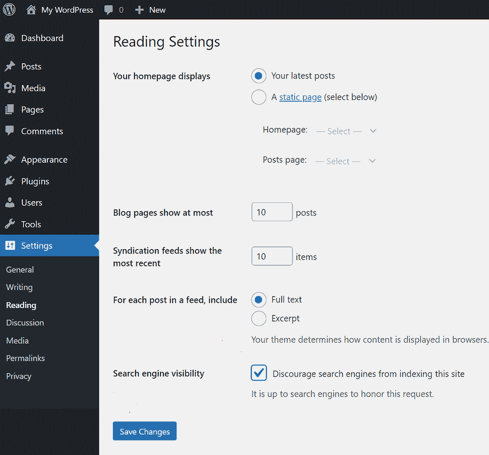
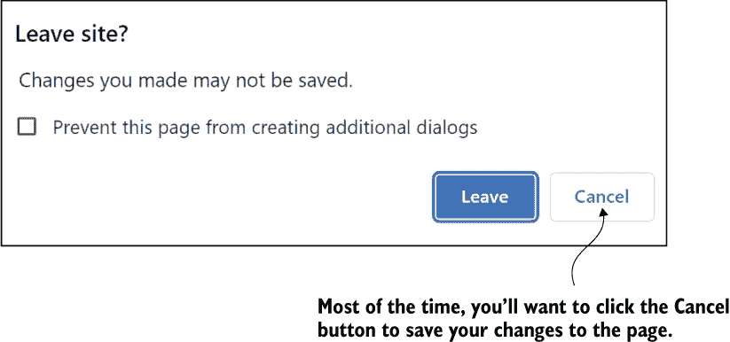
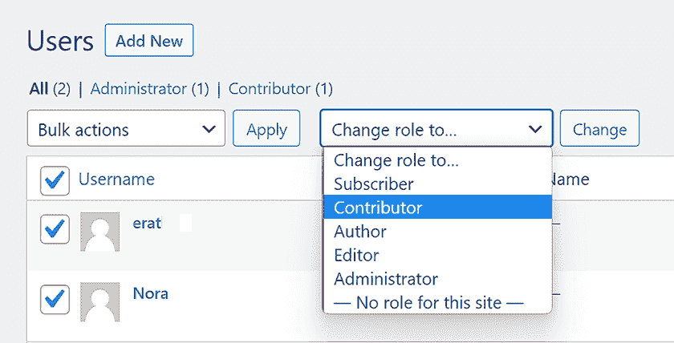

# 2 开始建立网站

本章涵盖

+   选择正确的 WordPress 版本和最佳托管服务

+   在准备好亮相之前隐藏您的网站

+   保存您的作品

+   安装安全和备份插件

+   管理对您网站的访问

在建立网站时，从正确的方向开始非常重要。您的网站是否能实现目标或失败，有时可能取决于您在甚至创建第一个页面之前所做的选择。

首先，WordPress 有两种版本，如果您选择了错误的一个，您可能会一直与限制和缺乏灵活性作斗争。此外，您必须选择一个优质的托管服务，它将您的网站存储在云端的伺服器上。选择错误的一个，当您需要技术支持（我们所有人有时都会需要）时，您可能会遇到延误、糟糕的建议或完全没有回应！本章全部关于在您甚至开始决定您网站的结构和设计之前做出正确的决定。

## 2.1 选择正确的 WordPress 版本

WordPress 有两种不同的版本：WordPress.com 和 WordPress.org。大多数专家认为，在这两个版本中，WordPress.org 优于 WordPress.com。

note 这里提到的*org*和*com*术语只是标识这两种 WordPress 版本，与.com、.edu、.net（称为*域名后缀*）以及其他附加到互联网网站地址（如 cnn.com 或 Wikipedia.org）的简写缩略词无关。

当你开始建立网站时，你的第一个决定是选择哪个版本的 WordPress。回想一下，WordPress*可以*安装在您的硬盘上，但这并不推荐。您将不得不处理诸如安全、正常运行时间和许多其他最好留给位于云端的 WordPress 托管服务的技术问题。托管服务的一个关键好处是，当出现问题的时候，您可以获得技术支持。

那么，为什么不选择 WordPress.com 呢？WordPress.com 网站上有一个免费托管计划。但是，这个免费版本有一些限制——例如不允许使用插件。然而，对于小型、简单的个人博客来说，这可能是足够的。WordPress.com 还提供付费的高级计划，但许多评论员表示，与 SiteGround.com、Bluehost.com 或 DreamHost.com 等独立托管服务相比，它们的价值并不高。

人工智能助手

向困惑者、双子座或另一个 AI 提出这个问题：

|

| WordPress 只推荐三种托管服务。它们是什么？为什么推荐它们？ |
| --- |

note 回想一下，插件是一个小的应用程序，您将其添加到 WordPress 网站中以提供额外的功能，例如旋转幻灯片或自动网站备份。第五章全部关于选择最佳插件。

如果您计划建立一个超越简单个人博客的网站，您将需要注册不同于 WordPress.com 的托管服务。并且当您注册不同的托管服务时，您将自动使用 WordPress.org 版本而不是 WordPress.com 版本，因为托管服务不使用 WordPress.com 版本。

WordPress.org 版本是开源的，并且免费使用。但是，优质的托管服务确实会收取费用。以下是付费托管服务的一些主要优势：

+   您可以期待高质量、快速的科技支持。

+   您可以通过数以万计的插件添加功能。

+   与 WordPress.com 免费计划中有限的定制相比，付费托管商不会限制修改。

+   他们通常提供更好的性能，例如更快的页面加载时间。

+   您将获得更多实用工具和功能，例如更大的带宽、更多的存储空间以及免费的网站迁移。

+   付费托管计划使您更容易从您的网站上赚钱。

如果您想使用付费托管服务并避免大量前期投资，您通常可以在每月 3 美元以下找到试用优惠（就像有线电视促销优惠一样，优惠结束后价格会上涨）。一些托管商还提供退款保证。如果您想了解更多关于为什么大多数专家推荐使用 WordPress.org 版本的原因，您可以在本有用的教程中找到更多信息：[`mng.bz/PNVR`](https://mng.bz/PNVR)。

## 2.2 注册一流托管服务

WordPress 网站通常驻留在云服务器上。这些服务器由提供技术支持以及各种实用工具（如安全系统、文件管理器和加密）的托管服务维护。从您的硬盘上托管 WordPress 网站是*可能的*，但这需要相当的技术技能，并且您将负责由托管服务最好提供的功能和安全性。坦白说，这并不值得。以下是使用托管服务而不是在您的硬盘上托管网站的一些优势：

+   *可靠性*—托管服务拥有一支专家团队，负责确保您的网站全天候正常运行。如果您的网站经常宕机，您可能会迅速失去观众。

+   *安全性*—优秀的托管商已经实施了强大的安全措施，以保护您的网站免受攻击。WordPress 网站是黑客攻击的热门目标。

+   *性能*—托管商的专用服务器针对 WordPress 进行了优化。您的页面将加载得更快，响应性也更强，如果您的网站位于自己的硬盘上，情况则相反。请注意，您的一些观众可能拥有较慢的互联网连接，页面加载时间可能会决定访客是否返回您的网站。

+   **易用性**——托管服务包括一组实用工具（位于名为 cPanel 或网站工具的位置）。您会发现一个安装安全套接字层（SSL；因此当有人访问您的网站时，他们不会看到令人不安的通知：“不安全”）。托管服务还提供许多其他有用的工具，包括自动备份、更新、文件管理和一个“预览”区域，您可以在那里离线修改您的网站，以及其他功能。

+   **成本**——随着时间的推移，托管服务可能比购买和维护自己的服务器更经济。

+   **支持**——最后但同样重要的是支持。您需要一个质量高的技术支持团队，以便快速解决技术问题。他们需要知识渊博、快速响应，并且可以通过聊天、电子邮件或电话轻松联系。

### 2.2.1 选择您的域名

当您首次注册托管服务账户时，您将被要求选择一个**域名**。这是 URL，是您网站**主页**在互联网上的唯一地址。URL 的例子包括 bbc.com、amazon.com 和 facebook.com。

**定义** 一个网站的**主页**是您网站中的第一个页面。这是访客到达您的网站时看到的页面。您可能还会看到它被称为着陆页、闪屏、主页面、索引、首页、起始页和第一页**。

每个页面和每篇博客文章都有自己的 URL（内部页面和文章的 URL 被称为**永久链接**），但网站的**域名**是主页面的 URL。因此，当在搜索引擎列表中点击时，会将访客带到您的首页。请注意，永久链接通常由站点名称加上一个短链接（通常是内部页面的标题）组成。一个永久链接的例子是*cnn.com/world*。

人们过去为了找到他们网站的最佳域名而苦苦挣扎——找到一个描述性强且简短的域名——换句话说，**易于记忆**。但到目前为止，所有好记的域名都已被占用（或者正在被储存起来，直到有人愿意为它们支付巨额费用）。Voice.com 在 2019 年以 3000 万美元的价格被区块链技术公司 Block.one 收购。

因此，不要折磨自己试图想出一个完美的域名，只需尝试将您网站的最佳**关键词**融入您的新域名中。关键词是一个寻找类似您网站的某人可能会在 AI 或 Google 中键入的单词或短语。

例如，如果您正在创建一个烹饪网站，将单词**recipes**或**cooking**放在域名中某个位置。*koolrecipes.com*就很好。如今，人们通常不会记住大多数域名。相反，他们将通过搜索引擎、AI 平台、浏览器中的书签或他们在其他网站上找到的指向您网站的链接来访问您的网站。

**注意** 谷歌正在迅速将自己从搜索引擎转变为 AI 系统。它需要与 GPT 和其他 AI 竞争，否则会失去业务。

**AI 辅助**

就像在头脑风暴时一样，向你的 AI 助手寻求建议。例如，为了找到一个尚未被使用的域名，用于我们的食谱实践网站，我向 Perplexity 提交了这个提示：

|

| 你是网站营销方面的专家。我想请你列出十个以“Time Tested Recipes for the Instant Pot”为标题的新网站的域名。让它们听起来吸引人、易于记忆，且简短。每个域名不必以“.com”作为顶级域名。顶级域名可以是“.edu”、“.net”或“.org”。同时，请确保每个域名都包含“recipes”这个词。对于你提出的每个域名，都要在互联网上查找。如果它已经被使用，请不要将其包含在你提出的十个域名建议列表中。相反，尝试一个不同的域名，并重复查看它是否已被使用的流程。深呼吸，一步一步地思考。 |
| --- |

Perplexity 给出了几个不错的建议：

|

| 以下是针对名为“Time Tested Recipes for the Instant Pot”的新网站的十个域名建议：InstantPotRecipesHQ.comTriedAndTrueInstantPot.comTimeTestedInstantPotRecipes.comInstantPotRecipesCentral.comInstantPotRecipesVault.comInstantPotRecipesMastery.comInstantPotRecipesGenius.comInstantPotRecipesEmporium.comInstantPotRecipesHub.comInstantPotRecipesGuru.com |
| --- |

我已经在互联网上搜索了这些域名，看起来它们都没有被使用。

### 2.2.2 设置实践网站

在附录中，你可以找到设置托管服务账户、在该账户上安装 WordPress 以及安装你可以用于本书实践网站的 Twenty Sixteen 默认 WordPress 主题的说明。最后，附录描述了如何进入网站的设置 > 通用屏幕，并将网站标题命名为“Time Tested Recipes for the Instant Pot”，副标题为“适合初学者的舒适食品”。如果你还没有设置实践网站，请访问附录，并立即设置，如果你想使用实践网站。本书中的一些示例基于附录中描述的设置。但如果你选择，你也可以在你的真实网站上工作。

在选择托管提供商时，寻找一个可靠、价格合理且声誉良好的公司。正如经常发生的那样，最广泛宣传的服务并不一定是最佳选择。例如，GoDaddy 拥有相当大的市场份额。但它得到的评价褒贬不一。

寻找一个可靠的托管服务可能会让人感到 daunting。全球大约有 330,000 个 WordPress 托管服务！但 WordPress.org 本身只推荐这三个托管商：SiteGround、Bluehost 或 DreamHost。不出所料，我也推荐这三个，原因稍后会列出。

这些托管服务都是优秀的选择，拥有出色的技术支持、稳定的性能和一系列可供使用的实用工具。你可以在以下链接中找到最新的最佳托管服务概述：[www.wpbeginner.com/wordpress-hosting/](https://www.wpbeginner.com/wordpress-hosting/)。

小贴士：wpbeginner 网站是一个很好的资源。无论何时你对 WordPress 有任何疑问，你通常都能在那里找到一个可靠的答案。他们提供清晰的教程、技巧、指南和无偏见的评论。其他有用的资源包括以下链接：[`neilpatel.com/`](https://neilpatel.com/)、[`chat.openai.com/chat`](https://chat.openai.com/chat)、[`wordpress.org/support/forums`](https://wordpress.org/support/forums)、[`wordpress.org/support/`](https://wordpress.org/support/)和[www.facebook.com/groups/wpbeginner/](https://www.facebook.com/groups/wpbeginner/)。

在你为托管服务注册账户的过程中，你将被要求为你的托管服务账户创建一个用户名/密码对。然后，当你向该账户添加一个新的、空的 WordPress 安装时，你将需要第二个用户名/密码对。将这些四个术语都写在一张纸上。当你需要访问你的托管账户或登录你的 WordPress 网站进行工作时，你需要这些用户名和密码。

### 2.2.3 托管服务清单

你想要找到一个提供以下服务的托管服务：

+   *可靠、持续在线*—你应该期望 99%的在线时间，因为如果服务导致你的网站不可用，你可能会失去一部分观众。人们知道有替代你的产品，而互联网已经使大多数人习惯于鼠标按钮非常快地反应。对于许多网络冲浪者来说，只需几秒钟的延迟就会飞到别处。

+   *快速页面加载和缓存*—考虑到你的观众中很多人对任何形式的延迟都变得不耐烦，包括加载缓慢的网站页面。因此，在审查托管服务的指标时，检查它们的平均页面加载速度。同时也要看看网站流量激增是否会影响加载速度。

注意：一种有助于快速显示页面的重要技术是*缓存*。为了加快页面显示速度，托管服务会*缓存*（存储）之前显示过的你的网站页面。当再次请求同一页面时，托管方只需将已渲染、缓存的页面直接显示在访客的屏幕上。这样可以避免渲染过程造成的延迟。（为了显示一个全新的页面，浏览器必须执行各种任务——从你的 WordPress 媒体库中获取图片；查看任何 CSS 代码，例如，检查字体大小是否与主题的 CSS 样式表指定的不同；扫描 HTML 代码以确定页面元素的定位位置；等等。因此，你将需要一个能够高效缓存其网站页面的托管服务。）

+   *有效的安全性*—在安全性方面，冗余通常是好事。重要的是您的托管服务提供自己的强大安全系统，并且您还安装了像 Wordfence 这样的安全插件。顶级军事设施不会只依赖一道栅栏，您也不应该这样做。

+   *可靠的备份系统*—优质的托管服务会自动每天备份您的网站。同样，您也会希望安装一个单独的备份插件。这样，如果您的双重栅栏安全预防措施失败，您仍然可以恢复您的网站。

+   *易于获取且可靠的客服支持*—每个创建或管理网站的人都会时不时地需要与托管服务的客服技术支持进行沟通。这不是一个“是否”的问题，而是一个“何时”的问题。因此，您会希望选择一个提供快速且准确响应您电话、电子邮件或聊天查询的服务。之前提到的 WordPress.org 推荐的三个托管服务都提供了这种技术支持。他们可以迅速帮助您摆脱困境。

+   *服务器位于您的目标受众附近*—尽管托管服务的大本营并不重要，但他们的服务器位置却很重要。一些最好的托管服务宣传他们的内容分发网络（CDN），这意味着他们提供多个服务器存储您的网站。如果托管您网站的服务器至少位于您的主要受众所在的同一大陆，您的页面加载速度会更快。许多可能成为您受众的人如果遇到页面加载缓慢的情况，他们可能根本不会忍受。而且，您的受众中的一些人也可能有较慢的互联网连接。对他们来说，页面加载速度是他们决定是否将您的网站加入书签以备将来访问或离开时考虑的一个重要因素。

总结来说，如果您签约 WordPress.org 推荐的三大托管服务之一：SiteGround、Bluehost 或 DreamHost，您可能会得到很好的服务。但如果您想探索其他选项，您可以使用之前给出的清单来避免以后的遗憾。

## 2.3 访问您的后台

在 WordPress 后台，您在这里工作并处理您的网站，有相当多的不同页面，例如菜单构建页面、媒体库和添加新插件页面。然而，我们将它们称为屏幕而不是页面，以区分它们与您的受众看到的网站的实际页面。后台是只有您，管理员（或您授权的其他人）可以进入的网站视图。在这里，您可以添加新页面、进行维护、进行改进，以及其他构建和维护网站的工作。它是位于您的访客所见之上的引擎室。访客被限制在前端，即网站的公共区域。

在您的托管服务上设置全新的、空白的 WordPress 安装后，首先要做的事情是访问您网站的后端。其地址基于您在注册托管服务时为您的网站 URL（域名）选择的地址。例如，如果您的域名是[`mysitesname.com`](https://mysitesname.com)，那么您后端的地址是 https://mysitesname.com/wp-admin。

您的后端地址只是前端地址的一种修改。您只需将/wp-admin 附加到您的域名即可。当您第一次访问后端时，请在浏览器中将其添加到书签（或收藏）。此外，当您的浏览器询问是否要保存用户名和密码时，请保存它们，以便您随时可以轻松地访问该网站。请注意，当您想查看前端时，只需删除地址中附加的/wp-admin 部分。

2018 年，WordPress 开发团队为 WordPress 添加了第二个编辑器，并将其设置为默认编辑器。编辑器是您向网站添加新内容或修改现有内容（如文本、图像、多媒体、超链接等）的地方。新的编辑器被称为*Gutenberg*或*WordPress 块编辑器*。

因此，WordPress 开发者可以选择两个编辑器：传统的经典编辑器和 Gutenberg。前者有点像加了兴奋剂的文字处理器，而后者则像页面构建器。第三方页面构建器，如 Elementor 和 Divi，已成为流行的 WordPress 插件。页面构建器可以提供诸如拖放布局、所见即所得的动态设计、页面模板等功能，以及无需编写代码即可微调网站外观的工具。

Gutenberg 旨在将多年来后市场页面构建插件所提供的功能集成到 WordPress 中。目前，我建议您切换到经典 WordPress 编辑器。这样，您得到的结果将与本书中展示的相匹配。然而，在本书中，也描述了使用 Gutenberg 进行操作的方法。选择权在您手中。如果您想使用经典编辑器，请参阅附录中的说明。使用名为*Classic Editor*的插件在经典和 Gutenberg 之间切换非常简单。

## 2.4 在网站建设期间隐藏您的网站

您可能希望在网站完善后再将其公开。显然，在您尽力使其出色之后，搜索引擎对您网站质量的判断非常重要。您也不希望潜在的目标受众根据半成品来决定是否再次访问您的网站或将其添加到书签。

因此，在你准备好盛大开业之前，你应该屏蔽 Google 和其他搜索系统，如 perplexity.ai。要屏蔽搜索系统，请转到你网站的的后端，在左侧你会看到一个黑色菜单，称为*管理菜单*或*仪表板*。点击设置以打开其子菜单，然后点击阅读，如图 2.1 所示。然后，在搜索引擎可见性旁边，选择“阻止搜索引擎索引此网站”复选框，并点击保存更改按钮。

隐藏你的网站的最终步骤是安装一个*即将推出*的插件。如果有人访问你的网站，他们只会看到一个消息，说明网站正在建设中。

然而，作为网站的管理员，*你*可以查看真实页面。你需要这样做。在为你的网站工作时，你时不时地想查看一下前端页面。即将推出插件会在你的浏览器中存储一个 cookie，以便清楚地表明你被允许看到真实的页面。

提示：Cookies 是通常由你访问的一些网站存储在你浏览器中的小数据块。主要目的是节省你的时间。如果你之前填写了表单或使用密码登录——如果你在访问网站之前将信息存储在 cookie 中，你就不需要重复那些操作。

图 2.1 在你的设置 > 阅读屏幕中，阻止搜索引擎对你的网站进度进行评判。

一个即将推出的好插件是 SeedProd 的网站构建器。要使用它，点击 WordPress 后端仪表板中的插件 > 添加新插件。然后，在右上角的搜索框中，输入`seedprod`。最后，点击安装按钮，然后点击激活。

一些插件和主题会将项目添加到你的仪表板菜单中。在左侧菜单中，点击 SeedProd > 落地页面，如图 2.2 所示。

一些插件即使你激活了经典编辑器插件，也会显示 Gutenberg 风格的 UI。例如，SeedProd 就是其中之一。当你到达 SeedProd 设计屏幕时，你可以体验一下 WordPress 中 Gutenberg 块编辑器的工作方式。SeedProd 模仿了块编辑器。如果你愿意，可以添加一些 SeedProd 的块，并用你的信息替换无意义文本。然后，你的真实页面将被这个即将推出页面所取代，通知访客你的网站目前正在建设中。点击保存按钮。如果你看到 WordPress 不允许你保存的警告，SeedProd 会显示如何解决这个问题。任何时候你想查看你的即将推出页面如何显示给访客，请将你网站的 URL 复制或粘贴到一个你没有用来设置此插件的浏览器中。

SeedProd 插件还包括一个正在施工的屏幕，如果你正在*更新*现有网站，可以使用它。但除非网站状况真的很糟糕，否则你应该避免这种方法。你的网站访客期望能够访问。如果你的网站关闭，即使只是短暂的，你可能会失去一些观众。

在 SeedProd 中点击“点击着陆页”，然后点击“编辑页面”按钮来自定义你的即将推出页面。

相反，通常最好的做法是通过对其副本进行工作来更新你的网站，而不是关闭实时网站。使用你托管服务 cPanel 工具集中找到的*预览*实用程序（或者你也可以添加一个预览插件到你的网站）*.* 当进行预览时，网站会被复制，但实时网站仍然对访客可访问。你在副本上进行改进。然后当你完成时，副本替换了旧版本并上线。

对于预览阶段有一个例外。如果你的网站被恶意软件攻击严重破坏，例如，导致有断开的链接、缺失的页面、可见的代码、空白页面等，那么显示一个带有网站何时可再次使用的信息的施工中屏幕会更好。你不想让访客到达一个充满问题的网站。

在保持网站私密时，一个可选的步骤是隐藏单个页面和帖子，除非你给某人一个密码来访问它们。网站中的每个页面和帖子都有自己的、独立的永久链接 URL 地址。

通常，永久链接是通过将页面标题附加到网站地址来构建的：

+   [`siteaddress.com`](https://siteaddress.com)—网站地址。

+   [`siteaddress.com/about-us`](https://siteaddress.com/about-us)—这将是我们“关于我们”页面的永久链接地址。（URL 地址不能有空格字符，所以用连字符插入以替换页面标题中的空格。）在这个例子中，地址中的 about-us 部分被称为*缩略词*。

由于内部页面有自己的 URL 地址，所以有可能在你准备好将网站公开之前，有人到达这些内部页面之一。话虽如此，一个高质量的即将推出插件，如 SeedProd 提供的，默认情况下会在所有页面上显示即将推出屏幕。

### 2.4.1 请求人工智能不要打扰你的网站

人工智能系统通过遍历互联网、记忆和组织找到的内容来“学习”。但如果你不希望人工智能使用你的内容，你可以要求人工智能系统不要从你的网站上收集信息。并且一些人工智能会遵守这一要求。这种请求的有效性可能至少部分取决于未来的版权法。

假设你想要保留所有或部分内容不对外公开——只有付费获取该信息的人才能访问——或者你不想让 AI 收集你的内容。你可以通过在网站根文件目录中存储一个名为 robots.txt 的文件来尝试阻止 AI 或搜索引擎访问你的页面。（该目录是存储在你的网站数据库中的名为 public_html 的目录，它存储在你的托管服务提供商的服务器上。）如果该文件已经存在，你可以修改它。或者你可以创建一个同名的新文件。但如果你要修改网站文件，请确保你知道自己在做什么。你可能会破坏你的网站。（在修改网站文件之前，请务必先备份你的网站。） 

在任何情况下，你可以在该文件中指定你授予 AI 的访问权限，如果有的话。要查看该文件中应输入的具体内容，请访问 [`mng.bz/eyww`](https://mng.bz/eyww)。如果你需要帮助了解如何以及在哪里保存此文件，你可以咨询你的托管服务的技术支持人员。

## 2.5 保存你的工作

一些应用程序，如 Microsoft OneNote，会自动保存你所做的任何更改。WordPress 则不是这样。相反，当你修改网站上页面的内容时，你必须点击更新按钮（或 WordPress 为该按钮显示的几个同义词）。

这些同义词存在的一个问题是：WordPress 在保存工作时的按钮命名并不一致。例如，当你首次在 WordPress 中创建新页面时，保存工作的按钮被标记为 *发布*。然后，该按钮的标签会变为 *更新*。改变按钮名称并不是一个好的 UI 设计。初学者常常因此感到困惑。如果所有保存工作的按钮都简单地命名为“保存”会更好。

WordPress 通常直观。用户界面设计良好。但这些保存按钮令人困惑，因为它们有不同的含义。这只是你必须习惯的事情之一。首先，*发布*通常意味着*公开*。换句话说，你会认为点击发布意味着你的观众现在可以看到你刚刚修改的页面的最新版本。但情况并不总是这样。如果页面被缓存（存储以供将来显示），他们可能看不到新版本，尤其是如果缓存算法认为修改很小。

此外，你可能正在编辑该页面的草稿，或者指定了该页面应为私有。在这些情况下，页面仅存储在你的网站数据库中，但不会对公众可见。

更糟糕的是，这个保存工作的按钮在 WordPress 的不同屏幕上以几种不同的方式标记。当你正在编辑网站的菜单屏幕时，它被命名为“保存菜单”。在其他一些屏幕上，它被称为“保存更改”。你也会发现有时只是简单地标记为“保存”。

还有一个问题。这个“保存”按钮出现在不同屏幕的不同位置。它通常在右上角，有时在右下角，有时在屏幕底部很远的地方，以至于你必须向下滚动才能看到它。

注意，你还可以通过几种方式退出未保存的屏幕：点击浏览器中的不同标签页，关闭当前标签页，关闭浏览器，或切换到不同的应用程序。如果你在没有保存更改的情况下退出，WordPress 通常会显示如图 2.3 所示的警告消息。

图 2.3 如果你尝试离开一个你没有保存所做的更改的页面，你通常会收到这样的警告。

关键词是“通常”。在少数屏幕上，没有警告，你将失去在该屏幕上所做的所有工作！因此，你将想要养成通过点击保存按钮或当时可能显示的其各种标签来保存修改的习惯。

## 2.6 确保网站安全

如果你已经注册了优质的主机服务，你可以确信他们已经在你的颤抖的年轻网站和互联网上不断漫游的威胁性蜘蛛机器人之间建立了一套围栏——不知疲倦地以惊人的速度探测漏洞。但在你投资时间建立网站之前，你将想要采取自己的两个防御步骤：添加一个安全插件，并添加一个备份插件。

的确，一个好的主机会在确保其服务器受到保护上投入大量的努力。大规模的攻击会摧毁他们的业务。好的主机也会每天或根据你选择的最佳频率备份你的网站。但在这些事情上冗余是好事。大多数人打开 Windows Defender，但也会投资一个单独的反病毒应用程序，这也帮助他们的机器。

一个广受尊敬的 WordPress 安全插件是 Wordfence。这是一个*免费增值*产品——提供免费和付费计划，但免费版本非常有效。在网站建设的早期阶段将其添加到你的网站上。以下是操作方法：

1.  前往你的插件 > 添加新插件页面。

1.  在搜索框中输入`wordfence`。

1.  点击安装按钮，然后点击激活。

还要确保你的密码强大，无论是你网站的背面密码还是你主机服务账户的另一个密码。你的浏览器可以为你记住这些密码，所以没有理由不使它们复杂且无意义。记住，互联网上四处游荡的邪恶蜘蛛不知疲倦。他们的一种技巧叫做暴力攻击。他们可以尝试英语中的每一个单词以及有限数字集的每一种组合，直到他们找到你的密码。

## 2.7 自动备份

最好的备份插件之一是 UpdraftPlus，它在超过 300 万个网站上使用。这是一个免费增值服务，但免费版本工作得非常好。以下是安装它的方法：

1.  前往你的插件 > 添加新插件页面。

1.  在搜索框中，输入`updraftplus`*.*。

1.  点击安装按钮，然后点击激活。

激活后，转到您的设置>UpdraftPlus 备份屏幕，并点击设置选项卡，如图 2.4 所示。

点击文件备份计划旁边的向下箭头。这将下拉一个列表，如果您正在积极修改站点或拥有一个经常添加新帖子的繁忙博客，您应该从列表中选择每日备份。

图 2.4 在此设置屏幕中，指定备份您的站点文件和数据库的频率、要保留的备份数量以及存储位置。

对于数据库备份计划也做同样操作。同时选择您想要保留的备份数量，大约 10 个。第 11 个备份将成为堆栈中的第一个，而最旧的备份，即第 10 个，将被删除。最后，选择您想要存储备份的位置。然后，务必点击“保存更改”按钮。

提示：在您构建或积极更新您的站点时，每日备份可以确保您不会丢失太多工作。但如果您需要立即保存所做的更改，您始终可以手动备份：只需在主 UpdraftPlus 设置屏幕（备份/恢复选项卡）上点击“立即备份”按钮。此外，如果您几周内没有对站点进行更改，您可以减少自动备份的频率。

然而，如果您的站点遭受了大规模攻击或其他灾难，您无法恢复，仍然还有希望。前往[`archive.org/web/`](https://archive.org/web/)，并将您的站点前端地址粘贴到搜索框中。您至少可以复制粘贴存储在此存档站点上的文本内容，您还可以截图图像和页面布局。这至少会使从头开始重建您的站点变得容易得多。您将恢复站点设计、页面布局和内容。

## 2.8 管理站点访问

如果您想让其他人参与您的设计工作、贡献内容或订阅您的站点，您需要决定您想授予他们多少以及什么类型的访问权限。并非每个人都需要完全的、管理员级别的站点控制权。您可以提供不同程度的权限，每种权限都有自己的范围。本质上，您可以指定特定个人可以在站点中做什么或不能做什么。您在“用户”>“添加新用户”屏幕上设置这些权限，如图 2.5 所示。

图 2.5 在添加新用户屏幕中，您为允许进入后端的人指定一个权限级别。

### 2.8.1 理解各种用户角色

有一些默认的用户角色可供您使用。以下描述了每个用户角色：

+   *管理员*—被分配此角色的人对网站拥有完全控制权。他们可以添加、删除或编辑任何内容，任何地方。他们可以管理其他用户，更改网站上的任何设置，安装或删除插件和主题。他们最重要的能力是可以删除、修改或添加其他用户，包括更改他们的密码。换句话说，管理员可以做任何事情。

+   *编辑*—他们能够添加、删除或修改网站上的任何内容，并且可以管理博客帖子。他们不允许安装或操作主题或插件，添加新用户，修改现有用户的角色，或更改网站的设置。

+   *作者*—这个角色对网站的风险很小。作者可以添加、删除或创建帖子标签，或修改他们自己的帖子。他们不能创建新分类。他们不能批准或删除他人的帖子。他们也不能对网站做其他任何事情。

+   *贡献者*—这些人拥有与作者角色相似的权限。然而，他们不能删除他们发布的帖子。而且与作者角色不同，他们不能向网站添加文件，因此这阻止了他们在帖子中包含图片。

+   *订阅者*—订阅者可以修改他们的个人资料或更改他们的密码。但他们不能做其他任何事情。

新用户会收到你的电子邮件（如果你在设置他们时选择了这个选项）。它告诉他们他们的用户名，并显示一个链接，允许他们创建密码。

除了这些默认用户角色之外，作为管理员，你可以定义自定义角色。这样，如果你想要的不是默认角色之一，你可以创建一个新角色，包括你想要授予的任何权限集。通常认为最好只有一个，最多两个管理员用户。其他人应该对网站的掌控较少。

插件和主题也可以添加除了 WordPress 默认角色之外的角色。例如，WooCommerce 插件添加了商店经理和客户角色，这些角色定义了用户如何与其电子商务功能交互。

### 2.8.2 通过订阅盈利

从你的网站盈利的一个好方法是为访客提供必须付费的内容，你可以将整个网站或其部分内容设为付费区域。人们很少反对这种盈利方式，因为它自愿且不显眼。

TIP 订阅者角色通常用于基于会员制、订阅或在线商店模式的网站。用户必须注册并付费才能访问网站的部分或全部内容。订阅者角色的另一个场景是允许订阅者注册并评论帖子，但阻止他们创建或发布其他内容。

如何盈利

如果你想要盈利你的网站内容，以下是一些使用订阅者用户角色的建议：

+   在这些在线课程中，人们付费观看内容或加入在线课程

+   部分或全部网站设为付费区域，提供付费内容的杂志

+   仅对注册用户提供特殊折扣的付费订阅

+   私人论坛

+   咨询或辅导服务

要更改 WordPress 中的用户角色，请按照以下步骤操作（见图 2.6）：

1.  以管理员身份登录 WordPress 仪表板。

1.  在管理菜单中，点击用户。

1.  找到你想要更改角色的用户，并点击他们的用户名以打开他们的个人资料。

1.  滚动到用户个人资料的“角色”部分。

1.  从下拉菜单中选择新角色。

1.  点击更新用户按钮以保存更改。

### 2.8.3 页面密码保护

这是你控制网站前端页面或博客文章访问权限的另一种方式。你的访客可以分为那些有特定页面密码的人和那些无法查看这些页面的人。你可以通过标记为密码保护来隔离单个页面和帖子。以下是操作方法：

1.  前往你的页面 > 所有页面屏幕。

1.  点击你想要设置密码保护的页面标题。

1.  在这个编辑页面屏幕中，找到右侧的发布模块。

1.  点击密码保护。

1.  输入密码。

1.  点击更新按钮。

图 2.6 这里你可以通过批量操作功能一次性更改多个用户的角色。

图 2.7 显示了你可以在哪里设置页面或帖子的密码保护，阻止没有该密码的人查看。

图 2.7 在发布模块中，输入一个你可以提供给允许查看页面的人的密码。

提示：只有拥有管理员或编辑级别权限的人才能查看标记为密码保护的页面或帖子，即使是在网站的的后端。

除了货币化之外，将内容设置为密码保护还可以在几种其他方式中发挥作用：

+   即使访客知道页面的永久链接地址，他们也无法看到它。

+   你正在为你的网站添加一个新页面，但希望它在完成之前保持隐藏。

+   你希望某些页面或帖子只被你的受众的一部分人查看——例如，只有成年人。

如果你编辑这个相同的发布模块中的“发布于”字段，页面或帖子也可以被安排在特定的时间后显示。

在本章中，你已经学习了在开始 WordPress 网站时需要采取的一些重要初步步骤。你需要选择一个可靠的托管服务，选择一个你感到舒适的编辑器，安装安全措施，并决定谁可以访问你的网站后端的内容。在下一章中，你将看到如何将网站聚焦于单一、专业的目标，并设置任何优质网站的基本组件——高效的导航。

## 摘要

+   从正确的方向开始，并做一些预先规划，可以帮助你创建一个连贯、有机的网站。

+   许多专家都认为你应该使用免费的、开源版本 WordPress.org，而不是 WordPress.com。

+   选择合适的主机服务可以成就或毁掉一个网站。每个人时不时都需要坚实的科技支持，而且你不想在你最需要帮助的时候，选择一个在你需要帮助时消失的服务机构。

+   如果你选择 WordPress.org 推荐的三个主机之一进行注册，就不会出错：Bluehost、DreamHost 或 SiteGround。

+   WordPress 有两个编辑器。如果你愿意，可以尝试它们两个，但总的来说，经典编辑器比新的 Gutenberg 块编辑器更稳定和高效。后者仍在建设中。

+   在你的网站打磨完毕并准备好亮相之前，将其从搜索引擎和访客中隐藏起来。

+   一定要安装两个重要的安全插件：UpdraftPlus 和 Wordfence。前者可以可靠地自动备份你的网站，而后者则可以保护你的网站免受病毒攻击。

+   探索 WordPress 提供的几个工具，这些工具允许你控制对网站后端和前端访问的控制。
