# 3 网站构建预备知识

本章涵盖

+   紧密聚焦你的网站主题

+   设定目标

+   创建层次结构

+   充分利用链接

+   构建有效的菜单系统

为什么在开始添加文本和图片之前先规划你的网站？这非常简单：指定你的主题、确定你的主要目标，以及为其页面创建层次结构，这些都会让你在之后做出的许多决定得到信息。

如果你直接跳进去添加内容，几乎不可能有效地聚焦网站并知道什么应该优先考虑。对我们大多数人来说，这会导致一个无组织且混乱的工作流程。可能的结果是一个无组织且令人困惑的网站。

在这本书中，我们将描述如何构建和修改一个实践网站。这样，你将看到如何通过现实世界的例子应用每一章中介绍的各种概念。然而，如果你更喜欢，你也可以直接将这些概念应用到你的网站上。

或者，你实际上可以设置一个新的、空的 WordPress 网站，并开始构建你自己的实践网站版本。附录提供了如果你想要自己构建的详细说明，因为我们教授了所有有助于创建优质网站的技能和技术。这个实践网站的标题是《Time Tested Recipes for the Instant Pot》，其标语（口号）是《初学者的舒适食品》。然而，我们也会不时地看看其他用例。例如，在本章中，你将看到如何为鲈鱼渔民的电子商务网站做准备。

本章将向您展示如何明智地奠定坚实的基础，这将帮助你创建一个连贯、专业且你引以为豪的网站。第一步是专注于你的网站主题。换句话说：找到一个细分市场。

## 3.1 聚焦你的网站

初学者在开始他们的第一个网站时犯的最常见的错误可能是选择一个过于宽泛的主题。这听起来合乎逻辑，但实际上是错误的。

考虑这个用例。一个男人住在北卡罗来纳州，并经常在 Randleman 湖钓鱼。他是那个湖里捕捞宽口鲈鱼的专家。他知道一天中最好的时间、一年中最好的季节、正确的天气条件以及其他使他成为非常成功的鲈鱼渔民的细节。

你需要为你的网站选择一个好的标题。（标题与浏览器地址栏中输入的互联网地址[URL]以访问你的网站不是同一回事。）标题出现在你网站上每个页面的顶部。但它不需要像 URL 那样独特。在 WordPress 中，你可以通过访问设置>常规屏幕，随时输入或更改标题。

因此，在决定网站标题时，我们的渔夫想：嘿，这么多年来，我确实可以在这里提供关于 Randleman 湖钓鱼的极好建议。但仅仅谈论这个特定的湖泊真的会*限制*我的受众。所以，为什么只把我的所有好建议只提供给当地人呢？世界上还有那么多渔夫。我应该追求那个庞大的受众。此外，将来，当我的网站变得巨大时，我还可以卖给他们我特制的手工鱼饵。这可以变得*很大*！我只需写关于钓鱼的一般性内容，并向庞大的客户群销售！哇塞！

这是常识，是直观的，也是选择标题最糟糕的方式。它之所以如此错误，是因为如果你的网站焦点和标题是*钓鱼*，你将与使用该关键词的 1.3 亿其他网站竞争——从雷达扫描仪到青蛙钓鱼应有尽有。其中一些网站已经成熟且受欢迎。如果你的网站在搜索*钓鱼*时出现，几乎为零机会。大多数人可能会使用额外的关键词，如*北卡罗来纳州，鲈鱼*，甚至*Randleman 湖*。因此，我们的渔夫应该通过使用这样的关键词来大大缩小他网站的主题：*格林斯伯勒的 Randleman 湖的鲈鱼钓鱼*。

那样的标题在搜索时只会触发几个竞争网站。如果搜索工具或 AI 判断你的网站制作得很好，你甚至可能成为 AI 或搜索工具最推荐的网站之一。

这种方法——紧密聚焦你的标题和内容——是你增加扩大一个庞大且忠诚受众机会的方式。毕竟，在 Randleman 湖附近大约有 200 万人。作为一个受众群体，这已经足够大了。

## 3.2 明确网站目标

有些人擅长即兴发挥，边走边想。但对我们大多数人来说，在开始构建网站之前制定一个网站计划几乎总是个好主意。如果你有太多的后续想法，而不是有机地增长，最终网站可能会感觉拼凑在一起，缺乏连贯性，杂乱无章，甚至令人不快。

因此，确定你构建网站的主要目标（不是目标）。在构建网站的过程中，持续朝着这个目标努力。结果很可能是看起来有组织，从而产生信任并传达质量。无论你的目标是什么，你希望网站看起来专业，而不是业余的。

首先决定你想要构建哪种类型的网站。你是要卖东西吗？如果是这样，你正在构建一个*电子商务*网站。这个网站只是为你自己和家人朋友而设，记录你的活动、生平或家谱的多媒体日记？这种网站被称为*个人* *博客*网站（在这种类型的网站上，你不需要找到一个利基市场——你就是那个利基市场）。

TIP 大多数个人网站的目标受众非常有限，仅限于亲戚和朋友。这样的网站很少吸引大量观众。一方面，它们通常内容分散，没有明确、单一的主题。少数人成为*影响者*——他们运气好，建立了一个观众群体。但除非你已经是一个名人，拥有一个渴望了解你动向的现有粉丝群体，否则你的个人博客可能只会吸引到你圈子之外很少的追随者。如果你不关心生成收入或建立庞大的观众群体，那也无可厚非。

### 3.2.1 10 种网站类型

根据它们的主要目的，网站可以被大致分为大约 10 个不同的类别。当然，一些网站融合了两个或更多目标，而一些网站非常独特，难以轻易分类，例如 DudeQuote ([www.dudequote.com](https://www.dudequote.com))—一个《大话水牛》电影台词生成器。以下是一些主要类别的列表：

+   *电子商务*—专注于在线销售的网站。例如，eBay、Etsy 以及数百万个个人卖家。

+   *博客*—专注于网站单页上按时间倒序发布的消息。一些博客鼓励互动，允许访客对帖子做出回应。一般来说，博客提供最新的信息，与不经常变化的静态页面形成对比。如今，许多网站除了包含一组传统的静态页面外，还包含一个博客页面。这样的网站被称为*混合型*网站。

+   *新闻*—BBC 或 CNN 等网站。

+   *社交媒体*—人们可以在这里与朋友和家人互动，分享评论和媒体，并参与讨论。Facebook 是最著名的一个。

+   *论坛*—类似于社交媒体，但主要设计用于回答特定、通常技术性的问题或交换信息，如编程。包括 WordPress 本身在内的许多应用程序都设立了论坛，让初学者可以与有帮助的专家建立联系。或者专家可以交流想法。论坛通常是一个包含问题和答案的消息板。相比之下，社交媒体倾向于包含更多通用内容，包括多媒体。

+   *信息类*—维基百科、我们自己的食谱实践网站以及类似网站提供各种知识。一些信息类网站对研究可能很有用。但通常，最有效的资源是像 GPT、Claude、Perplexity 等 AI 驱动的网站。

+   *教育类*—Udemy 和 ed2go 是两个在线学校的例子。一些提供视频课程，而另一些包括一个讨论板，学生可以与讲师互动。许多教师和图书管理员为当地学生和读者建立了小型、地方性的教育网站。例如，我为 ed2go 在线学校教授三门课程：博客与播客入门、创建 WordPress 网站和中级 WordPress 网站。

+   *聊天机器人*—这些基于 AI 的系统以对话或聊天的形式提供信息。换句话说，你可以通过请求对先前响应的详细说明或修订来深入挖掘更有帮助的答案。

+   *作品集*—艺术家、作家或其他人想要展示他们的创作会建立作品集网站。有许多优秀的主题旨在展示各种类型的创意工作。

+   *就业*—像 MonsterInsights ([www.monsterinsights.com](https://www.monsterinsights.com))这样的网站为求职者提供资源，例如创建简历、寻找职位空缺、推广你的可用性以及申请职位。

+   *政府*—旨在协助提供服务、政策和其它政府资源的本地或国家网站。

### 3.2.2 需要回答的五个问题

在实际开始构建你的网站之前，确保你已经回答了这些问题：

+   你网站的目的是什么？

+   网站的短期目标是否与长期目标不同？换句话说，网站的目的是否会随着时间的推移而演变？例如，你计划先扩大受众，然后再出售商品吗？

+   目标受众是谁？

+   人们希望从网站上获得什么？

+   你打算在托管服务、插件和主题上花费多少钱？

在你的目标上做出这些基本决策有助于将设计和内容引导成一个和谐的整体。这也有助于你选择能够有效支持你目标的插件、功能和功能。以下是我们针对我们的鲈鱼钓鱼网站计划的一些示例答案：

+   我网站的长期目的是最终出售我手工制作的鱼饵。

+   是的，我网站的用途将随着时间的推移而改变。最初，我想只是吸引当地的鲈鱼钓鱼者，并通过提供关于如何钓鱼 Randleman 湖的最新、有价值的小贴士来让他们不断回来。但最终，我会添加电子商务组件来销售我承认成本高昂但非常*有效*的鱼饵。

+   目标受众是那些在 Randleman 湖钓鱼并希望捕捞鲈鱼而不是鲢鱼或鲤鱼的人。

+   我将给我的受众提供优秀、具体的信息，他们可以用这些信息提高他们的钓鱼技巧。

+   我计划获得一个免费增值主题，先用免费版本使用一段时间，然后当网站起飞时可能升级到付费版本。我会看看我最终是否需要专业版本的特性。我将使用 DreamHost 托管服务，因为它被高度推荐，但仍然有一个低廉的预付费计划。（我确实理解托管服务通常在试用期后会增加月费。）

### 3.2.3 与 Claude AI 的咨询

现在我已经为这五个问题提供了最好的答案，我将这些问题和答案提交给了 claude.ai 以获取其建议。我开始提示如下：

|


| 作为一名经验丰富的、专业的网站设计师（以及一名 bass 鱼民），深呼吸并回顾我对这五个问题的回答。逐步思考，列出你为改进关于这个 bass 鱼民网站的计划的回答所提出的任何补充或建议。你是我的新网站项目的顾问。尽你所能做到最好，否则会有后果。 |
| --- |

克劳德提出了以下一些好主意：

|


| 从一个经验丰富的 bass 鱼民和网站设计师的角度来看，以下是一些额外的建议：强调你在 Randleman 湖钓鱼的个人专业知识。提供在那里钓鱼的年数、最喜欢的地点、最大的捕获量等详细信息。建立你的信誉。针对目标受众，非常细分——针对经常在 Randleman 湖参加锦标赛和俱乐部活动的严肃 bass 鱼民。为铁杆常客提供内容，而周末垂钓者也会跟随。专注于提供专业技巧和高级策略，以持续捕获大 bass。超越基础——分享你的专业、经过验证的方法。在社区方面，考虑为游客创建一个 Randleman 湖 bass 钓鱼论坛，让他们互动并分享他们的经验。这可能会激发持续的参与。在货币化方面，研究与你受众一致的 bass 设备和船只的联盟计划。考虑与当地钓鱼向导和旅馆合作。为在核心目标中推广你的网站而预算付费推广——Facebook 广告、赞助活动、战术 SEO 等。利用你在 bass 社区中的社交媒体存在来推广网站。也可以在影响者博客上写客座文章。如果你希望我详细说明计划的任何部分或提供我在 bass 钓鱼和建立利基网站方面的经验建议，请告诉我。我很乐意提供我的专业知识！ |
| --- |

最后，一旦你确定了要建立的网站类型，访问该类型其他流行的网站。从他们那里学习什么有效，什么应该包含，以及最佳的功能性和设计。还要在标题、标语（显示在每个页面标题下方的一行短语）和文本内容中包含关键词。使用精确和详细的、人们可能在使用搜索你网站提供的信息时使用的关键词，例如

波士顿为幼儿园儿童的艺术资源

或者

获奖的水彩意大利街头风景

注意，这些搜索词是*专注于*相当具体的话题的。你通过添加形容词来集中。我在这一章中多次使用了“focus”这个词。

## 3.3 创建层次结构

如果你希望你的网站成功，高效的导航是必不可少的。人们访问网站是为了寻找某些东西。但他们不希望的是一个如此混乱的网站，以至于他们的第一反应是困惑。如果你让他们觉得必须解决谜题才能得到他们想要的东西，他们很快就会去别处。

您希望从主页到他们的目标路径清晰直观。确保他们不会感到困惑。记住，当人们感到困惑时，他们很少会责备**自己**。他们只是对**您**和您毫无意义、随机、复杂且效率低下的网站感到沮丧。

您必须立即向访客提供一个关于您网站结构的心理模型。随着您的网站随着时间的推移而变得更大，一个坚实、合理的架构会使未来的修改更加容易。最后，如果 AI 爬虫和搜索引擎看到您的网站结构连贯且合理，它们会给您更高的排名。

在未来的章节中，我们将探讨获取有关人们如何遍历您的网站、他们在哪里遇到困难以及其他您可以用来使他们的用户体验（UX）尽可能好的数据的方法。但就目前而言，让我们考虑一下基础知识：层次结构和可导航性。

### 3.3.1 网站结构：父级和子页面

在创建您网站的页面之前，列出您想在网站上包含的主题。然后按照列表进行分组：父级页面、子页面、孙子页面（如果您的网站相当大，孙子页面可能是必要的）。

小贴士：如果可能的话，尽量避免孙子页面（子页面的子页面）——人们在最好的情况下也会觉得它们难以理解且难以导航。

网站菜单通常只显示父级页面。当访客将鼠标指针移至菜单上父级页面的名称时，会下拉一组子页面。这是大多数访客导航您网站的方式。

例如，我们钓鱼网站的父级页面可能包括诱饵和关于我们。子页面将是这些页面的子页面。诱饵父页面可能有四个子页面：旋转饵、旋转饵、水面诱饵和泡沫饵。关于我们的子页面可能是我们的历史和未来计划。

这里的目标是组织网站为五个或六个主要父级页面，每个页面可能包括子主题（子页面也称为*子菜单*）。网站的菜单是一组链接到网站页面的集合，通常显示在每个页面顶部的水平栏中。

让我们看看这在实践中是如何工作的。例如，钓鱼网站可以将这些主要、父级分类作为其主菜单项：

新闻（博客）技巧与技术 赛事 联系我们

很理想的是，尽可能保持您的菜单简短。因此，限制自己不超过六个父级页面，除非这牺牲了可导航性。创建一个描述性、吸引人的网站标题，但请注意，标题与网站的 URL 互联网地址（URL 以.com、.org 或某些其他后缀结尾）不同。现在考虑我们的钓鱼网站如何显示典型的网站页面中的七个元素，如图 3.1 所示。


图 3.1 当代网站页面通常至少包括以下七个元素：网站标题、网站标语（口号）、横幅图片、页面标题、菜单、正文内容和行动号召。

### 3.3.2 请人工智能为您创建页面层次结构

人工智能能否为我们的示例淡水鱼垂钓网站制定一个层次结构的第一稿？当然可以。

小贴士：在与人工智能合作时，请习惯您的角色：您是老板；它是一个助手，尽管它比您快得多，拥有庞大的互联网记忆，思维速度极快，多才多艺，等等。老板处于权力的位置，但这并不意味着他们一定是天空中最明亮的星星。作为老板的角色是提出任务，将任务交给人工智能，然后判断其回答哪些是可靠的，哪些需要进一步的工作。您始终可以要求人工智能再次尝试。或者，您可以自己进行改进。

要请人工智能创建页面层次结构（即网站菜单系统），最好指定两个任务：

1.  寻找并列出最成功的淡水鱼垂钓网站。

1.  显示一个有序列表，展示这些网站的菜单层次结构有哪些共同点。这些问题将有助于确保没有遗漏任何主题，并且很可能会生成最佳、最合理的整体网站组织。人工智能如果不是擅长逻辑，那就什么都不是了。

因此，我向 Copilot 提出了这个提示：

|


| 您是一位经验丰富的网站评论家和批评家。同时，您也是一位专业的淡水鱼垂钓专家。请列出世界上五个最成功的淡水鱼垂钓网站的网址。请再次确认这些网址仍在积极使用，并且在谷歌搜索中使用关键词“淡水鱼垂钓”时排名很高。 |
| --- |

它回复说：

|


| 根据我的搜索结果，以下是当前在谷歌搜索中使用关键词“淡水鱼垂钓”排名靠前的五个活跃的淡水鱼垂钓网站：    1. BassFan    2. BassResource    3. BassRankings    4. Bassmaster    5. FLW Fishing |
| --- |

然后，我接着提出了第二个提示，要求 Copilot 设计一个菜单，将这五个网站共有的主题结合起来：

|


| 您理解网站菜单系统。请检查这五个网站的菜单和子菜单。通过将这五个网站的菜单层次结构合并成一个有序列表，列出父页面及其子页面。再次检查您的结果，以确保您将这些层次结构合并成一个优秀的淡水鱼垂钓网站的单一菜单层次结构。 |
| --- |

Copilot 提供了这个有用且逻辑清晰的层次结构：

|


| 基于前五个淡水鱼垂钓网站的主题结构，这里有一个可以作为一个优秀淡水鱼垂钓网站的一般结构的综合层次结构：**首页** **新闻（博客页面）** 最新新闻 Pro Tour 新闻 Dock Talk**锦标赛** 日程安排结果排名运动员档案**排名** 世界排名年度运动员**技巧与技巧** 专业垂钓技巧如何视频装备评论**论坛** 通用淡水鱼垂钓论坛小嘴鲈鱼垂钓垂钓报告**装备** 新产品钓具评论**视频** 顶级捕捞专业日记**文章** 特色文章观点**会员** 登录/立即加入 |
| --- |

这涵盖了淡水鱼网站的基础。它包括一些我未曾想到的好主题。然而，我想要精简菜单，将其大小减少到只有大约六个父页面项。一方面，我会将锦标赛和会员从菜单中移除，放到侧边栏上。但为什么我应该担心精简，当我的热情洋溢、才华横溢的助手可能会做得更好时？我们将很快将这个菜单精简任务交给 AI。

### 3.3.3 AI 可以为你创建整个网站

你是想让 AI 生成一个全新的网站，或者至少提供一个可以工作的初稿？几个 AI 驱动的系统提供这样做。其中，10Web（[`10web.io/`](https://10web.io/））是一个不错的选择。你只需提供一些关于你意图的基本信息。然后，它就能相当好地生成一个真正的网站。

当然，你需要进行调整并提供内容，但对于一些人来说，这个过程比从头开始创建一个空白的网站要容易。10web 倾向于偏好长滚动的主页（整个网站都在主页上），我认为这会使导航变得困难。然而，10web 生成的网站层次结构、文本和图像出人意料地好，如图 3.2 所示：

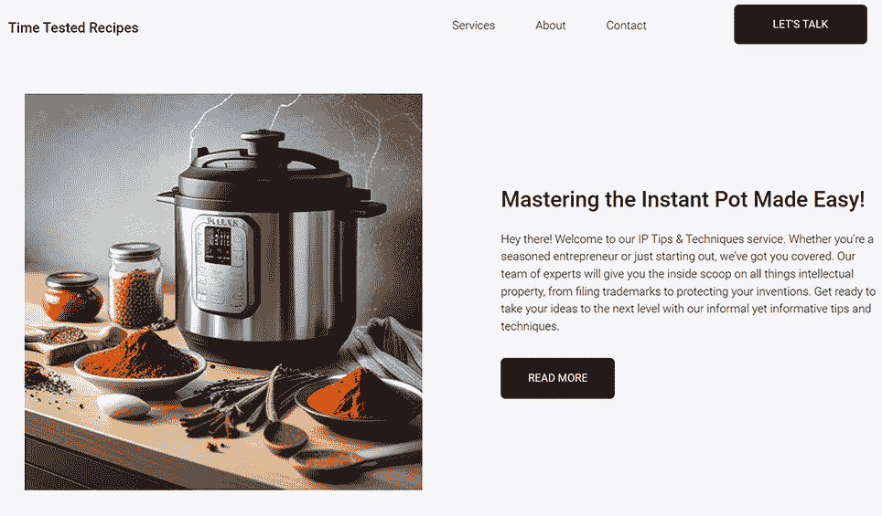

图 3.2 这是从一个简短的、段落长的提示中生成的，描述了我们的 Instant Pot 食谱实践网站。

这些即时网站构建器在生成有效的导航、选择合适的主题或插件或编写有用的文本内容方面并不出色。因此，我主要会使用它们来获取设计灵感。

### 3.3.4 使用菜单插件

总是如此，你可以安装插件来为你提供额外的功能和菜单选项。以下是一些流行的菜单插件：

+   *UberMenu*——允许你创建复杂的超级菜单（这意味着它们有多个层级，可以包括地图或博客文章网格等特殊内容）。

+   *QuadMenu*——具有拖放界面，可以构建包括动画、图标和社交媒体集成在内的菜单。

+   *Max Mega Menu*——允许你添加带有小工具、过渡效果等超级菜单。

提示：超级菜单允许你显示网格、图标、多个层级、过渡动画效果和其他高级功能。在 Theme Junkie 网站上查看一些示例：[www.theme-junkie.com/what-is-mega-menu-examples/](https://www.theme-junkie.com/what-is-mega-menu-examples/)。

### 3.3.5 使菜单简短、简单和清晰

每个网站都有不同的菜单要求，但务必确保追求简洁、简单和清晰。（实际上，在整个网站上都要追求这一点。）记住，人们期望在互联网上获得快速的结果。

在你将网站公开之前，请朋友在你观看并做笔记的同时浏览你的网站是个好主意。什么让他们感到困惑？什么让他们感到烦恼或困惑？他们通过网站的哪些路径？最重要的是，当他们离开主页时，他们会去你希望他们去的地方（基于你的行动号召）吗？当然不是去一个不同的网站！

有人说，完美的导航系统是那种访客可以在不点击任何东西或实际上*做*任何事的情况下看到所有选项的系统。甚至包括像将鼠标悬停在菜单栏上以展开并显示子菜单列表这样简单的事情。

然而，对于大多数类型的网站来说，将网站分为父页和子页是必要的。你不想在任何页面上有太多的文本。大多数人不想在网上阅读冗长的文本。子页也使得网站导航更加容易。让访客尽可能少地点击就能到达他们感兴趣的内容。人们有时想回到网站的首页，所以最好在菜单的左侧远端包含一个名为*首页*的菜单项。此外，点击网站标题或标志也通常会将你带回到首页。网站通常在每个页面上显示网站标题（以及可选的标志图像）。这些通常位于页面的左上角。

主菜单项（父页）显示你在网站上找到的主要、最一般的话题。子菜单用于页面或辅助内容。子页显示在其父页内容的基础上扩展的附加、更具体的信息。

为了帮助使菜单项尽可能短，不要在菜单中重复你的网站标题。例如，我们书籍的实践网站的标题是*Time Tested Recipes for the Instant Pot*。所以不要在命名菜单项（或页面标题）时使用这些词语。不要重复*Mexican Recipes for the Instant Pot*，甚至只是*Mexican Recipes*。你的访客*知道*他们正在查看一个专注于 Instant Pot 食谱的网站，所以只需将菜单项命名为*Mexican*和*Thai*。短语*Time Tested Recipes for the Instant Pot*是既定的。毕竟，你的网站标题在每个页面上都作为头条显示，所以没有必要在菜单中重复它。

技术上，在*时间*和*测试*之间需要使用连字符，因为这些修饰语一起作为一个复合形容词来修饰*食谱*。这种连字符的使用可以防止人们产生错误的想法，例如“时间食谱”。然而，在标题中，标点符号的规则通常会被放宽。

### 3.3.6 向 AI 请求简化你的菜单

如果你试图缩短你的菜单，你可能想让它通过 AI 来获取一些建议。使用之前描述的垂钓网站菜单，Copilot 提出了几种简化它的有用方法。在我查看 Copilot 在本章早期为我们创建的菜单后，我给了它这个提示：

|


| 你创建的那个菜单不错，但太长了。你能列出任何可以降级为子菜单、与其他项目合并、放入侧边栏，或者完全从菜单中移除的主要菜单项吗？ |
| --- |

|


| 这里是我对简化您网站菜单的建议：合并相似项目：将相似的项目组合在一起以减少杂乱。例如：“最新新闻”、“职业巡回赛新闻”和“码头谈话”可以作为“新闻”下的子菜单。“赛程”、“结果”和“排名”可以作为“锦标赛”下的子菜单。“世界排名”和“年度最佳钓手”可以作为“排名”下的子菜单。“职业钓鱼技巧”、“教程视频”和“装备评测”可以作为“技巧与技术”下的子菜单。“通用淡水鱼论坛”、“小口黑鲈钓鱼”和“钓鱼报告”可以作为“论坛”下的子菜单。“新产品”和“装备评测”可以作为“装备”下的子菜单。“顶级捕捞”和“职业日记”可以作为“视频”下的子菜单。降低不太重要的项目：将不太常访问的项目移动到侧边栏或页脚。例如，“登录/立即加入”选项通常放置在网站的右上角或页脚，而不是主菜单中。删除冗余项目：如果某些信息在不同的部分重复，考虑删除一个。例如，如果“装备评测”和“装备评测”中的内容相似，你可能想将它们合并。 |
| --- |

### 3.3.7 菜单替代选项

虽然几乎总是最好的做法是网站提供传统菜单，但还有替代方案。你的目标始终是找到让访客最快找到他们所需信息的最快方式。每个网站都应该在每个页面上都有一个搜索工具。

虽然大多数人更愿意点击链接或菜单项而不是输入搜索词，但你确实需要提供一个好的方式让访客找到高度具体的信息。搜索工具就起到了这个作用。大多数主题都包括一个基本的搜索字段，但你可能想使用一个专门的搜索插件，它将提供额外的选项，例如深入挖掘、自动完成，以及可能还有缩略图预览。

较大的网站也经常在页脚显示一个*网站地图*，通常位于每个页面的底部。如果你把菜单看作是网站的书目，那么网站地图就像索引。它是一个详尽、非常细致且全面的链接列表，链接到整个网站中的每个主题和子主题。据说，网站地图还可以提高你在 Google 和 AI 机器人中的排名。更多信息，请参阅 RankMovers 的这篇教程：[www.rankmovers.com/importance-of-sitemap-in-seo/](https://www.rankmovers.com/importance-of-sitemap-in-seo/)。

制作网站地图可以帮助你可视化如何将网站划分为合理的层次结构。在创建网站地图后，将可能多达 50 个地图主题安排在父页和子页内的层次分类中。

在许多情况下，提供网站地图和菜单是最好的选择。正如有索引的书仍然有目录一样。

## 3.4 避免长滚动

菜单明显有助于网站导航，提供轻松访问内部页面。但如果一个网站只有一页呢？仅仅因为某件事变得流行并不意味着它是个好主意。还记得所有被草坪飞镖杀死的人吗？

网页设计中目前有一种潮流，即把网站的全部内容都放在主页上。这可能会让访客在导航内容时感到复杂。滚动并不是寻找所需内容最有效的方式。

如果长滚动页面上没有链接到各个部分，访客必须向下滚动，扫描标题，才能找到他们想要的内容。今天的在线观众期望使用链接快速到达他们想去的地方。

长滚动方法的倡导者认为人们更喜欢简单，提供菜单或其他内部页面的链接并不简单。他们认为一个单页网站是无缝的——所有信息都直接在一页上。这更加简洁。他们声称的一个额外优势是，单页网站在移动设备上表现良好，而菜单可能不太有效。

显然，像 amazon.com 这样内容丰富的网站不可能采用长滚动的方法。这样的网站必须有多页。而且网站越大，就越依赖于其搜索工具。

但如果客户或设计师坚持要使用长滚动系统，有一个解决方案。提供一个菜单，链接到页面内的各个部分（称为*内部*或*书签链接*，与页面链接相对）。我很快就会向你展示如何在页面内链接到目标。

小贴士：确保将内容*分块*。人们通常喜欢相对较短的段落，由图片或空白分隔。而且你的访客也通常更喜欢简短、清晰的句子。

## 3.5 充分利用链接

菜单是一组链接，但网站还采用其他类型的链接——所有这些努力都是为了尽可能使网站导航变得容易。超链接在点击时会将您带到互联网上的其他地方（链接的*目标*）。您跳转到链接目标的位置可以是短距离，比如页面下方的几段文字，也可以远至太空站。此外，链接还可以显示文档，如 PDF 文件或其他媒体。

### 3.5.1 链接受到网站访客和设计师的重视

网站设计师喜欢链接，因为它们以有用的方式向网站受众提供信息，从而改善了用户体验。人们还认为链接可以提高网站的搜索引擎排名。

由于通常将受众留在您的网站上尽可能长时间是一种很好的策略，因此应尽量减少指向您网站外部的链接。您希望将受众留在您的网站上，直到他们完成您希望他们做的事情。注册某个东西，提供他们的电子邮件地址，购买您的商品，等等。

链接以各种方式显示。以下是最常见的：

+   *传统*—通常是一个带有下划线和蓝色字色的单词或短语，描述链接的目标。有时，可见于访客的单词或短语描述链接的目标被称为*锚文本*。点击链接后，它可能会改变颜色，以便让访客知道他们已经访问过那里。

+   *菜单*—通常在每个网站页面的顶部附近显示的横向链接组。链接文本描述通常与链接发送您去访问的页面的标题相同。

+   *按钮*—每个人都明白按钮可以被点击。有时，它会执行某些操作，比如从访客提交联系表单到您的网站。有时它可以是按钮标签中描述的位置的链接。

+   *图像*—您可以使用图片或缩略图而不是传统的文本链接或缩略图组作为文本菜单的替代品。

+   *地图*—包含地图内多个链接的大图像。点击时，它会显示几个位置或图标，将访客带到不同的目标。

+   *标志*—您的网站标志和标题通常是链接，点击后会将访客带回到主页。

而且，链接有多种目标。以下是主要的一些：

+   *图像的另一种视角*—以不同的方式显示图像，例如，将小图像放大到页面大小或在不同浏览器标签中显示。

+   *帮助*—显示文档，通常在单独的标签中。

+   *内部链接*—跳转到与链接相同的页面内的位置。

+   *广告*—将访客带到亚马逊或其他商家的链接，通常为网站所有者提供回扣。

+   *类别或标签*——仅在网站博客页面上出现的专业链接。它们以簇或列表的形式显示，并重新绘制消息，仅显示其中的一部分。例如，在房地产网站上，一个名为“低于 20 万美元”的博客标签将重新绘制帖子列表，仅显示那些价格低于该点的房屋。

### 3.5.2 如何创建四种类型的超链接

您可以通过四种不同的方式创建传统链接，具体取决于链接目标的位置。链接可以将用户

+   将链接放置到您网站上的不同页面顶部。

+   将链接放置到外部位置，例如不同的网站。

+   将链接放置到您网站上的不同页面内部的位置。

+   将链接放置到同一页面的位置。

链接到您网站上的页面

让我们看看在向我们的食谱实践网站的两个页面（泰国美食和墨西哥特色）添加链接时，这个功能是如何实际工作的：以下是链接到同一网站中不同页面顶部的步骤：

1.  前往您网站后端的“页面”>“所有页面”屏幕。

2.  双击您想要放置链接的页面标题。

3.  确保您点击以选择编辑页面文本框右上角的视觉选项卡。

4.  在您想要放置链接的框内点击鼠标。您会在点击的地方看到闪烁的插入光标。

5.  在工具栏中，点击图 3.3 中显示的插入/编辑链接图标。

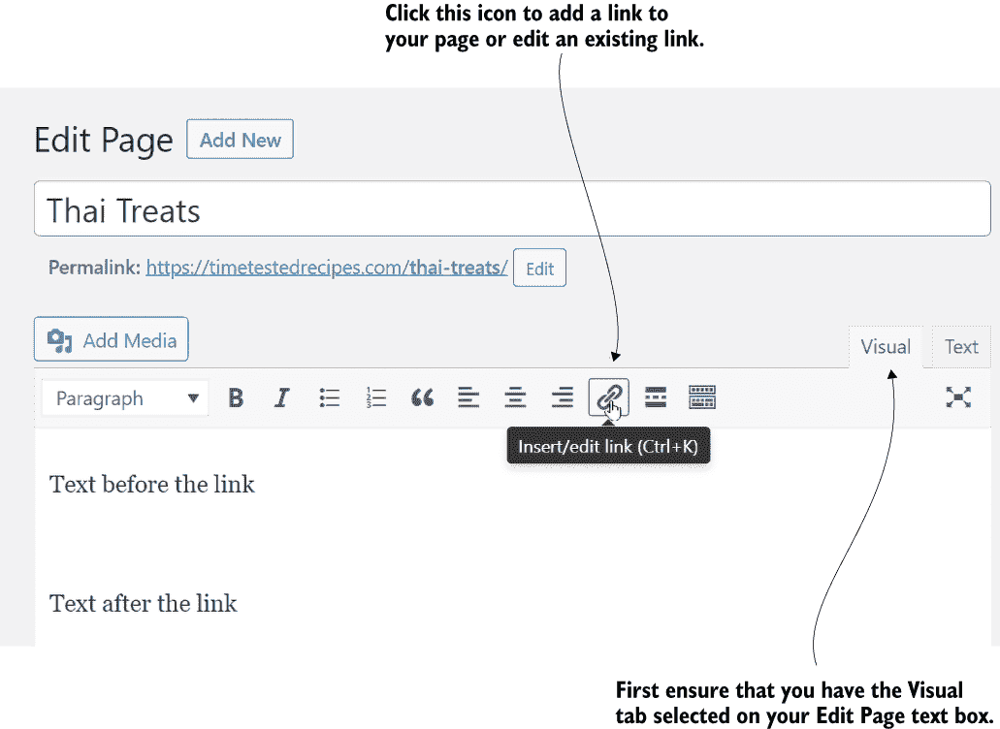

图 3.3 点击插入/编辑链接图标，在页面上放置链接。

提示：如果您的“编辑页面”屏幕看起来不像图 3.3 所示，您正在使用 Gutenberg 块编辑器。在您的页面上添加一个经典块，然后按照这些相同的说明操作。

6.  点击图 3.4 中显示的齿轮图标以打开插入/编辑链接模块。

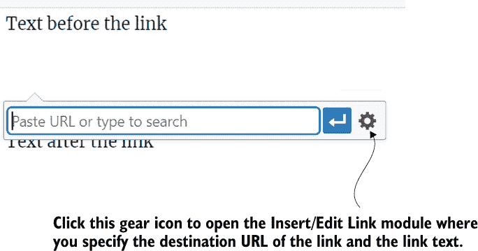

图 3.4 点击此齿轮图标将打开插入/编辑链接模块。

7.  您现在可以看到您网站上的页面和帖子列表。在链接文本字段中填写链接的标签，并点击作为链接目标的页面，如图 3.5 所示。

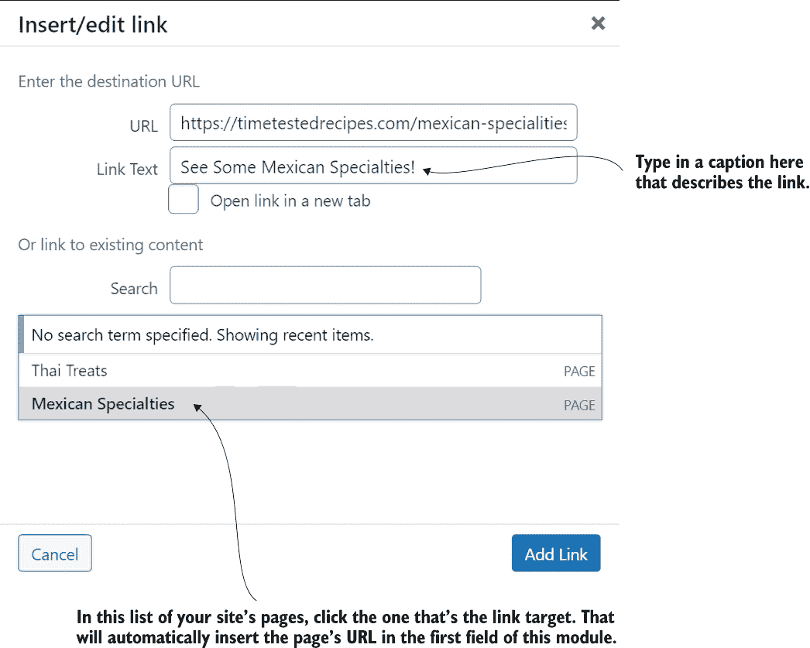

图 3.5 当您点击*墨西哥特色*时，WordPress 将填写该页面的 URL 地址。

8.  最后，点击添加链接按钮以保存链接。

9.  点击更新按钮以保存您对此页所做的修改。

10.  要查看实际的链接代码，并可能修改链接文本，请点击文本框右上角的上文选项卡。（如果您正在使用 Gutenberg，请按 Ctrl-Shift-Alt-M。）

链接的 HTML 代码看起来像这样：

```py
<a href="https://timetestedrecipes.com/mexican-specialties/">
See Some Mexican Specialties!</a>
```

我们将在创建不同类型的链接时稍后探索此代码。

提示 在 WordPress 的编辑页面和编辑帖子屏幕中，有一个文本框，你可以在这里添加文本或媒体内容。这些文本框在其右上角有两个标签：视觉和文本。视觉标签允许你看到的内容几乎与你的访客在网站前端看到的内容相同。然而，文本标签不仅显示内容，还显示告诉浏览器如何显示该内容的 HTML 代码，例如格式、粗体、链接、页面位置等。（Gutenberg 将文本视图称为*代码编辑器*，这是一个更准确的名称。）

链接到外部网站

要创建链接到其他网站，例如 YouTube，你遵循与之前在网站页面中链接相同的步骤。唯一的区别是在点击齿轮图标（步骤 6）后，你粘贴或输入外部网站的 URL 地址（见图 3.6）。并且，一如既往，不要忘记点击添加链接按钮。


图 3.6 在这里很容易添加 URL 地址和链接标签。

在不同页面内链接到某个位置

虽然链接到页面顶部更为常见，但有时你可能想将访客发送到第三段或到你网站上的某个特定图片。为了遵循这个例子，在你的练习网站上添加两个新页面，分别命名为泰国美食和墨西哥特色。

在这个例子中，我们的链接目标是墨西哥食谱页面中的第二段。而链接本身位于泰国食谱页面中。（如果你使用的是 Gutenberg 编辑器，请向你的页面添加经典块）。遵循以下步骤：

1.  前往墨西哥页面，在文本框右上角点击文本标签（在 Gutenberg 编辑器中，按 Ctrl-Shift-Alt-M）。然后，粘贴或输入两段随机文本。我们将创建一个目标为第二段链接：

*这是第一段。Lorem ipsum dolor sit amet, consectetur adipiscing elit, sed do eiusmod tempor incididunt ut labore et dolore magna aliqua.* *Ut enim ad minim veniam, quis nostrud exercitation ullamco laboris nisi ut aliquip ex ea commodo consequat.*

*这是第二段。Lorem ipsum dolor sit amet, consectetur adipiscing elit, sed do eiusmod tempor incididunt ut labore et dolore magna aliqua.* *Ut enim ad minim veniam, quis nostrud exercitation ullamco laboris nisi ut aliquip ex ea commodo consequat.*

2.  使用 HTML `<p>` 和 `</p>` 标签将第二段包裹起来，告诉浏览器将包含的内容显示为段落：

**`<p id="mextarget">`***这是第二段。Lorem ipsum dolor sit amet, consectetur adipiscing elit, sed do eiusmod tempor incididunt ut labore et dolore magna aliqua. Ut enim ad minim veniam, quis nostrud exercitation ullamco laboris nisi ut aliquip ex ea commodo consequat.***`</p>`**

注意跟随`<p`标签的`id="mextarget">` HTML 属性。这给段落赋予了一个名称。它标识了这个段落，以便我们可以将其作为我们接下来要创建的链接的目标。你可以将`id`属性命名为你想要的任何名称。

图 3.7 显示了你的 HTML ID 代码在文本框的文本（代码）标签中的样子。


图 3.7 目标 ID 放置在目标段落的开始处。

3.  点击更新按钮以保存这些更改。

4.  接下来，为了创建一个指向墨西哥页面的链接，你需要该页面的永久链接地址。因此，通过将鼠标拖过永久链接并按 Ctrl-C 来复制它到 Windows 剪贴板，如图 3.8 所示。

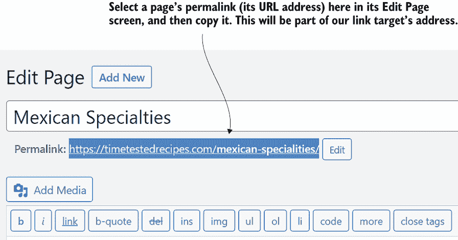

图 3.8 这里是你复制页面永久链接的位置。

在 Gutenberg 中查找永久链接

在 Gutenberg 中查找页面的永久链接是一项错综复杂的任务。首先，点击设置图标。它在右上角。设置图标之前看起来像是一个齿轮（Windows 中设置的传统符号），但现在它已经被改变成这个带有横线的矩形。那个符号代表什么让我感到困惑。

如果当前选中的是块标签（设置图标下方），请点击页面标签。现在通过点击其黑色三角形图标打开摘要部分。然后，找到并点击 URL。这打开了一个新的模块，你可以将鼠标拖过永久链接来选择它，并按 Ctrl-C 来复制它。如果直接在页面编辑器屏幕上显示永久链接可能会更容易，但这会违反 Gutenberg 编辑器 UI 所遵循的极简主义理论。该理论主张默认显示尽可能少的信息和选项。术语是*上下文相关*——这意味着只显示他们认为你可能需要的信息。因此，由于像永久链接这样的东西并不常用，你需要钻入 UI 的几个层级才能找到它。


这里有一个小技巧：点击查看页面选项以获取页面的前端视图。然后，只需从浏览器的地址栏中复制永久链接。

5.  现在，转到泰国页面以创建指向该 ID 的链接。在泰国页面的编辑页面文本框中点击文本标签，然后在文本框中添加此代码（但用你页面的永久链接替换）：

```py
<a href="https://www.timetestedrecipes.com
/mexican-specialties/#mextarget">
Visit the second paragraph in the Mexican recipes page</a>
```

让我们分解这段 HTML 代码：

o   `<a`是链接开标签的 HTML 代码。

o   `href="https://www.timetestedrecipes.com/mexican-specialties"`是你复制的永久链接，它指向墨西哥食谱页面。换句话说，这告诉链接，当点击时，要显示互联网上的哪个页面。

o   `/#mextarget">`是你为墨西哥食谱页面中你想要链接点击时跳转到的位置赋予的 ID。它是第二个段落的 ID。

o   `访问` `第二个` `段落` `在` `墨西哥` `食谱` `页面` 是你想要显示在链接上的标题。

o   `</a>` 是链接的结束标签。

提示 注意到在*链接*代码中，一个哈希符号（也称为井号`#`）被添加到目标 ID：`#mextarget`。在墨西哥页面上，ID 没有哈希符号：`mextarget`。

6.  点击更新按钮保存这些更改。现在，通过前往前端上的泰国页面来测试链接。你可以通过三种方式查看你网站的前端：通过点击仪表板左上角的网站标题，或者通过点击两个查看页面链接之一（一个链接如图 3.9 所示）。


图 3.9 有三种方式可以从网站的后端转到前端。

7.  点击链接，浏览器应该显示墨西哥页面的第二个段落，如图 3.10 所示。

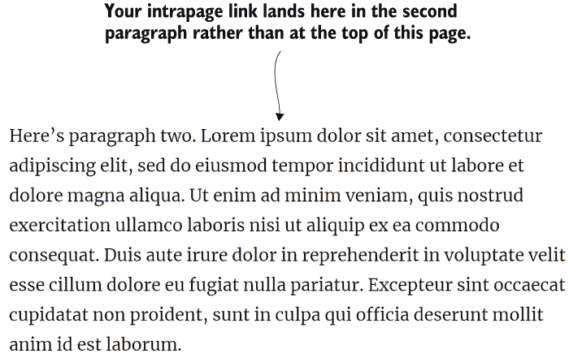

图 3.10 你直接跳到了页面内的一个段落，而不是页面的顶部。

调试 HTML

与一些计算机语言不同，HTML 在你提供有 bug 的代码时不会显示错误信息。它只是做一些奇怪的事情，比如显示 404 错误信息（页面未找到）。或者它可能就坐在那里什么也不做，嘲笑你。

计算机代码非常精确。一个错误的标点符号或打字错误，计算机就不会理解你要求它做什么。这意味着你需要追踪 bug。在我们之前的链接示例中，你可能从像 Microsoft Word 这样的源复制了代码，它使用的是花括号引号而不是直引号。

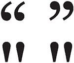

有两种类型的引号——直引号和（花括号或斜体）——HTML 想要的是直引号。

HTML 不喜欢花括号引号。它不知道它们是什么东西。

或者，你可能遗漏了一个>符号，或者在你应该包含引号的地方没有使用引号。解决 bug 的一种方法是对代码进行校对——仔细比较你的代码与本书中的代码。确保所有内容都完全相同（当然，除了你的 URL 地址）。但你可以使用一个有用的调试工具。

将你的墨西哥或泰国页面的永久链接粘贴到 W3C 标记验证服务([`validator.w3.org/`](https://validator.w3.org/))。

为了展示这是如何工作的，我在泰国页面上的链接中省略了第一个引号，验证器正确地报告说这部分代码（称为属性）未加引号。所以这是一个简单的修复：我只是添加了需要的引号。这个错误信息如图所示。


验证可以描述你 HTML 代码中的 bug。

然后，它还正确地标记了花括号引号，如以下图所示的错误信息。

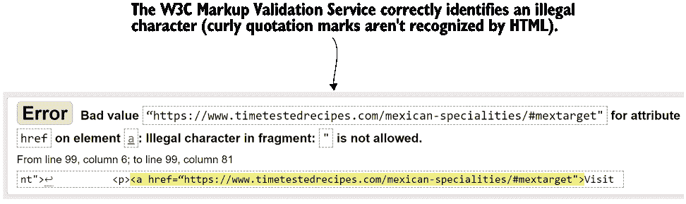

这个错误信息甚至显示了非法字符，即引号。

AI 辅助

AI 系统在调试代码方面很擅长。这段 HTML 代码中有两个错误：(1) 在 https 前面是斜体（花括号）引号而不是垂直引号，以及 (2) 结尾的 </a> 标签中缺少反斜杠 (/)：

```py
<a href="https://www.timetestedrecipes.com/mexican-specialties/#mextarget">
Visit the second paragraph in the Mexican recipes page<a>
```

因此，我让 GPT 找出这段代码中的错误并告诉我如何纠正它们。AI 在这个测试中得了 100%。它的回复是：

|


| 我已经识别了提供的 HTML 代码中的错误：href 属性的开头引号是一个花括号引号（“）而不是直引号（“）。锚标签的结尾缺少一个正斜杠 (/)。以下是修正后的 HTML 代码：<a href=”https://www.timetestedrecipes.com/mexican-specialties/#mextarget”>访问墨西哥食谱页面的第二段</a>所做的更改：将 href 属性中的花括号引号替换为直引号。在锚标签的结尾添加了一个正斜杠 (/)。 |
| --- |

链接到同一页面内的位置

这个链接比其他类型的链接简单，因为你不需要指定 URL 或永久链接。当链接代码中省略了 URL 时，HTML 假设你指的是链接目标位于与链接相同的页面内。

假设你在一个页面中有四个标题。在页面顶部，你添加了一个链接到第四个标题。

在页面的编辑页面屏幕中点击文本选项卡，然后在文本框中输入这四个标题：

```py
<h1>First</h1>
<h1>Second</h1>
<h1>Third</h1>
<h1>Fourth</h1>
```

接下来，在文本框的顶部输入链接：

```py
<a href="#fourth">Go to the fourth headline</a> 
<h1>First</h1>
<h1>Second</h1>
<h1>Third</h1>
```

最后，给第四个标题添加一个 ID 以标识链接的目标：

```py
<h1 id="fourth">Fourth</h1>  
```

小贴士：记住，你可以将 ID 命名为任何你想要的名称，但在 *链接* 中，你必须使用一个前置的井号 `#`。

点击更新按钮保存你的代码。现在当你通过点击查看页面来测试前端页面时，点击链接应该会带你到第四个标题。

### 3.5.3 使用按钮作为链接

到目前为止，你已经看到了如何创建文本链接。但你也可以将图片、按钮或其他视觉元素变成链接。让我们显示一个点击后会将访客带到 YouTube 的按钮。

HTML 有一个内置的按钮对象，所以你可以将其变成链接。记住，当你向网站上的页面添加代码时，你需要处于编辑页面屏幕，并点击文本框中的文本选项卡。（或者在 Gutenberg 中，按 Ctrl-Shift-Alt-M）。以下是按钮链接的 HTML 代码：

```py
<a href="https://www.YouTube.com"><button>Click to visit YouTube</button></a>
```

结果的链接按钮如图 3.11 所示。


图 3.11 默认的 HTML 按钮是一个相当简陋的黑色方块。

层叠样式表（CSS）是一种计算机设计语言，是一个强大的工具，可以让您以数百种方式修改和微调您网站的外观——从字体到淡入动画的一切。在第七章中，我们将探讨如何轻松地让计算机为您生成 CSS 代码。您根本不需要学习这种语言。但就目前而言，让我们快速看一下 CSS 如何让您能够润色设计元素。

那个醒目的全大写白底黑 HTML 按钮与许多——实际上几乎所有的——WordPress 主题不太搭配。它看起来不美观。因此，让我们添加一些 CSS 代码来使其不那么刺眼，如图 3.12 所示：

```py
<a href=https://www.youtube.com/
style="background-color: lightblue;
color: gray; padding: 10px;
border-radius: 5px solid gray;">
Click to visit YouTube</a>
```

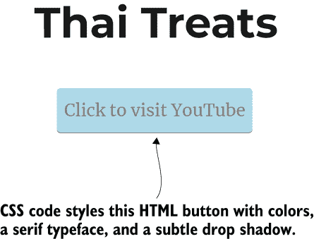

图 3.12 CSS 样式代码可以改善默认的 HTML 按钮，但您可以做得更好。

提示：如果您只使用`border`而不是`border-radius`，您将得到一个实心的框架。添加`radius`，您将得到更微妙、3D 的阴影效果。

HTML 属性的`style`代码实际上是使用 CSS 语言编写的。它与 HTML 一起工作，以指定事物的外观。CSS 还可以添加特殊效果，如动画、透明度、过渡淡入和其他酷炫视觉效果。幸运的是，对于我们的来说，CSS 相当容易理解，因为它与大多数计算机语言不同，它使用了诸如*border*、*color*和*background*之类的英语单词。当然，您始终可以向 Claude 或其他 AI 提交请求，以根据您的规格生成 CSS 代码。您将在第七章中了解更多关于 CSS 的信息，CSS 是任何网站设计师的重要工具。

那个蓝色的按钮比第一个按钮更上一层楼，但它仍然可以改进。为了创建一个逼真的按钮，您可以在像 Paint.NET 或 Photoshop 这样的照片编辑应用程序中创建一个按钮图像。或者，使用 Midjourney 这样的 AI 文本到图像应用程序。您甚至可以从 Pexels([www.pexels.com](https://www.pexels.com))或 iStock([www.iStockPhoto.com](https://www.iStockPhoto.com))购买按钮图标。然后，将按钮图像添加到您的网页上，并使其成为链接。以下是方法：

1.  前往媒体>添加新屏幕，并将您的按钮图像上传到 WordPress 媒体库。那里存储了您在页面上使用的图像和其他媒体。

2.  前往您想要创建链接的编辑页面屏幕。

3.  在文本框中点击视觉选项卡。

4.  点击添加媒体按钮，点击图片以选择它，然后点击插入到页面按钮。

提示：如果您使用的是 Gutenberg 代码编辑器，请按 Ctrl-Shift-Alt-M。这个快捷键可以在代码视图和视觉视图之间切换。现在，您想要在视觉编辑器模式下。然后，在页面上添加一个经典块。如果您在经典块的工具栏上没有看到菜单（文件、编辑、查看、插入等），请转到您的插件>添加新屏幕，并搜索、安装和激活高级编辑工具插件。在块的菜单上，选择插入>添加媒体（不是媒体选项）。从您的媒体库中选择您想要使用的图片。点击插入到页面按钮。

5. 在编辑页面屏幕中，点击图片以选择它。

6. 点击工具栏上的链接图标。

7. 输入 YouTube 的网址，然后点击左箭头图标以创建如图 3.13 所示的链接。


图 3.13 这就是如何将图片链接到 YouTube。

8. 点击更新以保存您的更改。

9. 点击查看页面以查看和测试链接，如图 3.14 所示。

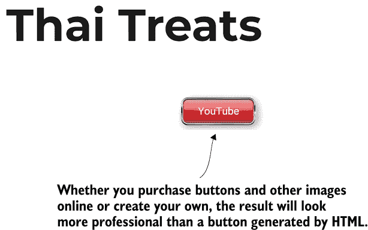

图 3.14 一个逼真的按钮图像比 HTML 按钮看起来更专业。

这是完整的 HTML 代码：

```py
<a href="https://www.youtube.com">
</a>
```

注意，这里不需要链接标签，因为单词*YouTube*已经嵌入到按钮图像中。

## 3.6 管理您的菜单

一个网站的菜单几乎总是关键导航系统，所以您想要做得正确。我们将通过构建食谱实践网站的菜单来结束本章。这包括选择和重命名主页，正确显示菜单上的子页面，并检查断链。

### 3.6.1 自定义您的菜单

您的菜单项顺序，以及在某些情况下菜单项的名称可能需要修改。但在做之前，让我们在实践网站上创建一些子页面。

提示：如果您使用的是 Gutenberg 编辑器，您将按照此处描述的经典编辑器的相同步骤创建您的菜单。Gutenberg 还包括一个导航菜单选项（在“外观”>“小工具”屏幕中作为一个小工具，以及在编辑页面屏幕中作为一个块）。它提供了几个选项，包括在侧边栏中显示所有页面的链接列表。

到目前为止，所有页面都是父页面。这些新的子页面将是空占位符页面。它们将有标题，但在创建网站结构之后，我们将向它们添加内容。所以，让我们向实践网站添加更多占位符页面。

前往您的页面>添加新页面屏幕，并添加七个新页面。给它们以下标题：

+   墨西哥菜

+   香辣泰国菜

+   中国菜系

+   法国美食

+   意大利食材

+   美味希腊菜

+   博客

目前，我们将仅专注于填写标题字段，并不要在这些占位符页面上添加任何内容。别忘了为每一页点击发布。

人工智能助手

如果您需要一些构思良好子页面的帮助，您可以询问 GPT 以下内容：

|


| 作为一位墨西哥餐厅的专家厨师，请列出六个墨西哥菜的子类别（例如，例如德克萨斯菜）。不要根据地理位置创建类别。 |
| --- |

GPT 的建议：

|


| 当然！墨西哥菜系丰富多样，尽管无法仅用几个子类别来归类其所有细微差别，但以下有六个大致类别：街头食品开胃菜和小食莫莱萨酱和酱汁沙司海鲜色拉烤菜和炖菜甜点和糖果 |
| --- |

在创建我们的菜单之前，还有一些家务事要处理。WordPress 默认将博客页面设为主页。但针对实践网站，你希望博客成为一个内部页面。（博客是一种特殊的页面，包含你或访客发布的所有消息。它们以可滚动的、逆时间顺序显示。我们将在下一章中处理博客页面。）

前往“文章”>“新建文章”，输入一个标题和一些用于占位符的文章文本。这将导致 WordPress 为你完成创建博客页面的过程。点击“发布”按钮。

在此阶段，将博客改为内部页面。如图 3.15 所示，前往你的“设置”>“阅读”屏幕，点击“静态页面”选项，并将“ Instant Pot 的即时食谱”作为主页选择。选择“博客”作为博客页面。点击“保存更改”按钮。


图 3.15 这里是你指定网站主页的地方。

当你首次开始一个新的 WordPress 网站，你给网站一个标题。如果你为这本书设置了实践网站，你将在附录中将实践网站命名为“ Instant Pot 的即时食谱”。WordPress 自动将主页标题与网站标题相同。（每个网站都有一个主页。）但你应该更改默认的主页标题。这是多余的。因为网站标题出现在每个页面上，主页不应该与网站标题相同。

因此，前往你的“页面”>“所有页面”屏幕，点击“ Instant Pot 的即时食谱”以打开其编辑页面屏幕。将主页标题更改为“简易卓越”或你喜欢的任何名称。点击更新按钮。

快速查看你的“页面”>“所有页面”屏幕。注意，WordPress 已经将“博客”识别为博客页面，将“简易卓越”识别为前台（主页），如图 3.16 所示。

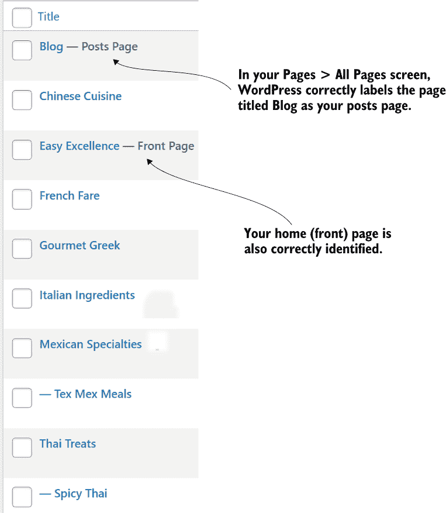

图 3.16 WordPress 已经识别了你的主页（前台）和博客页面，并缩进了子页面。

在构建网站菜单之前，你还需要完成最后一项工作：你需要将“Tex Mex Meals”和“Spicy Thai”转换为子页面。转到“页面”>“所有页面”，双击“Tex Mex Meals”。为了使其成为“墨西哥特色”父页面的子页面，找到“页面属性”模块，然后点击下拉箭头打开父菜单。点击“墨西哥特色”。点击更新按钮，如图 3.17 所示。按照相同的步骤将“Spicy Thai”设置为“泰国美食”的子页面。


图 3.17 这是你分配子页面给其父页面的地方。实际上，你在这里创建了父/子页面关系。

在用占位符填充了网站后，你现在可以将注意力转向组织和自定义菜单。转到“外观”>“菜单”屏幕。

由于我无法理解的原因，WordPress 默认在“添加菜单项”模块中只显示最近添加的页面。幸运的是，WordPress 中这类用户界面错误非常罕见。但你应该记住这一点：每次你访问“外观”>“菜单”屏幕时，请首先点击“查看全部”标签，如图 3.18 所示。

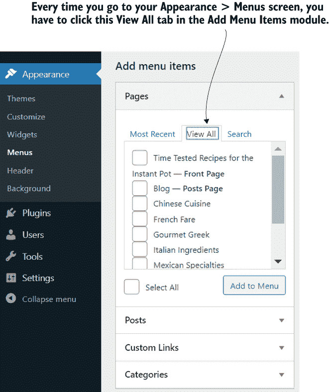

图 3.18 一定要记住首先点击这个“查看全部”标签。

在“菜单结构”下，输入一个菜单名称，例如“主菜单”，然后点击“创建菜单”按钮。你希望所有页面都在菜单中，所以点击“添加菜单项”模块中的“全选”框，如图 3.19 所示。然后，点击“添加到菜单”按钮。菜单结构模块将填充你的页面标题。点击指定此模块下的“主菜单”选项。这将使这个新菜单位于每个页面的顶部附近。你可以选择将菜单放置在哪里取决于你的主题（或你安装的菜单插件）提供的选项。


图 3.19 将所有页面添加到菜单中。

### 3.6.2 创建子页面菜单链接

将菜单项拖放，使你的菜单结构看起来像图 3.20。要将菜单项改为子菜单（换句话说，将其显示为子页面），将其稍微向右拖动，然后放下，使其缩进在父菜单项下。

这个操作需要一些习惯。在图 3.20 中，注意当你将菜单项向右拖动时出现的虚线框。这个框是你想要放下“Tex Mex Meals”子菜单项的目标。

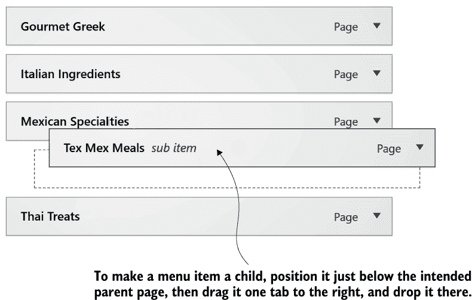

图 3.20 要创建一个子菜单（子菜单）项，将子菜单拖动到一个标签上，然后放下。

小贴士 如果你发现将子菜单向右拖动一个标签有挑战性，你可以点击子菜单框右侧的黑箭头图标来打开其模块。然后，点击图 3.21 中显示的“移动到下级”链接。


图 3.21 你可能会觉得这个链接比在下一个标签中添加菜单项更容易。

为了完成菜单，我们需要缩短菜单项的名称（WordPress 中称为*导航标签*）。对于每个菜单项，点击其框右侧的黑箭头图标以打开其模块。将标签重命名为如下：`首页`、`中文`、`法语`、`希腊语`、`意大利语`、`墨西哥语`和`泰语`。菜单简洁是我们的目标。

注意，你必须将“简易卓越”重命名为“首页”，因为这是惯例。人们期望第一个菜单项被命名为“首页”，并且位于菜单栏的左侧。完成的菜单结构应如图 3.22 所示。


图 3.22 完成菜单

点击“更新菜单”按钮，然后点击左上角的网站标题“Time Tested Recipes for the Instant Pot”，以查看前端菜单，如图 3.23 所示。回想一下，点击网站标题是快速在后台和前端之间切换的方法。

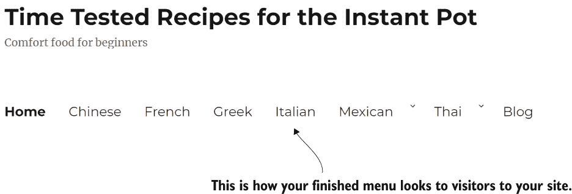

图 3.23 完成菜单的前端视图

这里有两点需要注意。Twenty Sixteen 主题在菜单上提供了两个不显眼的视觉提示：当前显示的页面菜单项为粗体（在本例中为“首页”），墨西哥和泰国的项目有小的向下箭头图标，让人们知道这些项目有子页面。

警告：没有比死链接更能清楚地说明“不专业”和“不可靠”的了。确保所有链接实际上都指向真实的目标，而不是触发“页面未找到”错误消息。要测试小型网站的链接，您可以手动点击它们的前端。大型网站可以使用 Google 搜索控制台插件。或者使用这个在线检查器：[www.brokenlinkcheck.com/broken-links.php](https://www.brokenlinkcheck.com/broken-links.php)。我们将在下一章中探讨插件。

本章全部关于初步规划：你的网站目的是什么？它的层次结构是什么？我们还探讨了链接和菜单等工具，这些工具将使访客尽可能容易地遍历网站结构。

因此，现在我们已经在我们练习网站上创建了占位符页面，是时候用内容填充它们了。我们将从文本内容开始。大多数网络写作都需要特殊的语气和风格。正如你将在下一章中看到的，AI 擅长将你的初稿变成出色的、适合网络的散文。

## 摘要

+   在向网站添加内容之前建立网站蓝图和最终目标非常重要。这有助于你保持对网站目标的关注，并有助于实现统一的设计和高效的网站导航。

+   在规划网站时，蓝图的一部分是创建具有父页和子页的层次结构。这导致了一个更简单的菜单，它只显示主要（父）类别并隐藏次要（子）页面——只有在访客将鼠标指针悬停在父页上时它们才会可见。

+   避免使用长滚动页面——它们效率低下，可能会让访客感到烦恼。滚动并扫描标题以找到感兴趣的内容，比阅读菜单要麻烦得多。

+   链接是关键导航工具，正确使用它们可以降低您网站的跳出率，并提高您行动号召的成功率。

+   请特别注意您的菜单，它是网站的主要导航工具。菜单上只显示少量项目，并保持每个菜单项的长度简短。
