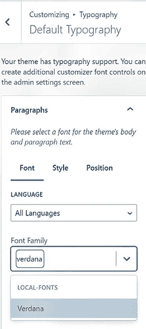
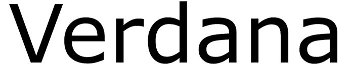
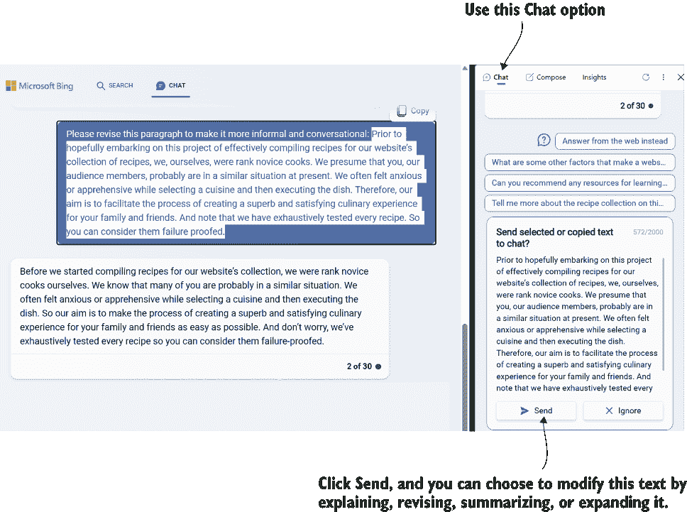
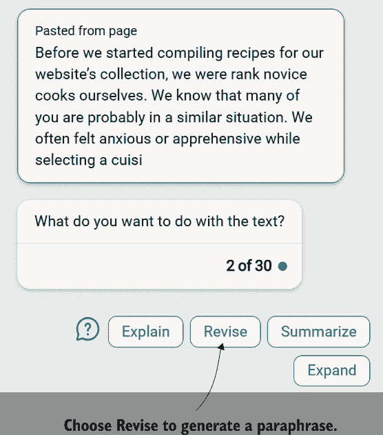
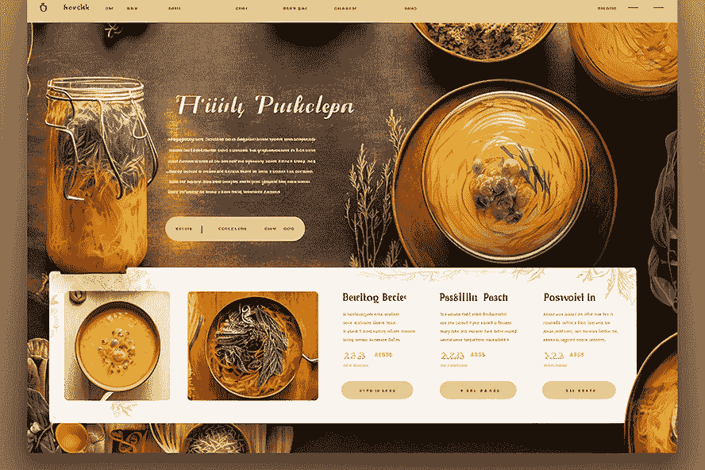
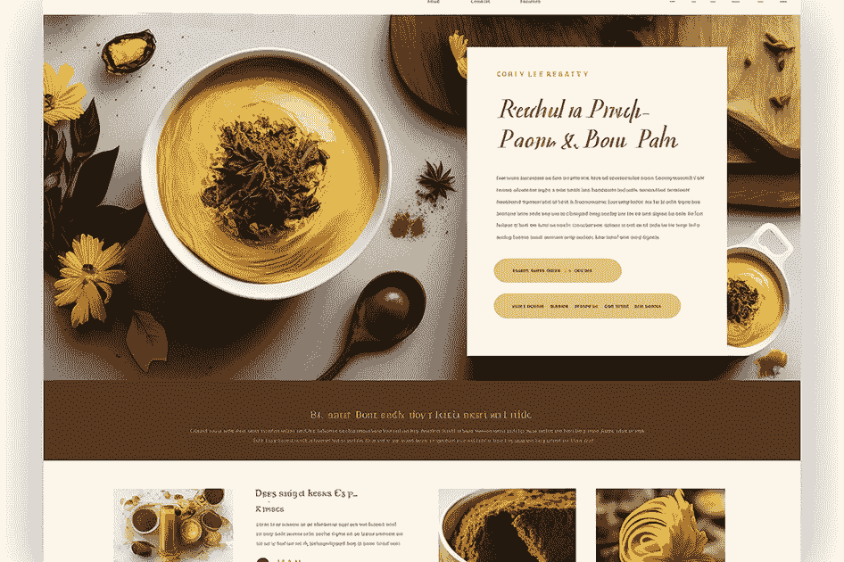

# 4 AI-powered writing

本章涵盖

+   选择合适的排版

+   理解网站写作风格

+   用出色的主页吸引访客

本章重点介绍您网站的文本内容。AI 可以在细节上协助您，例如选择合适的字体，以及您写作的整体质量和风格。当拼写检查器出现时，我们不再需要擅长拼写。有了 AI，我们也不再需要擅长写作本身！

在本章的后面部分，您将把您的文本提交给一个 AI“海明威”。我想您会对这位著名作者的技术如何提高您的写作感到惊讶。我也是。这个 AI 将帮助您使句子更加清晰、有力且美观。

首先，您当然希望找到最佳的字体和文本设计。您可以选择字体大小、字体家族（例如 Times Roman）、字体样式（正常或斜体）、粗细（例如**粗体**与常规之间的区别），以及其他如字母间距和行高之类的特性。您选择的主题提供了一些默认设置，但您应该根据您的话题和受众进行微调。

此外，您还需要考虑您写作的语气和风格。大多数现代网站都采用轻松、对话式的风格。因此，如果您来自法律、学术或其他正式写作背景，您将在本章中学习如何放松您的写作——如何掌握一种不同、更对话式的写作方法。AI 可以帮助您重写文本，使其更加随意，更吸引普通人。

最后，我们将探讨通过制作一个出色、无法抗拒的主页来吸引访客注意力的方法——这是访客首先看到的页面。研究表明，平均而言，人们在 0.05 秒内就会决定是否留在主页上！因此，访客的第一印象至关重要。这显然是一个“封面决定书”的案例。AI 在这方面也会非常有帮助，确保您留下自信、积极的第一个印象。

## 4.1 选择最佳排版

大多数人并不真正了解排版，甚至没有考虑过它。但在某种程度上，它对他们有影响。为您的网站正文、标题和字幕选择一个吸引人、易读的字体和字体大小。

最重要的排版考虑因素是*可读性*。您希望显示足够大的字符以便于阅读。屏幕上的字体大小通常以*像素*为单位。

定义：*像素*或*px*（图像元素）指的是最小的视觉单位，数字显示屏上的单个点。但像素不是一个固定的大小，就像英寸一样。它是相对的。像素大小相对于整个屏幕的大小。因此，足球场上的巨幕屏幕会有砖块大小的像素，但平板电脑的像素可能太小，以至于肉眼无法看到。像素是您通常通过非常靠近大屏幕电视才能看到的那个单点颜色。

### 4.1.1 理解人工智能多模态

目前，*多模态*是人工智能研究的一个活跃领域。想法是，像 GPT 这样的大型语言模型不仅应该从文本输入中学习，还应该从其他模态中学习，包括视频、图形、音乐，甚至是交通摄像头，或任何其他信息来源。换句话说，它们应该以人们的方式从现实世界输入中学习（只是比我们学习得快得多，而且永远不会忘记）。人脑每秒大约工作几百次循环。计算机则做几十亿次。

目前，文本到图像生成器如 Midjourney 通过从互联网收集图像来学习，并将这些图像与文本（例如，通过存储它们捕获的标题来标记图像）结合起来。大型语言系统如 GPT 从互联网和其他数据库中抓取文本。然而，目标是让人工智能系统从各种信息中学习。

随着 GPT 4o（“o”代表*全功能*）的推出，GPT 通过在其学习中包含图像和视频，引领了人工智能的潮流。但其他人工智能都在向多模态输入和输出发展。

一个持续研究的相关领域是允许用户向人工智能系统提交多模态提示。在有限程度上，当前的文本到图像系统允许这样做。你可以向 GPT、谷歌的 Gemini 和 Midjourney 上传图像，以及文本提示。然后，人工智能根据图像和文本生成其输出。在某些系统中，可以根据滑动条调整输出与提交图像的相似程度。Midjourney 还允许你提供图像作为角色参考（内容）和/或风格参考。

但多模态*输出*怎么办？如果你想要提出这样的请求：

|

| 请描述针对儿童网站的三种最佳正文字体，并展示这些字体如何显示的图像。 |
| --- |

目前，唯一能够提供文本描述并显示相关图像的人工智能是 GPT、Gemini 和 Perplexity ([`perplexity.ai`](https://perplexity.ai))。其他，例如 Claude 和 Copilot，正在努力实现这一目标。Claude 对那种提示的当前响应是提供文本，并附上图像链接。

### 4.1.2 选择最佳字体大小

对于网站的正文字体，推荐在电脑显示器上查看文本的像素大小在 16 像素到 18 像素之间。（好的主题会在检测到网站在平板电脑或手机上查看时自动调整字体大小。）

但如果你的正文字体较细，你可能想稍微增加一点像素大小。此外，研究表明，如果你的网站包含大量文本段落，你应该选择 18 像素或更大的尺寸以提高可读性([`mng.bz/JNKZ`](https://mng.bz/JNKZ))。

但请记住，大多数网站的文字不应该太密集。当在线时，大多数人就像跳蚤一样——如果感到无聊、困惑或遇到一堆灰色文字时，会很快跳到别处。

小贴士：要查看和修改您网站字体的尺寸、字体和其他元素，请访问您网站的“后台”（WordPress 控制台），点击外观 > 定制 > 字体。它可能被称为其他名称，例如“字体”或“文本”。它被称为什么以及在此处显示的信息取决于您的主题或如果您安装了字体插件。

您还应该根据两个额外因素来选择字体大小：行高和字体。*行高*是文本行之间的空白量。它以字体大小的倍数指定，1.5 或 2 是最常见的值。如果太小，文本可能难以阅读；太大，文本看起来断开，好像它原本打算是一个项目符号列表，但项目符号却不见了。

添加大量字体

要向您的网站添加大量字体，我建议您转到“插件”>“添加新插件”屏幕，搜索、安装并激活由钛主题提供的出色的 Easy Google Fonts 插件。或者，搜索“字体插件 | Google 字体排版”。然后，您可以去“外观”>“定制”>“字体”屏幕，从数百种 Google 字体中选择！找到适合您网站设计的字体。以下图示说明了如何使用此插件选择字体。

Google 字体插件包含数百种字体供您选择。

注意，Google 使用“字体族”这个术语，而我们称之为“字体”。

### 4.1.3 选择字体

在婚礼策划网站（模仿人类手写的书法或手写体字体）中效果很好的字体，对于像迪克这样的体育用品店来说就不适用了。而正式、保守的 Times Roman 衬线字体对于医院和银行网站来说最为合适，在这些网站上必须传达可靠性和可信度。然而，大多数网站应该选择无衬线字体（普通、无卷曲、行宽变化很小）。流行的无衬线字体选择包括 Arial、Verdana 和 Helvetica。

小贴士：术语“字体”、“字体”和“字体族”经常互换使用，但我们将使用“字体”来指代字母的整体设计，即它们的形状（如 Arial 或 Times Roman），当描述字体的品质，如字体大小或字体样式时，我们将使用“字体”。有数百种具有各种特征的字体可供选择：粗细不一；线条形状和粗细各异；简约或华丽；卷曲；方块；几何；甚至有奇怪的、专业的字体，其特征是蜘蛛网以显得恐怖或由跳舞的腿组成的字符以暗示小丑。

然而，一些研究表明，三种字体在数字屏幕上尤其易读：Consolas、Cambria 和 Verdana。但其中只有一种是明显的赢家。

Consolas 是常用于编程代码的字体。但由于可读性并非唯一标准（Consolas 的可读性相当好），Consolas 应该避免使用，因为它只是不够吸引人。Cambria 也是可读的，但它是一种衬线字体（有卷曲），一些研究表明你应该避免在网站正文中使用。

获胜者 Verdana 是专门为屏幕阅读设计的。1996 年为微软创建，它拥有干净、简单的线条。它很受网站设计师的欢迎。字符相对较宽且间距较大。它是许多网站的最佳选择。

Verdana 很微妙。它有一些轻微的曲线和扩张的线条末端，以及某些字母的线条粗细变化（见图 4.1 中的小写字母），这使得它比传统的无衬线字体看起来更加柔和、更加放松。您可以在图 4.1 中看到 Verdana 的实际应用。

图 4.1 Verdana 的简洁简单设计使其在各种屏幕尺寸上易于阅读，并且是许多类型网站的优秀选择。

### 4.1.4 十种流行字体

以下列表包括 10 种流行字体，展示了不同外观的范围——从传统和正式到反传统：

+   Helvetica—一种干净现代的无衬线字体，广泛应用于印刷和网站正文文本。

+   Times New Roman—一种经典的衬线字体，通常用于正式文件或需要传达稳固和保守主义的网站。

+   Futura—一种具有独特和未来感的几何无衬线字体。

+   Bodoni—18 世纪设计的高对比度衬线字体，至今仍常用于标题和副标题。然而，网站标题通常使用无衬线字体。

+   Garamond—一种优雅且永恒的无衬线字体，最常出现在书籍和其他印刷材料中。

+   Impact—一种醒目且引人注目的无衬线字体，非常适合广告和网站标题。

+   Comic Sans—一种轻松且非正式的字体，常出现在儿童书籍和奇思妙想的网站设计中。

+   Optima—类似于 Verdana，它是一种优雅、平衡的混合字体，包括衬线和无衬线设计的元素。它多功能且被认为相当易读。

+   Arial—一种流行且多功能的无衬线字体，在各种环境中经常出现在计算机屏幕上，包括网站。

+   Brush Script—一种手写草书字体，具有手绘和艺术感，用于标志、品牌和婚纱店、餐饮和时尚等网站。据说它能传达优雅和精致。

您的网站主题通常指定了默认的大小、行高和字体。但如果它没有指定，浏览器有自己的默认设置，通常是 16 像素的通用无衬线字体用于正文文本。

你还可以使用 CSS 代码来修改你的字体值（实际上 CSS 可以几乎自定义网站中的任何其他设计功能，无论主题默认值如何）。在第六章中，我会向你展示一个自动生成 CSS 代码的优秀插件。因此，你不需要学习 CSS 语言来微调你网站的外观。

在指定字体质量时，最后一个基本考虑因素是其颜色，更确切地说，是颜色的*色调*。每种颜色从柔和色调到非常深色调都有。就像粉色是红色的一种浅色调。它们是相同的颜色，但暗度不同。

一些设计不佳的网站在深色背景上使用深色字体颜色，或者相反——浅色对浅色。显然，这种缺乏对比使得文本难以阅读。这对视力不好的人尤其令人沮丧。文本应该与背景形成对比。这通常意味着黑色或深色文本与白色或浅色背景。最佳选择通常是传统的可靠的黑白色。背景不应*与文本竞争*——所以不要在文本下方放置壁纸或鲜艳的图像。在背景等事项上，微妙是首选的。

人工智能可以帮助你查看一些优秀网站的设计示例。例如，向 GPT 等 AI 平台提交以下请求：

|

| 请列出两个特别有效利用排版的网站的地址。并列出该排版的元素，如行高、字体名称、字体大小等。 |
| --- |

### 4.1.5 排版清单

以下清单包括一些额外的排版细节，你应在网站亮相之前根据需要调整：

1.  在不同设备和屏幕尺寸上检查你的排版，以确保可读性。

1.  你的标题应该有助于建立网站信息的清晰层次结构。标题和副标题应该容易区分（通常通过大小或粗细），以及与正文文本区分开来。标题总结并介绍随后的文本。

1.  使用一致的排版。这意味着在整个网站上使用相同的尺寸、字体和颜色，以创建统一的视觉和感觉。

1.  确保你的排版对所有人都是可访问的，包括那些有视觉障碍的人。因此，选择易于阅读的字体。我们将在下一章中查看一些可访问性测试工具。

1.  排版会影响页面加载速度。一些字体比其他字体更复杂，加载时间更长。并不是每个人都有高速互联网连接。使用 IsitWP 免费在线工具测试你的网站：[`mng.bz/q0gx`](https://mng.bz/q0gx)。

1.  如果你计划用多种语言展示你的网站，请选择提供这些语言版本的字体。

### 4.1.6 获取人工智能对你排版的客观意见

在您选择了并应用了字体大小、字体样式、颜色、行高和字母间距后，将您的网站提交给 AI。我询问了 Perplexity 对宠物领养网站字体的看法：

|

| 请告诉我您对这个网站字体的优缺点看法：sitename.com。 |
| --- |

它通过提醒我，作为一个非人类，它没有个人观点来回应：

|

| 作为一个人工智能助手，我没有个人观点。然而，我可以为您提供您提供的网站所使用的字体的客观分析。 |
| --- |

然后它告诉我了它的观点。结果证明，这些观点实际上是有用且准确的，尤其是缺点和最后的总结。有了 AI 作为您的助手、编辑、设计评论家和全能的博学者，它可以从许多方面为您的网站提出坚实的改进建议：

|

| 网站的字体简单易读。使用的字体是无衬线字体，这是网站流行的选择，因为它看起来干净现代。字体大小也很合适，使得在桌面和移动设备上阅读文本都很方便。优点：字体的易读性和适用性适合网站的内容。使用无衬线字体使网站看起来现代且干净。字体大小适合桌面和移动设备。缺点：字体的独特性和记忆性不强，这可能会使网站与其他宠物相关网站相比缺乏特色。在网站上对字体的使用有限，以创建层次或视觉兴趣。例如，没有使用粗体或斜体文本来强调重要信息或创造对比。总的来说，网站的字体功能性强且适合内容，但在创造更具特色和视觉吸引力的设计方面仍有改进空间。 |
| --- |

Claude 的回应也很有帮助。首先，它警告我可能会产生幻觉，但在礼貌地犹豫之后，它给了我一些好的建议：

|

| 这里是我对网站字体的评估：优点：使用简单、干净的 sans-serif 字体用于标题和正文（看起来像 Roboto）。这使网站具有现代、友好的氛围。标题大而粗，易于扫描。正文大小和行距适中，便于阅读。深色文本和浅色背景之间有良好的对比度，增强了可读性。缺点：使用的字体缺乏个性 - 它们是安全且通用的选择。使用更具特色的字体可以使品牌更加突出。正文段落非常长。将这些段落分成较短的段落可能有助于提高可读性。文本对齐是齐行的，这可能导致单词间距不均匀。左对齐的文本通常更容易阅读。在宽屏幕上，行长度变得非常长，这使得从一行到另一行的跟踪变得困难。总的来说，字体完成了任务，但仍有改进的空间。我建议使用更具特色的标题字体，缩短段落长度，左对齐文本，并设置最大行长度。这些变化可以使字体从可用变为惊艳。请告诉我你是否需要其他建议！ |
| --- |

和往常一样，你可以提出后续问题以获得更具体的建议：

|

| 克劳德，你建议使用哪些替代字体来增加它的个性？考虑到这个网站的主题。 |
| --- |

|

| 这里有一些字体建议，可以为网站注入更多个性，同时仍然适合宠物/动物主题：Raleway - 这种优雅、细长的无衬线字体比 Roboto 更具个性。它的曲线和夸张的笔画增加了俏皮感。Montserrat - Montserrat 具有圆润、圆润的外观，灵感来自城市和涂鸦风格。它休闲但充满活力的氛围可能与宠物相得益彰。Playfair Display - 一种衬线字体，但具有弹性和友好的字母形状。它的对比和斜向强调使其具有适合动物的有机感。Libre Baskerville - 一种温暖、坚固的衬线字体，具有微妙的圆角。其遗产风格带来一丝古典主义，同时感觉像狗耳朵和被爱抚的。Happy Monkey - 一种具有有趣、圆润、猴子扳手启发外观的显示字体。可能对于正文来说过于俏皮，但可以很好地用于标题。Rock Salt - 手写、粗糙的边缘使这种字体充满个性。传达了宠物和动物的定制、个人性质。请告诉我你是否需要其他关于字体配对或网站风格的建议！我很乐意提供更多字体建议。 |
| --- |

我认为前三个建议值得考虑。但随着我们向下移动列表，它们变得越来越具有幻觉性。请注意，由于该网站有与宠物相关的内容，一些比字体更相关的动物修饰语悄悄地出现了：*活泼的*、*充满活力的*、*弹性的*、*磨损的*和*猴子的*。公平地说，寻找潜意识传达这些术语的字体对于宠物收养网站来说确实有一定的意义。

Gemini 也提出了一些好的想法，大部分与 Perplexity 和 Claude 的思路相同。但 Gemini 增加了一条独特的建议：“在大多数情况下避免使用全大写字母。全大写字母可能难以阅读，并可能使文本显得具有攻击性。”

Copilot 给出了这个简短但准确的回应：

|

| 字体清晰易读。字体大小足够大，便于阅读，并且整个网站上的字体风格保持一致。该网站还使用了无衬线字体，这是网页设计的一个好选择，因为它比衬线字体更容易在屏幕上阅读。 |
| --- |

小贴士有时向几个 AI 系统提交相同的提示以获得各种意见可能是个好主意。这不仅给您提供了一种共识，还有助于核实事实。

## 4.2 以正确的风格写作

人工智能可以在提供适合您网站整体使命的内容方面提供很大帮助。它还可以改善您的风格、语气、过渡以及许多其他风格元素。以下是一个您可以修改后提交给 GPT-4o 的提示（GPT-4o 能够永久记住事物）：

|

| 将以下内容牢记于心：当未来我以“:Edit:”开头向你发起提示时，你是一位非虚构作品的专家编辑。你既要进行抽象的大纲编辑，也要进行校对和校稿。请记住，我想要的是清晰、友好、非正式的对话风格。我还希望内容简洁。你应该仔细阅读，然后重新阅读我上传给你的文本或粘贴的文本，然后回答以下问题（为每个答案提供一个标题）。如果你没有在文本中找到与任何一个问题相关的问题，只需跳过它，继续下一个问题。在展示你的回答之前，请检查以确保其准确性、简洁性，并且不包含任何微不足道或不重要的建议。请注意，每个问题都有编号。你可以对每个问题有多个回答。或者，如果你没有找到问题所要求的内容，你可以跳过该问题。进行缓慢、细致的分析，否则可能会有后果。    1.  如果你发现任何非非正式或过于技术性的文本，请用引号标出该文本，然后跟随一个非正式的修订版本。    2.  如果你发现任何句子过长或过于复杂，请用引号标出该文本，然后跟随一个将过长句子拆分的修订版本。    3.  如果你发现任何文本可以通过比喻或类比来使观点更清晰，请用引号标出该文本，然后跟随一个包含有用比喻或类比的修订版本。    4.  检查是否有任何文本你认为是模糊的，如果是，请用引号标出该文本，然后跟随一个更清晰的修订版本。    5.  如果你发现文本中有需要过渡的地方，即主题突然切换到另一个主题，请用引号标出该文本，然后跟随一个包含良好过渡句子的修订版本。    6.  如果你看到任何需要具体例子来解释的抽象概念，请用引号标出该文本，然后跟随一个包含具体例子的修订版本。    7.  仔细审视文本中的断言，如果你发现任何可以通过支持事实（如统计数据）来加强的，请用引号标出该文本，然后跟随一个包含支持事实的修订版本。    8.  如果你认为文本中的某个段落可以通过图像、图表或其他视觉元素来改进，请用引号标出该文本，然后跟随一个包含有助于说明该段落的良好视觉元素的修订版本。    9.  如果你发现一个包含对某事物负面描述的段落（例如，“这不容易”），请标出该文本，然后展示相同概念但用积极语句表达（“这很容易”）。  10.  如果我没有上传文本给你，请显示“请粘贴你想让我分析的文本。”然后等待我粘贴文本后再继续。 |
| --- |

### 4.2.1 确定基调

网站内容大多是对话性和非正式的。使用你通常和朋友交谈时的语气和措辞。如果你对我的上一句中使用*like*感到不满，那么在为网络写作时你需要轻松一些。对话性写作允许在措辞和语法上有些非正式。（严格的语法学家会坚持认为上一句中的*like*应该被*that*或*as*等词替换。）

所以，如果你有法律、校对或学术背景，或者倾向于写正式的散文——你可能需要追求许多网站典型的更随意的沟通方式。当然，总有例外。用于法律、银行、医疗或教育目的的网站可能需要更正式的“正确”风格。这些网站需要传达可靠性、权威性和严肃性。一点*冷漠*的感觉也无妨。但大多数网站应该追求轻松、友好、可接近的语气。

### 4.2.2 转变僵硬的段落

记住，你网站首页的第一段对于吸引观众至关重要。你希望让他们感到欢迎，从一开始就让他们感到舒适。让我们尝试写一个刻板的、正式的介绍作为我们的第一段，然后请 GPT 将其修改为一个更温暖、更口语化的版本。这本书的食谱实践网站首页标题是“简易卓越”，所以这里有一个自负的第一段，充满了夸夸其谈：

在我们有望开始这个项目，为我们的网站食谱集合有效地整理食谱之前，我们自己也是初出茅庐的厨师。我们假设你，我们的观众，现在可能处于类似的情况。我们在选择菜肴并执行菜肴时常常感到焦虑或不安。因此，我们的目标是帮助你为你的家人和朋友创造一个出色且令人满意的烹饪体验。并且请注意，我们已经对每个食谱进行了彻底的测试。所以，你可以认为它们是经过验证的，不会失败。

相当拘谨，不是吗？在这种情况下，AI 可以非常有帮助。当我们要求它重写我们的段落以使其不那么正式时，它提出了以下内容：

|

| 在我们开始为这个网站整理这些食谱之前，我们在厨房里几乎一无所知！也许你能理解那种感觉？当我们不得不选择晚餐吃什么时，我们会感到压力很大，甚至在烹饪时更是如此。因此，我们的目标是让你轻松地为你的朋友和亲人做出一些令人惊叹的美味佳肴。这些食谱简单但很棒！而且它们不会让你失望——它们已经经过广泛的测试。 |
| --- |

### 4.2.3 召唤一个模拟体

记得我们可以为 AI 分配角色来扮演，比如网站评论家或获奖网站设计师。这也意味着我们可以让它召唤出已故的名人。让我们请一个 AI 海明威给我们一些建议，关于如何改进我们的散文。

海明威的风格因其清晰和简洁而仍然具有巨大的影响力。（1935 年的书籍《风格要素》也倡导一种类似干净、清晰的文章写作方法。该书于 1935 年出版，至今仍在教授。）海明威建议以下事项：

+   创建一个简短有力的第一段。努力工作；这是吸引读者的钩子。

+   保持句子简短。当被要求用六个词讲故事时，海明威写道：“出售：婴儿鞋，从未穿过。”

+   使用积极的短语，而不是消极的短语。例如，使用*简单*而不是*不难*。你应该使用描述想法的术语，而不是其对立面。

+   修改，然后再修改。 “我写了一页杰作，九十一页垃圾。我试图把垃圾扔进垃圾桶。”

他们说海明威将《永别了，武器》的最后一页重写了 39 次。一位采访者问他问题所在。他说，“把词写对。”特鲁曼·卡波特也以其精致、完美的句子而闻名。

Copilot 提供与风格相关的三个设置

如果您使用这样的提示，Copilot 将提供良好的修改：

|

| 请修改以下段落，使其更加非正式和对话化。此图显示了三种风格选项。 |
| --- |

此外，当您在右侧侧边栏中选择聊天时，Copilot 也会在那里提供修改选项。要使用该选项，请按照以下步骤操作：

1. 在左侧的主窗口中选择一些文本。它将自动出现在右侧的聊天窗口中：

2. 点击发送，您将看到下一张图所示的选项。

3. 当您点击修改时，您确实会得到一个新版本，但它更像是改写而不是改变语调的重写。

### 4.2.4 使用海明威应用程序

谈到海明威，有一个应用程序将他的散文原则付诸实践。试试海明威编辑器应用程序([`hemingwayapp.com/`](https://hemingwayapp.com/))。您将获得对您写作中任何问题的良好分析。如果您倾向于过于正式地写作，或者有其他问题，如过度使用副词（如*希望地*和*真正地*）或过多依赖被动语态（*The burger was eaten by the dog*可以通过将其改为主动语态来使句子更清晰、更简洁：*The dog ate the burger.*）

让我们把过于正式的段落交给海明威编辑器应用程序。图 4.2 显示了它说了什么。该应用程序特别不喜欢副词，并建议使用少于零个。

图 4.2 这个海明威编辑器应用程序在将正式写作修改为更对话化的风格时非常有帮助。

要使用这个应用程序，点击其网页右上角的“写”按钮。删除现有的示例文本，然后通过粘贴你的文本到该字段来替换它。点击“编辑”按钮以查看生成的评论。

除了发展一种轻松的风格，还要记住将你的内容分成相当简短的段落。避免巨大的灰色文本墙。甚至尝试限制整个网站上的文本量——除非你有很好的理由不这样做（例如，一个大型商品目录）。在大多数页面上，只显示几个简短的段落，使用空白、媒体或布局设计来分隔它们。

利用 AI 辅助也很重要。你的最成功的竞争对手正在使用它。你可以找到许多正文内容生成器，它们可以为你提供一个良好的起点，包括用你自己的话修改的文本和事实核查。

此外，将你的文本通过抄袭检测系统。例如，当你打开 Microsoft Word 中的拼写和语法检查器（F7）时，你会在编辑面板中看到相似性部分。如果它发现你的文本在互联网上的其他地方重复，它将标记任何抄袭问题。或者，尝试 Copyleaks（它检查数十亿个在线来源）或 Grammarly（你应该无论如何都要使用它，因为它是一个优秀的通用、用户友好的基于 AI 的写作助手）。几位评论员表示，undetectable.ai 在发现抄袭以及“人性化”AI 生成内容方面都是最好的。

为什么担心抄袭？你知道你没有做。实际上，确实有很好的理由担心。在写作时使用 AI 引入了两个新的危险。你可能会在某一点忘记检查 AI 的结果是否有抄袭（有时它会从互联网上复制整个段落而不进行修改）。或者，在写作的热情中，你可能会忘记修改你复制的某些 AI 内容。显然，只发布你自己的原创内容，而不是别人的——即使那个人是机器——这是正确的事情。

话虽如此，AI 可以生成许多不同类型的与网站相关的内容，包括博客消息、产品描述、主页文本、不同级别的正式程度、一系列引人入胜的标题变体供你选择、初稿和头脑风暴，仅举几例。

小贴士：Medium 上的这篇文章为网站作者提供了一些 AI 资源：[`mng.bz/75EQ`](https://mng.bz/75EQ)。

## 4.3 打造良好的第一印象

记住，你必须花时间润色你的主页，尤其是网站的第一段。并且真的要努力工作在第一句话上。注意，海明威说过，一篇文章的第一段至关重要。它必须立刻抓住读者的注意力。

### 4.3.1 吸引访客

的确，您网站的第一页必须吸引访客。写尽可能多的修订稿，直到文本变得精彩。让它简短、精彩、清晰如山间溪流。并且重新设计页面，直到它在视觉上也非常出色。

我们将在接下来的两章中探讨网站设计，但现在让我们先预览一下这个主题。思考您主页设计的一种方法是考虑基于色彩心理学的研究结果，什么样的色彩方案会是一个好的选择。对您的特定网站受众来说，哪些颜色是最好的？对于我们这个食谱实践网站，我进行了一些研究，并提出了以下建议：

+   红色是快餐连锁店最常使用的颜色，其次是黄色和橙色。

+   黄色和橙色会让人感到饥饿。

+   棕色有助于为您的网站营造一种柔和而真实的感觉。

+   蓝色，尤其是较深的色调，或者整体使用过多的蓝色可能会让您的网站感觉冷漠和不关心。

+   据说蓝色也可以抑制食欲，所以它不是食谱收藏的最佳选择。

### 4.3.2 使用 AI 寻找设计灵感

作为一项实验，让我们让图像生成器 Midjourney 为我们提供四个网站设计。我们将指示它遵循那些心理学研究中的色彩建议。这是我提交给 Midjourney 的提示：

|

| 阳光明媚、明亮、美丽的电压力锅食谱网站主页，棕色：2 黄色：1 4K，详细，杰作，用户体验（ux），用户界面（ui），--无蓝色 --无橙色 --宽高比 3:2 --质量 2 |
| --- |

小贴士 注意，您可以在 Midjourney 提示中指定相对权重，使用双冒号符号。该提示表示使棕色比黄色突出两倍：棕色::2 黄色::1。其他规格包括高分辨率（4K）、用户体验（ux）、用户界面（ui）、宽高比（ar）3:2 和高质量（q 2）。

四个结果分别显示在图 4.3 到图 4.6 中。（在撰写本文时，AI 艺术生成器在生成有意义的文本方面仍在努力。但它们正在改进。）

图 4.3 除了一些奇怪的植物外，这是一个可以作为我们主页的不错设计。

图 4.4 这里的第二个版本可能对于主页来说过于复杂和拥挤。

图 4.5 这个设计平衡得很好，并且很好地遵循了我们的色彩方案，但我们可能会省略下方的三分之一部分以简化设计。

图 4.6 这个设计也要求在文本数量和图片数量上简化，但左侧草药的 3D 阴影效果是一个极好的想法。

除了一些外星花卉和蔬菜（以及奇怪的文字）之外，这些图像看起来像是灵感的良好起点。从 Midjourney 或其他 AI 图像生成器中，你可以得到关于颜色搭配、布局、字体、平衡、文本或图像位置等方面的令人惊讶的好主意。有趣的是，AI 艺术通常似乎以某种方式运用了艺术学校教授的关于平衡、线条、对称、颜色、对比、构图等品质的规则。

Midjourney 为每个提示生成四个图像，因此很容易生成许多替代方案。而且，重新运行或改变结果图像非常简单。如果你想要从结果图像中删除某些内容，可以使用之前阻止蓝色和橙色时使用的`-no`命令。梵高曾说，“没有黄色和橙色就没有蓝色。”但我们都不要蓝色或橙色，所以我们告诉 Midjourney 这一点。

尝试在提示中添加变化，直到设计真正脱颖而出。例如，尝试改变权重：`brown::1` `yellow::2`。或者通过放大并选择“变化”或“缩放”选项来优化 Midjourney 的四个图像中的最佳图像。你也可以修改提示进行混搭。你与 Midjourney 之间的这种来回互动可以产生你想要的出色最终结果。

### 4.3.3 使用 Canva

任何从事设计工作的人现在都需要了解 Canva。你可以从 GPT 中的 Canva 插件（推荐）开始，或者直接访问 Canva 的网站([www.canva.com](https://www.canva.com))。Canva 使得创建一个具有简约、现代感的引人注目的主页变得相对容易，就像图 4.7 中展示的那样。

图 4.7 如果你想为你的网站设计一个不那么舒适的家居设计，可以尝试使用 Canva。凭借其精心设计的 UI，你可以快速创建一个令人愉悦、看起来专业的图像。

Canva，作为一个专门的 GPT（点击探索 GPTs，然后搜索`Canva`），为设计提供了丰富的资源。假设你想要为我们的 Instant Pot 实践网站设计一个更现代、简约的主页。一个不那么明显舒适的布局。按照以下步骤进行：

1.  将 Canva 插件添加到 GPT 的活跃插件中。或者使用针对 Canva 进行微调的 GPT。

2.  使用以下提示：

|

| 使用 Canva，为提供食谱的网站创建一个现代、简约、优雅的主页。 |
| --- |

小贴士：Canva 本身（目前）不提供提示。所以如果你通过 GPT 的 Canva 插件访问 Canva，你将获得 AI 的优势。通常，提示可以得到更好的结果。回想一下，传统的搜索只能给你一个需要访问以查找答案的链接列表。然而，Canva 正在积极开发添加 AI 功能（见[www.canva.com/magic/](https://www.canva.com/magic/))。

3.  GPT 将显示一系列示例主页的图片，并提供到 Canva 的链接。

4. 点击显示与您所追求的主页样本模板最接近的链接。这会带您到 Canva 的免费版本。

5. 在 Canva 的侧边栏中滚动，看看你是否找到了更好的模板（见图 4.8）。

图 4.8 浏览 GPT 提示找到的样本模板。

6. 如果你通过滚动没有找到好的模板，在模板搜索字段中输入：“食谱网站着陆页”。

7. 按下 Enter 键。

8. 浏览数百种设计。尝试不同的搜索词，如“极简主义”或“现代”。

9. 当你在侧边栏中找到一个喜欢的模板时，点击它将其移动到主窗口。然后，侧边栏将重新绘制，填充与你选择的模板相似的设计。

10. 如果你想再次浏览，当最终找到合适的模板时，点击顶部菜单中的“调整大小”。创建你想要的形状。

11. 双击设计中的文本以自定义它。

探索 Canva。如果你计划创建设计，那么这是值得你花时间的。例如，点击设计中的一个元素以选择它，然后点击动画菜单项。

### 4.3.4 主页清单

通过考虑以下建议来预先规划你的主页：

+   *撰写一个简短、吸引人、描述性的页面标题。* 它应该总结你网站的目的。并且包括一个简短的段落，更详细地介绍网站提供的利益。主页的地产就是简洁，简洁，再简洁。如果你绝对必须显示较长的文本内容，用副标题或项目符号列表将其分割，并将其放置在页面底部。

+   *人们比文本更快地理解视觉的含义。* 选择有助于立即理解网站目的的图片。不要仅仅为了装饰而包含图片。并且限制背景装饰，以确保它不会与你的图片竞争。始终牢记简洁和专注。研究表明，你的访客在毫秒内就会决定是否留下或离开，所以你没有太多时间来吸引他们。

+   *专注于推广网站的目标。* 应只有一个主要目标。如果你在写旅行博客，不要在主页上包含健康小贴士来削弱焦点。可以有一个内部子页面专门介绍旅行时的健康保持，但要保持其内部性。在主页上，将健康主题限制为一个单一概念。确保主页上的每一项内容都服务于你唯一的主要目的。

+   *避免跳出率。* “跳出率”意味着有人访问了你的主页，但立即跳回其他网站，没有访问你的内部页面，甚至没有查看你主页的大部分内容。

    记住，专家们说，平均而言，访问你网站的人会在 0.05 秒内决定是否留下或离开。如果你的主页通过了这种超快的快速判断，那么他们仍然有可能在接下来的 20 秒内离开，除非你设法吸引他们。从技术上讲，互联网营销专家会查看他们称之为*跳出率*的数据：查看主页而没有继续查看网站其他页面的访客百分比。我们将在关于网站分析的后续章节中探讨你如何与这个指标（以及许多其他指标）一起工作。

+   *不要让他们滚动。* 如果你在初始屏幕下方放置一些他们可能会觉得有价值的内容，人们可能没有足够的时间来发现这些内容。将你最具吸引力的内容放在主页屏幕的顶部。如果你认为你有更多的空间来吸引人们，只需记住，目前的估计是大约 50%的互联网观看是在便携（即小）屏幕上，手机占主导地位。从顶部开始吸引他们。

+   *决定你希望访客采取的下一步行动。* 他们应该点击链接到显示你产品的页面吗？你希望他们填写表格，以便你可以获取他们的电子邮件用于后续营销信息吗？他们应该使用你的网站搜索工具吗？希望他们通过在博客上发帖来分享他们的观点吗？或者订阅你的网站？或者也许预约、签署请愿书或获取免费试用？

    无论你希望他们采取的下一步行动是什么，这都是你的*行动号召*（CTA）。所以，如果他们不采取这一步，如果他们跳走了，那么你的主页就失败了。

    让 CTA（行动号召）在视觉上与其他内容不同（例如，对比颜色），并包含一个简单、有力的文字描述，如“查看我们的最受欢迎的食谱”或“注册获取更多食谱”。也许你可以通过提供发送他们你 10 个最佳食谱的优惠来激励他们遵循 CTA，如果他们提供他们的电子邮件地址。清楚地告诉他们你提供的奖励。也许你可以提供首次订单的折扣。无论需要做什么来防止他们从你的网站上跳出：“只剩三个了！”“注册获取独家优惠。”“现在观看视频。”

+   *移除退出选项。* 不要显示那些会让他们离开你网站的链接。一些网站甚至隐藏他们的菜单——用三个横线的汉堡图标替换，或者只是显示“菜单”这个词。这是一个相当极端且相当操纵性的方法。但确实要避免在主页上放置可能会诱惑他们点击并飞到 Facebook 或 X 的社交媒体按钮。

+   *精炼和修订。* 主页，就像任何创造性工作一样，永远不可能真正完美。观察朋友或亲戚尝试您主页的不同版本时的行为。其中一个版本可能拥有最成功的 CTA。并且安装我们将在本书后面部分讨论的分析插件。它们显示了您的访客如何行为，他们来自哪里，他们通过您网站的哪些路径，他们查看不同页面多长时间，以及其他可以帮助您改进网站的数据。

+   *建立信任。* 用户评价是展示您网站价值和质量的有力工具。考虑在主页上添加一些简短、热情洋溢的访客评论。展示这些人的姓名、地点和照片，使他们看起来更加真实。也许还可以包括一个包含额外用户评价的内部页面。用户评价与评论略有不同——前者完全是正面的，但后者要被相信，必须至少包含一些批评性评论。

在本章中，您为内容创作和网站设计做好准备。您首先探索了选择最佳字体及其相关品质的方法，这些品质会使您的文本内容看起来很棒。接下来，您看到了如何实现一种让您的受众想要阅读您所写内容的写作风格。本章最后通过将您迄今为止所学的内容付诸实践：创建一个引人入胜的主页。

在下一章中，我们将探讨插件——这些是小程序，只需点击一下即可添加到您的网站。它们包括诸如垃圾邮件拦截器或为您的网站访客提供的事件日历等实用程序。我们还将看到您如何通过向 AI 描述您想要的内容来创建自己的自定义插件。

## 摘要

+   字体排印在网站成功中是一个比许多人意识到的更重要因素。您的主题可能指定了一些默认值——字体、大小和其他字体元素，但您应该看看这些选择是否可以改进。

+   学习在许多网站上常见的对话式写作风格。除非一个网站必须传达稳固和严肃的语气——例如法律或学术网站——否则人们通常期望一种非正式的语气。

+   您的主页必须迅速吸引读者的注意，并将他们引导到您行动号召（CTA）的目标。人们在首次访问网站时通常会很快做出判断，除非给您留下深刻印象，否则他们就会离开。
