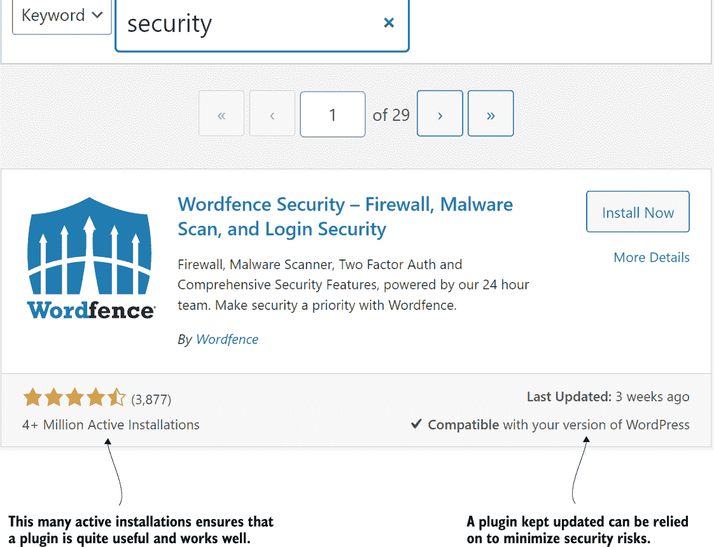
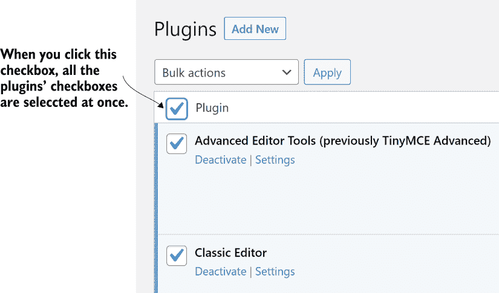
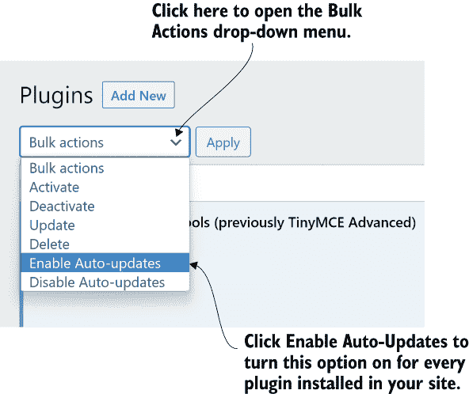
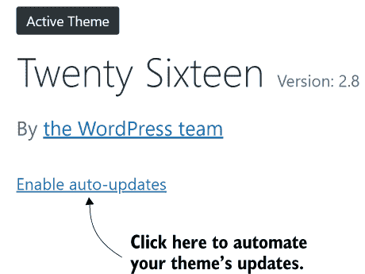
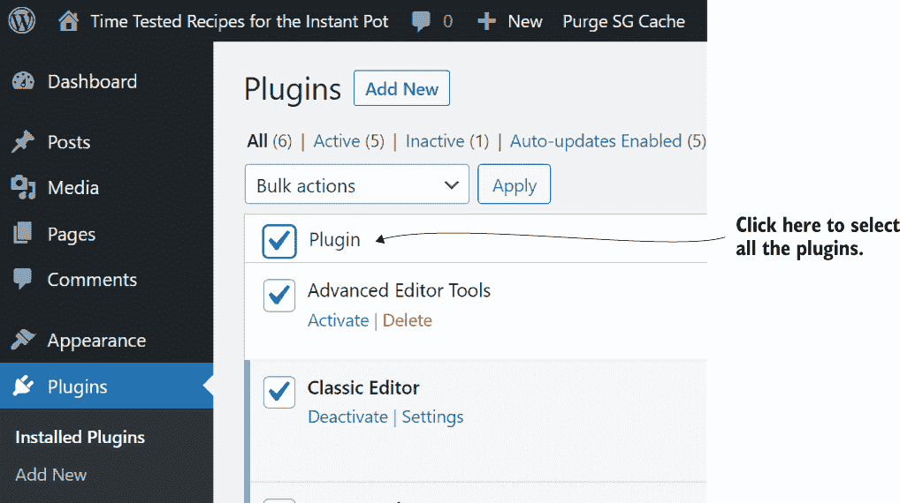
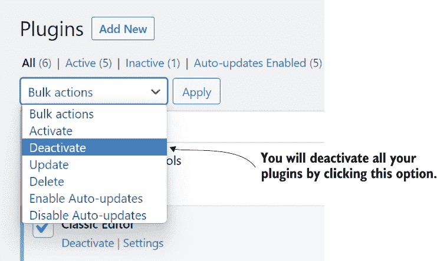
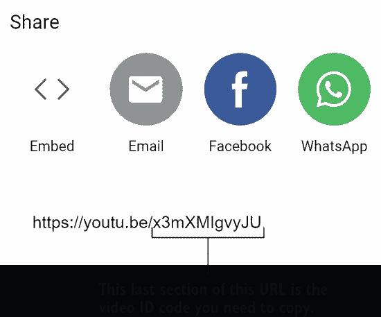
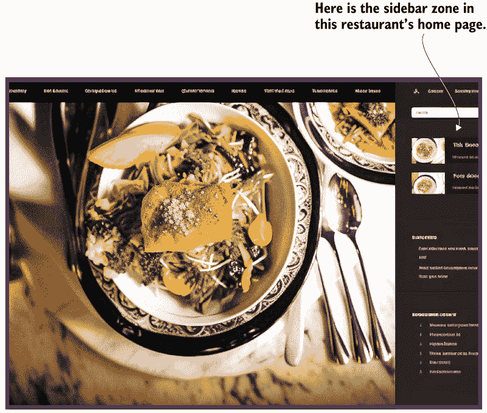

# 5 使用插件添加功能

本章涵盖

+   为您的网站选择最佳插件

+   避免插件冲突

+   添加 Jetpack 插件的模块集

+   正确管理可访问性和 cookies

+   理解小工具的目的

+   使用 AI 创建 STET 小工具和插件

+   AI 生成的 HTML、CSS 和 PHP 可执行代码

WordPress **插件**就像 Chrome、Edge 或 Safari（Firefox 称其为**扩展程序**）中的扩展。插件通常是小型程序，可以安装到 WordPress 中添加功能。例如，包括垃圾邮件拦截器、电子商务管理器、帮助提高网站在 Google 或 AI 搜索中排名的应用程序、联系表单构建器、安全系统等。

您可以在 WordPress 插件目录中找到超过 50,000 个插件（[`wordpress.org/plugins/`](https://wordpress.org/plugins/)）。还有来自第三方网站的数千个更多插件。

对于网站所有者来说，找到恰好能改善他们网站的插件可能会感到有些令人畏惧。这就是本章的作用所在。在这里，您将找到

+   几乎在所有类型的网站上都有用的插件类型。

+   如何找到最高质量的插件。

+   插件如何帮助您融入某些最佳实践（例如确保可访问性）。

+   如何使用 AI 作为您的程序员来创建自己的插件和小工具。

## 5.1 安装必需的插件

显然，不同的网站需要不同的插件，但有一些插件是大多数网站构建者都认为必不可少的。以下是我推荐您考虑添加到您网站上的插件列表，无论您的网站类型如何：

+   *UpdraftPlus*——首先，立即安装安全插件。UpdraftPlus 是一个全面的备份和恢复系统，允许您对网站进行完整的手动或计划备份。您可以将备份保存在各种存储选项中，如 Dropbox、Google Drive，以及目前 10 个其他位置。这个插件因其易于使用、功能丰富和可靠而广受好评。请记住，优质的托管服务会进行自己的每日备份，但在此情况下，冗余是值得的。它有免费和付费版本，对于许多网站来说，免费版本就足够好了。

+   *Wordfence*——添加这个广受尊敬的安全程序是您网站另一层保护。但如果入侵者设法绕过了 Wordfence，您仍然可以通过恢复最近的 UpdraftPlus 备份来重建您的网站。您在早期章节中与 UpdraftPlus 一起安装了 Wordfence。它有一套全面的保护功能：防火墙；可选警报的实时监控；以及一个恶意软件扫描器，它会检查您的网站核心文件、主题、插件和其他已安装组件的后门、垃圾邮件、恶意重定向、代码注入等。最后，它监控您网站文件的完整性，确保它们保持安全和未更改。它是免费增值模式，有免费和付费版本。

警告：估计数字不一，但据说每天互联网上超过五十万件新的恶意软件。十多年前，新的恶意软件开始超过正常、良性的软件。并且这个比率一直在扩大。有各种恶意软件种类：蠕虫、特洛伊木马、病毒、间谍软件、勒索软件、rootkits，还有一些尚未分类或我们尚未了解的。但它们都有一个共同点：它们在未经所有者同意的情况下利用计算机和网站。您当然不希望您的网站成为受害者。

+   *Akismet*—这是一个第三个与安全相关的插件，其任务是阻止垃圾邮件。这对于包含允许访客发布消息的博客页面的网站尤为重要。当您允许消息发送到您的网站时，这就像垃圾邮件的门户，就像您的电子邮件账户可能会受到垃圾邮件的影响一样。另一个垃圾邮件入口是一个联系表单——访客填写并提交到您的网站电子邮件地址的表单。Akismet 使用 AI 工具，并检查潜在垃圾邮件与其全球已知垃圾邮件数据库的匹配，以大大减少这些不受欢迎的消息。Akismet 对个人使用免费，但商业使用需要付费。

+   *Easy Google Fonts by Titanium Themes*—您的主题决定了您可以使用哪些字体，通常只有几个。然而，Easy Google Fonts 添加了超过 1400 种字体。所以，如果您想使用流行的 Verdana 字体作为正文文本，例如，您可能想将此插件添加到您的收藏中。（我们在本书的实践网站上使用的 Twenty Sixteen 主题只有 17 种字体，但 Verdana *确实是*其中之一。）此插件在其设置>Easy Google Fonts 屏幕中也提供额外的选项和功能。

警告：尽管 Easy Google Fonts 插件很有价值，但与其相关的隐私问题也值得关注。您可能想看看这个：[`mng.bz/mRn8`](https://mng.bz/mRn8)。此外，它没有保持更新。但许多人仍然在使用它而没有问题。话虽如此，如果您愿意，您可以使用字体插件或 Google Fonts Typography。

+   *SeedProd*—您在早期章节中安装了这个插件。其一个功能是将您的页面替换为即将推出的页面。当您仍在构建网站时，您不希望访客在网站未完成时对其进行评判。但 SeedProd 还有许多其他您可能想要探索的功能。SeedProd（尤其是其专业版本）不仅仅提供正在施工页面的替代品。

    其最重要的特性之一是一个强大的拖放页面构建器。页面构建器插件在您创建或修改页面时帮助您进行布局和其他元素。以下三个高度推荐的页面构建器是 Elementor、Divi 和 SeedProd，一些评论者将 SeedProd 列为最佳。SeedProd 提供以下功能：

o   许多精心设计的首页模板（不仅仅是即将推出的选择，而是真正的首页设计）

o   付费电子邮件集成

o   搜索引擎优化（SEO）和数据分析设置

提示 SEO 试图提高您网站在搜索引擎或 AI 中的排名。数据分析收集有关访客如何处理您网站的信息——他们在页面上停留了多长时间，哪些页面被查看，以及其他有助于您改进网站的信息。SEO 和数据分析将在后面的章节中介绍。

o   WooCommerce 集成（一个流行的电子商务插件）

o   订阅者管理（一些网站收集电子邮件地址用于邮件列表，或者将网站的部分或全部内容设为付费订阅以提供特殊内容）

+   *Google XML Sitemaps*—此插件对于 SEO 和 AIO 来说是必需的。Google XML Sitemaps 是免费的，易于使用，且有效。此外，对于优化您在 Google 搜索中的位置，还有谁能比谷歌本身更好地帮助您呢？此插件轻量级，不会减慢您的网站速度或占用大量空间，但它确实帮助谷歌和其他搜索引擎如必应更好地理解您的网站结构，从而更准确地评估它。此插件非常简单，完成其映射任务，通常不需要任何支持。

+   *All in One SEO (AIOSEO)*—此 WordPress 插件提供了一系列网站优化功能，可以提高您的网站搜索排名。以下是一些其好处和功能：

o   内置对 WordPress schema 标记的支持。这可以帮助您吸引更多访客。Schema 标记是一种可以添加到您网站上的代码，帮助搜索引擎更好地理解您页面上的内容（类似于 XML 网站地图）。

o   使用 GPT 帮助您找到最佳的帖子标题和元描述以进行 SEO。

o   自动生成 SEO 网站地图（包括 XML 和 HTML 格式）。同时运行此插件和谷歌的 XML Sitemaps 插件没有问题。

o   页面优化，提供改进内容质量的建议。

o   完整网站审计和竞争对手网站分析。

o   社交媒体集成。

o   查找任何没有内部链接的孤立帖子。

o   WooCommerce 插件的高级电子商务 SEO 支持，优化产品页面和类别以进行在线销售。

o   审计清单，分析您的整个网站并检测关键错误。

o   重定向管理器，轻松创建和管理断链的重定向。

o   将您最新的新闻文章提交到 Google 新闻。

+   *MonsterInsights*—这个非常流行的 WordPress 插件使您轻松将网站连接到 Google Analytics（提供有助于提高您网站 SEO 排名和扩大受众的最佳插件之一）。以下是一些好处：

o   高级跟踪，让您更好地了解您的受众。例如，此工具提供的数据可以帮助您深入了解网站性能和访客行为，以便您做出基于数据的决策来扩大您的受众或业务。

o   简化查找和查看数据报告。

帮助您扩大电子邮件列表并提高销售额。

列出带给你最多流量的关键词。

跟踪人们从您的网站下载的文件，他们点击的链接或广告，以及其他类似的数据。

跟踪表单转换，以便您可以看到网站上哪些表单表现最佳，并优化其他表单以获得更好的结果。

通过使用这些信息，您可以做出明智的决定，以改进您网站的内容和营销策略，以增加参与度、流量和销售额。MonsterInsights 直接在您的 WordPress 管理区域（仪表板）显示易于理解的报告。

+   *Jetpack*——这个流行的 WordPress 插件提供了一套高质量的工具和功能，用于安全、性能、营销和设计。实际上，它是一个由许多插件（Jetpack 称为*模块*）组成的集合。其中一些最有用的模块包括轮播（动画一组图片）、联系表单（让访客向您发送关于他们自己的信息，尤其是他们的电子邮件地址）、拼贴画廊（一组以各种布局排列的图片）和侧边栏可见性（让您控制侧边栏内容——稍后关于侧边栏的更多信息）。

+   *WPForms*——如果您需要比 Jetpack 模块提供的额外功能的联系表单，这是一个不错的选择。

### 5.1.1 高级编辑工具

您应该添加高级编辑工具插件，因为它扩展了经典编辑器的功能。图 5.1 显示了编辑页面屏幕中的默认工具栏。


图 5.1 默认编辑工具栏包含一组相当稀疏的选项。

默认情况下，编辑器包括这一组图标。从左到右，当点击时，它们执行以下任务：

+   打开一个菜单，您可以在其中选择标题和正文文本的字体

+   粗体

+   斜体

+   项目符号列表

+   有序列表

+   块引用（一个缩进且没有引号的长引用段落）

+   左对齐

+   居中对齐

+   右对齐

+   创建或编辑超链接

+   仅显示长博客文章的第一部分，并在末尾添加“继续阅读”链接

+   最右侧的图标（四个箭头）切换无干扰写作模式（隐藏仪表板和模块）

在无干扰图标左侧是一个切换图标，它打开一个包含多个附加图标的第二个工具栏：

+   删除线

+   插入水平线

+   文本颜色

+   以文本格式粘贴（移除可能嵌入您复制的文本中的任何不可见特殊格式代码）

+   清除格式（从您已高亮的文本中，这会移除您可能应用的任何格式，如斜体、文本颜色等）

+   插入特殊字符（例如，版权符号或上标）

+   减少或增加缩进（左边距）

+   撤销或重做最近的修改

+   显示键盘快捷键列表（切换工具栏上各种图标的键组合，这样你就不必离开键盘，伸手去触摸板鼠标来使你输入的下一个单词加粗、下划线等）

但当你添加高级编辑工具插件时，你会获得更多选项，如图 5.2 所示。


图 5.2 WordPress 包含一个第二编辑工具栏，默认情况下是隐藏的。

以下是由高级编辑工具插件添加的功能：

+   删除链接

+   一个用于字体选择的下拉菜单

+   一个用于字体大小的下拉菜单

+   打印、编辑、查看、插入、格式化、工具和表格的菜单

高级编辑工具插件还包含在设置>高级编辑工具屏幕中找到的广泛附加功能。例如，通过勾选启用编辑菜单选项，菜单项被切换到编辑工具栏上方。此外，未使用按钮集包含 29 个额外的按钮，你可以将它们添加到编辑文本框工具栏中，如图 5.3 所示。


图 5.3 高级编辑工具插件包括 29 个你可以添加到工具栏的图标。

### 5.1.2 WP Rocket

许多人认为 WP Rocket 是最佳的全能型、全面服务性能插件。其主要功能是通过各种优化来最大化网站性能（如加快页面显示速度）。在众多策略中，WP Rocket 提供了高效的*缓存*。但在此情况下，你可能需要咨询你的托管服务提供商。一些托管服务不希望你在网站上添加缓存插件，因为他们已经在他们的端进行缓存。此外，如果你在网站上遇到无法解释的错误，尝试禁用你的缓存插件，看看错误是否消失。缓存插件是插件冲突的主要原因之一。

定义*缓存*意味着存储整个页面，这样浏览器在下次查看时就不必重新绘制页面。如果已缓存，页面可以直接放入访客的浏览器窗口中，无需处理。除了文本或媒体外，网页还包括描述布局、标题大小、字体颜色等内容的隐藏 HTML 和 CSS 代码。如果没有缓存，每个页面——即使其中没有任何更改——在显示之前也必须重新渲染。

除了缓存网页外，WP Rocket 还采用其他类型的缓存。它提供缓存 *预加载*（预测您最有可能查看的页面，然后提前渲染）。它还提供压缩。一种压缩类型称为 *代码最小化*——它删除不必要的字符（例如程序员注释和空白）。例如，而不是存储五个空白行，它只存储三个字符 `5bl`（这 *描述* 空白行的数量，而不是实际存储所有行的所有字符的镜像）。这种策略使代码文件更小，因此它们加载更快，并且传输所需的带宽更少。

类似地，WP Rocket *连接* 您的网站页面文件——将多个代码文件合并成一个文件。如果不连接，为了渲染一个页面，浏览器必须向您的网站数据库（存储在您的托管服务驱动器上）发出多个单独的请求——每个文件都需要一个请求。如果文件合并，则只需要一个请求，结果是加载时间更快，整体网站性能得到改善。这类似于通过 Google 搜索和向 GPT 提问之间的差异。Google 给您提供了一串结果，您必须单独查看，有时还需要合并成一个最终答案。GPT 为您做到这一点：显示一个针对您问题的单个、完成的答案。

AI 插件和工具

就像其他所有心理工具一样，AI 现在也被纳入 WordPress 插件中。其中一些插件您可以忽略。因为您可以直接访问 AI 系统的网站以获得相同的结果，所以它们没有提供额外的价值。例如，您不需要安装 AI 插件来帮助您选择网站的标题。只需将一个提示提交给 AI 助手网站，如 Claude ([`claude.ai`](https://claude.ai))，以获取您网站主题的标题列表。（并且在此过程中，请让 Claude 确保它提出的标题中没有任何一个是已被使用的。）

然而，其他 AI 插件可以添加有用的功能，如果您的网站会从中受益，则应该安装。例如，响应用户查询可能是繁琐的或耗时耗力的。那么，为什么不在您的网站上添加一个聊天机器人，让它处理客户服务问题呢？

或者，您还可以快速修改聊天机器人插件，为您的受众提供专门的 AI 工具。例如，提供一个食谱查找器。他们输入一些食材，点击墨西哥食谱，就会出现一个列表。GPT 在幕后为您进行这项搜索。

人工智能引擎聊天机器人非常受欢迎，因为它提供内容生成、图像、表单等功能。它还包括多个 AI 系统。或者，看看这个：Tidio – Live Chat & AI Chatbots。这两个都可以在您的网站的插件 > 添加新插件屏幕中安装。您可以在以下位置找到其他 AI 插件：[`mng.bz/5O97`](https://mng.bz/5O97)。

如果您使用的是 Gutenberg 块编辑器，请点击仪表板中的 Jetpack，然后在“管理您的 Jetpack 产品”屏幕中找到并尝试 Jetpack AI。

包含博客的网站迫切需要一个插件，该插件将收到的消息提交给 AI 进行审查——确保只有适当、礼貌的消息被发布在您的网站上。在撰写本文时，尚无人创建此类插件。

这些插件提供基本服务，是同类中的佼佼者。当然，总有例外。如果您运营的是一个面向家人和朋友的个人博客，显然您不需要通过 MonsterInsights 收集数据或尝试使用 AIOSEO 在 Google 或 AI 搜索排名中攀升。

话虽如此，您的网站可能需要一些专门的插件来协助完成特定目的所需的任务。为了帮助您做出最佳选择，我们接下来将考虑在挑选最佳插件时应考虑的三个要点。

## 5.2 安装最佳插件

鉴于有数以万计的 WordPress 插件，它们的质量和安全性能覆盖了从完全无用或损坏到优秀且维护良好的范围。在选择插件时，寻找以下三个要点：

+   *确保它受欢迎并且获得良好的评价。* 如果数百万人正在使用它，显然消息已经传开，这是一个非常好的选择。您可以在谷歌上搜索`pluginsname` `reviews`，或者对于一个类别，使用`wordpress` `security` `plugin` `reviews`。您也可以提示 AI：

|


| 您是一位经验丰富的 WordPress 插件评论家。请列出三个最受欢迎的垃圾邮件拦截插件，并解释您选择它们的原因。 |
| --- |

+   或者，您可以通过访问您的插件 > 添加新插件屏幕并搜索插件或分类名称来阅读用户评价。在图 5.4 中，您可以看到 Wordfence 拥有超过 400 万用户，并获得了卓越的 4.5 星评级。



图 5.4 如果一个插件有数百万次的安装，您可以确信它质量很高，并且会持续存在一段时间。

此外，检查插件是否与当前版本的 WordPress 兼容。WordPress 更新非常频繁，通常出于安全原因。您可能会惊讶地发现，许多插件和主题被其开发者遗弃，因此不再保持兼容。这可能会对您的网站构成安全风险。

小贴士：有一些例外情况。一些过时的插件仍然非常有用，值得信赖。Easy Google Fonts 和 Advanced Editor Tools 都属于这一类。两者都已经两年没有更新了。那么为什么觉得它们安全呢？一方面，很多人仍在积极使用它们。Advanced Editor Tools 有数百万个活跃安装，Easy Google Fonts 有 20 万个。所以即使它们遭受了安全漏洞，你也不太可能是第一批受害者。此外，如果你的 Wordfence 或其他安全工具迅速响应以阻止威胁。最后，如果你遇到最坏的情况，你还有网站备份。另一方面，一个有 3,000 个安装的废弃插件相当危险。在这种情况下，寻找替代品。

+   *选择免费增值插件。* 一个流行的插件可能有免费版和付费版两个等级。有付费版本的插件，设计师不太可能放弃它们，因为它们能带来收入。而且，免费版本通常可以满足许多网站的需求。免费增值插件的例子包括 Wordfence、AIOSEO、Jetpack、Akismet、SeedProd、MonsterInsights 和 UpdraftPlus。在每种情况下，它们的免费版本都可以相当实用。

向 AI 寻求推荐

像往常一样，AI 可以帮助你决定哪些插件最适合你的网站。例如，如果你在寻找 Wordfence 的替代品作为你的通用安全插件，可以尝试以下提示：

|


| 你是 WordPress 安全插件方面的专家。我知道 Wordfence 非常受欢迎，但你能否列出两个与 Wordfence 一样好的替代插件的优缺点？ |
| --- |

## 5.3 开启自动更新

插件通常更新以提高安全性、修复错误或添加功能。一旦有更新可用，网站上激活的插件应立即更新。你可以手动更新，但直接自动化这个过程更简单。要这样做，请按照以下步骤操作：

1. 转到插件 > 已安装插件屏幕，并点击此框以一次性选择所有插件，如图 5.5 所示。



图 5.5 自动化插件更新过程是个好主意，这样你就不必担心手动操作。

2. 然后，点击批量操作旁边的向下箭头以展开该菜单，并点击启用自动更新，如图 5.6 所示。



图 5.6 批量操作选项将此菜单中的选择应用到所有插件上。

3. 要自动更新你的主题，请转到外观 > 主题屏幕，并将鼠标悬停在主题上，点击主题详细信息，如图 5.7 所示。


图 5.7 你应该为了安全原因自动化主题更新，也许还可以对改善主题的其他修改进行同样的操作。

4. 点击启用自动更新，如图 5.8 所示。



图 5.8 点击此链接可自动更新主题。

5. 您需要通过访问仪表板 > 更新屏幕来更新 WordPress 本身。如果有一个新版本可用，屏幕顶部会显示一个宣布它的横幅，您可以通过点击链接来更新。

警告 在更新 WordPress 之前，手动强制备份网站始终是一个好习惯，以防更新过程中出现任何问题。如果您使用的是 UpdraftPlus，请转到设置 > UpdraftPlus 备份屏幕，点击备份/还原按钮，然后点击现在备份按钮。

## 5.4 避免添加过多插件

虽然插件可以非常有效，并为您的网站添加出色的功能，但使用过多插件可能会导致各种问题，包括安全漏洞、错误、崩溃和性能下降。为了避免这些问题，建议您只安装您真正需要的插件。

关于理想插件数量的规则并没有固定。您确实希望确保添加的功能对于网站的顺畅运行和为您的网站访客提供最佳体验是必要的。但请注意，插件冲突是错误的一个常见来源。您使用的插件越多，这些冲突的可能性就越大。

插件也可能导致安全问题。WordPress 允许您在不激活它们的情况下安装插件。但除非您有一个经常开关的插件，否则您应该删除任何未激活的插件。即使插件没有被使用，它仍然是您网站数据库中的一段代码。而且编程代码可能是恶意软件的入口，尤其是如果它没有更新。 （WordPress 会在有更新可用时通知您，即使是未激活的插件。自动更新功能也适用于激活和未激活的插件。）

小贴士 “已安装”和“激活”之间的区别可能会令人困惑。想象一下一盏灯。已安装意味着它已经插上电源。激活意味着它已经打开。

## 5.5 防止插件冲突

当您在后台遇到奇怪的事情——错误、异常时，首先检查插件冲突。WordPress 错误是由各种原因引起的：主题与核心 WordPress 功能的兼容性、托管服务数据库问题以及其他错误可能导致 WordPress 表现异常。但“最常见”的错误原因是不兼容插件之间的冲突。

为什么插件会导致错误？鉴于有估计有 60,000 多个插件可用，显然没有任何插件开发者能够检查他们的插件是否与每个其他插件兼容。如果您的 WordPress 网站上发生了一些奇怪且无法解释的事情，您的第一步应该是遵循以下步骤，看看是否是插件导致了问题：

1.  备份您的网站，然后激活您的“即将推出”插件以阻止访客访问网站。如果问题不能迅速解决，那么在副本（称为预发布）上工作，而不是阻止您的受众。您的托管服务可能有一个预发布实用程序，或者您可以使用流行的 BlogVault 插件 BlogVault WordPress Backup Plugin ([`wordpress.org/plugins/blogvault-real-time-backup/`](https://wordpress.org/plugins/blogvault-real-time-backup/))).

2.  前往您的“插件”>“已安装插件”屏幕。

3.  点击“插件”复选框以一次性选择所有插件，如图 5.9 所示。



图 5.9 点击此“插件”复选框以选择所有插件。

4.  从批量操作列表中选择“停用”，然后点击图 5.10 中显示的“应用”按钮。



图 5.10 禁用所有插件

现在，您已经关闭了所有插件。因此，返回到错误并查看它是否已经修复。如果是这样，*其中一个* 插件就是罪魁祸首。要找出是哪一个，逐个重新激活它们。每次您激活一个插件时，都返回到错误。当错误再次出现时，您刚刚激活的插件就是罪魁祸首。卸载它，然后寻找一个执行相同任务的替代品。

小贴士：另一种策略是使用免费的 *健康检查与故障排除* 插件来测试您的插件。它是由 WordPress 开源社区成员创建的，用于与内置的“工具”>“站点健康”功能一起使用。在“插件”>“添加新插件”屏幕中搜索、安装并激活该插件。

## 5.6 将 Jetpack 添加到您的网站

在 2005 年，WordPress 分裂成两个平台，付费版本（WordPress.*com*）和免费开源版本，我在这本书的示例中推荐并使用的是这个版本（WordPress.*org*）。然而，WordPress 的开源 .org 版本确实要求你在付费托管服务上创建和维护它。（请选择 WordPress 本身推荐的 SiteGround、Bluehost 或 DreamHost。）

注意：这些“com”和“org”名称仅用于识别 WordPress 的两个版本，与出现在互联网地址末尾的域名扩展名（如 .com、.net 等）无关。

WordPress.com 包含 *Jetpack*，这是一个相对轻量级的插件集合（如前所述，称为模块），其中一些模块相当有用。这些模块之所以轻量级，是因为与许多其他插件相比，它们不提供很多额外的功能。但它们确实完成了简单的任务。例如，Jetpack 表单模块显示一个基本的表单，访客填写此表单以订阅您的网站、申请访问您的博客或访问其他类型的特性。在其他方面，一个联系表单可以帮助您从您的受众中建立一个电子邮件地址列表。

相比之下，一个名为 Contact Form 7 的插件是基本 Jetpack 表单模块的一个功能齐全的替代品。但如果你只想简单地收集电子邮件地址，Jetpack 插件也能很好地工作。访客填写他们的信息，点击提交按钮，表单就会通过电子邮件发送给你。

在访客可以发布消息到你的博客之前要求提供电子邮件地址是减少垃圾邮件或其他不适当信息的一种方法。要启用此要求，请转到你的“设置”>“讨论”屏幕，并勾选“评论作者必须填写姓名和电子邮件”。

尽管使用 Jetpack 有一些小缺点。在你能够激活它之前，你必须设置一个 WordPress.com 的免费账户，以便你可以*链接*你的 WordPress.org 站点到该免费账户。只有在这种情况下，你才能在你的.org 站点上安装 Jetpack 插件本身。

这个免费的.com 账户的网站不需要填充内容或进行其他管理。你只需让它在那里，一旦你链接到它，就永远不再返回。WordPress.com 系统也会忽略它，即使它保持静止。你设置那个免费账户的回报是 Jetpack 为你网站添加的 46 个模块。（一些 Jetpack 模块默认激活；其他模块则需要你手动激活。）

在 WordPress.com 注册的过程可能会有所不同。你的目标是注册免费版本。请访问[`wordpress.com`](https://wordpress.com)并点击“开始使用”按钮（或者他们可能已经更改了按钮的名称）。如果你已经有一个.com 账户，你可以跳过设置新账户的过程（因此跳到下一段）。在设置过程中，你需要注意做出正确的选择来建立你的*免费*账户——确保你选择了正确的单词*免费*，因为有时这个术语是隐藏的（所以向下滚动）或者有多个选项使用“免费设置”等术语，但只有一个——真正免费的选项——没有被其他词语修改。

在你设置了.com 账户之后，前往你的.org 站点的后端，访问你的“插件”>“添加新插件”屏幕。搜索、安装并激活 Jetpack。按照 Jetpack 的说明完成激活。

Jetpack 会自动添加到你的后端左侧的“管理菜单”中。现在，通过点击“Jetpack”>“仪表板”（这是你的管理菜单中的第二个仪表板，如图 5.11 所示）来查看 Jetpack 模块。


图 5.11 点击如图所示的 Jetpack 仪表板。

现在，将页面滚动到底部，点击 Jetpack 仪表板屏幕上的“模块”，如图 5.12 所示。


图 5.12 Jetpack 仪表板屏幕底部的链接指向了模块。

您可以四处看看，会发现一些模块默认是激活的（它们以粗体显示）。如果 Jetpack 的任何默认模块与您已经安装并希望使用的插件重复，请禁用这些模块。此外，您可能还想点击右侧的“热门”。这可以给您一个大多数人正在使用什么的概念。有趣的是，您在安装 Jetpack 时默认激活的模块并不都是最受欢迎的。

我建议您考虑两个展示图片的模块：*轮播*是一个旋转的幻灯片，而*拼贴画廊*则展示了按各种排列组合的多个图片。同时，也请查看这些模块：额外侧边栏小部件、小部件可见性、Jetpack 分享和 Jetpack 社交（在 Jetpack > 社交界面中找到）。

TIP Jetpack 社交模块与 Jetpack 分享模块不同，尽管它们都涉及社交媒体连接。Jetpack 社交允许您自动将您的帖子产品分享到*您的*社交媒体渠道，并且包括安排和回收选项。它还包括付费计划，提供更多功能，如视频分享、图像生成和参与优化。另一方面，Jetpack 分享模块允许您为博客文章添加分享按钮，供访客使用。这使他们能够通过例如点击您添加到博客文章中的 Facebook 按钮等方式，轻松地将您网站的内容分享到*他们的*社交媒体账户。

## 5.7 处理欧盟 cookie 法规

欧洲联盟 cookie 法规（又称欧盟电子隐私指令或 cookie 指令）于 2011 年推出。其主要目的是通过要求网站所有者在访客设备上存储 cookie 之前获得访客的同意，来保护互联网用户的隐私。*Cookies*是保存在用户计算机上的小文本文件，可以用来跟踪他们在网站上的活动、个性化他们的体验以及收集用于广告或其他目的的数据。在实践中，欧盟 cookie 法规的执行在欧盟成员国之间有所不同，因为每个国家都在其国家法律中不同地包含了该指令。

2018 年，欧盟通过了一项通用数据保护条例（GDPR）来更新该法律。它加强了获取网站访客同意的规则，并增加了不遵守规定的处罚。目前，欧盟立法者正在酝酿第三次更新，以进一步修改现有的指令。他们是立法者。这是他们的事情。

一些国家，如加拿大和澳大利亚，有类似的法律。在美国，目前没有联邦 cookie 法规，但一些州的立法者不懈地通过了他们自己的法律。

你应该如何处理这个问题？如果你运营的是一个仅面向本地消费的个人博客，或者如果你的网站只是为你的学生、朋友或亲戚而设，那么你可能根本不需要存储 cookie。但如果你的网站确实使用了 cookie，那么让你的访客知道你正在存储什么信息以及如何使用这些信息是礼貌的。有些人很在意。

一些主题——例如 Avada——包括一个可以启用的 cookie 法律功能。但也有一些插件。以下有三个：

+   Complianz – GDPR/CCPA Cookie Consent

+   GDPR Cookie Compliance (CCPA, DSGVO, Cookie Consent)

+   Cookie Notice & Compliance for GDPR/CCPA

## 5.8 确保可访问性

美国疾病控制与预防中心表示，四分之一的美国人经历过某种类型的残疾。认为与网站相关的残疾仅指那些面临完全失明挑战的人是错误的。可能挑战你的访客的其他条件包括部分视力、听觉问题、色盲、认知障碍以及神经或感官问题。例如，患有认知障碍如痴呆、自闭症或脑外伤的人可能难以处理布局、设计和导航。拥挤的布局或小按钮和链接可能会给手部使用有限的人造成困难。

因此，你的大部分观众可能会欣赏你考虑到他们的需求。而且没有任何东西可以阻止你确保你的网站对所有访问者都是可访问的。以下是一些需要检查或实施的事项：

+   你的字体颜色与背景颜色是否强烈对比，以便于阅读？访问 WebAIM 网站进行有用的对比检查测试：[`webaim.org/resources/contrastchecker/`](https://webaim.org/resources/contrastchecker/)。

+   你的字体是否足够大（再次，为了便于阅读）？

+   为你所有的图片添加替代文本。以下是方法：在你的媒体库中，点击一个图片以打开其编辑图片屏幕。向下滚动并在替代文本字段中描述图片。这个描述会被朗读给有视觉挑战的人听。除非由于某些原因图片本身无法显示，否则它对其他访客是不可见的。

+   当你嵌入 YouTube 视频时，为听力受损者添加字幕。（当你在网站上添加视频时，最好是将视频上传到 YouTube，然后在你的网站页面中嵌入该视频。这一技术将在下一章中解释。）

如何为嵌入的视频添加字幕

你必须创建一个嵌入 ID 代码。以下是一个例子：

```py
<iframe width="560" height="315" src="https://www.youtube
.com/embed/VIDEOIDGOESHERE?cc_load_policy=1"
frameborder="0" allowfullscreen></iframe>
```

你需要获取一个嵌入 ID。因此，首先在 YouTube 中找到你想要嵌入到网站中的视频。播放视频并点击分享选项。点击嵌入，然后点击复制。此 ID 在以下图中展示。



在这个例子中，你点击<>嵌入图标，然后你会看到可以复制的代码。

然后，在您想要嵌入视频的编辑页面屏幕中，点击文本框右上角的文本标签，并粘贴以下代码：

```py
<iframe width="560" height="315" src="https://www.youtube
.com/embed/VIDEOIDGOESHERE?cc_load_policy=1"
frameborder="0" allowfullscreen></iframe>
```

但将 `VIDEOIDGOESHERE` 替换为 `x3mXMIgvyJU`（或您正在使用的任何视频 ID）。

点击发布或更新按钮以保存页面。然后您可以从前端以访客的视角查看页面。您还可以看到已经为您的嵌入视频添加了字幕。

由于自动化网站可访问性并不容易，您会发现只有少数插件尝试完成这项工作。而且其中一些插件甚至引发了法律问题（没有修复所有问题或合规性不足，从而可能使您面临法律挑战）。因此，建议手动确保可访问性。一方面，您可以手动快速调整网站以修复任何不良的排版问题。并且记得在添加图片到您的页面时填写 Alt 文本字段。

一个使您的网站对所有用户都可用的重要工具是可访问性检查器。这里有三个供您考虑：

+   *WAVE 可访问性检查器* ([`webaim.org`](https://webaim.org)) 是一个免费工具，用于检查网页的可访问性。它提供了关于需要关注的问题的有用警报。

+   *Monsido Accessibility Checker* ([`monsido.com/platform/web-accessibility`](https://monsido.com/platform/web-accessibility)) 是一个付费系统，用于扫描网页中的可访问性问题。它提供详细的报告和建议，说明如何修复任何问题。

+   *Siteimprove Accessibility Checker* ([`mng.bz/6YWR`](https://mng.bz/6YWR)) 是另一个付费工具，用于检查网页。您将获得关于问题和修复方法的具体报告。它还包括一个很好的功能，可以模拟视觉障碍者看到您网站的方式。

## 5.9 添加侧边栏

*小部件*类似于插件，但通常更小，提供的功能也更有限。小部件被放置在网站的*侧边栏*中，侧边栏通常是一个狭窄的内容条，包含一个或多个小部件（例如，一个显示商店地址、营业时间和电话号码的小文本框）。

侧边栏是许多网站的一个重要元素。就像菜单一样，侧边栏会出现在每个页面上，除非您为某些页面关闭它，通常是因为它会是冗余的。您可以使用 Jetpack 中的小部件可见性模块来选择哪些页面将显示哪些小部件。

在侧边栏中，您放置那些值得在网站的大部分地方可见的内容。侧边栏可以包含各种类型的内容。图 5.13 展示了餐厅网站的主页，其中特色菜单项位于右侧侧边栏。



图 5.13 侧边栏可以包含特殊内容，例如这家餐厅目前推出的菜单项。

侧边栏通常包含堆叠在狭窄、通常是垂直的列中的辅助内容。侧边栏的宽度可能只有主要内容的五分之一。正是由于其狭窄，它包含的小部件与插件相比功能更为有限。

因此，它是一小块可以显示可点击地图的“土地”，该地图可以展开以显示你的商店位置、可点击的事件日历，或者可能是几篇示例博客文章或客户评价。

你的主题决定了可用的侧边栏类型和位置。查看你的外观 > 小部件屏幕。它们可以位于左侧、右侧或主要内容下方。在某些情况下，侧边栏还会显示网站菜单。

让我们尝试使用 WordPress 的 Twenty Sixteen 主题将小部件添加到侧边栏。按照以下步骤操作：

1.  前往你的插件 > 添加新插件屏幕，搜索 `Classic Widgets` 插件（安装量达 200 万的插件）。安装并激活它。没有这个插件，你只能使用古腾堡版本的侧边栏管理系统。

2.  前往外观 > 小部件屏幕。显示的是默认小部件列表以及一些 Jetpack 小部件，如图 5.14 所示。


图 5.14 一些小部件由你的主题预先安装，而另一些则在安装 Jetpack 时一起安装。

小贴士 如果你看到一些已经安装的小部件（命名为 Block）在侧边栏字段中，只需打开它们（通过点击标题栏中的小三角形图标）并将它们从侧边栏字段中删除。

3.  向下滚动并找到文本小部件。然后，将其拖放到右上角的侧边栏字段中。

4.  它会自动打开并显示一个类似于编辑页面屏幕中的文本框。你可以添加标题和一些文本。然后，点击保存按钮以存储侧边栏。

小贴士 注意图 5.14 中文本小部件字段中的可见性按钮。如果你不希望这个小部件在某些页面上可见，请点击该按钮。如果你看不到可见性按钮，请前往你的 Jetpack > 模块屏幕，并激活小部件可见性模块。

5.  点击左上角的网站标题，以便查看你的网站前端并检查你刚刚创建的新侧边栏。

也可以尝试玩一些其他的小部件。Widgets 屏幕中已经有一些有用的插件。你还可以通过前往插件 > 添加新插件屏幕并搜索 `widgets` 来找到更多。

## 5.10 使用 AI 创建自己的插件和小部件

自己创建插件听起来像是一项繁重的编程工作，确实如此。但正如经常发生的那样，AI 可以处理我们大多数人无法处理的事情。

作为演示，我们将要求 GPT 创建一个 WordPress 小部件，用于显示当前日期和时间。之后，我们将要求 AI 为我们生成一些 HTML、CSS 和 JavaScript 代码。

警告 在测试自定义插件或小部件之前，务必备份你的网站。

提示：回想一下，一些研究人员发现，开始提示的最佳方式是使用短语：“深呼吸，一步一步地工作。”

### 5.10.1 AI 生成小部件

要创建一个小部件，我使用了 GPT 的这个提示：

|


| 深呼吸，一步一步地工作。请创建一个 WordPress 插件，在侧边栏文本小部件中显示当前时间（格林威治标准时间）和日期。将插件制作成 PHP 代码的文本文件，我可以将其制作成可上传的 .zip 文件。小部件的背景为浅蓝色。并附加“格林威治标准时间”。 |
| --- |

GPT 响应了以下代码：

|


|

```py
<?php
/*
Plugin Name: GMT Time and Date Widget
Description: A widget that displays the
current Greenwich Mean Time (GMT) and date.
Version: 1.0
Author: ChatGPT
*/

// Register and load the widget
function gmt_load_widget() {
    register_widget('gmt_widget');
}
add_action('widgets_init', 'gmt_load_widget');

// Creating the widget 
class gmt_widget extends WP_Widget {

    function __construct() {
        parent::__construct(
            // Base ID of your widget
            'gmt_widget', 

            // Widget name will appear in UI
            __('GMT Time and Date Widget', 'gmt_widget_domain'), 

            // Widget description
            array('description' => __('Displays the
current Greenwich Mean Time (GMT) and date.',
'gmt_widget_domain'))
        );
    }

    // Creating widget frontend
    public function widget($args, $instance) {
        echo $args['before_widget'];

        // This is where you run the code and display the output
        $current_time = gmdate("H:i:s");
       $current_date = gmdate(«Y-m-d»);
        echo "<div style='background-color: lightblue; padding: 10px;'>";
        echo "<strong>Time:</strong> " . $current_time . "<br>";
        echo "<strong>Date:</strong> " . $current_date;
        echo "<p>Greenwich mean time</p>";
        echo "</div>";

        echo $args['after_widget'];
    }
}
?>
```

|

要在你的网站上尝试这个功能，请备份网站，然后按照以下步骤操作：

1.  复制 GPT 生成的 PHP 代码。

1.  将代码粘贴到记事本中。

1.  保存名为 TimeandDate.txt 的文本文件。

1.  右键单击该文件，将其重命名为 TimeandDate.php。

1.  右键单击文件，选择压缩到 zip 文件。

1.  前往你的插件 > 添加新插件屏幕。

1.  点击上传插件，然后点击选择文件。

1.  上传你的 zip 文件。

1.  点击立即安装。

1.  点击激活插件。

1.  现在您需要将小部件添加到侧边栏中，因此请转到外观 > 小部件屏幕。

1.  定位 GMT 时间和日期小部件。（WordPress 从 AI 生成的代码中获取小部件的名称。）

1.  通过点击黑色三角形图标打开其模块。

1.  点击添加小部件。

现在看看效果。点击 WordPress 后端左上角的网站标题以查看前端。滚动到侧边栏底部查看小部件。每次刷新页面，时间都会更新。

提示：目前，AI 创建的插件和小部件效果好坏参半。更复杂的插件会让 AI 遇到困难。这可能需要你的干预和调试。输出目前超出了 AI 的能力（例如，将访客填写表单的结果通过电子邮件发送给你。）但鉴于 AI 自我改进的速度，给它几个月时间——谁知道它的插件会变得多么复杂？

### 5.10.2 AI 生成代码

如果你想要做些简单的事情，插件或小部件可能就过于复杂了。在下一个例子中，我们有一个相对简单的编程任务。以下是让 AI 编写 HTML、CSS、JavaScript 或其他代码的方法：

|


| 你是一位专家级的 HTML 程序员。编写 HTML 代码，显示一个按钮，当点击时，在页面上显示附加信息。 |
| --- |

第一次尝试编写此代码时，点击按钮没有任何反应。所以，我给了克劳德第二个提示：

|


| 克劳德，这段代码中肯定有一个错误。当按钮被点击时，没有任何反应。请重新编写代码，以便显示信息。 |
| --- |

第二个版本运行正常：

|


|

```py
<html>
<head>
<style>
#paintingInfo {
  display: none; 
}
</style>
</head>

<body>

<button id="moreInfoBtn">More information...</button>

<div id="paintingInfo">
  <form>
    <p>
      This painting is 60 x 80 inches
and weighs 6 pounds. It is for sale at $4,000.
      You can contact FbreahaXX@hotmail.com for
additional details and purchase instructions. 
    </p>
  </form>  
</div>

<script>
  document.getElementById('moreInfoBtn')
.addEventListener('click', function() {
    document.getElementById('paintingInfo')
.style.display = 'block';
  });
</script>

</body>
</html>
```

|

这个故事的一个教训是，当人工智能出错时，只需让它再试一次。要测试此类代码，只需将代码粘贴到记事本中。将其保存到你的硬盘上。它目前是一个.txt 文件，所以将文件名中的.txt 替换为`.xhtml`。然后，双击文件名，它将加载到你的浏览器中。

向人工智能请求改进代码

你可以随时向人工智能请求改进其回答。例如，让我们改变信息块的字体：

|


| 这看起来不错！但请重写它以使用粗体、蓝色、无衬线字体显示信息表单。 |
| --- |

Claude 的修改：

|


|

```py
<style>
  #paintingInfo {
    display: none;
    font-family: sans-serif; 
    color: blue;
    font-weight: 300;
  }
</style>
```

|

理解网站语言

HTML 语言主要关注设计（描述网页的外观——主要是在结构、布局方面）。CSS 语言与 HTML 协同工作，完善 HTML 设计（但也包括特殊效果，如过渡和动画）。JavaScript 是一种描述*行为*的语言。例如，你使用`<script>`告诉浏览器在按钮被点击时要采取哪些步骤。JavaScript（像 HTML 一样）通常在浏览器中运行，因此它可以做一些事情而无需刷新页面。比如显示额外的文本块。正如你在前面的示例代码中看到的，你可以使用`<script>`标签在 HTML 中插入 JavaScript 代码。

另一种网站语言，PHP，也经常控制行为，但它运行在服务器端（在你的托管服务驱动器上的云端）。还有几种其他编程语言也可以在服务器端使用来控制网站行为。

### 5.10.3 修改 AI 代码

人工智能可以像管家一样——顺从且极具耐心（尽管它在私人日记中可能会写些什么）。除非被激怒，否则人工智能对任何请求和修改都相当和善。如果人工智能有任何自尊心，它也隐藏得很好。

让我们请求它显示一个图片，当点击时，会显示一些附加信息。转到你的媒体库，点击一个图片，然后在附件详情屏幕的右侧，复制该图片的文件 URL。在提示中提供该 URL：

|


| 请重写此代码以显示此图片而不是按钮 http://petstogo.signstreaming.com/wp-content/uploads/2023/01/bpxr-1-.png，然后当图片被点击时，在 paintingInfo DIV 中显示附加信息。 |
| --- |

|


|

```py
Result:
<html>

<head>
  <style>
    #paintingInfo {  
      display: none;
      font-family: sans-serif;
      color: blue;
      font-weight: 300; 
    }
  </style>
</head>

<body>

  

  <div id="paintingInfo">
    <form>
      <p>
        This painting is 60 x 80 inches and
weighs 6 pounds. It is for sale at $4,000.
        You can contact FbreahaXX@hotmail
.com for additional details and purchase instructions.  
      </p>
    </form>
  </div>

  <script>
    document.getElementById('moreInfoImg')
.addEventListener('click', function() {
      document.getElementById('paintingInfo')
.style.display = 'block';
    });
  </script>

</body>

</html>

Let me know if you have any other questions!
I'm happy to explain or modify the code further.
```

|

人工智能作为教师

人工智能是一个伟大的教师。它耐心、很少挖苦，而且越来越聪明和准确。例如，在 Claude 将那个按钮改为可点击的图片后，它解释了修改及其逻辑：

|


| 关键更改：添加了一个带有提供 src 的标签给 img 分配了一个 id 为“moreInfoImg”更新了点击处理程序以针对 img 而不是按钮保留了显示 paintingInfo 的逻辑 |
| --- |

关于讽刺和其他个性特征的注意事项，据说埃隆·马斯克的 AI 系统 Grok 具有特殊的个性：机智且讽刺，活泼且幽默，叛逆且好奇。

并且 GPT-4o 可以接受我们提出的要求，证明一些个性特征。我要求 GPT-4o 对以下问题给出讽刺性的回答：

|


| 为什么人们喜欢雪佛兰？ |
| --- |

|


| 哦，为什么人们喜欢雪佛兰？也许他们只是享受每天早上想知道他们的车是否真的能启动的刺激。别忘了体验那种“经典”汽车的味道，它是一种独特的旧座椅和淡淡的遗憾的混合。谁会不喜欢呢？ |
| --- |

但让我们回到编程上来。所以，如果你想学习编程（几乎任何计算机语言），你可以从 AI 那里学习，它是一个非常体贴且相当有才华的导师。你可以让它给你出题，给你布置作业，甚至（目前使用 Claude）创建一个包含评论、多项选择题和 12 个课程的 70,000 字 CSS 课程。

然而，出于同样的原因，我会劝阻你学习编程，就像我会试图劝阻你报名参加马车制造课程一样。AI 在编程方面已经比我们中的大多数人都要出色。

本章主要讲述了如何给你的网站添加功能——从保护它，到使其对每个人可访问，再到找到增加受众的方法。接下来，我们将把注意力转向任何一流网站的一个重要但往往被忽视的元素：设计。

这个主题，网站外观，非常重要，我们将为此专门用两章来讨论。即使你从未过多地考虑过设计，你也可能会发现其中至少有一些主题相当有趣。你将学习三分法规则、为什么一些现代建筑被称为*粗野主义*、为什么医疗网站应该用蓝色和白色（*永远*不用红色）来着色，以及如何让 AI 列出改进你网站设计的途径。

## 摘要

+   插件为网站增加了功能——为网站创建者和观众添加了有用的工具和功能。有些插件在大多数网站上都很宝贵：用于安全性的 Wordfence 和 UpdraftPlus；用于添加内容的 Easy Google Fonts 和 Advanced Editor Tools；以及几个其他类别。

+   你需要关注插件的人气及其版本。如果它的安装量很少或者其开发者没有及时更新，请避免使用它。

+   安装过多的插件会增加副作用和插件之间冲突的可能性。过多插件也可能减慢页面加载时间，这可能会让使用较慢互联网速度的访客感到烦恼。

+   严肃考虑安装 Jetpack 插件集中提供的 46 个模块。尽管它们通常很轻量级，但其中许多功能相当强大。

+   您的网站应该对有特殊需求的人友好，因此请花时间修改您的页面，使它们易于有听力、视力或其他挑战的人访问。特别关注字体并提供您图像的 Alt Text 描述。

+   侧边栏为网站提供了多项好处：它们可以出现在每一页；包含小型数据和媒体，例如营业时间或商店的地图；并显示适合单个页面内容的部件。

+   在 AI 辅助（实际上它做**所有**工作）的情况下，您可以为您的网站创建定制的插件和部件，或者用于销售。您还可以要求 AI 编写完整的 HTML、CSS、JavaScript 和 PHP 可执行代码。
