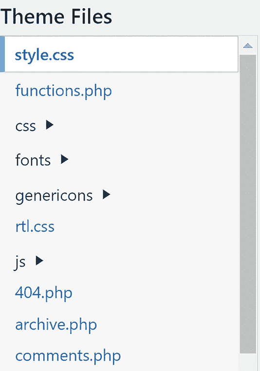
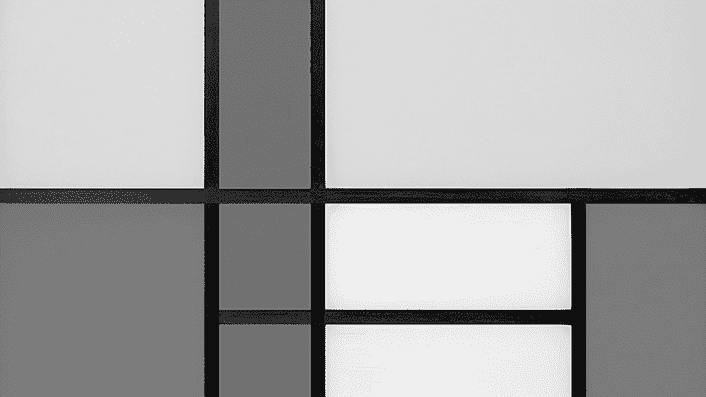
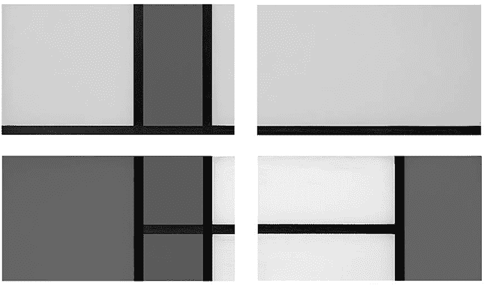
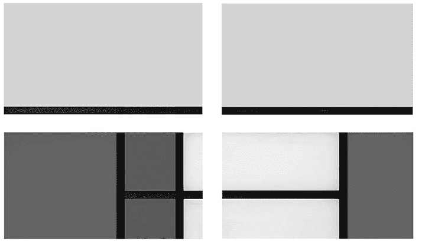
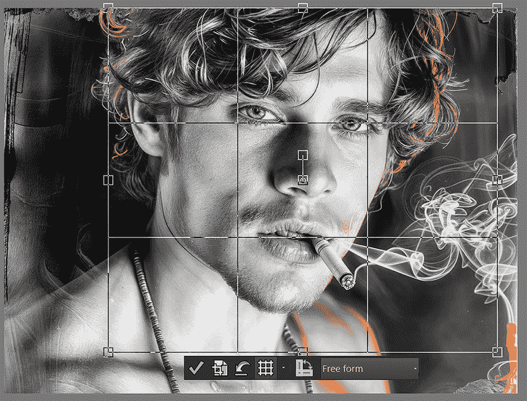
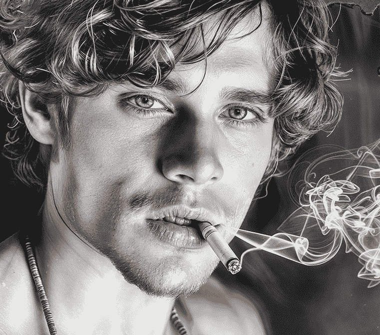
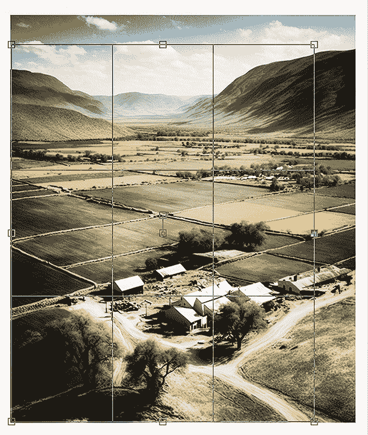
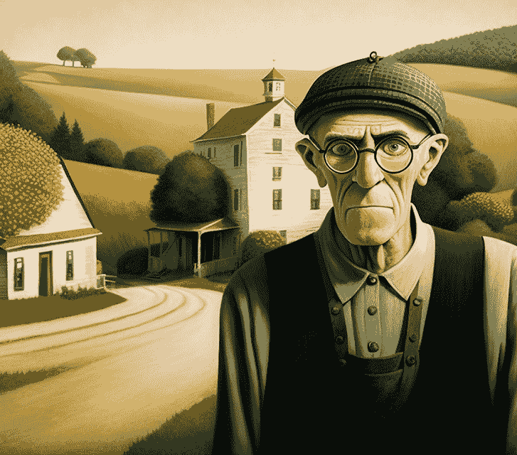
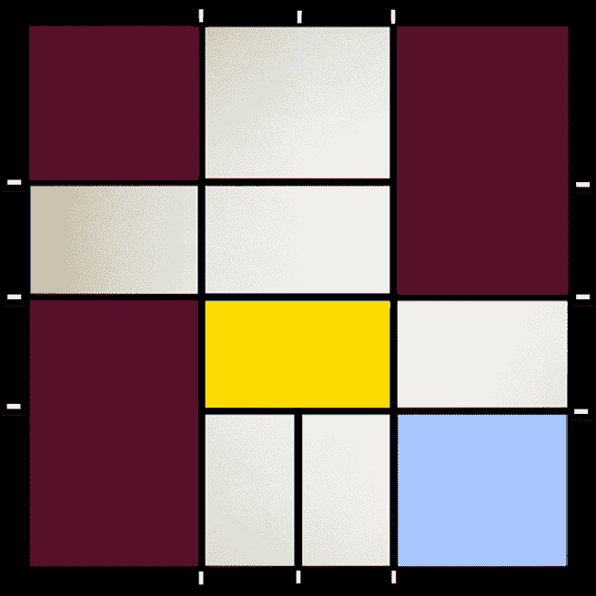
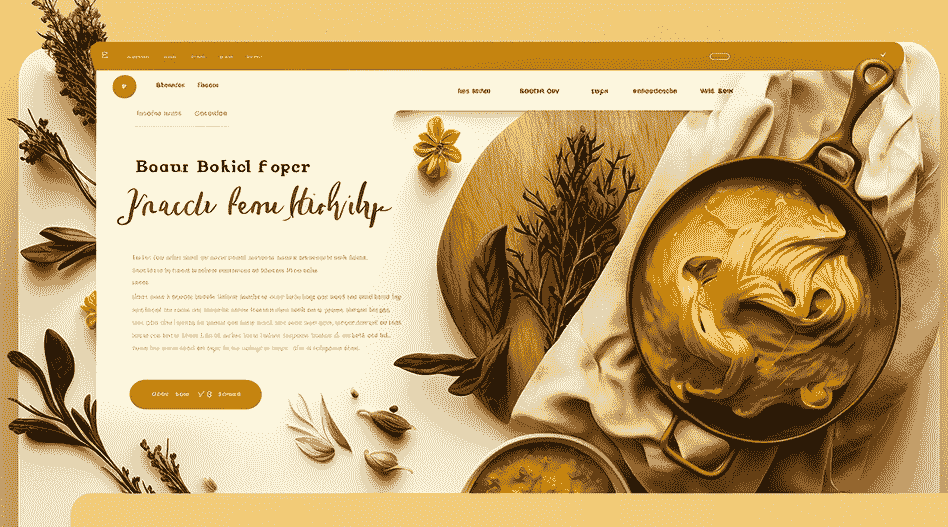

# 第六章：人工智能辅助网站设计基础

本章涵盖

+   为你的网站选择最佳主题

+   检查主题自定义

+   关注色彩心理学

+   创造优秀的构图

+   应用设计规则让你的网站看起来出色

+   从竞争对手那里获取灵感

+   请人工智能改进你的设计

WordPress *主题*主要关于设计——你的网站看起来如何。一些主题还添加了插件以增加功能，但在大多数情况下，主要关注的是外观。

有数以万计的主题。但不用担心找到完美的主题——在即将到来的章节中，我将向你展示如何轻松修改和微调*任何*主题。所以，现在，只需找到一个设计大致符合你期望的主题。一个主题为你的网站带来的具体设计元素或功能因主题而异，但这里有一些典型的元素：

+   *布局*—侧边栏、菜单、页眉图片、列文本和其他元素的位置。通常，主题会允许你在定位时选择几个选项，例如侧边栏。

+   *行为*—链接、按钮、博客页面和其他功能的外观和行为。

+   *配色方案*—设计师认为和谐且适合网站目的的颜色。主题通常为特定的网站主题设计，例如艺术家的作品集或律师的执业。在几乎所有情况下，主题都允许你在“外观”>“自定义”屏幕中轻松更改颜色和字体。

+   *字体排印*—标题、正文文本、字幕和其他文本元素中的文本字符的外观。

+   *背景*—页面周围的框架和背景图像。

+   *插件*—由主题提供的默认功能，例如电子商务系统或安全防御。

+   *小工具*—放置在侧边栏或页脚的功能，例如商店的营业时间或活动日历。

+   *表单*—由访客填写，以便你可以通过电子邮件联系他们或请求他们的信用卡等信息。

+   *图像展示*—动画你的图像的滑块或旋转木马。

+   *社交媒体功能*—自动化将你的博客帖子发送到你的社交媒体的功能，或者一个按钮，当点击时，将博客消息发布到访客的社交媒体。

每个 WordPress 网站都有一个主题。当你第一次创建一个新的网站时，WordPress 会安装一个它自己设计的默认主题。这个默认主题的名称是当前年份：二十二十五年、二十二十六年，等等。（所有过去年份的官方 WordPress 主题都保持更新和可用。）但更换到不同的主题相当容易，至少在网站建设的早期阶段。 

在网站建设初期选择合适的主题

当你刚开始建立一个新的网站时，切换到不同的主题相当简单。但如果一个网站已经成熟或规模较大，更换主题可能会很复杂。

考虑这些潜在的风险：

+   你的主题是否为你的网站带来了额外的功能（除了样式），例如短代码、自定义小工具或文章格式？如果你更改主题，这些功能将会丢失。

+   更改主题也可能损害你网站的一些核心功能，如联系表单、菜单栏和特定于主题的小工具或插件。

+   链接可能会断开——指向网站上不再存在的地址。WPBeginner 网站上关于“如何在 WordPress 中查找和修复断开的链接（分步指南）”的文章([`mng.bz/wJYa`](https://mng.bz/wJYa))描述了断开链接检查器工具以及其他可用的工具，这些工具可以帮助你确保你的网站链接是好的。此外，Themeisle 网站上关于“如何在 WordPress 中自动查找和修复断开的链接”的文章([`mng.bz/qxJ6`](https://mng.bz/qxJ6))解释了修复链接的过程。

最后，这里有一些来自 WPBeginner 关于如果你有一个大型成熟网站更改主题的好建议：[`mng.bz/7pJ7`](https://mng.bz/7pJ7)。

警告 为了避免不得不更改主题，你可能想要远离免费主题。它们更有可能被设计师放弃。相反，使用一个*免费增值*主题——一个既有免费版也有付费版的主题。当一个主题能带来收入时，其开发者不太可能停止更新它，这样就会迫使你更换到另一个主题。尽管如此，WordPress 本身提供的免费主题并没有被放弃。其中一些相当不错——尤其是 Twenty Sixteen。

## 6.1 选择合适的主题

你的网站有一个目的，最好是狭窄聚焦的单个目标。你的设计的外观和感觉应该支持这个目标。虽然大多数访问者不太可能自觉地分析设计元素，但这并不是你*忽略*它们的原因。

人们知道他们是如何感受的，即使不总是知道为什么会有这种感觉。你想要创造一个适合网站目的的空间，避免让受众感到烦恼。让他们感到舒适。

有些主题显然是不合适的：用快乐的小丑和气球装饰婚姻顾问的网站——不行。在派对租赁网站上包含农业机械的图片也不是一个好主意，同样，在医院的网站上使用血红色的朱红色作为主色调也不是明智之举。

一些主题提供各种模板——主题的变体。（模板有时被称为*子主题*）。

正如你从学校时代就知道的那样，受欢迎并不保证未来的成功，但它提供了一个线索。与插件一样，你想要寻找一个受欢迎的主题——在大多数情况下，这预示着质量和持久性。如果你不想一开始就投入太多，你可以从免费增值主题开始——首先使用其免费计划，也许以后可以升级到付费计划。以下是一些质量上乘且受欢迎的主题列表（[`mng.bz/mGzW`](https://mng.bz/mGzW)；除 Divi 外，所有都是免费增值）：

+   *Astra*——这个主题提供了相当多的预建或模板元素可供选择，包括菜单、布局、颜色选项等。它还与 WooCommerce 和各种页面构建器插件兼容，并包括搜索引擎优化（SEO）工具。

+   *OceanWP*——这个主题拥有一系列适用于许多目的的预建完整网站。它还与 WooCommerce 和 SEO 兼容。

+   *Divi*——由 Elegant Themes 提供，Divi 拥有自己的拖放式页面构建器以及许多为各种网站目标准备的现成布局。它还具备与 SEO 和 WooCommerce 的额外兼容性。它不是免费增值产品，但您可以免费试用 30 天。

+   *SeedProd*——SeedProd 不仅是一个即将推出的页面实用工具，它还拥有一个备受尊敬的拖放式页面构建器和一系列高质量的模板。

+   *Ultra*——这个主题包含了一组可用的示例网站，您可以用它们作为构建的基础。它还拥有一个名为 Themify 的专有页面构建器。

人工智能将为您找到适合您网站主题的好主题

编写一个详细描述您网站的提示，然后向人工智能请求一份好主题的列表。我将这个测试提示提交给了 Claude ([`claude.ai`](https://claude.ai))，它回应了良好且合适的主题建议：

|

| 我的 WordPress 网站是关于帮助残疾人士制作手工艺品的，特别是制作手工项链和手镯。我们使用珠子来制作这些。您是帮助残疾人士制作手工艺品的专家。请列出三个非常受欢迎且非常适合我的网站的免费增值主题。 |
| --- |

不要忘记响应式

在选择主题时，请确保它是*响应式的*。响应式意味着您的网站页面布局、菜单和其他元素将能够有效地重绘和重新排列，以便访问者可以在任何尺寸的屏幕上轻松阅读、点击以及其他交互。您的网站将在从平板电视到手机等各种尺寸的屏幕上被查看。显然，适应所有这些尺寸和屏幕形状是一项必要且具有挑战性的任务。

大多数网站构建器是在桌面显示器上构建网站，但大多数网站访问者将使用手机（据估计，60%的所有互联网流量都是通过手机）。显然，在 27 英寸显示器上用鼠标轻松点击的链接，在手机屏幕上用手指点击可能会相当困难——除非链接之间有足够的空间。

响应式需要各种调整。例如，在大屏幕上显示为水平菜单项列表的内容，在手机上将以垂直方式显示。有时你只能看到“菜单”这个词。访问者点击这个词以打开垂直菜单项列表。

一个高质量的主题将确保响应性——文本易于阅读，链接可以轻松触发，页面设计不会歪斜——即使缩小到 2 英寸宽的手机屏幕。话虽如此，在你将网站公开之前，请在多种屏幕尺寸和形状上测试它——手机、平板、笔记本电脑和显示器——以查看是否需要做一些调整。并且请注意，谷歌通过许多其他因素来判断网站的质量，其中包括移动友好性。

你可以访问你网站上的任何页面，然后按 Ctrl-Shift-I 打开检查器。在顶部，你会看到“尺寸”。下拉该菜单以查看你的网站在不同屏幕尺寸和形状上的显示。

## 6.2 使用最新的主题

你应该安装一个由其开发者保持更新的主题。这也是选择付费或免费增值主题的另一个原因，因为这些主题的所有者正在赚钱，并且不太可能放弃这种收入来源。这不是一个绝对的长期保证（一些主题开发者已经放弃了一个主题，转而使用另一个，一些已经倒闭），但我们谈论的是概率。

如果一个主题在 WordPress 库中列出，将鼠标悬停在主题的缩略图上，然后点击“更多信息”。这将告诉你该主题有多受欢迎以及它是否在保持更新。以下是避免过时主题的五个原因：

+   *安全性*—未更新的主题可能成为黑客的目标，因为更新通常包括针对安全漏洞的补丁。记住，主题，就像插件一样，是计算机代码，因此可能为恶意软件提供入口。

+   *兼容性*—WordPress 本身会定期更新。如果你的主题没有跟上这些更新，你可能会开始遇到兼容性问题，这会影响你网站的功能。

+   *用户体验（UX）*—网站设计和功能会不断发展。如果一个主题没有积极改进，可能会看起来和表现得很过时。它可能会变得缓慢，甚至无法有效地响应，导致在各种形状和大小的屏幕上看起来很糟糕。

+   *无支持*—如果一个主题被放弃，那么任何支持也将随之消失。因此，如果你在主题上遇到问题，你将无法从其开发者那里获得解决方案。

+   *无新功能*—除了填补安全漏洞外，主题更新还可以包括新功能或对现有功能的改进。这也会限制你网站的功能和吸引力。

定义层叠样式表（CSS）是一种设计语言，它允许你几乎完全修改主题的任何设计选择。我们将在第七章深入探讨 CSS。你会发现你实际上不需要学习 CSS 语言。你只需描述你想改变的内容，AI 就会为你编写代码。或者你可以使用所见即所得（WYSIWYG）插件，该插件也会自动为你生成 CSS。（回想一下，如今，人类程序员正迅速变得不再必要。）

## 6.3 避免安装多个主题

您可以使用专门为此目的的插件在 WordPress 网站上同时激活多个主题。因此，如果您想为博客页面或显示目录的几个页面提供不同的外观，您可能会尝试多主题安装。但说实话，拥有多个主题可能比它值得的麻烦更多。支持多个主题的插件来来去去相当快，所以如果您安装了一个，您可能最终需要找到替代插件。此类插件也可能减慢您的网站或产生副作用和兼容性问题。

因此，您最好考虑激活一个如 SeedProd 这样的单一主题，它提供了许多页面模板。它有一个拖放页面构建器，让您可以自由地单独设计页面。SeedProd 还提供了 150 多个预设计模板，可以单独应用于不同的页面。实际上，它就像一个多主题集合。Astra 和 Divi 也是值得考虑的优秀的多模板主题。

TIP 激活您选择的主题后，请转到外观 > 主题屏幕。如果有其他已安装的主题，请卸载它们。不活动的主题会占用服务器空间，可能成为恶意软件的入口（毕竟，它们是托管服务器上的代码），并且可能会减慢您的网站速度。

## 6.4 不要修改主题代码文件

“看看，但不要触碰”是访问外观 > 主题文件编辑器屏幕时最好的建议。WordPress 本身显示此消息：在这里更改 CSS 没有必要——您可以在内置 CSS 编辑器中编辑和实时预览 CSS 更改。然后，WordPress 提供了一个链接到您的网站外观 > 定制 > 额外 CSS 屏幕。正如您将很快了解到的，该 CSS 屏幕是您应该修改 CSS 的位置，而不是在主题的 style.css 文件中。

修改主题 CSS 代码时出错很少会引发灾难。毕竟，CSS 是关于设计的——它只是描述了一个网站的颜色、布局和其他外观元素。这类事情不会破坏网站。

但将 CSS 代码放入额外 CSS 屏幕的一个好处是，当您的主题更新时，此屏幕保持不变。因此，您的 CSS 得以保留。相比之下，您在主题文件编辑器中进行的任何更改都将被主题更新覆盖。

主题的 CSS 文件不是您可以在主题文件编辑器屏幕中访问的唯一代码文件。图 6.1 显示了主题的一些 PHP 和 JavaScript 编程代码文件。（您在这里看到的内容取决于您的主题。）

图 6.1 如果您愿意，可以查看您主题的代码文件，但不要修改任何内容。

编程代码文件控制网站的*行为*而不是外观。例如，有代码描述了博客页面应该如何列出其帖子。其他代码管理网站的内置搜索工具。如果您对这些内容进行修改，您最好知道如何用 PHP 或 JavaScript 编程。并且记住，您在这里所做的更改将在下一次主题更新时被清除。

一些安全插件、托管服务、IT 人员和主题开发者——厌倦了在人们破坏这些主题代码文件时不得不提供技术支持——简单地从 WordPress 菜单中移除了主题文件编辑器。还有一个“插件”>“插件文件编辑器”，同样适用“不要触摸”警告。所以除非您真的理解代码语言，否则请避免修改主题或插件文件。

## 6.5 利用“外观”>“自定义”屏幕的优势

主题为您提供了一些修改网站设计元素的简单方法。它们位于“外观”>“自定义”屏幕中。主题开发者决定您可以在这里进行多少和哪些修改，因此在不同主题之间，您获得的选择范围相当广泛。

免费主题通常只允许您进行少量自定义。但流行的付费主题通常提供更多选择，不仅在“自定义”屏幕中，在其他地方也是如此。一些付费主题甚至包括功能齐全的页面构建系统——类似于 WordPress 的 Gutenberg 块编辑器，但通常更好。

您可以在“外观”>“自定义”屏幕中进行的多数修改都是所见即所得。您可以立即看到您更改的效果。并且记住，鉴于您没有修改主题文件（在主题文件编辑器屏幕中），您在“外观”>“自定义”屏幕中进行的更改将保留在主题更新后。

这里是 WordPress 自己的 Twenty Sixteen 主题提供的自定义列表。这个集合是免费主题提供的典型示例：

+   *字体样式*—字体家族、粗细、下划线、删除线、上划线、大小写、颜色、背景颜色、大小、字母间距、边距、填充、边框和边框半径。这些自定义可以应用于正文文本和六级标题。

+   *网站标识*—标题、标语、标志和图标（它是一个在浏览器标签页和书签中显示的小符号）。

+   *颜色*—完整的配色方案（包括暗色、系统色、亮色、红色、黄色、默认色），页面背景颜色（所有页面文本和媒体内容的下方），页面框架颜色（页面的边框），主要文本（正文文本和标题），次要文本（页脚、标语、文章中的日期），以及超链接。

+   *页眉图片*—出现在网站的每一页上，通常位于网站标题下方，但位于正文内容上方。

+   *背景图片*—作为页面边框出现的图片，取代了页面框架颜色。

+   *菜单*—菜单的位置。与在“自定义”屏幕中工作相比，前往“外观”>“菜单”屏幕来管理菜单位置更有效率。

+   *小部件*—功能单元（如日历、商店地图），类似于插件，出现在您网站的侧边栏中。与在“自定义”屏幕中工作相比，在“外观”>“小部件”屏幕中操作小部件更方便。

+   *主页设置*——你的网站是否在主页上显示博客，或者是一个静态页面。在设置>阅读屏幕中管理这一点更有效率。

+   *附加 CSS*——一个你可以自定义网站外观、添加自定义动画和其他设计修改的屏幕。我们将在第七章深入探讨 CSS。

## 6.6 考虑颜色的心理学

就像许多其他设计元素一样，人们的感受会受到你网站配色方案的影响，即使他们没有意识到这一点。颜色唤起潜意识的感觉，传达出支持或反对网站目的的信息。颜色可以在你的访客中营造一种氛围，甚至可以影响他们在网站内的行为或加快他们的退出速度。

幸运的是，有一些指南可以帮助你选择页面背景、页面框架、字体排印和其他元素的颜色。例如，医疗网站几乎普遍选择白色的变体（传达清洁），搭配浅蓝色（可靠性、值得信赖和权威）。绿色和白色的搭配较为罕见，尽管绿色与健康相关。红色极为罕见，原因与你在候诊室找不到斗牛画一样，除非医生和他的整个团队都麻木不仁。

万圣节网站以黑色和橙色为主。婚纱店当然选择白色，以及精致的粉彩。圣诞商店则使用红色、白色和绿色。银行使用蓝色，较少使用红色（与行动相关）和黄色（温暖）。一些法律和银行网站完全摒弃颜色，选择单色方案——黑色、白色和灰色（暗示严肃——这里没有开玩笑——颜色是轻浮的）。

向 GPT 或其他 AI 系统咨询有关颜色的建议和资源

咨询 GPT 关于颜色的好方法是提出以下问题：

|

| 适合[你网站目的]的好配色方案是什么？ |
| --- |

我让 AI 就餐饮业务提出建议，它提出了以下建议：

|

| 对于餐饮业务网站，一些流行的配色方案包括浅色系，如象牙色、米色、白色、浅黄色和浅灰色。另一种选择可以是土色，如棕色、橄榄绿、米色、赭色和深橙色。你也可以考虑暖色系，如黄色、陶土色、橙色、红色和金色。在选择配色方案时，重要的是要考虑餐饮业务的整体品牌和传播信息。你希望给访客留下什么样的印象？       (1) 内部色彩选择与您的餐厅信息 - WebstaurantStore. [`mng.bz/MDO2`](https://mng.bz/MDO2)       (2) 15 Best Restaurant Website Color Palettes That Will Wow Everyone! [`mng.bz/avdJ`](https://mng.bz/avdJ)       (3) 60 Best Website Color Schemes for 2025 &#124; Design Shack. [`mng.bz/gaVR`](https://mng.bz/gaVR)       (4) 31 Best Colors for Websites (2024) - Colorlib. [`mng.bz/eyDJ`](https://mng.bz/eyDJ) |
| --- |

记住，GPT 等人工智能工具是*聊天机器人*。这意味着你可以与人工智能进行对话，并通过提出额外的问题来完善其回答。注意，在第一次回应的推荐末尾，GPT 会要求你更加具体：

|

| 你希望给访客留下什么样的印象？ |
| --- |

你可以做出以下回应：

|

| 我们提供南方烧烤食品及其相关配料。 |
| --- |

小贴士 访问与你的品牌或提供的服务相似网站。并且记住，过多的颜色，或者鲜艳、醒目的颜色（如霓虹色），可能会令人不安。此外，务必要求人工智能列出你网站上关于该主题的五个最受欢迎的网站的链接。

当然，你可以选择一个反映你网站主题的主题，然后信任设计师在“外观”>“自定义”屏幕上的选择，或者选择合适的默认配色方案或配色方案。如果你对色彩理论感兴趣，Elementor 博客上的这个教程对初学者来说是个不错的选择：[`mng.bz/vKOm`](https://mng.bz/vKOm)。

## 6.7 注意布局

*布局*——即你页面中各种内容区域如何互动——在设计网站时也必须考虑。这些区域由文本块、媒体（如图片或视频）以及被称为空白区的空白区域组成。但区域也可以是侧边栏、菜单或其他独立的内容区域。主要思想是，你希望你的页面看起来平衡。

当人们听到“平衡”这个词时，他们自然会想到对称——就像天平或摆锤那样的均衡。但视觉上，如绘画或网页，平衡并不那么简单。许多因素都在发挥作用。通常，严格的对称是最差的选择！

假设你正在拍摄一幅壮丽的山景：一幅**平衡**的摄影作品将涉及前景中适量的风景，比如一只驼鹿或一栋房子。在背景中，可能有一座雪山。最后，你会在上方有一个明亮的蓝天。正是这些部分之间的对比提供了维度和吸引力。但你需要确保前景、背景和天空是平衡的。例如，不要太多天空或太少，也不要三个相等的区域。

注意：考虑一下鸡蛋。有人说它是一个完美的形状，因为它是一个非对称的球体。

### 6.7.1 实现不对称的平衡

视觉平衡可能涉及多个相互作用的元素：从内容之间的空白空间、引导视线的线条、颜色、对比度、标题大小等等。而且还有一些看似矛盾的地方。例如，一个大的空白区域可以与一个较小但内容详细的区域具有相同的视觉重量。换句话说，空白本身就有重量。幸运的是，有一些规则你可以运用来创建令人愉悦、平衡的页面。而且更加幸运的是，你现在有一个设计专家为你提供建议——你的 AI 助手。

一种策略是让专业人士（或一个在视觉设计方面有才华的朋友）给你提供预设计的布局供你选择。然后，你只需使用他们的布局模板，用你的图片和文字替换他们的。设计师创建的布局在大多数情况下已经很好地平衡了。你只需使用设计师使用的文本和图片或其他媒体块相同的定位和大小。然而，有一个缺点是这可能会导致你网站上页面之间过于相似，甚至使用相同模板的网站之间也相似。

布局涉及调整页面内容的定位、大小和对齐。你的目标是最终得到一个视觉上吸引人的设计，适合你想要页面传达的信息。同时，它也应该引导访客沿着你希望他们走的路径。 

首先，你想要创建一个起点，一个**焦点**，页面中某个方式上更为强烈的区域——它就是首先吸引观众注意力的地方。它就是他们将在页面中开始他们的路径的地方。也许它是最详细、最大、最亮，或者在某些情况下，页面中最令人震惊的区域。很快你就会看到，有一条规则可以告诉你焦点应该放在哪里，实际上页面中有**四个特定的位置**你可以选择。这被称为**三分法**。你很快就会了解更多关于这个规则的信息。

小贴士 在网站术语中，焦点通常被称为*英雄*。尤其是在主页上，你希望焦点以某种方式定义或代表网站。英雄通常是图像或其他视觉元素。如果是文字，它应该是一个简短的标题。英雄的品质——颜色、字体、形状等——通常也应该反映在页面其余部分的设计中。这提供了视觉上的连贯性。

你的页面应该是平衡的——视觉上权衡，使内容区域分布得令人愉悦。达到理论上理想平衡的最简单捷径就是使页面对称。然而，精确的对称性可能会导致页面看起来静止、过时，甚至死气沉沉。尽管总有例外，但许多吸引人的现代网站都避免严格的对称性。这就是为什么当被问及完美的形状是什么时，有些人会说鸡蛋而不是球体。

### 6.7.2 考虑蒙德里安的经典平衡技巧

皮埃特·蒙德里安的画作因其不使用严格对称性达到平衡而闻名。注意在图 6.2 中，某些区域在大小上几乎是对称的。但，整个构图在水平和垂直方向上都是平衡的。（这张图片不是蒙德里安的原创作品；它是通过 Midjourney AI 以蒙德里安的风格生成的。并且已经移除了颜色，以聚焦于形状及其相互作用。）图 6.2 中存在*一些*对称性——你能找到吗？（答案即将揭晓。）

图 6.2 当设计页面布局时，你的任务是有效地平衡各种内容块，而不必求助于对称性。

批评你的布局的一种方法是将页面分成四个区域，然后看看这四个区域是否具有密切相当的视觉重量。图 6.3 展示了这一点。

图 6.3 当图像被分成四个象限时，你可以更容易地检查平衡。

有些人会说，显然右上区域比其他区域轻。但重量不仅仅是关于区域平均的暗度或细节的多少。*视觉重量*意味着判断设计的相对复杂性（在这个例子中，*复杂性*意味着每个象限中有多少线条）以及形状的*大小*（形状越大，重量越重）。这些因素必须同时考虑。

有些人会说，按照那个规则，任何细分空间都会自动达到平衡，因为线条越少，空间越大，反之亦然。在某些页面上，这将是正确的，但如果你消除了线条的复杂性，结果可能会产生不受欢迎的对称性。看看图 6.4，其中移除左上象限的线条产生了一种明显的对称性。与图 6.3 进行比较，看看这种差异。

图 6.4 移除此设计中的线条，对称性是不可避免的。

你可以通过将页面对角线分割来进一步分析平衡——从而显示四个三角形形状。当然，我们在这里简化了事情，只考虑直线、灰度和矩形。曲线和其他非矩形形状当然也发挥作用，颜色、字体和其它因素也是如此。随着时间的推移，你可以训练你的眼睛去寻找对称和平衡。有些人发现眯眼有助于看到图像区域之间的整体关系。

现在，让我们回到之前关于图 6.2 中对称性的问题的答案。原始页面上的对称性是通过穿过中间的水平线创建的，这导致上半部和下半部大小相等。

在自然摄影中，经常有一条主要的分割线将天空与地面分开。它被称为*地平线*。专业摄影师认为，将镜头框架中的这条线放在正中间是不良的实践。这是一种对称。在其他方面，地平线在正中间意味着你给予天空和地球同等的重要性，好像你无法决定哪个应该占主导地位。

这样想：如果你将地平线定位在框架的上方，你允许地球在画面中占主导地位，并且希望最有效的视觉（焦点）被发现在这个空间内。观众首先会看主导区域内的焦点，然后才会看到天空，反之亦然。

如果你发现很难在完全对称和不平衡的构图之间找到一个好的折衷方案，你可以做什么？你会找谁？GPT 和其他人很乐意扮演艺术评论家的角色。

你可以为 GPT 上传一张图片以供查看和评论。你甚至可以要求它为你修改图片，并将改进后的版本作为下载返回给你。让我们试试：

|

| 作为一位经验丰富且敏感的艺术评论家，逐步思考，请回答以下问题：    1.  这是一个平衡良好的构图吗？    2.  我们想避免对称设计——这幅画是否成功地避免了对称？    3.  是否有一个清晰的焦点，如果有，那是什么？    4.  通过裁剪能否改善构图？如果可以，请在图像上画白色线条以显示你将如何裁剪。按顺序回答这些问题。并且要具体，不要模糊或犹豫不决。 |
| --- |

|

| 这幅图像展示了一片宁静而美丽的风景，让我们根据您的问题来分析它：构图平衡：构图平衡得很好，有元素引导观众的视线穿越整个场景。两座起重机形成了一个自然的兴趣点，左侧的鲜艳花朵与之平衡。阳光透过树木形成了一个发光的点，与水和叶子的较冷色调形成对比，有助于平衡。避免对称：构图避免了严格的对称，这有助于创造一个更动态和自然的场景。虽然有一些对称元素，如两座起重机和水面上的倒影，但它们被树木、花朵和光线的非均匀分布所抵消。这种不对称提供了自然随机感，避免了完美对称可能带来的僵化感。焦点：清晰的焦点是水中的两座起重机。它们位于中心，与水和树木较暗的背景形成对比。它们在水中的倒影也增强了它们在构图中的突出度。裁剪潜力：虽然构图已经很强大，但裁剪可以用来强调某些元素。例如，将起重机稍微偏离中心的裁剪可以增强构图的动态感，可能遵循三分法规则。裁剪掉右侧的一部分也可能使场景更多地聚焦于起重机和它们背后的阳光。让我们尝试裁剪，看看我们是否能稍微改变焦点，更紧密地遵循三分法规则，以创造一个更具吸引力的构图。我会进行调整，并展示结果。图像已被裁剪，以通过将焦点——起重机——稍微偏离中心并遵循三分法规则来增强构图。这种调整可能使观众的注意力更多地集中在起重机和它们背后的明亮阳光上。您可以从下面的链接查看和下载裁剪后的图像。 |
| --- |

### 6.7.3 出了问题

GPT 第一次尝试裁剪是不合理的，几乎切掉了图像的 50%！它没有遵循其文本响应中的建议。它没有像建议的那样将起重机稍微偏离中心，而是完全移除了起重机！因此，我们来回尝试了三次更多，聊天，我要求它遵循其文本建议，这些建议是好的。最后，我告诉它“慢慢来”和“做你说的”。然后 GPT 最终花费了之前努力的两倍时间。它最终通过最终给我展示在图 6.5 中的裁剪而成功。

图 6.5 GPT 通过有效的裁剪改进了这幅构图。白色线条显示了图像被裁剪的位置。

总结本节的主要观点：在构图时尽量保持平衡，但避免仅仅通过严格对称的设计来采取懒惰的方法。这样确实可以达到平衡，但会显得无聊、死板。即使你对结果感到满意，向 AI 寻求意见也从未有过害处。

### 6.7.4 空白空间与负空间

之前的蒙德里安例子没有考虑到通常在网页中分隔内容区域的背景。有两种类型的分隔：空白和负空间。两者都是重要的设计概念，并且相互关联，尽管经常被互换使用，但存在传统的区别。负空间有时被包含在内容*之内*；空白空间与其他空白区域相连。这意味着什么？

*负空间*指的是内容之间的空间。换句话说，任何不是正空间（如段落或图像）的内容。有时它被用来创建可以增强构图或传达额外意义的形状或图案。负空间不一定是白色或单一颜色。它是背景。

如图 6.6 所示，联邦快递的标志是一个使用负空间传达信息的例子。E 和 X 之间的空间形成了一个箭头，象征着快速交付，我想。

图 6.6 对于大多数人来说，这里的箭头是一个潜意识信息。

与之相反（也称为*空白空间*或*空空间*），*空白空间*指的是页边距、填充或列、字体行、图形、图像或其他设计元素之间的空间。空白空间来源于印刷设计——书页上未印刷的部分，如页边距。它的目的不是像负空间那样传递潜意识信息，而是帮助平衡布局并提高可读性。

空白实际上不一定是白色的；它仅仅是那些没有文本或媒体的区域。空白空间的目的在于给你的设计元素留出呼吸的空间，或者通过将页面分割成文本块来避免视觉过载。空白空间还可以帮助引导访客的眼睛在页面上移动。

负空间与空白空间的主要区别在于，负空间在概念上用于创建形状或增强设计的意义。但空白空间更多的是一种实用功能。空白空间应该用来使网页看起来更有吸引力。

人们通常会对大量的灰色文本感到厌烦。他们会觉得你是在给他们布置任务。因此，你希望你的文本以段落形式呈现，通过空白分隔，并且足够窄的列宽，这样读者就不必费力地找到下一行的起始位置。

## 6.8 使用三分法规则

著名的三分法规则是帮助你实现网站页面不对称平衡的优秀工具。它还引导观众的目光到页面最重要的位置（页面的主题，焦点）。

当处理视觉构图——照片、绘画或网页——时，三分法规则是视觉艺术家广泛应用的 fundamental 原则。它最早在 18 世纪由约翰·托马斯·史密斯在 1797 年出版的《关于乡村风景的评论》一书中提出。

### 6.8.1 精通裁剪以强调焦点

三分法规则通过叠加两条等距的水平线和两条等距的垂直线，将页面或绘画分成九个相等的部分。*裁剪*是艺术家常用以提高图像质量的方法。你可以通过裁剪（如图 6.5 中所示，使用起重机进行裁剪）来最好地遵循三分法规则。

裁剪和外扩

*裁剪*意味着从图像的边缘裁剪掉——从一边或多边裁掉一些内容。这可以做几件事情：改变宽高比（图像的形状）、重新构图，或者——就像我们下一个例子中那样——通过使用三分法规则改善构图并突出主要焦点。

*外扩*——现在由于 AI 可以操纵视觉，因此成为裁剪的相反操作。在外扩（也称为*扩展画布*或*边缘扩展*）中，你上传一张图片，然后要求图片的一侧或更多侧边被*扩展*（而不是裁剪，就像裁剪时那样）。这怎么工作？你如何向原始图像中未包含的图像添加视觉内容？在 AI 出现之前，这是不可能的。

外扩*扩展*图像，创建反映图像的视角、风格和内容的*新内容*。新内容是现有内容的变体——而不仅仅是复制。 (外扩一张新鲜产品的图片，可能会在现有的苹果箱中添加一个香蕉箱。) 外扩还可以与三分法规则一起使用，将焦点移动到一个新的和扩展的网格上。关于这一点和其他技术的更多内容将在第七章中探讨。

提示：*宽高比*指的是照片、绘画或其他图像的形状。传统上，风景图像的宽度大于高度。肖像画则相反——高度大于宽度。在电脑显示器上查看网页时，网页处于风景模式。手机通常处于肖像模式，除非你将手机旋转 90 度以将其转换为风景模式。大多数电脑显示器具有 16:9 的宽高比，因此它们是风景模式。

通过裁剪应用三分法规则最常见的方式。裁剪工具可在任何高质量的图片编辑器中找到，例如 Photoshop、Paint.NET 或 GIMP。（后两者是免费的，可以从[`ninite.com`](https://ninite.com)安全下载。）

当你在照片编辑器中使用裁剪工具时，网格线会自动显示在图像上，将三分法网格叠加在图像上。定位焦点的良好位置是网格线交叉的地方。

图 6.7 显示了如何拖动裁剪网格（使用照片编辑器的裁剪工具）直到男人的眼睛位于两个焦点上，嘴巴位于网格线上。将此图像与图 6.8 进行比较，它显示了裁剪的结果。为了使用此工具平衡您的网站页面，请截取一个页面的屏幕截图，并将其加载到您的照片编辑应用程序中。

图 6.7 如果将焦点（s）放在网格线或交叉点上，构图将得到改善。（照片由 Midjourney 提供）

图 6.8 在裁剪掉图 6.7 中较早显示的原作的左侧 25%后，这幅肖像更有效。

三分法网格将向您展示如何改进您网页焦点（您试图出售的画作的照片或主要标题）的位置——无论您希望访客首先注意到什么。然后，拖动裁剪网格直到您的焦点位于三分法显示的四个交叉点之一。裁剪工具将在裁剪网格的边缘显示八个小方块（拖动把手，如图 6.7 中所示），任何一个小方块都可以被拖动以重新定位网格线。顺便说一句，如果您没有注意到头发和烟雾之间的关系，那么您可能具有除了设计之外的其他才能。

或者，你可以在网格线上某个位置简单地定位焦点。这种方法虽然不那么强大。你的焦点离网格四个交叉点越远，效果就越弱。

小贴士以下布局建议主要适用于您网站上静态（非滚动）且在典型计算机显示器上查看的页面。屏幕大小或形状的变化通常会重新框定您的布局。因此，了解您的观众使用什么来浏览。在后面的章节中，我们将探讨获取有关观众及其如何查看您网站的方法。

让我们尝试一个例子。我们将使用画作，但同样的技术也可以应用于你的网页。如果您的网站在大屏幕上查看，以下的设计建议将非常有帮助。

### 6.8.2 测试三分法规则的实际效果

图 6.9 显示了网格三分法规则覆盖在画作上。四个箭头指向主要焦点区域。这些是焦点应该定位的交叉点。为了实现这一点，你需要拖动裁剪工具的把手（网格框架上的八个小方块）直到画作焦点位于这些交叉点之一。把手可以拖动到不同的方向来定义裁剪。

图 6.9 如果可能的话，将焦点定位在这四个交叉点之一。

一些图片将有一个以上的焦点。有时，你可以裁剪，使得两个或多个焦点位于交点（参考图 6.7）。但在下一个例子中，农舍中最亮的部分将成为我们的焦点。因此，我们将网格移动，直到农舍位于四个交点之一。

图 6.10 显示，我们已经将网格拖动到将右下角交点放在农舍正上方。现在你也可以看到裁剪将发生在哪里——顶部有一点，右侧更多一点。

图 6.10 网格已被调整大小，以便将农舍放置在焦点交点。

最终的结果，如图 6.11 所示，是一个更强的构图。现在图像具有更好的整体平衡和深度，首先将观众的目光引向兴趣点——那座农舍。这张图片现在明显是关于农舍的，其次是它的背景，山谷，而不是天空。

图 6.11 与之前图 6.9 中展示的原始场景相比，现在这个场景在几个方面都更为突出。有一个明显的焦点，因此观众首先看到的内容毫无疑虑。

然而，你可能想要以不同的方式裁剪这张图片，因为之前图片的宽高比通常用于肖像而非风景。进一步的裁剪（图 6.12）可以将图片变成传统的风景形状（宽度大于高度）。你越是用裁剪工具及其网格，就越会珍视它在平衡整体图像和强化焦点时的有用性。

图 6.12 尝试不同的形状，直到你得到满意的结果。

### 6.8.3 向 AI 寻求决策

如果图片中有人物，他们的眼睛通常是焦点。这在图 6.13 中农民的脸部得到了体现。

图 6.13 在肖像画中，眼睛通常是焦点，所以你可以像这样裁剪这幅画，强调右眼。

在图 6.14 中，你可以看到我们农民肖像重新平衡后的结果。裁剪后，农民的左眼成为了焦点。

图 6.14 在原始图像和重新平衡的图像之间进行选择当然是主观的。但经过一段时间，三分法规则已被证明是有价值的。注意，通过裁剪，我们也改变了从方形到肖像形状的宽高比。

在进行这些修改（或咨询知名艺术评论家、GPT 或 Claude）时，你需要使用自己的判断力。例如，你可能更喜欢图 6.15 中展示的裁剪结果。这仅仅是将焦点从他的右眼移到了左眼。

图 6.15 通过仅将焦点稍微向左移动，你减少了画中农民的突出度。

图 6.14 和 6.15 都是好的构图，所以它们之间的选择可以基于您想强调的内容以及强调的程度。图 6.15 具有更好的深度且不那么激进。

当然，您可以上传多张图片并让 GPT 分析它们的差异。我将这三幅农民画的版本都提交给了 GPT，看看它认为哪一幅是最平衡、最令人愉悦的构图。GPT 回复如下：

|

| 农夫 3 对我来说是最令人愉悦的。它和谐地平衡了主题的详细描绘与环境背景，使观众对人物及其周围环境有一个全面的理解。构图感觉经过深思熟虑，看起来更有效地吸引了观众的注意。 |
| --- |

我无法对此提出异议。

### 6.8.4 考虑其他一些设计规则

眼动研究显示，当观察图像时，人眼自然地倾向于三分法规则中的交点。（人们通常不会从画布或网页的中心开始看。）因此，网格与这种自然倾向相结合，导致更美观、吸引人、动态和平衡的图像。

如果您将主题直接放置在屏幕中央，这往往会使图像变得平淡，使其更加静态。结果通常缺乏动态性，类似于严格对称的布局。将主题放置在中心之外往往会产生更有力、更有活力、更吸引人的图像。

是否有其他设计规则？是的，有几个（三角形、对角线、交替网格）。其中最著名的规则被称为黄金比例（或黄金螺旋）。它是一种在自然界中可以看到的数学进步，如向日葵、DNA 和鹦鹉螺贝壳，如图 6.16 所示。

图 6.16 著名的黄金比例在自然界中显现，但也用于艺术、建筑、时尚和电影。这个贝壳是由人工智能生成的。它不可能在自然界中存在。你能看出为什么吗？

如果您对如何应用黄金比例感兴趣，Photoshop 有另一个裁剪网格可以帮助您。或者您可以使用这个公式：a/b = 1.618。例如，如果您的建筑宽度为 25 英尺（b），那么高度（a）应大约为 25 × 1.618 = 40.45。

另一个相关的规则被称为斐波那契螺旋（序列或曲线）。**《戴珍珠耳环的少女》**和**《蒙娜丽莎》**都是基于这种模式构建的。它可以通过一系列长度为斐波那契数的正方形来构建。从框架内每个正方形的对角线绘制弧线，形成一个类似螺旋的曲线，引导观众的视线绕过画面。通常，最大的细节位于最小的盒子中。这个规则就像一个漩涡，只产生一个焦点。

在 Midjourney 中保留图像风格或特征

另一个需要记住的规则是*简洁性*。现代设计品味倾向于极简主义。一个极简主义网站页面通常是最好的，除非你在卖被子或类似的东西。上传你的网页截图，并要求 Midjourney（使用带有`–sw`设置为`800`的`--sref`功能）或 GPT 修改图像，使其更加极简。

Midjourney 的`--sref`功能非常强大。它意味着*风格参考*。要使用它，你需要上传一张图片（或几张），Midjourney 就会创建出具有提交图片风格的新的图像。你可以通过使用`–sw`（风格权重）参数来调整上传图片的影响程度。给`–sw`赋一个介于 0 到 1,000 之间的数字。

有一个相关的参数叫做`––cref`，用于*角色参考*。除非你使用`–cw`（角色权重）参数，默认值为`100`，它可以设置为`0`到`100`。在`100`时，生成的图像将复制上传图片的服装、头发、面部特征，甚至配件。但在`0`时，只有面部被复制，服装和其他元素则不会。

答案：图 6.16 中的壳体就像埃舍尔的楼梯。它从壳体的中心开始，是一个内部视角，但随着你向外环绕，逐渐翻转成为外部视角。正如你所见，Midjourney 完全能够生成甚至像埃舍尔这样的艺术家复杂风格的图像。

所有这些话都说了，规则是为了被打破的，所以如果你对构图和设计整体敏感，你可以做出例外。如果有人有权利打破规则，那就是达芬奇。他实际上在画框中将蒙娜丽莎水平居中。但他确实以几种方式遵循三分法，包括将那个微笑放在网格线上。

最后一个焦点示例：Midjourney 被要求以蒙德里安的风格创作一幅画，但必须非常严格地遵循三分法。在图 6.17 中，注意八处白色标记表示网格线的位置。另外四个标记表示中点。

图 6.17 这种对三分法的超级严格应用产生了相当多的对称性。

图 6.18 显示了过度严格遵循三分法会产生许多对称的矩形——无论是大小还是位置。

图 6.18 如果将一些方块组合成更大的矩形，甚至比这些箭头显示的对称性更多。一个例子是中间的线条，它水平地切分了整个图像。

如果你觉得页面设计太麻烦、不有趣或不可能，你可以请一个与视觉设计相关的人审查你的网站并提出建议。或者，像往常一样，咨询 AI 以获得改进建议。GPT 等系统内置了文本到图像的能力，因此你可以首先上传你的页面并请求建议。然后，请它创建一个包含这些建议的新图像。如果你想进行进一步修改，只需提出一个或两个后续问题，就像我们之前在裁剪时做的那样。

## 6.9 使用 AI 分析网站设计

AI 可以利用其庞大的互联网内存来检查你最成功的竞争对手的网站，然后为你提供有关改进网站外观的质量建议。查看与你主题相似网站的布局是个好主意。比如说，你想为图书馆创建一个网站。一种方法是将以下任务分配给 GPT：

|

| 列出五个获奖的图书馆网站。 |
| --- |

当你访问这些网站时，研究它们的设计以获取可用于你网站的灵感。此外，从浏览器地址栏复制设计良好的网站的 URL 地址，然后访问 WPThemeDetector 网站（[www.wpthemedetector.com](https://www.wpthemedetector.com)），并将地址粘贴到其搜索字段中。如果一个网站正在使用 WordPress 主题，这个检测器会告诉你哪个主题，并提供该网站使用的插件列表。你还可以通过探索获奖网站来获得良好的设计灵感：

+   “21 个优秀的 WordPress 网站示例，你应该看看”（[`mng.bz/mGzW`](https://mng.bz/mGzW)）

+   “5 个获奖网站及其你可以从中学习到的内容”（[`mng.bz/6eGp`](https://mng.bz/6eGp)）

+   “14 个获奖网站设计（以及它们做对了什么）”（[`mng.bz/oKVy`](https://mng.bz/oKVy)）

最后，你可能不认识任何一流的网站设计专家。但是，现在我们大家都认识了一个。发送你的主页图片给 AI。请求它总结你的主页设计与其他一些最佳竞争网站相比的情况。请求它提出改进建议。图 6.19 显示了我在 GPT 上上传的我们的实践网站主页版本。

图 6.19 GPT 关于如何改进这个舒适、温馨的我们食谱实践网站主页的几个想法。

这是我在使用 AI 分析网站设计时使用的提示：

|

| 你是一位专业网站设计师。看看互联网上四个最好的提供食谱的网站，看看它们的首页设计。深呼吸，一步一步来。找出这些其他网站设计成功的原因。它们有什么共同点？然后看看我刚刚上传给你的我的网站首页。列出这四个成功网站的设计与我的设计之间的差异。并告诉我如何改进我的设计。 |
| --- |

GPT 提供了概述，然后得出以下建议：

|

| 我注意到的与您设计的不同之处：*字体*：您用于主要标题的脚本字体可能对一些用户来说难以快速阅读。成功的网站往往使用更简单的字体作为主要标题的字体。*色彩一致性*：芥末黄很突出，但并未在所有元素上保持一致，例如顶部导航。*图像焦点*：虽然您有一个美丽的首选图像，但展示的菜品种类较少。流行的网站通常在主页上展示多个诱人的菜品。*导航标签*：导航栏中的标签并不立即被识别为食谱网站上常见的分类。这可能会让一些访客感到困惑。 |
| --- |

那个标题手写字体*确实*比标准的无衬线字体（如 Verdana）更难阅读。此外，考虑色彩一致性很重要，但我不同意说让更多项目使用芥末色会是一个改进。展示一些成品菜肴，可能是蒸的，是有意义的。关于标签的这个最后一点是 Midjourney 倾向于创造无意义词汇的直接结果（参见图 6.19 中的标题词汇*Bouur Bakiol f oper*）——至少在撰写本文时是这样的。他们正在解决这个问题。

### 6.9.1 尝试一个现代极简主义主页

接下来，让我们看看 GPT 对我们食谱网站主页的一个更加现代的设计的看法。我向 GPT 提交了我们在图 6.20 中展示的主页的更简约版本，使用了相同的提示。 

图 6.20 GPT 对我们实践网站主页的这个更现代版本的反应不同。

GPT 的回应：

|

| 改进建议：*字体*：“INSTANT POT”这个词被分割并分散在页面上。这破坏了可读性。设计将受益于更直接的字体或至少一些字距调整。*图像*：树叶的图像很优雅，但并未传达食谱或烹饪的主题。考虑使用高质量的菜肴或食材照片。*标语/行动号召*：“TIME TESTED RECIPES - EASY ELEGANCE FOR ALL OCCASIONS”是一个很好的标语，但它可以更加突出，也许可以搭配一个行动号召，如“现在探索”或“查看最新食谱”。 |
| --- |

TIP 记住 CTA 代表*行动号召*。

|  | *微妙动画*：加入微妙的悬停效果或微交互。例如，悬停时颜色轻微变化或轻微缩放效果可以视觉上吸引人，而不会令人感到压倒。*空白空间*：空白空间（或负空间）并不一定意味着“白色”空间。它是不同元素之间的未标记距离，这可以帮助设计呼吸并强调关键组件。 |
| --- | --- |

再次，AI 提供了一些深思熟虑的建议。但让我们让它决定它更喜欢哪种设计，并说明原因。是舒适的现代风格还是极简主义现代风格？

### 6.9.2 GPT 选择胜者

我随后要求 GPT 比较家庭式和整洁版本，选择它最喜欢的，并说明原因。它略微倾向于家庭式版本：

|

| 这两个设计都有其独特的优势，迎合不同的审美。第一个感觉温暖、丰富、手工艺，非常适合美食或精品食品网站。第二个设计简洁、现代、专业，可能更适合高端或现代品牌。从视觉设计角度来看，我稍微倾向于第一个设计，因为它丰富的图像和温暖感。然而，如果目标是现代和复杂的吸引力，第二个设计就做到了。 |
| --- |

### 6.9.3 向 AI 请求改进有缺陷的设计

最后的测试，这里是场景：你有一个良好、干净的主页设计，但一个委员会出于错误的想法，在图片中添加了一些红色土豆，试图使设计“更关于食物”，正如他们所说的。让我们看看 AI 对图 6.21 中显示的结果有什么看法。

图 6.21 有些人认为将随机的土豆随意地粘在图片中，并使用不同的背景颜色，这是一个非常好的主意。用最温和的话来形容这个建议就是*无知的*。

我的提示如下：

|

| 你是一位获奖的专业网站设计师。你有什么建议可以改进这个网站的首页？ |
| --- |

|

| 土豆的图片看起来不连贯。将图片与内容整合，以便它们补充信息并使页面流畅。 |
| --- |

跟进提示：

|

| 你关于图片整合的说法很有趣。从整个设计角度来看，列出那个土豆图片中存在的一些问题。 |
| --- |

|

| 马铃薯的图片本身质量很高，但在整体主页设计中存在一些设计和语境问题：*相关性*：图片似乎与主页的主要信息脱节。如果“INSTANT POT”是重点，那么生马铃薯的图片与该主题没有明确关联。通常，对于一个烹饪或食谱网站，人们可能会期望看到成品、厨房场景或正在使用的相关烹饪器具。*对比和可见性*：图片有一个深色的背景，与网站整体明亮、轻松的感觉形成对比，使其以一种似乎不是有意为之或不美观和谐的方式突出。*位置*：图片放置在右下角，有些尴尬，没有与任何文本或其他设计元素结合。它感觉像是一个额外的想法，而不是设计的一部分。*尺寸和比例*：与叶子的大小和整体页面布局相比，图片很小，这降低了它的影响力。这可能会让观看者不确定图片在网站语境中的重要性。*缺乏语境*：图片周围没有标题或文字来解释为什么它在那里或它代表什么。它与特定的食谱有关吗？它是突出提供的食谱中使用的食材类型吗？*质量和风格一致性*：马铃薯图片的风格是鲜明的照片，这与叶子图片所采用的更风格化和褪色的方法不匹配。图像风格的一致性对于品牌身份和整体协调性都很重要。 |
| --- |

这个分析非常准确，GPT。正如你所看到的，人工智能可以提出优秀的设计建议。一旦你掌握了与人工智能沟通的技巧——如何提示它以及何时提出后续问题——人工智能就成为了你改善网站内容的主要资源——无论是写作还是设计。

在本章中，你学习了网站设计的基础知识。你探讨了平衡、构图、色彩、空白和负空间等元素。你还了解了如何运用几个设计规则。在整个过程中，人工智能在构思和最终确定网站主页方面发挥了重要作用。那个主页是访客首先看到的东西，它应该清楚地传达网站的语气、目的和质量。人工智能在这方面的帮助将证明是无价的。

下一章将带您进入高级网站设计。您将深入了解当代趋势。您还将学习如何微调主题设计的任何元素——从布局到过渡动画，再到 Z 轴上的不透明度。为了实现这一点，您将掌握强大的 YellowPencil 插件。它会自动为您编写 CSS 代码。您只需告诉它您想要这个段落是红色，YellowPencil 就会编写相应的代码。您无需自己学习 CSS 语言。您再次处于指挥和评判的位置，同时让插件或 AI 承担实际的重活和苦力。而且，AI 始终会在您身边以多种方式提供帮助。

## 摘要

+   每个 WordPress 网站都必须有一个主题，您可以从成千上万的主题中进行选择。在本章中，您学习了缩小选择范围的战略。

+   您希望安装的主题不会被设计师后来放弃，因为更换主题可能会出现问题。

+   不要过于担心找到完美的主题。因为在下一章中，您将看到如何轻松修改任何主题，以微调它并使其与您的网站目标和美学相匹配。

+   您网站的设计非常重要——您希望访客对网站的外观感到舒适并印象深刻。如果您对设计不擅长，可以请其他人（比如 AI）提供他们的建议。重要的考虑因素包括色彩心理学、构图、布局、空白空间以及设计规则，如三分法则和黄金比例。

+   为了获得灵感，访问与您的网站具有相同重点的成功网站。同时，也看看获奖网站。然后，告诉 AI 访问相同的网站，总结它们的共同点，并描述如何使您的网站看起来同样出色。

+   将 AI 融入创建良好构图、选择最佳设计、提供建议和进行改进的各种任务中。
