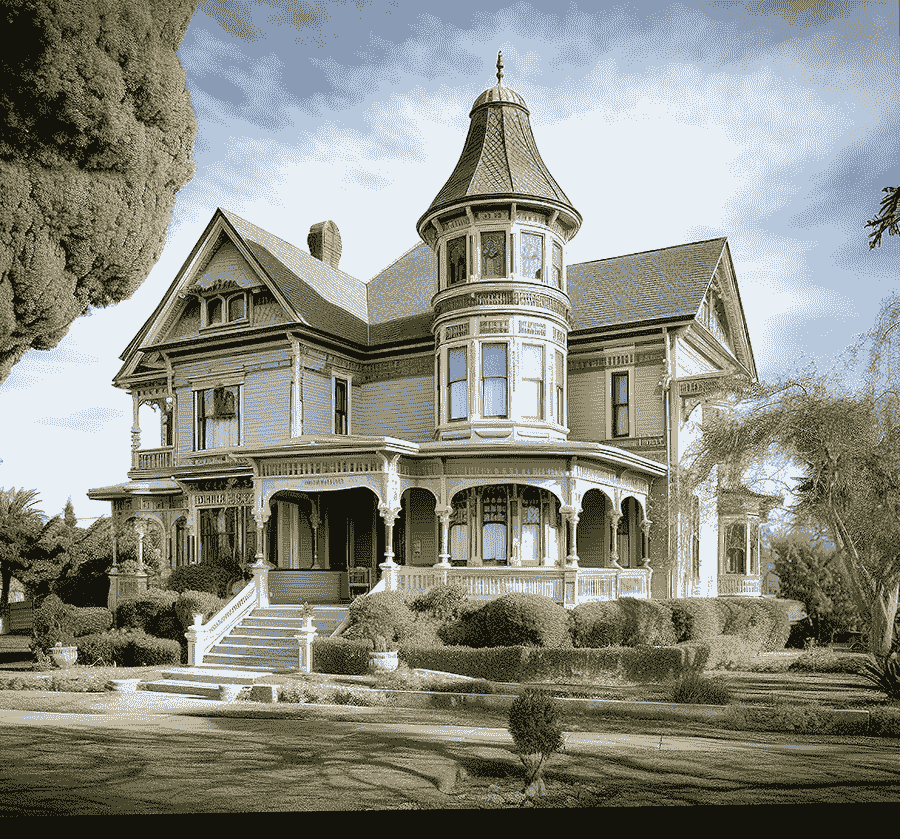
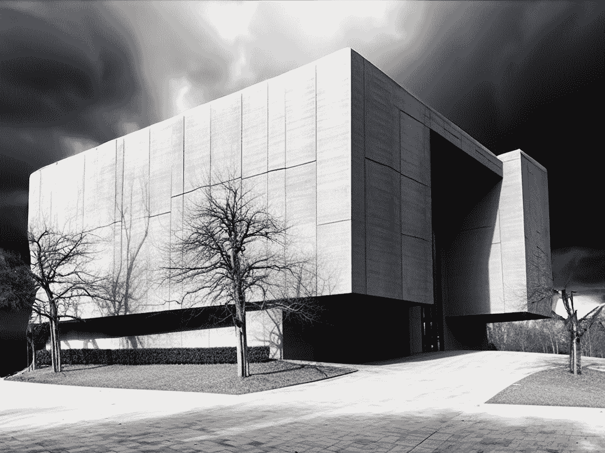
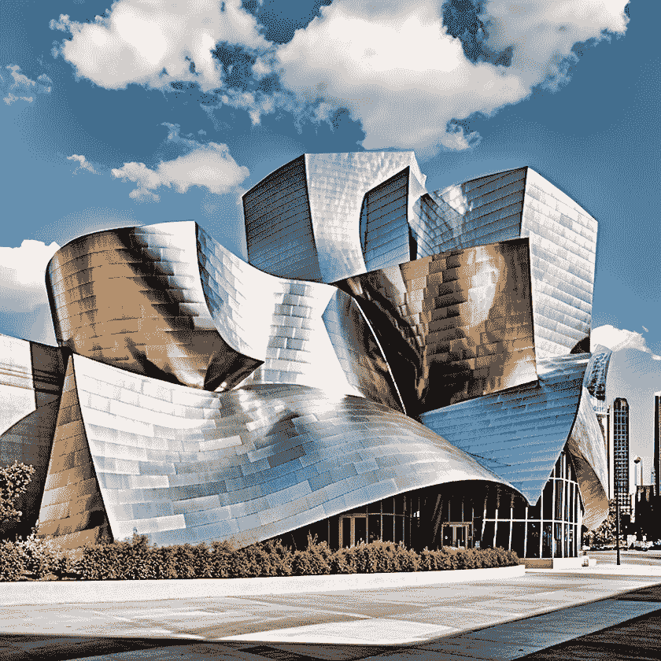
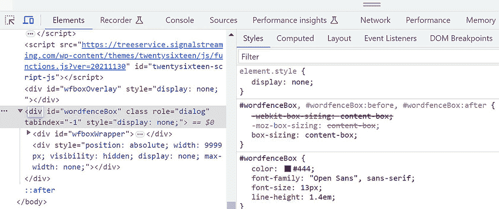
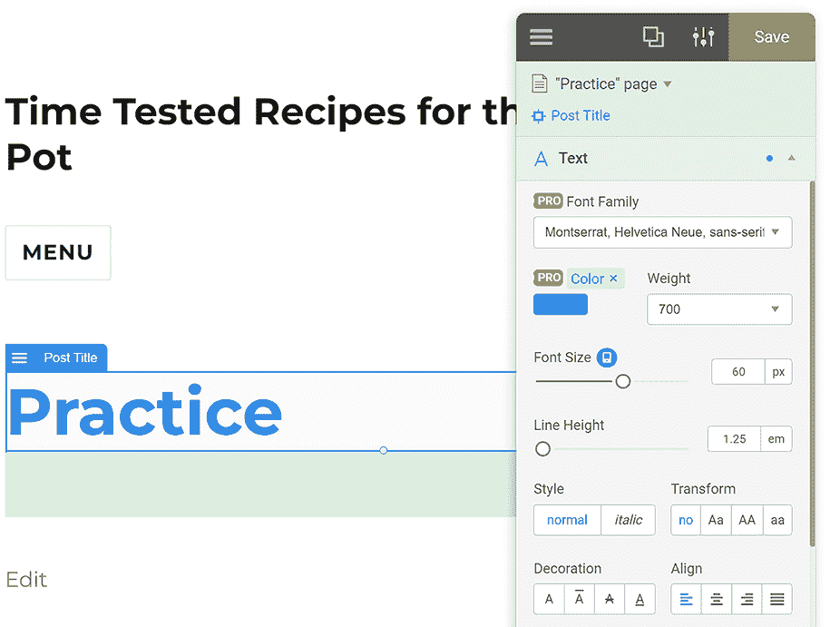
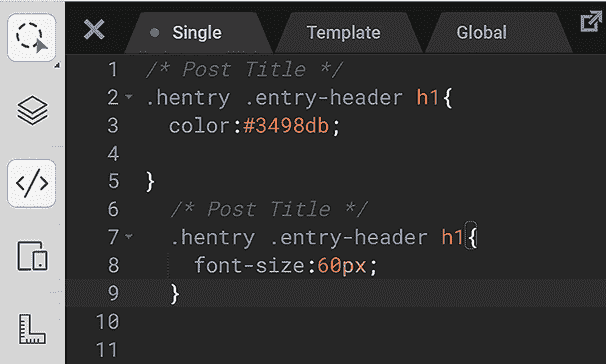
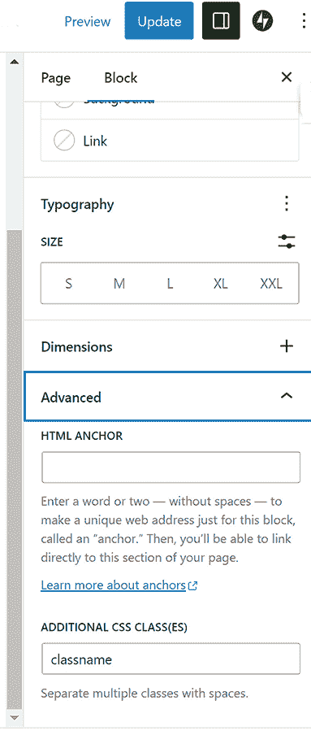
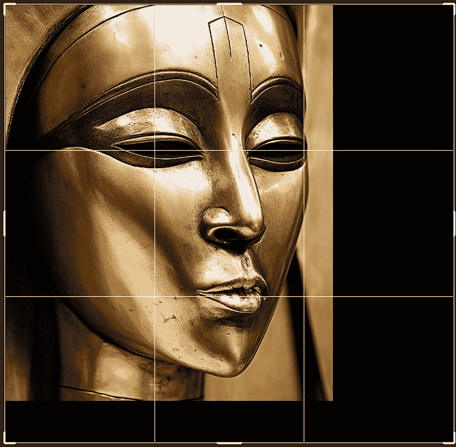

# 7 高级设计技术

本章涵盖了

+   确保你的网站看起来现代化

+   理解层叠样式表

+   精通 YellowPencil CSS 自动化插件

+   利用 AI 编写 CSS 动画

+   探索 AI 修复和扩展图像技术

+   在 Gutenberg 编辑器中管理 CSS

在第六章中，你学习了如何选择一个强大的主题以及布局和设计的基础知识。在本章 7 中，你将更深入地学习设计，了解更多使你的网站在视觉上脱颖而出的方法。我们将探讨如何确保你的网站看起来现代化，以及如何精确调整设计，超越主题在“外观”>“自定义”屏幕中提供的选项。

你还将了解到何时以及如何使用 AI 修复和扩展图像。修复会删除或替换图像中的对象。扩展则会扩展图像，创建与原始图像的整体视角、风格和内容相关的新内容。

## 7.1 创建现代设计

网站设计风格随时间而变化，就像建筑、艺术和其他创造性事业一样。衡量当前时尚的一个标准是今天建筑的外观。你可以用“鲜明”这个词来总结当今的大部分建筑。

西方风格在历史上一直在两个极端之间移动：曲线（装饰性、动态、华丽）和直线（矩形、静态、简约）。我们目前正处于许多艺术领域，包括网站设计艺术的直线时期。

在古典时代，几个世纪以来，建筑的特点是实用性和相对简约的装饰。例如，早期的埃及、波斯和希腊罗马建筑（例如帕台农神庙）。这些建筑大部分都拥有高度系统化和有序的设计，注重比例、平衡、对称和功能。

但在从早期中世纪到 20 世纪中叶的漫长时期内，钟摆摆向了另一边，并且最终在一段漫长的华丽时期中稳定下来。装饰、细节和复杂性统治了几个世纪。这持续了哥特式、巴洛克式、洛可可式、维多利亚式，甚至直到 20 世纪初的新艺术运动和装饰艺术时期。几个世纪以来，建筑师们偏爱复杂的细节和广泛的装饰元素。从诸如滴水兽和彩色壁画以及彩色玻璃窗等装饰，到精致甚至繁琐的装饰。

然后，在第二次世界大战期间，古典风格回归——这次是强调功能。甚至曲线也过时了。这是一个简化，但其中也有一些真实性。在过去的八十年里，重点是线性、无装饰、主要是矩形形状。悉尼歌剧院和建筑师弗兰克·盖里的曲线形奇迹是少数例外之一。



图 7.1 维多利亚时代的住宅色彩微妙，通常包括管状房间和其他曲线，提供了多样的轮廓。看看那些装饰华丽的门柱。甚至烟囱也不是矩形的。

如您在图 7.1 和图 7.2 的比较中可以看到，维多利亚时代的房屋庆祝精致和曲线。今天的更严峻的美学不仅拒绝曲线，甚至经常连*色彩*也不保留！



图 7.2 当代风格中的粗野主义是对曲线、色彩、装饰和基本人性的极端反应。显然，即使在 200 码内，树木也无法生存。

所说的*粗野主义*建筑在某些圈子中很受欢迎。诚然，一个好处是当你站在这样的建筑前面时，*你*自动成为画面中最美丽、最有生命力的事物。

报道称，Beyoncé和 Jay-Z 以 2 亿美元现金购买了他们在马里布的 3 万平方英尺的粗野主义住宅。这是加利福尼亚州有史以来最昂贵的房屋。

但没有任何趋势是绝对的。当然，总有叛逆者；感谢他们。正如您在弗兰克·盖里的强大作品中看到的那样（见图 7.3 中 Midjourney 尝试创造他的风格），他是一位反对直角的建筑师。（他最新的多伦多建筑有点方方正正，但以一种可预测的奇特方式。）甚至盖里的半矩形作品似乎也带有某种生物和生命力。



图 7.3 这是 Midjourney 对弗兰克·盖里风格的建筑创新。这种建筑风格与粗野主义截然相反。在计算机出现之前，这样的设计是不可能绘制蓝图。相比之下，粗野主义自 20 世纪 30 年代以来一直存在，主要在纳粹德国和共产主义苏联，这些社会并不以对美学的敏感性著称。

当然，你不会想让你的网站完全采用粗野主义，或者完全采用盖瑞的风格。例如，婚纱销售网站可以从蕾丝、装饰、曲线设计元素中受益，包括模仿传统书法笔触的脚本字体，仿佛是用笔或刷子书写。

然而，现代网站设计简洁、整洁，通常是极简主义的。看看你对以下网站的看法：

+   [`mng.bz/4av5`](https://mng.bz/4av5)

+   [www.findgift.com](https://www.findgift.com)

+   [www.konstolymp.gr](https://www.konstolymp.gr)

在那个第三个网站上，注意几个细节。动画细腻、温和且引人入胜。此外，背景中还有一个非常低调的橄榄树图案。这种动画和透明度可以通过使用层叠样式表（CSS），一种强大的设计工具来实现。我们将在下一节详细探讨如何使用它。

为了提供一个简短但令人印象深刻的预览，让我们请 AI 编写一些可以复制粘贴到我们网站外观>自定义>附加 CSS 屏幕的 CSS 代码：

|


| 编写 CSS 代码，使所有 h1 标题在页面加载时从 0%透明度变为 100%透明度。 |
| --- |

克劳德([`claude.ai`](https://claude.ai))的响应是

|


|

```py
h1 {
  opacity: 0;
  animation: fadeIn 1s ease-in forwards;
}

@keyframes fadeIn {
  from {
    opacity: 0;
  }
  to {
    opacity: 1; 
  }
}
```

|

如果您愿意，可以尝试一下。只需将 CSS 代码复制并粘贴到外观 > 定制 > CSS 屏幕中。点击发布按钮，然后转到您网站的首页。您应该看到任何 h1 标题（最大的标题）淡入视图。您可以将渐显动画值从 1 秒调整到其他持续时间以改变动画速度。您还可以调整透明度。如果您想从灰色而不是完全不可见的文本开始，请从大于 0 的值开始。您网站的可能标题就是一个 h1 标题。

## 7.2 理解 CSS 样式

*层叠样式表* (CSS) 是一种专门用于修改网页设计大多数元素的计算机语言。因此，如果您想微调主题的默认设计选择，您需要使用 CSS。

好消息是，有一个名为 YellowPencil 的优秀插件可以为您自动生成 CSS 代码！因此，您不需要学习这种语言。当然，AI 也是一个优秀的程序员，正如之前渐显动画的 CSS 代码所展示的那样。

使用 YellowPencil 插件，您可以在高级别上进行操作——移动滑块、在颜色轮中点击、从菜单中选择、使用视觉拖放等。所有这些调整以及更多都是在所见即所得(WYSIWYG)屏幕上实时显示的。您在调整东西时就能看到结果。最好的是，YellowPencil 插件会*自动*编写 CSS 代码，使您的更改在网站上永久生效。

我们将在第 7.4 节中简要介绍优秀的 YellowPencil 设计系统。如果您想现在就跳到那里，请这样做。下一节有些技术性，如果您不想阅读，也没有关系。但如果您好奇，这里有一个关于 CSS 做什么以及它是如何工作的简要介绍。这本书旨在对初学者有价值，但对我们这些技术爱好者来说也很有趣。

总是使用小写字母

在编写 CSS 和 HTML 代码时始终使用小写字母。最初，CSS 明智地不区分大小写。但委员会聚集在一起，结果 CSS 被设置为大小写敏感，这很不幸。因此，现在 HTML 和 CSS 中都有大小写不敏感的例外。代码在几个上下文中是大小写敏感的（类名、属性选择器），但这频繁到足以导致无数错误。因此，为了避免问题，*始终使用小写字母，而不是试图记住*规则的随机例外。

这里是一个 CSS 样式定义的示例，用于 CSS 类名`myId`或`myid`：

```py
#myId {
    color: red;
}
#myid {
    color: blue;
}
```

这里是 HTML 代码：

```py
<div id="myId">Some text.</div>
```

由于大小写敏感，这些`div`标签内的文本以红色显示，而不是蓝色。为什么？因为`myid`中的“i”是小写的，而在`myId`中是大写的。所以，CSS 将它们视为两个不同的 CSS 选择器。

定义 A *选择器*只是 CSS 要修改的设计元素的名称。选择器后面跟着一个属性/值对的列表。每个选择器下的整个组合称为 CSS *规则*。通常，选择器只是一个普通的 HTML 元素，如`h1`，或者它可以是类名，如前一个例子中的`myid`。

### 7.2.1 探索 HTML 在页面设计中的作用

在 CSS 出现之前，只有 HTML 可以告诉浏览器网页应该如何显示。但 HTML 主要是一种*标记语言*，因为它标记了网页中特定元素的开始和结束，如标题或段落：

```py
<h1>MAJOR HEADLINE</h1>
```

`<h1>` HTML 开始“标签”告诉浏览器从这里开始应用 h1 样式到这段文本。而`</h1>`结束标签告诉浏览器在这里结束标题样式。

浏览器有一组默认的 HTML 属性值。例如，如果浏览器看到一些被`h1`标签包围的文本，它将默认使用以下属性值列表来显示标题：

+   `display:` `block;`—这意味着 h1 标题将从新的一行开始，并占据可用的全部宽度（这就是 CSS 值`block`所做的事情）。

+   `font-size:` `2em;`—h1 元素的字体大小是根元素字体大小的两倍（也称为`em`）。

+   `margin-top:` `0.67em;`—h1 元素上方的空间是根元素字体大小的 0.67 倍。

+   `margin-bottom:` `0.67em;`—h1 元素下方的空间是根元素字体大小的 0.67 倍。

+   `margin-left:` `0;`—h1 元素左侧没有空间。

+   `margin-right:` `0;`—h1 元素右侧没有空间。

+   `font-weight:` `bold;`—标题文本为粗体。

换句话说，网站中的所有 h1 标题都使用这些默认设计属性进行渲染。这些项目符号是 CSS 所说的*属性-值对*，也称为*声明*。整个目的在于你可以使用 CSS 来修改这些默认值中的任何一个。

### 7.2.2 查看 CSS 为 HTML 带来的好处

如果你想更改网站上 h1 标题的大小、字体、颜色或其他属性呢？换句话说，你想要修改那些默认的浏览器声明。也许你想使这些标题更大一些。在 CSS 出现之前，你必须逐个检查网站的所有 HTML 代码，并手动更改每个 h1 元素。（在 HTML 中，一个完整的标签-内容-结束标签单元称为*元素*。）要使 h1 标题更大，你必须重新输入 HTML 开始标签，使其看起来像这样：

```py
<h1><font size="+2">MAJOR HEADLINE</font></h1>
```

这意味着将 h1 标题的大小设置为比浏览器默认大小大两倍。将此更改输入到网站中每个 h1 标题中显然既繁琐又乏味。

警告 确保在 CSS 代码中的引号是直的(" ")，而不是弯曲的（“ ”）。HTML 和一些类型的 CSS 代码不喜欢斜体或弯曲的开放和关闭引号。

这里有一些典型的 HTML 标签：

+   `<h1>` 到 `<h6>` 定义标题，其中 `<h1>` 是最重要的，而 `<h6>` 是最不重要的（通常是最小的）。这些为网站上的文本内容提供了层次结构，让读者知道页面中各部分之间的相对重要性或关系。

+   `<p>` 代表段落（常见的正文文本）。

+   `<div>` 和 `<span>` 指定一个区域或一组页面组件。

+   `<table>` 用于表格。

+   `` 用于图像。

+   `<a>` 用于超链接。

### 7.2.3 进入 CSS

幸运的是，CSS 的发明使得网站设计变得更容易、更多样化。在其他有用功能中，您可以通过修改单个 CSS 规则来更改网站上的所有 h1 标题。（我们在之前的淡入 CSS 示例中就是这样做的。）下一个示例显示了一个使所有 h1 标题的大小是浏览器默认（2 em）字体大小两倍的规则）：

```py
h1 {
    font-size: 4em;
}
```

在大多数现代浏览器中，段落 `<p>` 的正文元素的大小默认为 16 像素 [px])。

提示：*像素*是电视或手机等显示设备中最小的视觉单位。如果你真的靠近电视，你通常可以看到像素，即小点。在手机屏幕上你看不到它们，因为它们太小了，但在体育场的大型显示屏上，其像素的大小就像砖块一样。因此，像素的大小相对于它所在的屏幕大小是相对的。像素没有像英寸或厘米这样的特定、绝对的大小。

CSS 提供了比原始 HTML 属性集（*属性*是 HTML 对样式修改的称呼）更多的样式属性。CSS 甚至超越了简单的样式。有些人更喜欢将 CSS 称为标记语言，但实际上它是一种具有显著标记能力（仅指定样式的开始和结束）的设计语言。例如，CSS 包括以下内容：

+   *变换*—应用于 HTML 元素的 2D 或 3D 变换，允许您旋转、缩放、移动、倾斜、重新定位并对元素进行其他更改。

+   *过渡*—将元素从一个状态转换为另一个状态。换句话说，CSS 过渡允许您在给定的时间内，以给定的速度，在给定的延迟后平滑地更改属性值。这种技术可以用来创建各种效果和动画，如淡入淡出、缩放、倾斜、改变颜色以及随时间旋转元素。

+   *布局和定位*—*Flex* 是一个用于在容器内定位和排列元素的模型。CSS Flex 指定了元素如何增长或缩小以适应其 `Flex` 容器内的可用空间。三个属性—`flex-grow`、`flex-shrink` 和 `flex-basis`—共同工作，为您提供了在 `Flex` 容器内对齐、布局和分配空间的高效方法。

+   *阴影*—文本或框架阴影效果。

+   *特殊文本规范*—例如调整行高的规范。

### 7.2.4 什么是层叠？

这个多彩的术语*级联*非常准确。CSS 被称为级联样式*表*（复数），因为可能有多个 CSS 样式表。有四个主要的样式表（包含 CSS 代码的文件），它们共同工作，形成级联。

这意味着在样式表中可能会有重复的 CSS 属性。假设一个样式表指定 h1 标题应该是红色，但另一个样式表说它们必须是绿色。浏览器该怎么办呢？答案是样式表有一个顺序（即“级联”）。浏览器必须使用在*最低*样式表中提到的颜色。

初始时级联可能会让人感到困惑。下面是如何可视化这个级联过程。让我们考虑两个在同一个样式表中的 CSS `h1`选择器。其中一个在选择器表中位于另一个之下，因此它是最低的。这段 CSS 代码导致 h1 标题变为蓝色，因为`blue`值在`red`值之下：

```py
h1 {
    color: red;
}
h1 {
    color: blue;
}
```

另一种说法是，如果 CSS 属性重复，则使用代码中最低的属性值（例如颜色），并且任何其他之前的重复属性定义（代码中较高处）将被忽略。那些之前的值被称为*被覆盖*。就像学校校长可以覆盖老师的决定一样。

为了更好地理解在这个上下文中“较低”的含义，可视化一个水级联沿着山丘下落是有帮助的。在决定使用哪个重复声明时，浏览器按照特定顺序查看所有四个样式表。这就是这里所描述的*级联*：

+   CSS 级联中有四个主要分支，在每个分支上，如果任何 CSS 选择器的属性值对声明被重复，则之前的此类声明将被覆盖。

+   将四个分支或滴落可视化成一个水级联。在最高的分支处放置一个花篮。花朵按照特定的顺序排列。然后，花篮掉落到第二个分支池中，花朵可能会因为那个凸起而重新排列。然后，它继续掉落到第三个和第四个分支，最终在最低的池中静止。如果在任何这些凸起过程中重新定义了 CSS 声明（特定选择器的属性值对），则使用这个新的重新定义，即“获胜”的那个。换句话说，级联中的每个较低分支都可以重新定义（覆盖并更改）之前由较早分支定义的任何 CSS 样式。

+   如果分支 3 说 h1 是红色，但分支 4 说绿色——绿色获胜，浏览器在显示网站上的 h1 标题时遵循该规则。每个较低的分支可以重新定义任何选择器的属性值，因此提到 h1 标题颜色的最低分支的颜色是浏览器最终显示的颜色。图 7.4 说明了级联是如何工作的。


图 7.4 我们的花篮类比图。级联过程中的每一次跳跃都可能重新排列篮子中的花朵。

### 7.2.5 样式表的级联顺序

如前所述，CSS 中有四个主要的样式表。以下是样式表的级联顺序，从最高到最低的样式表：

1.  第一个、最高的分支是浏览器的默认样式。所有其他随后的、较低的分支都可以覆盖这些默认样式定义。例如，浏览器默认将颜色设置为黑色用于 h1 标题。这是基线，如果级联中后续的样式表没有提到 h1 的颜色，那么浏览器将 h1 渲染为黑色。（这很常见，因为黑色在白色文本上通常是网站上的标准。）

2.  每个 WordPress 网站都有一个主题，每个主题都有自己的 CSS 样式表。这是级联的*第二个*分支。您可以通过前往 WordPress 后端的“外观 > 主题文件编辑器”屏幕来查看它。主题的样式表覆盖浏览器默认值（但可以被下一个两个分支覆盖）。

警告：如果您愿意，可以查看主题的样式表，但不要修改它或主题的任何其他代码文件。

3.  *您的*（网站管理员的）CSS 样式规范接下来。在您的外观 > 定制 > 附加 CSS 屏幕中，*您*可以输入 CSS 代码来覆盖前两个样式表（浏览器的默认值和主题）。这是第三个分支。

4.  最后，在最低级别的是所谓的*内联 CSS*。它覆盖了之前的三个样式表。内联 CSS 与其他级别不同。前三个样式表是*全局*的——它们的样式定义应用于整个网站的所有元素（如*所有*的 h1 标题）。

然而，内联 CSS 是*局部*的，因此只为特定区域定义样式。这个区域可以小到单个字符。或者它可能是一个单词、句子、段落、整个页面、标题、图像或其他局部内容区域。指定区域的一种方法是在`<span> </span>`或`<div> </div>`标签之间包含某些内容，如下所示：

```py
<span style="color: red;">This sentence is red</span> 
```

在经典 WordPress 编辑器中，内联 CSS 代码会输入到页面编辑屏幕上的“文本”标签。或者对于 Gutenberg 块编辑器（当使用段落块或类似块时），点击编辑页面屏幕右上角的三个点（选项）。然后，点击代码编辑器，或按 Ctrl-Shift-Alt-M。

这是使单个句子变红的内联 CSS 代码：

```py
<p style="color: red;">This is a red sentence.</p>
```

这部分是实际的 CSS 代码：

```py
style="color: red;"
```

图 7.5 展示了级联过程。


图 7.5 级联的四个阶段

请注意，如果你只是提出请求，GPT 和其他 AI 系统可以轻松为你编写内联 CSS 代码。

|


| 使用内联 CSS 代码创建一个动画，在页面加载后等待三秒钟，然后将以下句子从普通文本慢慢转换为粉色斜体，然后再回到普通文本。所有这些都在两秒内完成。句子是“请注意我!!” |
| --- |

GPT 做出了以下回应：

|


| （将此代码放入页面的文本标签中。）

```py
<p style="display: inline-block; 
/* Needed for transform to work */
           animation: textAnimation
2s ease-out 3s 1 forwards;">
Please notice me!!</p> 
```

（将此代码放入外观 > 定制 > 额外 CSS 屏幕。）

```py
    @keyframes textAnimation {
        0%, 100% { 
            transform: skew(0deg); 
            color: initial; /* or replace with
your preferred initial color */
        }
        50% { 
            transform: skew(20deg); 
            color: pink;
        }
    } 
```

|

小贴士：注意 CSS 代码中的那些 `{ }` 括号。漏掉一个，代码将无法工作。值周围必须有一个开括号和一个闭括号。AI 会正确处理。但当你复制粘贴代码时，很容易错过最后的闭括号。

注意从技术上讲，除了我们查看的四个之外，还有一些额外的样式表。有 CSS 类或样式定义，它们的作用范围是整个页面，但这些是为那些想要深入研究 CSS 的人准备的。对于我们来说，你只需要可视化之前描述的四个主要样式表。

现在让我们看看一个名为检查器的工具，它内置在大多数浏览器中。它有几个有用的功能，其中之一是并排显示任何网站的 HTML 和 CSS 代码。但除此之外，你还可以使用检查器进行以下操作：

+   *测试响应性*——使用工具模拟网页在不同设备上的外观。

+   *监控网络流量*——你可以看到页面发出的网络请求列表，包括每个请求所需的时间等详细信息。这对于优化加载时间和解决与资源加载相关的问题特别有用。

+   *调试 JavaScript*——为此有很多工具。

+   *性能分析*——这包括监控页面加载速度，识别 JavaScript 执行中的瓶颈，并揭示不同元素对页面整体性能的相对影响。

但对于我们来说，我们将专注于检查器为页面设计师提供的工具。

## 7.3 使用检查器

让我们看看一些真实的 CSS 示例以及一组在探索 CSS 和 HTML 时可能会发现有用的工具。这些工具可以在你浏览器的检查器（也称为开发者工具）中找到。在查看任何网页时，你可以通过右键单击打开上下文菜单，然后从菜单中选择“检查”来打开检查器。图 7.6 显示了典型的检查器显示。



图 7.6 在这里你可以看到关于这个网页的很多细节。

左侧面板显示 HTML 代码，右侧面板显示 CSS 代码。在 HTML 面板中双击一个 HTML 元素以选择它（如图 7.6 所示，已选择一个`div`区域），你可以在右侧面板中看到任何相关的 CSS 代码。

注意到 CSS 属性`webkit box sizing`上有一条横线。这意味着相同的属性在层叠中再次出现，因此这里的值（`content-box`）在浏览器渲染此代码时将被忽略。它已被覆盖。

检查器有许多功能和工具。例如，您通常可以找出网站正在使用什么主题和插件。按 Ctrl-F，搜索主题。

这个功能丰富的工具集让您可以检查、调试和测试 CSS。检查器提供了一个直观且交互式的界面，帮助您理解和操作任何页面的视觉方面。

右侧的样式面板显示了应用于当前所选 HTML 元素的 CSS *规则*。该功能让您了解为什么某个样式被应用或覆盖。

规则和选择器

记住，CSS 规则是特定 HTML 元素的所有属性及其值的完整列表。规则以所谓的*选择器*（这是 CSS 对被样式化的 HTML 元素的称呼）开始。选择器后面跟着一个开括号（`{`）和属性：值对的列表。最后，规则以一个闭括号（`}`）结束。以下是一个典型的 CSS 规则：

```py
h1 {
    color: blue;
    font-family: sans-serif;
    font-size: 14em;
    font-weight: bold;
}
```

检查器还允许您实时编辑 CSS 代码。在样式面板中做出的任何更改都会立即反映在检查器的网页面板上。（页面之前曾以两个代码面板显示，尽管面板可以调整大小和重新排序。）这样，您可以尝试不同的 CSS 样式并立即看到结果，而无需编辑源文件并刷新页面。

您可以编辑现有规则、禁用规则、添加新规则，甚至添加全新的样式表。（要查看更多前端面板，将鼠标移至菜单中的“性能”上方，然后向下拖动。）然而，您在检查器中做出的任何更改都不是永久的。您只是在实验，但这些更改不会应用到任何样式表中。

检查器还包含用于处理更复杂 CSS 特性的各种工具。例如，盒模型视图显示了所选元素的填充、边框和边距，并允许直接编辑这些值。（要查看所选元素的盒模型，请点击 CSS 代码上方的“计算”选项卡。）在盒模型图示下方，您可以查看应用于此元素的层叠最终结果。换句话说，您可以看到层叠完成后哪些值胜出。这有助于理解复杂的样式交互。（这里的“计算”指的是在扫描和渲染整个层叠后的最终结果。）

最受欢迎的浏览器的检查器还包括用于处理 CSS 动画和过渡的工具。您可以查看和控制动画的时间线，减慢它们的速度，并在特定点暂停它们。这有助于调试动画。不同浏览器的检查器在功能上略有不同，因此以下是每个检查器的概述：

+   *Chrome*——Chrome 的检查器包括一个动画抽屉选项卡，可以自动检测和分组动画。然后你可以检查动画，减速或重放它们，并查看源代码。

+   *Edge*——Edge 的动画工具中的动画检查器支持 CSS 动画和过渡。你可以操纵和测试各种效果，包括改变时间、延迟、持续时间或关键帧偏移。

+   *Firefox*——Firefox 的页面检查器包括一个动画视图，它以时间线同步的方式显示页面中的动画。它支持使用 CSS 过渡或关键帧规则创建的动画。

+   *Safari*——Safari 的 Web 检查器提供了一个图形功能，可以预览 CSS 动画和过渡中的关键帧及其类。

检查器还包括响应式设计测试的工具。你可以模拟不同的屏幕尺寸、分辨率，甚至特定的设备，让你可以看到你的 CSS 样式在各个屏幕尺寸和形状上的外观。

使用关键帧简化动画

*关键帧*是动画序列中变化（或“节奏”）的重要时刻。关键帧可以指定某物开始移动、改变方向、调整大小等。可以为诸如位置、旋转、缩放等设置关键帧。在两个关键帧之间（或关键帧和序列的结尾之间），动画软件将自动插值值以创建平滑的过渡。

这意味着你不需要手动定义每一个微小的变化，只需定义重要的关键帧即可。你只需说，旋转 1 秒，而不是为每秒 24 帧中的每一帧指定位置。你可以使用这种简化的关键帧技术来指定时间、节奏、转换和其他动画效果。

知识区结束。

## 7.4 掌握 YellowPencil

YellowPencil 插件非常出色。它允许任何人构建一个高度定制的网站，其视觉上与网站的目的非常接近。而且，你不需要了解任何关于 CSS 的知识。你可以细致调整你页面上的设计元素（在合理的范围内）。更重要的是，你的网站不会看起来像使用你安装的主题的其他网站的克隆体。

如果你觉得调整网站不舒服，可以让有设计经验的人自由地在网站上工作几天。并且给他们 YellowPencil。正如之前提到的，设计师不需要了解任何关于计算机编程的一般知识或 CSS 的特定知识。然而，他们可以让 YellowPencil 生成复杂而强大的 CSS 代码，真正让网站发光。在几个 CSS 代码生成插件中，YellowPencil 是最受欢迎的。

提示：YellowPencil 拥有数十种工具和功能。你可以在这里了解它们：[`mng.bz/QDg1`](https://mng.bz/QDg1)。

要开始使用黄色铅笔，请转到 WordPress 中的“插件”>“添加新插件”屏幕，并搜索“视觉 CSS 样式编辑器”（黄色铅笔的官方名称）。安装并激活它。当您查看黄色铅笔屏幕时，点击图 7.7 中显示的资源选项卡，以查看获取教程和论坛的位置，您可以在那里从专家那里获得答案。


图 7.7 如果在使用黄色铅笔时遇到任何问题，这些是寻找答案的绝佳资源。

黄色铅笔不会修改您的主题 CSS 文件，也不会将其 CSS 代码放入您的“外观”>“自定义”>“附加 CSS”屏幕（您可以在那里添加您自己编写的 CSS 代码，或者让 AI 为您编写）。相反，您可以通过访问 WordPress 网站后端的“黄色铅笔”>“自定义”屏幕来查看和编辑黄色铅笔生成的 CSS。但此功能仅在插件的 Pro 版本中可用。

黄色铅笔：免费版与 Pro 版

黄色铅笔的 Pro 版本会自动将其 CSS 代码保存到您的 WordPress 网站上（在“黄色铅笔”>“自定义”屏幕中）。免费版本只保存一些 CSS 属性。此外，Pro 版本还包括免费版本中不可用的许多附加功能。考虑到您获得的所有功能，升级到 Pro 版本相当便宜。

然而，即使只使用免费版本，您也可以生成可用的 CSS 代码（甚至对于黄色铅笔编辑器中标记为 Pro 的 CSS 属性）。原因是免费的黄色铅笔至少会显示它生成的任何 CSS。但是，手动将 CSS 代码添加到您的网站上既不方便又容易出错。

免费版本的黄色铅笔不允许您使用 Ctrl-C 复制其代码。然而，您可以将代码写在一张纸上，将其输入到记事本中，或者只需截图。然后，转到您的网站“外观”>“自定义”>“附加 CSS”屏幕，并将代码输入到该屏幕中。如何做到这一点将在下面描述。

### 7.4.1 自动生成 CSS 代码

现在，我们来尝试一下黄色铅笔。让我们生成一些简单的 CSS 代码，使您网站页面上的一个页面标题更大并呈现蓝色。转到您的“页面”>“添加新页面”屏幕，并添加一个名为“练习”的新页面。*.* 然后，点击“发布”或“更新”按钮以保存该页面。

在“练习”页面编辑页面屏幕的右上角，点击“编辑页面 – 黄色铅笔”按钮。这将带您进入主黄色铅笔屏幕，如图 7.8 所示。注意图 7.8 的右侧是一个您可以修改的 CSS 设计类别列表。点击“文本属性”以打开并查看您可以修改的所有排版属性。


图 7.8 当您在页面上点击一个元素时，您可以在右侧面板中为其设置样式。在这里，我们将处理页面标题。

现在，点击黑色颜色条，然后点击蓝色（在图 7.9 的颜色类别下可以看到它）。将字体大小拖到 60 px。请注意，这些更改会立即在 YellowPencil 的页面视图中显示。这样，您可以进行调整并检查这些更改对页面整体设计的影响，如图 7.9 所示。



图 7.9 您在右侧面板中做出的修改会实时显示在左侧的页面视图中。

注意字体家族和颜色旁边的 Pro 图标。这意味着您可以在 YellowPencil 中更改这些属性，但如果您还没有注册 Pro 版本，YellowPencil 不会将这些属性应用到您的网站上。对其他属性（如样式斜体）*将*会应用并保存到您网站上的 YellowPencil > 自定义屏幕，如图 7.10 所示。


图 7.10 这个 WordPress 后端 YellowPencil > 自定义屏幕显示了在 YellowPencil 中做出的修改的 CSS 代码。

但让我们假设您确实想做出那些 Pro 更改，比如将页面标题变为蓝色并放大到 60 px。然而，您没有 Pro 版本。尽管有些笨拙，您仍然可以使用此代码进行这些更改，即使在免费版本中也是如此。点击左侧的 CSS 编辑器图标（或按`E`键），然后您可以看到 Pro 颜色和字体大小属性的 CSS 代码，如图 7.11 所示。图 7.12 显示了您可以在网站上使用的 CSS 代码。


图 7.11 在 YellowPencil 中点击此 CSS 编辑器图标以查看它生成的 CSS 代码。



图 7.12 这里是 YellowPencil 为您生成的 CSS 代码。

您可以手动复制此 CSS 代码（或截图），转到您网站的“外观”>“自定义”>“附加 CSS”屏幕，然后将代码输入或粘贴到 CSS 字段中。现在标题更大且为蓝色。但如果您计划进行大量的 CSS 工作，YellowPencil 的 Pro 版本价格相当合理。

### 7.4.2 理解 CSS 动画

目前，YellowPencil 提供了以下动画功能：

+   *动画*——使用这个 CSS 属性，您可以动画化 HTML 元素。

+   *动画生成器*——这个工具帮助您创建自己的自定义动画。其主要功能是允许您以使用设计师的视觉优势的方式创建动画，而不是要求他们手动编写代码。您也可以实时看到这些动画设计的结果。

+   *动画管理器*——在这里，您可以管理您添加到网站上的所有动画。例如，您可以直观地调整持续时间、延迟时间等设置。

+   *过渡*——这个 CSS 属性允许您向 HTML 元素添加简单的过渡，例如淡出或淡入。还有像橡皮筋动画这样的特殊技巧。

+   *50+动画*—这是一个包含 50 多个预定义动画的集合。

与动画和过渡一起工作

动画和过渡相关联。然而，*动画*更加复杂和多功能。你可以使用多个关键帧，并连续播放或循环活动，而无需用户交互或其他触发器。动画可以涉及多个属性，并允许对时间和顺序进行精细控制，显示更复杂和多样的运动和效果。

*过渡*，相比之下，通常用于涉及从一个状态到另一个状态的变化的简单交互（例如从不可见到可见，或从黑色到粉色）。它们由用户交互（例如查看新页面）触发，并且通常涉及在两个状态之间（初始状态和最终状态）平滑地改变一个或多个 CSS 属性：一个例子是将黑色正常文本变为粉色斜体，然后再变回。总结一下：动画生成器工具用于创建更复杂、基于关键帧的动画，而过渡工具用于创建更简单、基于状态的效应。

此列表描述了主要的过渡属性（[`mng.bz/XxAl`](https://mng.bz/XxAl)）：

+   *类型*—指定过渡效果所对应的 CSS 属性的名称。当指定的 CSS 属性发生变化时，过渡效果开始。

+   *持续时间*—过渡效果完成所需的时间（秒 s）或毫秒 ms。

+   *缓动*—过渡效果的速率曲线。值可以是 Ease、Linear、Ease-In、Ease-Out 或 Ease-In-Out。

此列表描述了主要的动画属性：

+   *动画*—向元素添加动画。

+   *触发器*—指定触发动画开始的条件。可以是 Onscreen（当元素在屏幕上可见时播放，我们很快会使用这个值），Hover（当鼠标指针移至元素上时开始），Click（当元素被点击时），或 Focus（当表单字段获得焦点时触发，意味着用户已按下 Tab 键在表单字段间移动，或点击了一个字段）。

+   *触发重复*—确定动画运行多少次。

+   *Duratio*n—规定动画完成一个周期所需的时间。

+   *延迟*—指定触发动画后动画应等待多长时间才开始。

+   *缓动*—设置速度模式。值是 Ease、Linear、Ease-In、Ease-Out 或 Ease-In-Out。尝试这些值以查看它们之间的差异。

+   *动画填充模式*—设置动画未运行时动画的结束状态。值可以是 None、Forwards、Backwards 或同时为 Forwards 和 Backwards。

提示 这里是来自 MDN Web 文档的一个很好的教程，介绍了使用 CSS 动画化页面的多种方法：[`mng.bz/yW27`](https://mng.bz/yW27)。

### 7.4.3 尝试动画

这里有一些步骤可以帮助您实现淡入效果。这可以是一种微妙但有效的方式，在网站标题下方显示各种元素，如您的网站标语。访客会立即看到您的网站标题，但然后您的标语需要几秒钟才能淡入视线。

在此示例中，我们将使用黄色铅笔插件的“运动”功能使网站的大标题 h1 在 2 秒内淡入视线：

1.  前往您的“页面 > 所有页面”屏幕，然后点击一个名为“实践”的页面以打开其“编辑页面”屏幕。

1.  在右上角点击“编辑页面 - 黄色铅笔”按钮。

1.  在黄色铅笔中点击页面的标题（实践）以选择该 h1 元素。

1.  在右侧点击“运动”来打开其模块。选择“淡入”作为动画类型。

1.  要在元素在用户的浏览器中可见时开始动画，将“`触发`”属性的“`onscreen`”选中。

1.  要使动画只播放一次，将“`触发重复`”属性设置为“`1`”。

1.  将“`持续时间`”属性设置为“`2`”秒（或“`3`”秒，或您喜欢的任何值）。

1.  除非您希望动画在页面显示后一段时间才开始，否则请保持“`延迟`”属性在默认的`0`值。

1.  根据您希望动画速度在其持续时间中如何变化，将“`缓动`”属性设置为“`ease`”或“`linear`”。

1.  将“`动画填充模式`”设置为“`forwards`”以确保动画结束后页面标题元素仍然可见。

1.  在右上角点击“保存”按钮以将代码存储在您的网站上。

1.  在您遵循那些步骤之后，黄色铅笔会生成以下 CSS 代码：

```py
.hentry .entry-header h1:yp-onscreen{
    animation-duration:2s;
    animation-delay:0s;
    animation-name:fadeIn;
}
/* Post Title */
.hentry .entry-header h1{
    animation-fill-mode:forwards !important;
}
```

现在返回到您的网站（点击之前的浏览器标签），然后在顶部菜单栏点击“查看页面”。您会看到页面标题“实践”淡入。要再次看到效果，请按 F5 刷新浏览器页面。

当然，您可以在网站上实验数百种变化、设置、交互和特殊效果，如动画，以改善您网站主题的 CSS 文件中描述的默认外观。如果您对网站设计感兴趣，我相信您会发现黄色铅笔插件既实用又有趣。

### 7.4.4 引入 AI

AI 是一位出色的程序员。让我们尝试从 GPT 获取一些帮助。一个流行的效果是当用户将鼠标指针悬停在图像上时触发的缩放动画。以下是我的提示：

|


| 您是一位 CSS 编程专家。为网站创建一些 CSS 代码，当鼠标指针悬停在图像上时，图像会慢慢增大 20%。 |
| --- |

GPT 提出了你应该粘贴到编辑页面屏幕的文本标签页上的代码。将 putyourimageURLhere.jpg 替换为你媒体库中一张图片的实际 URL。要获取该 URL，点击媒体库中的图片。然后，在屏幕的右下角，点击复制 URL 到剪贴板按钮。接下来，将以下`<div>`代码粘贴到你的一个网页中，并记得将`putyourimageURLhere.jpg`替换为你从媒体库中复制的 URL。

|


|

```py
*<div class="image-container">*
  **
*</div>*
```

|

点击更新或发布按钮。现在，转到你的外观 > 定制 > 附加 CSS 屏幕，并将以下整个 CSS 规则粘贴进去，从`.image-container` `{` 开始，到 `}` 结束：

```py
.image-container {
  display: inline-block; /* Ensures the container
 wraps tightly around the image */
  overflow: hidden; /* Prevents any overflow
 from the growing image */
}

.image-container img {
  transition: transform 1.9s ease; /* Smooth
 transition effect */
  display: block; /* Removes any unwanted space
 below the image */
}

.image-container img:hover {
  transform: scale(1.8); /* Enlarges the image */
*}*
```

点击更新或发布按钮。

注意：描述代码的注释被`/*`和`*/`符号包围。注释不是 CSS 代码，在 CSS 执行时会被忽略。它们只是给程序员看的。GPT 提供了代码及其描述。

现在为了测试它，转到你粘贴了`<div>`代码的编辑页面屏幕。点击查看页面以转到你网站的首页。将鼠标指针移到图片上以查看效果。

## 7.5 理解 CSS 范围

在这里，我们进入了另一个极客区域。接下来的信息有些专业，所以如果你不是技术人士，可以自由地跳过接下来的几节，并在 7.8 节回来继续阅读。

你可能注意到了在查看 YellowPencil CSS 编辑器时，它有三个标签页：单个、全局和模板。它们控制 CSS 代码的*范围*（影响范围）。单个标签页只将代码应用于当前页面，而全局标签页将代码应用于整个网站。

模板标签与单个标签类似，但模板将 CSS 应用于特定*类型*的页面（任何受特定模板控制的页面）。例如，假设你正在编辑一个由电子商务插件（如 WooCommerce）控制的产品页面。如果你点击模板标签，你应用于当前页面的 CSS 样式也将应用于你网站上所有其他产品页面。这样，你就可以在相同类型的所有页面上保持一致的外观和感觉。

为了复习，以下是 CSS 级联最有用、最简单的可视化。它是一个四级过程：

1.  浏览器默认属性，当级联中未定义 CSS 样式时，浏览器将应用于 HTML 元素。这是最高（最早）级别。这些属性是浏览器固有的，不是 WordPress、你的网站数据库或任何 CSS 样式表的组成部分。

1.  网站主题的 CSS 文件（位于你的外观 > 主题文件编辑器屏幕）。此文件中定义的样式将应用于整个网站，除非它们被级联中更下方的重复属性覆盖。

1.  你——网站的设计师——放入外观 > 额外 CSS 屏幕中的 CSS 代码。这些属性也是网站范围内的（除非你正在定义一个 CSS 类，它可以在特定的`<div>`元素中使用，例如）。

1.  在单个页面或该页面的较小区域（一个单词、一个图像、一个段落）中添加到 HTML 中的 CSS 代码。这是级联的最低和最终级别，并覆盖了之前的一切。例如，你可以转到你的页面 > 所有页面屏幕，点击练习页面，然后点击文本框中的文本（HTML 代码）选项卡。

现在添加以下 HTML/CSS 代码：

```py
<div style="color: purple;">
  This text will be purple.
</div>
```

代码的 HTML 部分是

```py
<div>
  This text will be purple.
</div>
```

代码中的 CSS 部分是

```py
style="color: purple;"
```

`<div>`标签允许你创建一个*区域*，在这个区域内你可以一次性应用多个 CSS 修改。在这里，前景色被改为白色，背景色为紫色：

```py
<div style="color: white; background-color: purple;">
<h2> A new color combination!</h2>
<p> This text will be white on a purple background.
</div>
```

我们希望这个`<h2>`标题和下面的`<p>`正文都使用白色与紫色对比。因此，我们创建了一个`<div>`部分来包含这两个元素。

注意：回想一下，之前描述的四级级联实际上是一种过度简化。自从 1996 年 CSS 推出以来，CSS 已经发展，并且由于几次委员会会议的直接结果，CSS 级联变得相当复杂。现在有各种继承、作用域限制、作用域根、邻近性以及其他因素可供使用。如果你对这种复杂性感兴趣，可以在这里深入了解最新的官方委员会文件：[www.w3.org/TR/css-cascade-6/](https://www.w3.org/TR/css-cascade-6/)。

被认为的最佳实践是限制内联 CSS 的使用。如果过度使用，它会使你的样式难以阅读和维护。毕竟，CSS 最初是为了消除在网站上每个特定类型的 HTML 元素上手动编码的需要而发明的。

如果你发现需要做很多内联 CSS，考虑使用 CSS *类*而不是`style=`属性。我们将在下一节转向类。

## 7.6 使用 CSS 类

CSS 类的作用类似于 CSS 本身提供的作用：类将 CSS 代码与网站内容分离。回想一下，你可以在外观 > 定制 > 额外 CSS 屏幕中定义 h1 标题（例如绿色和无衬线字体）的规则。当在该屏幕中定义时，*所有*的 h1 标题都会自动渲染为绿色和无衬线。因此，不需要手动将样式代码输入到网站上的每个 h1 元素中。相反，在额外 CSS 屏幕中定义的样式会自动应用到每个 h1 元素上。

这显然比在网站上为每个`h1`标题输入相同的样式属性要高效得多。另一个好处是，如果你改变主意，想将颜色改为蓝色而不是绿色，你只需在“附加 CSS”屏幕中修改`h1` CSS 规则，只需在一个地方进行更改。然后，这个更改将遍及整个网站，修改所有的`h1`标题。

CSS 类也可以在附加 CSS 屏幕中定义。类可以与内联 CSS 一起使用（它们也可以在外部样式表中和其他地方使用）。CSS 类可以逐个添加到单个 HTML 元素，如`h1`，使用内联 CSS。类似于你使用内联 CSS 的方式，它的`style=`属性被输入到网站上的每个`h1`元素中。换句话说，你将类属性输入到 HTML 元素中，就像你添加内联 CSS 的样式属性时做的那样。

使用`style=`属性的内联 CSS 在这里展示：

```py
<p style="color: green; font-weight: bold;">This
is a green and sans sentence.</p>
```

这里是使用`class=`属性的内联 CSS：

```py
<p class="greensans">This is a green and sans sentence.</p>
```

因此，如果你必须为每个你想要应用该类样式的`h1`元素输入类属性，使用类而不是`style=`属性的意义何在？嗯，使用`class=`而不是内联 CSS `style=`有两个优点：

+   当一个规则有多个属性时，`style=`属性*必须*为每个 HTML 元素（例如每个`h1`标题）列出它们*所有*。但使用`class=`属性，你只需要使用类名，例如前面代码中显示的`greensans`。这使得事情更简短、更简单。

+   如果你后来决定将颜色从绿色改为棕色，你只需在类定义中进行更改，而不是手动使用`style=`修改每个`h1`标题。

注意，CSS 中有几种选择器，但我们这里关注的是两种主要的选择器：HTML 元素标签名和类。HTML 标签名是预定义的，你不能更改它们。在引用那个标题元素时，你必须使用`h1`。相比之下，你可以为类命名任何你选择的名字——你可以为类命名。这还意味着，如果你想覆盖主题 CSS 开发者定义的类，你必须弄清楚那些开发者是如何命名那个类的。（这曾经有时很难弄清楚，但使用 YellowPencil 插件时，这根本不是问题。）现在让我们尝试一个示例，展示如何使用一个类。

1. 前往你的外观 > 定制 > 附加 CSS 屏幕，并输入这个类定义（为这个类使用你喜欢的任何名字）：

```py
.greensans {
  color: green;
  font-family: sans-serif;
}
```

2. 点击“发布”按钮。

3. 前往你的页面 > 所有页面屏幕，然后点击一个页面标题以打开其编辑页面屏幕。

4. 在文本框右上角点击“文本”标签。

5. 在该页面的文本框中输入以下内容：

```py
<h1 class="greensans">My first headline</h1>
<h1 class="greensans">The second headline</h1>
<p class="greensans">You can apply a class to any HTML element, like this
 paragraph.</p>
```

6. 点击“更新”按钮。

7. 点击“查看页面”以查看更改。

定义类

虽然 WordPress 不提供直接访问页面或帖子的整个 HTML 代码，但有时类定义在`<style> </style>`标签对中。这对标签位于页面 HTML 的顶部，在`<head> </head>`标签对内。这个区域被称为 HTML 文档的*头部*，其中包含用户不可见的元数据——JavaScript、“内部”CSS 等。

类也可以在链接到`<head>`部分的外部样式表中定义，如下所示：

```py
</head>
<link rel="stylesheet" href="styles.css">
<body>
```

在 HTML 文档中，这里列出了主要的区域，说明了在哪里可以定义一个页面范围的 CSS 类：

```py
<html>
<head>
<style>
.greensans {
  color: green;
  font-family: sans-serif;
</style>
</head>
<body>
    <!-- The primary content displayed in the web page-->
</body>
</html>
```

如果你在头部位置定义一个类，它只适用于那个特定的页面。然而，要在 WordPress 中输入“内部”CSS，你不能使用代码视图（编辑页面屏幕中的文本选项卡）选项。WordPress 在代码视图下选择时不会显示页面上的*所有*HTML。相反，你必须编辑主题的 header.php 文件。除非你是 PHP 专家，否则这不是一个好主意。即使如此，当主题更新时，你的类定义将被覆盖。

这标志着技术区域的结束。我们现在返回到我们的常规内容。

## 7.7 Gutenberg 中的 CSS

就像经典编辑器一样，WordPress 的块编辑器会对你在外观>自定义>附加 CSS 屏幕中输入的 CSS 代码做出响应（如本章前面示例中所述）。然而，在撰写本文时，在 Gutenberg 中，你只能通过预览选项查看 CSS 的效果。在页面或帖子编辑屏幕中，更改通常不可见。

小贴士：在描述如何使用 Gutenberg 时，术语*通常*会频繁出现。即使经过多年的工作，WordPress 的才华横溢的人们仍在完善这个正在进行中的工作。对我来说，Gutenberg 是一个值得追求的目标，终将实现。现在，你必须记住一些替代方案，正如本节其余部分所展示的。我期待着当 Gutenberg 稳定并且相对没有错误时，从经典 WordPress 编辑器切换到 Gutenberg。但我的希望是，通过单次鼠标点击就可以在经典和块编辑器之间切换。每个编辑器都有其优势。

就像经典编辑器一样，在 Gutenberg 中，你可以在附加 CSS 屏幕中添加全局、网站范围的 CSS 代码。不过，现在让我们看看如何使用 Gutenberg 添加*内联*CSS 本地化——将 CSS 添加到单个 HTML 元素，如段落正文文本（HTML 元素`<p>`）。

惊讶的是，在 Gutenberg 中有*五种*方法可以通过内联 CSS 代码访问和修改 HTML！转到页面>所有页面屏幕，点击一个页面标题进入其编辑页面屏幕。点击+添加一个*经典*块（*不是*段落块）到页面上，并在该块中输入`This is a paragraph`。

提示：目前，如果你尝试向段落块添加内联 CSS，你可能会遇到困难，即错误。在你使用代码视图添加 CSS 后，预览页面，然后点击“编辑页面”返回到编辑器，古腾堡会显示一个错误消息，称你的块中有意外的或无效的内容。这不是真的——内容既符合预期又有效。然后，古腾堡会提供通过显示“尝试块恢复”按钮来修复问题的方法。这种“修复”简单地删除了块！就像你去牙医那里修补牙齿，牙医却把你打了一样。

点击“经典”块以选择它，然后从工具栏上的菜单中选择“查看 > 源代码”。将此内联 CSS 样式添加到你的段落文本中：

```py
<p style="color: red;">This is a paragraph</p>
```

点击“确定”。现在你将看到变化，即使在页面编辑器中（无需点击“更新”或“预览”）。或者，如果你已经定义了一个 CSS 类（在你的外观 > 定制 > 附加 CSS 屏幕中），你可以使用`class=`属性以相同的方式应用该类，而不是使用`style=`，如下所示：

```py
<p class="greensans">This text</p>
```

或者，当选择一个块时（换句话说，其工具栏是可见的），你可以按 Ctrl-Shift-Alt-M 切换到代码视图并在那里管理内联 CSS。点击“退出代码编辑器”返回到视觉编辑器。

另一种选择是选择“工具 > 源代码”，这具有与选择“查看 > 源代码”相同的效果。还有另一种选择是点击右上角的三点，并选择“代码编辑器”，这具有与按 Ctrl-Shift-Alt-M 相同的效果。

由于古腾堡有时认为做同一件事的五种方法比一种方法更好，因此你也可以使用特殊的“高级”模块将 CSS 类应用到块上。如前所述，通过内联 CSS 添加`class=`可以很好地将类规则应用到 HTML 元素，如标题或正文文本。你只需像往常一样在附加 CSS 屏幕中定义一个类，然后在 HTML 元素中输入`<h1 class="classname">headline</h1>`。

在古腾堡中还有另一种方法可以内联添加 CSS 类。你点击一个块，然后点击编辑屏幕右上角的三点（这适用于一些块，但不适用于所有块）。现在你会在右侧看到一个侧边栏（通常是这样，但不总是）。点击侧边栏中的“块”标签。

最后，向下滚动到高级模块，并点击其向下箭头以打开它。你通常会看到机会通过在附加 CSS 类字段中输入 CSS 类的名称来向当前选定的块添加类，如图 7.13 所示。



图 7.13 你可以使用古腾堡的附加 CSS 类字段将类应用到块上。

警告：Gutenberg 的右侧边栏有 bug，至少在撰写本文时是这样的。经典块以及类似的经典段落块都不允许你使用高级模块添加 CSS。你甚至无法*查看*侧边栏。你必须首先将经典块转换为块（矛盾，不是吗？）。为此，你需要在经典块顶部的工具栏中点击显示的“转换为块”（有两个工具栏，一个在上一个在下）。你逻辑上认为经典块*是*一个块，但没关系。经典——让我们称它为伪块——在你可以访问侧边栏及其高级模块之前必须转换为真正的块。所有这些麻烦其实并不值得。直接使用代码视图选项手动输入`block=`属性要容易得多。这样你就可以继续使用经典伪块。

警告：当你在这个“附加 CSS 类”功能中使用类名时，不要在名称前加句点（正如你在“定义”附加 CSS 屏幕中的类时必须做的）。 

当你将类名输入到“附加 CSS 类”字段时，WordPress 会添加必要的`class=`属性到你的 HTML 中，就像你切换到代码视图并亲自输入它一样。

## 7.8 修复画布和扩展画布

AI *修复画布*使删除或替换图像中的不需要的对象变得容易。使用修复画布，你可以通过拖动选择套索围绕对象来选择对象。然后，你可以请求删除它，或者描述你想要替换的内容。

注意：本书中的许多图形都是设计为彩色查看的。电子书版本显示了彩色图形，因此在阅读时应参考。要获取免费电子书（PDF、ePub 和 Kindle 格式），请访问[www.manning.com/books/wordpress-power-toolkit](https://www.manning.com/books/wordpress-power-toolkit)注册您的印刷版书籍。

*扩展画布*是与裁剪相反的操作。回想一下，当你裁剪一张图片时，你会剪掉它的一边或多边。这通常是为了将焦点移动到三分法规则中的线条交点处。这也可以改善图像的平衡。

现在，多亏了 AI，你可以（令人惊讶地）*扩展*图像，*添加*一些之前从未存在过的内容！AI 在当前视图之外创造额外的视觉内容，但它不会重复现有内容。相反，它创建了一个变体，这是现有内容的视觉逻辑扩展。

例如，如果你正在处理海滩场景，你可以向左或向右扩展海滩，或者两者都扩展。以这种方式进行扩展将保留当前海滩的特性，但拓宽图像。或者，你可以扩展图像的顶部以延伸天空。你也可以通过扩展图像底部以下的部分来扩展前景。这是一个新技术，在 AI 出现之前并不存在。

在扩展绘画时，AI 不仅仅是复制现有内容。你不会得到一个看起来像原始图像中存在的云朵的第二朵云。记住，AI 是**智能的**。它可以感知性地解释在场景更广的视角中可能出现的图像，并为你提供可供选择的变化。扩展海滩，你可能会得到更多的海滩，但沙滩、阴影或甚至可能还有棕榈树（或者如果你想在扩展的画布上添加棕榈树，你可以在生成扩展工具栏中输入*palm tree*）。这些是值得了解的技术，让我们看看它们是如何实现的。

尽管 Midjourney 和其他文本到图像系统有生成这些修改的工具，但目前 Photoshop 的工具是最容易掌握的。所以，让我们用 Photoshop 来进行一些修复。

Photoshop 将修复和扩展绘画称为**生成填充**和**生成扩展**。两者都会自动匹配光线、视角和其他保持图像整体内容和风格的质量。这只需几秒钟，结果常常令人震惊地合适。就好像原始摄影师使用了更广的镜头，或者达利在背景中画了三只站在高跷上的大象。

看一下图 7.14。这个 Midjourney 生成的金色面具可以通过一些修改而受益。首先，它没有明显的焦点。所以，我们将通过让 Photoshop 用朱红釉来着色嘴唇，将嘴唇作为焦点。根据我们选择哪个区域，嘴唇的形状也可以改变。


图 7.14 使用套索工具选择了面具嘴唇后，Photoshop 将生成三种红色釉料的变化，现在我们的提示描述了我们想要的材料。

在 Photoshop 中，你可以使用它的套索工具来绘制选择区域。这将是要用釉料替换的区域。所以，我用套索大致跟随嘴唇的轮廓，留下了一条虚线，显示了所选内容。一个生成工具栏出现在屏幕底部，如图 7.14 所示。如果你只是点击生成，而不输入任何文本，它将移除所选对象，用周围的内容填充空间。

然而，我们的目标是修改，而不是删除这些嘴唇，所以我输入了“光泽朱红釉”作为文本提示，然后点击生成。

你可以反复点击生成，每次都会得到三个新的变化，直到你找到最喜欢的一个。图 7.15 显示了九个变化中最好的结果。色彩很好，嘴唇紧闭的形状更有趣，至少对我来说是这样的。



图 7.15 九个变化中最好的一个，特点是紧闭的嘴唇增加了趣味性

现在嘴唇已经变成了朱红色，为了使其成为焦点，我们将使用裁剪工具将嘴唇移动到三分法网格线上。此外，眼睛现在位于两个交点，面部右侧也是如此。我们现在正在进行扩展绘画，在这种情况下，我们将框架向下和向右拖动。这些目前是黑色的区域将由 Photoshop 用当前背景的适当变化或我指定的新的背景填充。

在 Photoshop 中进行扩展绘画时，你使用裁剪工具，并拖动该工具的框架手柄之一或多个，以显示扩展应发生的位置。图 7.16 中的图像发生了显著变化。我在生成工具栏中输入了“金色天鹅绒窗帘”，因此 Photoshop 将为与坚硬的金属形成对比，但保留颜色添加一个不太聚焦、更柔和的纹理。如图 7.16 所示，这还增加了背景模糊，这是摄影中常见的浅景深技术。

本章全部关于高级设计技术和工具。它从历史设计趋势和目前激发大多数建筑、时尚以及当然还有网站的大多数的极简主义美学概述开始。然后，你探索了 CSS——这种设计语言允许你以相当大的自由度修改你网站的主题。你还看到了如何使用强大的 CSS 插件或 AI 系统为你编写 CSS 代码。你不需要学习 CSS 就能使用它。


图 7.16 将此图与图 7.14 进行比较，看看你是否同意修复和扩展绘画改善了图片。

接下来，你学习了如何使用 WordPress Gutenberg 块编辑器与 CSS 一起工作。本章以如何使用 AI 扩展和修复绘画工具智能地添加、删除或扩展图像中的内容结束。

现在，是时候从设计主题转向探索通过添加多媒体（音频、视频和图像）使网站生动起来的其他方法了。在下一章中，我们还将探讨如何确保你的网站对面临各种挑战的人是可访问的。在结束之前，我们将考虑一些涉及媒体许可和归属的法律问题，并展示如果你选择使用 Gutenberg 编辑器，如何管理多媒体。

## 摘要

+   描述今天建筑和其他领域如服装时尚和网站设计的典型形容词包括*现代*、*极简主义*、*简单*、*干净*和*优雅*。对于大多数网站来说，设计时考虑到展示优雅、现代的页面是一个好主意。这也包括微妙、克制的动画和媒体的使用。

+   层叠样式表（CSS）是一种有效的设计语言，通过它你可以精细调整你网站的视觉效果，使其既不同于其他网站，又与你的网站目的相协调。

+   检查器是大多数浏览器中找到的一组工具。它在学习 CSS 基础知识以及 CSS 如何修改和与支撑网页显示的 HTML 代码交互等方面非常有用。

+   你不需要学习 CSS 语言，因为有一个名为 YellowPencil 的强大插件可以为你自动生成 CSS。你使用滑块、颜色轮和其他高级 WYSIWYG 工具来微调页面的设计，然后 YellowPencil 会自动创建 CSS。此外，像 Claude（[`claude.ai`](https://claude.ai)）这样的 AI 系统在编程方面，包括 CSS，越来越擅长。

+   在最实用的 AI 驱动艺术工具中，修复画布和扩展画布是其中之一。

+   使用修复画布，你可以从图片中移除某些内容，或者通过描述你想要替换的内容来替换它。

+   虽然有一些 bug 和必要的解决方案，但 CSS 可以在 WordPress 的 Gutenberg 编辑器中使用。

+   扩展画布意味着你可以扩展一张图片的一边或多边。这与裁剪相反，裁剪是修剪图片的一边或多边。裁剪已经使用了几个世纪。但扩展画布只有在人工智能出现后才成为可能。图像的扩展部分必须与图像的其余部分融合，但它们也必须是原创的，并且有所变化。不能只是简单的复制。人类艺术家可以做到这一点，但在人工智能出现之前，没有任何计算机能够做到。
