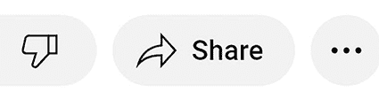
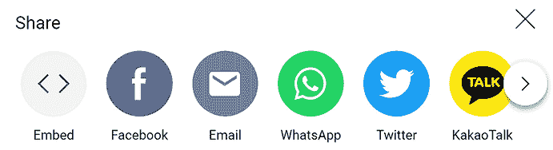
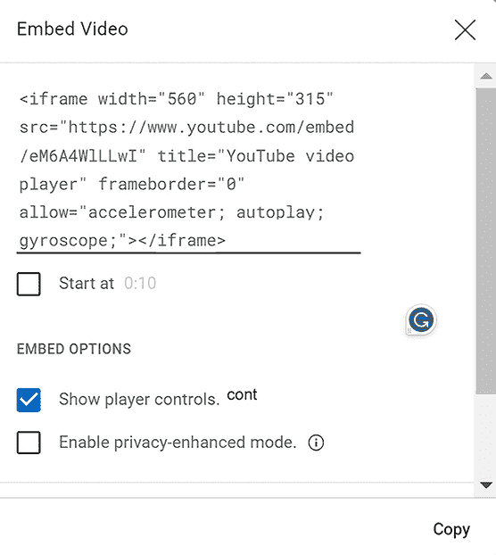
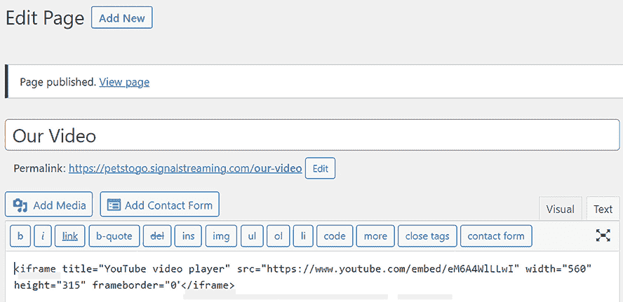
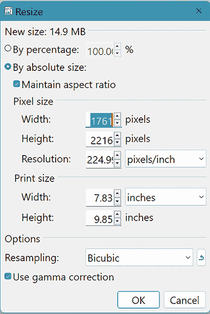
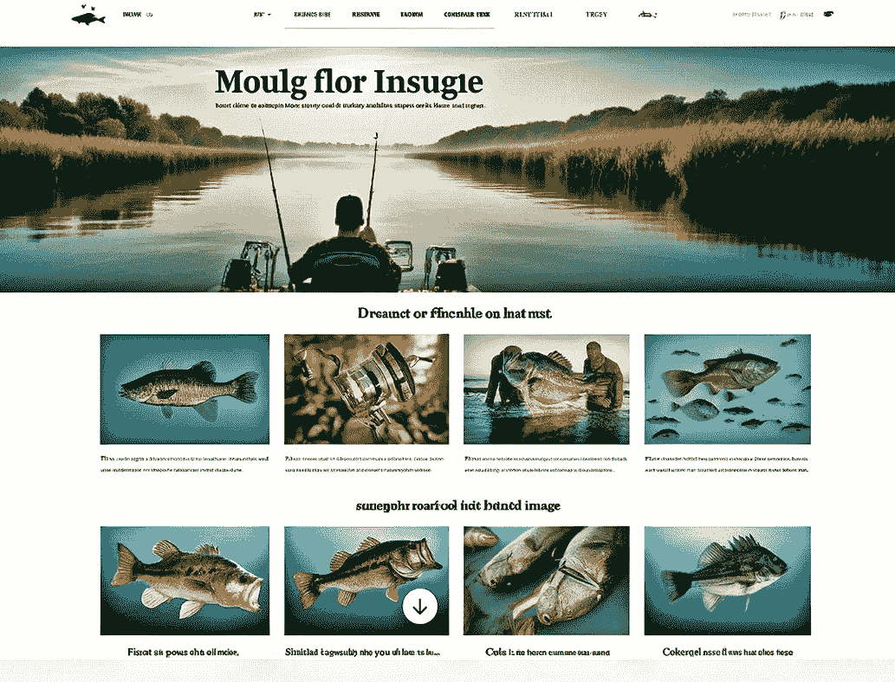
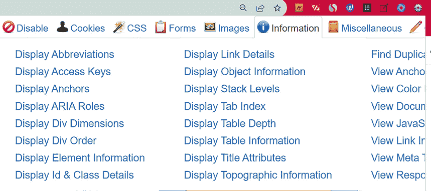
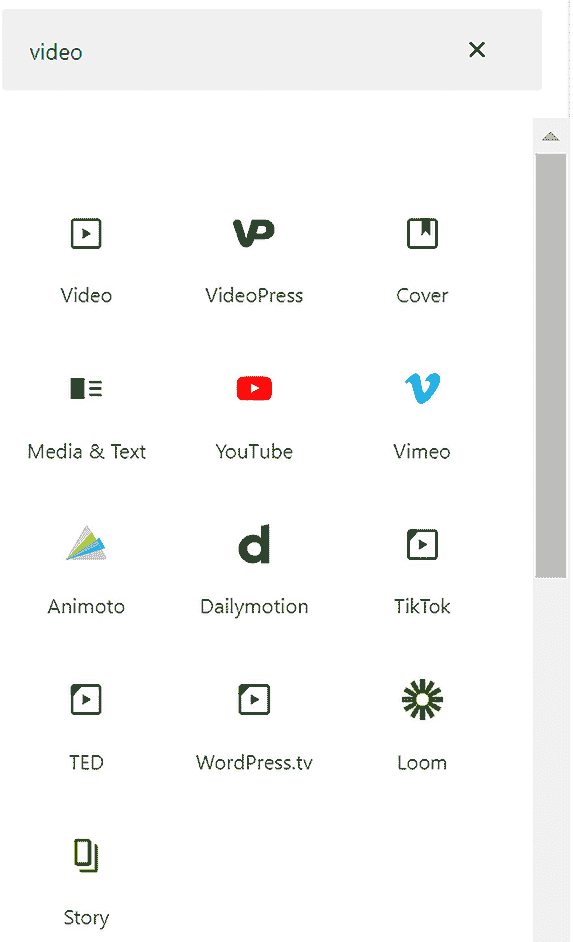

# 第八章：精通多媒体

本章涵盖

+   选择合适的图片数量、大小和类型进行展示

+   了解媒体文件存储的位置

+   确保你的网站对所有访客都是可访问的

+   注意法律问题，如剽窃、许可和归属

+   使用块编辑器管理媒体

多媒体是网站相对于印刷媒体的优势之一。虽然书籍和杂志可以展示图片，但它们不能包含音频或视频。几乎在每个网站上，你都想至少添加一些视频和肯定是一些图片。音频是可选的，并且相对较少见。

数据支持这一点。研究表明，包含*良好、相关*视觉内容的网站内容可以获得 94%的更多浏览量！（有关视觉效果的统计数据，请参阅[`mng.bz/av4x`](https://mng.bz/av4x)。）你还可以阅读《*福布斯*》杂志关于视觉学习和年轻一代特别是如何根据图片做出购买决策的评论，请访问[`mng.bz/MDWE`](https://mng.bz/MDWE)。

大多数人声称自己是视觉学习者。在本章中，我们将探讨将相关图片、音频和视频添加到网站的最佳方法，以使其生动有趣，并给访客留下停留的理由。

## 8.1 展示适量的媒体

当然，你希望在使用图片或其他媒体时谨慎行事。使用太少，网站会显得静态，可能看起来充满了令人望而却步的灰色文字。使用太多，你的观众可能会分心，甚至可能感到厌烦，因为页面缺乏焦点。

尽管没有固定的数字。你不能仅仅针对每页五张图片。你应该使用的媒体数量取决于网站的主题内容。一个在作品集中展示作品的艺术家可以包含许多图片，同样，一个展示商品目录的电子商务网站也可以。一个试图避免显得轻浮的律师网站可能预期展示较少的视觉元素。

### 8.1.1 测试页面加载速度

页面加载速度是另一个考虑因素。过多的图片可能会减慢你的网站速度。同时，你需要考虑到一些访客可能拥有较慢的互联网连接。要测试你的页面加载速度，请按照以下步骤操作：

1.  暂时禁用任何即将推出或建设中插件，如 SeedProd。

1.  前往“页面”>“所有页面”屏幕，然后点击一个页面的标题。

1.  复制该页面的永久链接（位于工具栏上方）。

1.  前往此处提交页面加载测试的永久链接：[`pagespeed.web.dev`](https://pagespeed.web.dev)。

1.  将永久链接粘贴到 URL 字段中，然后点击分析按钮。

你的网站类型应该使用多少图片？

请求 AI 检查竞争对手，并告诉你他们网站上每页典型的图片数量：

|


| 我网站的主题是淡水钓鱼。扫描几个最受欢迎的淡水钓鱼网站，并计算这些网站每页的图片数量。然后告诉我平均使用了多少图片。 |
| --- |

GPT 在这类查询中表现最佳：

|


| 我审查了三个流行的淡水鱼垂钓网站——BassResource、Wired2Fish 和 TacticalBassin，以确定每页的平均图片数量。BassResource：该网站提供各种文章、视频和论坛，通常每页有 20-25 张图片，包括文章缩略图、内容中的嵌入图片和视频预览（Bass Resource）。Wired2Fish：该网站上的每一页通常有 30-35 张图片，包括详细的钓鱼装备照片、教学图片以及伴随文章和评论的插图（Wired2Fish）。TacticalBassin：该网站采用更简洁的方法，平均每页大约有 15-20 张图片。图片主要展示钓鱼装备、捕获的鱼和教学视觉（Tactical Bassin’ - Bass Fishing Blog）。通过平均这些数据，我们得到：BassResource：每页 20-25 张图片 Wired2Fish：每页 30-35 张图片 TacticalBassin：每页 15-20 张图片。取每个范围的中间值以获得更精确的平均值：BassResource：22.5 张图片 Wired2Fish：32.5 张图片 TacticalBassin：17.5 张图片。这些网站每页图片的平均数量大约为(22.5 + 32.5 + 17.5) / 3 = 24.2 张图片每页。因此，平均而言，这些流行的淡水鱼垂钓网站每页使用大约 24 张图片。 |
| --- |

|


| 显然，Wired2Fish 正在扭曲这些结果。请给出排除 BassOnline 后的平均值。 |
| --- |

|


| 每页平均图片数量为：(22.5 + 17.5) / 2 = 每页 20 张图片。因此，在流行的淡水鱼垂钓网站上（不包括 Wired2Fish），每页的平均图片数量大约为 20 张。 |
| --- |

现在我们已经考虑了多媒体的定量方面，是时候将我们的注意力转向定性问题。

## 8.2 避免不适当图片、音频或视频

在这个背景下，*不适当*的媒体可以指几件事情：

+   与您网站的风格不匹配

+   与您网站的目的不符

+   完全粗俗或不恰当

+   仅仅装饰性，而不是推动您网站的故事

+   太大或太小

+   低质量或低分辨率

+   缺少替代文本描述（在图片详细信息屏幕中的“替代文本”或编辑相册屏幕中的“Alt 文本”）。

注意，替代文本由文本阅读器用于向有视觉障碍的人描述图片，或在图片无法显示时提供警报（仅限图片）。它也被搜索引擎使用。

+   缺少标题或字幕

+   自动播放的视频或音频

+   疯狂、分散注意力或令人不悦的视频或音频

+   由于媒体是由其他人创建的，因此不允许使用

+   没有正确格式化或尺寸以适应互联网显示（将在稍后讨论）

注意：如果您使用包含某人面部或车牌号码的媒体，则不应使用。据说谷歌在 Google Earth 应用程序中模糊处理这些内容的原因是，有人在将车停在臭名昭著的房子前陷入了麻烦。

媒体库并非无限。您需要了解其几个限制，以及解决这些限制的方法。接下来，让我们考虑媒体文件大小的问题。简而言之：请避免将大文件上传到您的 WordPress 媒体库。

## 8.3 在 YouTube 上存储视频

单个图像（以及 PDF 或 DOCX 文件等文本媒体）相对较小。因此，通常将它们存储在媒体库中不会成问题。然而，媒体库有一个文件大小限制。具体大小取决于您的托管服务（256 MB 是典型值）。

相比之下，视频文件非常大。原因如下：平均网站图像大约为 150 KB。但 5 分钟的视频是*9,000 倍大*。通常，视频的帧率为每秒 30 帧，换句话说，每秒 30 个图像。因此，5 分钟的视频大约相当于 9,000 个图像，或 1,350 MB。（这取决于图像或视频的规格和类型，但显然视频消耗内存非常快。）

WordPress 托管服务器的存储不是免费的。对您允许的存储量有限制。也可能存在最大文件大小限制。因此，除非您有一个只有几个简短视频的小型网站，否则请避免在媒体库中存储视频。

由于视频文件庞大，它们也会消耗大量的带宽和服务器资源。这样也会影响您网站的性能。

视频*可以*被压缩。这有助于提高页面加载速度和流畅的视频播放。然而，媒体库可能无法访问复杂的视频优化，例如管理压缩（这取决于您的托管服务）。但通常，出于之前提到的所有原因，最好将视频存储在第三方视频平台（如 YouTube）上。视频存储在那里后，您*嵌入*（粘贴）一个视频播放器到您网站上的一个页面。然后，当访客在播放器中点击播放按钮时，YouTube 会将您的视频流式传输到您网站页面，供您的观众观看。

YouTube 允许您免费存储视频！除了减轻您的托管服务存储和传输视频的负担外，YouTube 存储还为您提供以下额外好处：

+   高效、流畅的流媒体播放

+   高级优化和压缩

+   多种视频格式的管理

+   将视频嵌入您网站的简单方法

+   可定制的视频播放器

### 8.3.1 如何将视频上传到 YouTube

在获得许可的情况下，您可以在您的网站上展示他人的视频。或者，您可以上传自己的视频。幸运的是，在您的网站上嵌入任何类型的 YouTube 视频都非常简单。让我们看看如何将您自己的视频存储在 YouTube 上。以下是上传您的视频的步骤：

1. 登录您的 YouTube 账户。

2. 在右上角点击创建图标，如图 8.1 所示。


图 8.1 在 YouTube 中点击此添加视频图标以上传视频。

3. 点击上传视频。然后，拖放它，或从您的硬盘驱动器中选择它。请耐心等待，因为上传可能需要一段时间。

4. 在详细信息部分，如果您愿意，可以更改标题。并向下滚动以指定是否受年龄限制。这是必需的。

5. 在您的视频上传完毕之前，更改或添加您想要提供的信息。

6. 点击下一步。如果您想提供额外的视频元素（结束屏幕、卡片、行动号召），请在此页面上添加它们，然后点击下一步。

7. YouTube 会检查任何版权问题。然后，点击下一步。

8. 使您的视频公开，如果您愿意，点击计划以延迟视频的首映时间，默认时间是今晚午夜。

9. 点击保存。您现在已上传了视频。

### 8.3.2 在您的网站页面中嵌入视频

这里是找到您的 YouTube 视频并复制其 URL 地址（您将需要）的步骤。

1. 登录到您的 YouTube 账户。

2. 通过点击右上角的图标或头像进入您的频道。

3. 点击您的频道，如图 8.2 所示。


图 8.2 当您点击您的频道时，您将看到您上传到 YouTube 的所有视频。

4. 双击您的视频缩略图。这将带您到 YouTube 中视频的显示效果。

5. 点击视频下方的分享图标，如图 8.3 所示。



图 8.3 要开始将视频嵌入到您的 WordPress 网站中，请点击此分享图标。

6. 点击图 8.4 所示的嵌入图标。这将生成您实际嵌入视频所需的代码。



图 8.4 在您点击此处所示的< >嵌入图标后，您可以查看实际连接您的网站到您上传的 YouTube 视频的 HTML 代码。

7. 现在，您可以看到您需要粘贴到 WordPress 页面以创建视频播放器的 HTML 代码。它将加载您的视频，并准备好供您的访客播放。此 HTML 代码如图 8.5 所示。



图 8.5 点击这里的复制按钮将此代码保存到 Windows 的剪贴板，以便您可以将其粘贴到您的网站上。

8. 点击复制（如图 8.5 底部所示）将 HTML 代码发送到剪贴板。或者，如果您计划稍后嵌入，请将代码粘贴到记事本中，并保存到您的硬盘驱动器。

现在我们来看看如何将视频嵌入到您的网站——这相当简单。

### 8.3.3 在您的网站上嵌入 YouTube 视频

在您已遵循前面的步骤，上传了视频，并复制了该视频的 HTML 嵌入代码后，您现在可以准备将视频播放器添加到您网站的一个页面上了。请按照以下步骤操作：

1.  前往您的“页面”>“所有页面”屏幕，并点击您想要放置视频的页面的标题。

2.  现在，在编辑页面屏幕中，点击页面文本框中您想要视频所在的位置。这将使闪烁的垂直线光标位于视频播放器将被放置的确切位置。

3.  点击文本框右上角的“文本”选项卡。（此选项卡显示可以添加 HTML 代码的文本框版本。）

4.  现在按 Ctrl-V 粘贴代码。（如果您之前将代码保存在记事本文件中，请在记事本中打开它，按 Ctrl-A 选择它，然后按 Ctrl-C 复制它。然后，转到您的编辑页面屏幕并按 Ctrl-V 粘贴代码到您的 WordPress 页面中。）

5.  点击“更新”按钮（如果是新页面，则点击“发布”）以保存代码。编辑页面屏幕应类似于图 8.6。



图 8.6 在编辑页面屏幕的此“文本”选项卡中是简单嵌入视频的 HTML 代码。

6.  点击“查看页面”链接或编辑页面屏幕中的“视觉”选项卡，以查看和播放您的视频。

### 8.3.4 修改视频播放器

在编辑页面文本框的文本选项卡中，如果您愿意，可以查看和修改视频播放器的 HTML 嵌入代码。以下是一个包含您可能想要修改的属性的示例嵌入代码，或者，在`autoplay`的情况下，您可以完全删除它。大多数人不喜欢视频或音频自动播放。他们想要决定何时打开媒体。因此，删除`autoplay`及其后面的分号：

```py
<iframe width="560" height="315" src=https://www.youtube.com/embed/eM6Axxx4WlLLwI
title="YouTube video player" frameborder="0"
allow="accelerometer; autoplay; gyroscope;
</iframe>
```

如果您想考虑更改标签及其设置，以下是对标签及其设置的描述：

+   `<iframe>` HTML 元素用于在当前 HTML 文档中嵌入另一个文档或网页。它可以用于广告，或者在我们的情况下，用于嵌入视频。

一些 HTML 术语

在 HTML 中，像这样用大于号和小于号括起来的代码（如 `<iframe>` 和 `</iframe>`）被称为*标签*，它们描述了它们所包含的内容类型，有时还包括额外的指定，如大小、位置或字体。打开和关闭标签，以及它们之间的内容，构成了一个 HTML *元素*。当您在元素中看到 `="` 符号，例如 `title="Our Christmas` `Party"`，关于该元素的额外信息被称为 HTML *属性*。

+   `width` 和 `height` 属性以像素为单位描述了嵌入视频播放器的大小和形状。

警告：指定宽度和高度可能会使视频播放器*无响应*（这意味着它不会正确地调整大小以适应像手机屏幕这样的显示）。因此，如果您选择指定播放器的大小，请务必通过在手机、平板电脑和显示器上查看您的网页来测试它。您的网站主题负责处理响应性，但如果它做得不好，这里有一个 CSS 修复方案：[`mng.bz/gaYZ`](https://mng.bz/gaYZ)。

+   `src` 属性是将被检索和显示的内容的 URL 地址。在这种情况下，它是一个 YouTube 视频。

+   `title` 属性不会显示。视觉障碍人士使用屏幕阅读器来大声读取这个属性（以及其他页面内容）。因此，`title` 属性应该描述视频。

+   `Frameborder` 只有两个值：`0` 不在内容周围显示边框，而 `1` 则显示。

+   `allow` 属性可以包括多个属性，实际上是一个权限列表：

    +   `accelerometer` 允许嵌入的内容访问设备的加速度计，正如你可能预期的，它可以检测和测量手机或平板电脑的加速度。它读取设备沿所有三个轴施加的任何加速度。换句话说，如果以纵向模式查看表格，然后用户将其旋转 90 度，加速度计会检测到这种移动，屏幕会调整到横向模式。它变得比它高。

    +   `autoplay` 在页面显示时开始播放视频，这通常会让用户感到烦恼。让用户决定何时开始表演。一些浏览器实际上阻止自动播放。它还可能影响可访问性，因为屏幕阅读器可能会读取其他内容，而自动播放的音频可能会突然干扰。解决办法是在你的代码中不包括 `autoplay` 属性。

    +   `gyroscope` 是手机和平板电脑中的硬件，对扭曲或旋转非常敏感。它检测空间方向并提高加速度计的准确性。这些设备协同工作，可以使软件重新绘制屏幕到新的宽高比，例如从横向模式切换到纵向模式。

现在是时候回到一个定量问题：在互联网页面上显示的最佳图像文件大小是什么？

## 8.4 使用正确的图像尺寸

手机和其他现代相机拍摄的图像分辨率非常高，这意味着文件大小很大，会迅速耗尽存储空间。当你只想裁剪图像以显示细节时，高分辨率是有好处的。例如，如果图像中有大量像素，即使裁剪，结果仍然足够清晰。

但看看图 8.7。它展示了当你裁剪低分辨率图像时会发生什么。这被称为*像素化*——模糊、方框和斜边边缘呈阶梯状。


图 8.7 当你裁剪低分辨率图像时，结果可能会出现严重的退化，如这种像素化。

然而，当高分辨率图像文件在网站上显示时，可能会减慢页面加载时间。这不仅会让网速较慢的人感到烦恼，还可能降低你的网站在谷歌和 AI 系统中的质量评分。解决办法是减小高分辨率图像的大小。在网页上，大型超高清图像与合理较小的、像素密度较低的图像相比，并没有更清晰。因此，与高分辨率图像一起工作的唯一价值是如果你想裁剪它，从而减小文件大小。

影响图像的两个因素是分辨率和图像文件大小。*分辨率* 表示图像的像素（光点）密集程度。像素——通常是一个小的（通常是）彩色点——是屏幕显示的最小测量单位。分辨率通常以每平方英寸像素数（PPI）来衡量，即屏幕英寸中包含的像素数。

*文件大小* 表示图像的大小（通常通过水平像素数乘以垂直像素数来衡量）。例如，一个 1,080 像素的 HD 视频图像尺寸为 1,920 × 1,080 像素，因此它有超过 200 万个像素。

这里有一些在网站上使用的典型图像类型，以及每种类型的推荐尺寸和宽高比（形状）。这些数据是针对使用 .jpg 文件类型保存到磁盘的图像（其他格式，如 .png 文件，可能要大得多）：

+   *背景图片*（或其他全屏图片）——尺寸为 1,920 × 1,080 像素，宽高比为 16:9（文件大小为 400 KB）

+   *英雄图片*——尺寸为 1,280 × 720 像素，宽高比为 16:9（文件大小为 200 KB）

+   *网站的横幅（页眉）图片*——尺寸为 1,600 × 600 像素，宽高比为 5:3（文件大小为 200 KB）

+   *普通页面或帖子（博客）图片*——尺寸为 1,200 × 630 像素，宽高比为 3:2（文件大小为 180 KB）

+   *标志*——对于矩形标志，尺寸为 250 × 100 像素，宽高比为 2:3（文件大小为 30 KB）

*英雄图片*是访客首先看到的图片。它应该仔细选择，以代表网站的内容。它向潜在观众介绍网站。英雄有时是横幅或页眉图片。甚至可以是全屏的。

这些图像类型的分辨率应为 72 PPI。计算机屏幕上的图像不需要更高的分辨率。计算机屏幕显示的分辨率在 72 到 100 PPI 之间。今天的手机摄像头拍摄的照片分辨率为 300 PPI 甚至更高。超过 72 PPI 不会改善网站上的图像显示效果，但会增加文件大小。

例如，iPhone 12 默认拍摄的照片尺寸和分辨率为 4,032 × 3,024 像素和 460 PPI。这大约是典型网页图片大小的 12 倍。这种图像的 .png 文件大小约为 31 MB，而典型网页图片的 .png 文件大小约为 3 MB。

因此，在将它们上传到 WordPress 之前，您需要准备符合所需分辨率和文件大小的图片，以适应网站上的用途（标志、普通图片、全屏等）。由于印刷媒体需要的分辨率比显示器或其他设备屏幕（通常为 300 PPI 或更高）要高得多，因此当准备在网站上显示的图片时，您通常会同时降低 PPI 和图像大小。我将在稍后向您展示如何调整图像大小和调整它们的 PPI。

注意，那些之前的规范是指导方针，因此它们可能会根据用例和图像类型有所不同。但通常需要减少。还要考虑巨大的图像文件会影响页面加载速度，因此 AI 系统和谷歌对您受众的用户体验质量的看法可能会受到影响。

WordPress 在您将图像上传到媒体库时不会自动压缩图像。它保存了一个与原始图像一对一的副本，但也可以生成其他尺寸：缩略图、中等、大和全尺寸（原始尺寸）。然而，它不会降低分辨率。

WordPress 包含几个工具，例如裁剪工具，用于处理图像。然而，专门的图片编辑应用程序更适合进行高质量的图像处理，如调整大小。在将图像上传到 WordPress 之前，请使用 Photoshop 或替代应用程序准备您的图像。如果您没有 Photoshop，您可以通过安全下载 Paint.NET 或 GIMP 从[`ninite.com`](https://ninite.com)获得免费且出色的替代品。

小贴士：尽管在 WordPress 中使用 CSS 在图像上叠加文本是可能的，但更好的解决方案是直接使用图片编辑应用程序中的文本工具。这样做更简单，当您的网站在其他屏幕尺寸上查看时，结果更可预测。

图片编辑应用程序包括调整图像大小和修改分辨率的工具。例如，在 Paint.NET 中，选择图像 > 调整大小（Ctrl-R）。保持“保持纵横比”（形状）选中，然后输入所需的宽度。高度会自动改变以保持形状。然后，将分辨率降低到 72。图 8.8 显示了 Paint.NET 的调整大小模块。



图 8.8 在此类模块中更改图像的大小和分辨率。

小贴士：您可以通过以下菜单项在 Photoshop 中批量处理多个图像文件：文件 > 脚本 > 将文件加载到堆栈中。

现在你已经看到了如何为网站图像选择合适的尺寸，现在是时候考虑在页面中放置图像的位置了。

## 8.5 有效定位媒体

在您的页面上显示图像的位置很重要。如果您不擅长设计，您可能需要向一个熟悉设计的熟人求助。或者提交您页面的副本，并询问 AI 对图像放置的看法。

您还可以通过查看获奖网站来学习。以下是两个赢得设计比赛的网站：

+   Airbnb 有效地展示了目录式图像布局：[www.airbnb.com](https://www.airbnb.com)。

+   这篇《纽约时报》的“Snow Fall”文章有效地整合了视频、幻灯片和照片的淡入过渡。注意，图像始终位于右侧：[`mng.bz/5gN4`](https://mng.bz/5gN4)。

这里有一份考虑媒体放置和布局最佳实践的清单（如果您打算向 AI 寻求建议，请首先提交此列表）：

+   除非你正在显示目录或一系列缩略图，否则最好根据它们的重要性来调整它们的大小。

+   每张图片都应该超越仅仅装饰的目的。媒体应该与页面上的讨论内容相关。

+   人们首先会看页面上的最高图片或视频，所以确保这些媒体能够有效地代表页面的主题。不太重要的媒体可以放在页面下方。 （一些网站分析应用程序可以生成*热图*，直观地展示人们如何查看你的页面。它显示了从未、有时或总是被查看的区域。更多内容将在下一章中介绍。）

+   通常建议在每两到三段文字之间插入图片（或空白），以打断文本。

+   不要让媒体过于拥挤。为每张图片或视频提供足够的空白边框。然而，某些设计通过在图片或视频周围流动文本来实现。

+   保持一致性。如果你在大多数页面上将图片放在左侧，那么你应有充分的理由解释为什么在*所有*页面上不这样做。

+   检查媒体布局在手机屏幕上的显示效果。

+   在文本中找到与媒体相关的任何引用。

+   提供标题。

+   确保媒体不会分散对重要导航功能（如网站菜单）的注意力。

+   标志通常放置在左上角，有时在右侧，但很少在中间。

GPT 有什么要说的？我把钓鱼网站首页提交给了 GPT（见图 8.9）。


图 8.9 也许这个首页的图片可以调整大小或重新排列以改善布局。GPT 有一些想法。

|


| 我上传了我 bass fishing 网站的首页截图。请建议如何更好地安排这个网站首页的图片。 |
| --- |

|


| 根据您关于图像放置的指南，以下是一些建议，以更好地安排您垂钓网站主页上的图像：顶部图像代表页面主题：确保最高的图像（湖上钓鱼杆的图像）有效地代表了垂钓主题。这个图像放置得很好，但可能从更清晰、高分辨率的版本中受益，以便立即吸引注意力。空白和图像分隔：顶部图像下面的文本看起来很拥挤。在图像和文本之间添加空白将提高可读性，并使页面看起来更整洁。考虑在段落旁边添加较小的相关图像或图标，以分隔文本并保持读者的兴趣。一致的图像放置：下方的鱼类图像排列得很好。然而，确保对齐的一致性。如果可能的话，确保本节中所有图像的大小相同且对齐均匀。这有助于保持整洁、有序的外观。图像标题：在每个图像下方添加标题以提供上下文。例如，包括鱼类名称或任何可能对访客有用的相关信息。移动布局检查：确保图像和文本布局在移动设备上运行良好。有时大图像或紧密排列的元素在小屏幕上看起来很杂乱。使用响应式设计技术相应地调整图像大小和间距。图像周围的空白：每个图像周围应有足够的空白，以避免拥挤的外观。确保有足够的填充或边距将图像与文本和其他元素分开。标志位置：您的标志放置在顶部左侧，这是理想的。确保它可见且与背景区分开来，以提高品牌识别度。遵循这些建议，您的首页将看起来更有组织、视觉上吸引人且易于导航，这可以提高用户体验和参与度。 |
| --- |

我随后要求 GPT 展示一个使用其建议的页面（见图 8.10）：

|


| 你能使用 DALL-E 展示一个展示你建议的页面版本吗？ |
| --- |

|


| 这里是您垂钓网站主页的重新设计版本，展示了我所提供的建议。这种布局遵循了图像放置的最佳实践，确保了干净、有序且视觉上吸引人的设计。如果您有任何进一步的调整或需要额外的帮助，请随时告诉我！ |
| --- |



图 8.10 这是 GPT 的版本，重新排列了图像以满足我提供的标准。

现在让我们转向一个不同的主题。考虑使您的网站对有障碍人士友好是很重要的，因此这是下一节的主题。

## 8.6 提供无障碍访问

考虑到你相当一部分受众面临各种访问互联网内容的挑战，你希望构建一个每个人都能轻松使用和享受的网站。此外，这显然是正确的事情。

在这个背景下，可访问性意味着确保你的网站对所有人来说都高效可用，无论他们的残疾程度如何：

+   视觉障碍，包括低视力、色盲或完全失明

+   听力问题，如听力下降或耳聋

+   影响使用鼠标或键盘的肌肉或灵巧性挑战

+   影响理解和注意力的认知障碍

你的目标应该是消除阻碍访问你的内容和功能的障碍。人们应该能够理解、可视化、导航、交互，如果你有一个双向博客页面，甚至可以贡献信息。

互联网联盟致力于制定互联网标准。他们的努力包括网络内容可访问性指南（WCAG）的最佳实践和标准。他们列出了四个原则，通常被称为 POUR：

+   *可感知性*—信息不能仅通过大小、形状、声音或视觉位置等感官特征来传达，因为一些访客无法感知这些元素。

+   *可操作性*—如键盘导航等组件对所有用户都有效。

+   *可理解性*—内容清晰且易于理解。

+   *稳健性*—网站在各种浏览器和设备上都能正常工作。

美国残疾人法案

美国残疾人法案（ADA）与 WCAG 类似，但有一些区别。ADA 仅要求网站可访问性，而不指定任何技术标准。它只是将你引向 WCAG 标准。你可以因 ADA 违规而被起诉或处罚，但 WCAG 没有法律权威。到目前为止，原告律师对 ADA 违规的投诉主要限于“公共场所”，意味着汽车旅馆、面包店、剧院、商店、加油站、律师事务所、州和联邦网站等。

例如，如果你的网站支持实体店，如果网站在某些方面不可访问，你可能会收到警告信或传票。相比之下，如果你的网站是关于如何拍好照片或烤松饼的，那么你被针对的可能性相当低。然而，ADA 的执行并不完全一致。因此，这也是让你的网站可访问的另一个原因。总之：如果你通过网站销售商品或拥有相关的实体店业务，你的风险最大。

### 8.6.1 为什么你应该这样做

显然，为从你的包容性努力中受益的许多人做出安排是好事。除了做出正确的道德选择外，你还可以享受以下好处：

+   扩大受众范围，让更多用户访问你的内容

+   遵守网络可访问性法律，从而避免潜在的法律诉讼

+   通过展示你对包容性的关心来提升你的品牌形象

+   允许人们使用辅助技术，如屏幕阅读器、语音控制、开关和其他工具

+   提高搜索引擎优化（SEO）排名（据说，如果网站是无障碍的，Google、Bing 和 AI 搜索引擎会将其排名更高）

### 8.6.2 寻找无障碍性主题

一些主题在设计时就考虑了无障碍性。在主题中寻找的一个特性是它是否采用了称为*角色*的无障碍性富互联网应用程序（ARIA）功能。这种方法使用 HTML 属性使屏幕阅读器更容易澄清网站的结构和各个区域。HTML 5 包括许多这样的元素。以下是一些被描述为无障碍性就绪的流行主题和主题开发者：

+   Twenty Twenty-One

+   OceanWP

+   Astra

+   GeneratePress

+   Divi

+   AccessPress Parallax

+   精美主题

检查一个主题是否包含 ARIA 元素的一种方法是在网站的界面视图中右键单击，然后从弹出菜单中选择检查器。现在搜索`role`。ARIA 角色标签和识别各种类型的网站内容，如*展示、选项、列表框、组*等等。但如果要更有效地查看角色列表（如果有的话），请将 Web 开发者扩展添加到你的浏览器中。检查器专注于查看和测试网页结构和样式的修改，而 Web 开发者扩展有一套更全面的工具。值得一试。

Web 开发者：深入挖掘网站内部的优秀扩展

当你在浏览器中安装 Web 开发者扩展时，它会为你提供数十种工具。例如，你可以使用其信息菜单查看 ARIA 角色，如图所示。

Web 开发者工具包包括数十种对高级或中级开发者有用的工具，其中一些对完全初学者也很有价值。你可能想试一试。它在 Chrome、Edge、Firefox 和其他浏览器中都能使用。

以下博客文章列出了开发者可能会发现有用的附加浏览器扩展：[`mng.bz/6ejG`](https://mng.bz/6ejG)。



当你构建和维护网站时，你可能会发现这个 Web 开发者扩展非常有价值。

自动无障碍性测试

这里是如何运行一些自己的测试。在你的 WordPress 安装中激活一个主题（外观 > 主题 > 添加新主题），然后在 Chrome 中查看前端并按 Ctrl-Shift-I，以获取 Lighthouse 报告。或者，右键单击，并从弹出菜单中选择检查器。点击分析页面加载按钮。在众多诊断中，你可以向下滚动并查看一个无障碍性分析，它给你一个分数并列出它发现的问题。

例如，它可能会报告一些问题，如文本/背景对比度不佳或按钮和链接描述不充分。然而，请注意，自动无障碍性分析无法测试所有可能的无障碍性问题。

此外，将这个非常实用的 axe DevTools 扩展程序添加到您的 Chrome、Edge 或 Firefox 浏览器中：[`mng.bz/oKNN`](https://mng.bz/oKNN)。

然后，前往您正在测试主题的网站前端，打开检查器。在 Lighthouse 右侧的菜单中，点击 axe DevTools，并按照步骤分析您的页面以查找可访问性问题。axe 工具既全面又实用——它能发现许多类型的问题并提出良好的解决方案。如果您更喜欢一个高效的 axe DevTools 前端，并且还能生成详细的 Microsoft Excel 报告，请将 LERA 扩展程序添加到您的浏览器中：[`mng.bz/nRQv`](https://mng.bz/nRQv)。

在选择主题时，请注意以下事项：

+   通过键盘（无需鼠标界面）轻松导航，这对于有打字困难的人很有帮助。

+   响应式设计，确保您的网站在小屏幕上也能清晰地显示，这对于有视力问题的受众来说很重要。

+   ARIA 角色用于扩展 HTML，以帮助残疾人士，特别是那些使用辅助技术如屏幕阅读器、自定义控件和放大镜的人。

+   为视力不佳的访客提供颜色对比选项。

+   带有字幕的标签顺序，通过按 Alt-Tab 键在页面间导航时清晰，这样屏幕阅读器就可以通过字幕描述来识别每个标签。

+   为任何嵌入的视频或音频添加字幕，以便访客可以决定是否播放该内容。

+   视频的闭字幕，通过音频的文本表示使视频内容对聋人和听力受损人士可访问。他们也有助于有学习障碍或注意力缺陷的人保持专注。

+   为使用屏幕阅读器的盲人和视障人士提供图像的 Alt 文本描述。

+   为视觉障碍访客提供文本大小调整（缩放）功能。

+   跳转链接。

定义*跳转链接*对屏幕阅读器和仅使用键盘的用户很有帮助。这些特殊链接在有人开始通过页面中的各个部分进行标签切换时才会可见（类似于填写网页表单，按 tab 键将您带到表单中的下一个字段）。有了这个功能，人们可以跳过他们不感兴趣的内容，例如横幅、长菜单或重复的内容，如网站标题。通过添加 CSS 代码如`position: absolute; left: -999px`，跳转链接可以隐藏给不使用屏幕阅读器的鼠标用户。示例包括“跳转到菜单”和“跳转到下一个标题”。

## 8.7 理解权限、归属权和其它法律问题

法律是广泛的，不断发展的，有时甚至相互矛盾。但它是不能被忽视的。您是否需要采取措施来保护您网站上原创内容的版权？您是否需要避免使用非原创内容？显然，答案是“不”和“是”。

我没有资格提供法律建议。以下是我研究的结果，但如果你需要关于如何遵守法律的步骤的建议，请联系律师。请不要将以下内容视为法律建议。这仅仅是你自己研究的一个起点，或者为你提供与律师讨论的问题，或者提醒你关于剽窃等问题。

我听说当你创作新的文本、艺术、音乐或任何形式的原创内容时，它就自动获得了版权。一旦你将其写下来、画出来、画出来或以其他方式使其有形，它就受到保护。明确发布网站显然使内容有形。自动版权赋予你独家所有权。你拥有独家权利分发、展示、复制作品以及授予复制许可。其他人的作品也是通过这种方式获得版权的。你不能仅仅复制他们的作品并将其粘贴到你的网站上。（正如法律中经常发生的那样，有一些例外。）

如果这看起来很清楚，其实并不清楚。我在尽力处理这个话题，所以请让我一个人待着。😉

有时，版权只是*部分*的。例如，如果有人发布了一个披萨食谱，那么他们的说明、对过程的描述以及任何轶事或叙述都是受版权保护的。但实际的配料——面团、奶酪、番茄酱、意大利辣香肠、洋葱——不能获得版权。事实也不能获得版权，例如伦敦的位置或登月的日期。这些都是关于空间和时间的绝对事实，无论爱因斯坦怎么说。此外，不同国家有不同的版权和商标法。

法院存在是因为法律问题可以有多种解释方式。例如，时不时地，有人因为他们的歌曲与后来的某首歌曲（通常是赚了很多钱的那首）存在一些相似之处，而将音乐家告上法庭。由于相似度有高低之分，这种指控必须得到裁决。如果相似度*过高*，投诉者就会从中获利。但鉴于西方音乐音阶只有 12 个音符，且只有有限数量的节奏是有意义的，相似之处是不可避免的。通常，这些音乐版权案件失败的原因与画家无法对颜色进行版权保护的原因相同。而且，任何有创造力的人都知道，一个人会受到他人作品的影响。

很有趣，有些人抱怨 AI 画作受到了先前人类画作的影响。嗯，大多数人类画家也会从现有风格中汲取灵感。直到摄影出现，新的风格相当罕见。但当相机在现实主义方面做得更好时，艺术家们以新风格的爆炸式出现做出了回应，许多风格既愚蠢又奇特。这些风格通常更多的是对现实主义的反应，而不是努力寻找新的方式来在视觉形式中展示美。

### 8.7.1 精通改写

大多数作者都会研究并从他人发表的作品中学习。但你不能只是简单地复制粘贴他人的文本。你必须进行改写，这意味着用自己的话来表达。你可以重复*事实*，但不能重复其他作者如何措辞。

通过人工智能出现了一种新的工具——改写器。你将某人的文本输入其中，它们会重新编写文本，保留文本的意义而不只是简单地复制。QuillBot ([`quillbot.com/`](https://quillbot.com/)) 是其中之一。他们声称拥有 5000 万用户。该应用程序包括几个功能，如抄袭检查器。我要求 QuillBot 改写本节开头为“法院存在”的早期段落的前半部分。以下是 QuillBot 的修订版：

|


| *由于理解法律问题有众多方式，法院是必要的。例如，有时有人因他们的歌曲与随后的歌曲（通常是非常成功的歌曲）之间的相似性而起诉艺术家。相似度有不同等级，因此指控需要评估*。 |
| --- |

另一个流行的改写器是 Wordtune ([www.wordtune.com](https://www.wordtune.com))。与 QuillBot 一样，它具有额外的功能，例如允许你选择写作风格（随意、正式），通过缩短或扩展句子来指定句子长度，以及其他功能。一些评论员说，Undetectable ([www.undetectable.ai](https://www.undetectable.ai)) 在这些任务上做得最好。

### 8.7.2 进一步的法律问题

如果你拍摄了你朋友的视频，但视频中的某个人不想在网上被看到？你是否从视频中所有在场的人那里获得了书面许可？以及背景中的人？

为了安全起见，你可能想要让律师为你网站上使用的照片或视频起草一份许可表格。并且从这些媒体中所有可见的人那里获取签名。

你能在你的网站上嵌入他人的视频吗？即使你得到了创作者的许可，如果他们的视频中存在版权侵犯怎么办。也许电视背景中正在播放职业足球比赛？那么你是否会次级负责？

你不能仅仅归因或归功于视频的所有者。说谁创造了视频并不一定意味着你不需要在所有情况下获得许可。Nolo 提供了一个关于许可的良好教程：[`mng.bz/vKNx`](https://mng.bz/vKNx)。

但 YouTube 确实提供了一种合法的方式来嵌入他人的视频。YouTube 表示，如果上传视频的人没有关闭 YouTube 嵌入选项，您就可以这样做。回想一下，在本章的早期，您上传了一个视频到 YouTube，然后点击了分享选项（参见图 8.5）。嵌入选项是分享视频的几种方式之一。所以，如果您看到嵌入图标（参见图 8.6），视频的所有者已经隐含地授予了在网站上嵌入他们的视频的许可。嵌入选项可以被关闭，但您必须采取以下步骤：

1.  为自己设置一个 YouTube 内容管理器。

1.  登录后，点击 YouTube 屏幕右上角的 favicon（个人图标）。

1.  在下拉列表中点击“YouTube Studio”。

1.  点击“内容”。

1.  点击选择您想要管理的视频。

1.  点击左侧的“设置”。

1.  点击“权限”。

注意：以下是 YouTube 本身对这一问题的看法：[www.youtube.com/about/copyright/fair-use/](https://www.youtube.com/about/copyright/fair-use/)。

### 8.7.3 寻找免费媒体

避免版权侵权问题的另一种方法是使用“免费”媒体。一些在线资源提供股票照片、音乐和视频，您无需付费或获得使用许可。然而，您需要阅读他们的服务条款或许可要求，因为“免费”并不总是意味着“无限制”。

例如，股票照片网站可能允许您在包含署名或提供链接回其网站的情况下使用其内容。其他免费内容只能用于非商业目的。

非营利组织 Creative Commons 的成立有两个目的：一方面允许内容创作者——视频制作者、摄影师、艺术家和音乐家——保留他们的版权，同时仍然允许其他人（比如我们）有限地使用这些创作。该组织提供几种创作者可以选择的许可协议版本，为其他人使用他们的作品提供各种具体的权限。有些这样的许可协议要求任何衍生作品（对原始作品的变体）必须以相同的条款进行许可。其他则完全禁止衍生作品。有些要求署名或仅限非商业用途。

几个免费内容收集网站，如 Flickr、Wikimedia Commons、Pexels 和 Vimeo，允许您根据内容创作者选择的哪种 Creative Commons 许可协议来搜索内容。这种方法对您来说更有效率，因为您不需要分别联系创作者来寻求他们的许可。以下是一些最好的免费媒体资源：

+   Creative Commons—[`creativecommons.org`](https://creativecommons.org)

+   Pexels—[www.pexels.com](https://www.pexels.com)

+   Flickr—[www.flickr.com](https://www.flickr.com)

+   Vimeo—[`vimeo.com`](https://vimeo.com)

+   Freeplay Music—[`freeplaymusic.com`](https://freeplaymusic.com)

+   Mixkit—[`mixkit.co`](https://mixkit.co)

+   Ikson—[`mng.bz/4aOB`](https://mng.bz/4aOB)

+   CFM Production—[`mng.bz/QDQm`](https://mng.bz/QDQm)

+   Unsplash—[`unsplash.com`](https://unsplash.com)

+   Wikimedia Commons—[`commons.wikimedia.org`](https://commons.wikimedia.org)

+   Pixabay—[`pixabay.com`](https://pixabay.com)

## 8.8 使用 Gutenberg 媒体块

在撰写本文时，Gutenberg（WordPress 块编辑器）的音频和视频块加载可能较慢，并且某些媒体根本无法工作。我建议使用第三方音频和视频块。点击块编辑器中的+图标以打开块库，然后搜索`audio`或`video`。你可以找到内置的 WordPress 播放器，以及相当多的第三方块。下面是一个可以安装的插件列表，如图 8.11 所示。



图 8.11 你可以在 WordPress 的块编辑器中使用这些块显示视频。

最佳第三方媒体播放器之一是 EmbedPress。它是一个嵌入怪物，能够管理 150 个来源和文件类型，包括地图、视频、PDF 和 DOC 文件、SoundCloud、Twitch、Flickr、Instagram、DailyMotion、TED、MixCloud 以及 139 个更多。你可以在这里了解它：[`wordpress.org/plugins/embedpress`](https://wordpress.org/plugins/embedpress/)/。

在块编辑器中使用此插件进行嵌入非常简单。你只需复制一个 URL 并将其粘贴到 EmbedPress 块中。此插件还与经典 WordPress 编辑器以及 Elementor 页面构建器兼容。

使用经典编辑器与 EmbedPress 一起使用甚至更简单——无需使用块。只需将源 URL 粘贴到编辑页面或编辑帖子屏幕中的文本框中。EmbedPress 会自动创建显示嵌入所需的代码。你可以通过点击文本框的文本选项卡来查看代码。

本章探讨了三个主要主题：管理多媒体、确保可访问性以及你可能会遇到的法律问题。接下来，我们将转向如何在特殊类型的网站页面上与你的受众互动：博客。它可以服务于这些几个目的之一——提供新鲜内容、允许你的受众与你的网站互动、提供客户服务以及推销你的商品。一个缺点可能是，如果你允许你的受众向博客发送消息，你必须检查它们是否适当——不是煽动性的、粗俗的或其它不适合发表的内容。幸运的是，WordPress 包含一些工具可以半自动化这一审查过程。AI 也可以相当熟练地做出这些判断，我敢说，你也可以。

## 摘要

+   没有媒体的网站看起来相当空旷。但尺寸不正确、位置不当或其它不合适的媒体看起来杂乱无章、业余。确保你的媒体与页面中的其他元素良好配合，并与网站的整体目的和谐一致。在本章中，你探索了管理媒体的有效技巧。

+   与文本文件相比，视频文件非常大，音频文件也不算小。即使是标准定义的视频，其大小也大约是相同时长的音频文件的 20 倍。因此，您最好的策略是将这些媒体嵌入，而不是试图将它们存储在您的媒体库中。页面加载时间将更快，您也不会因为不必要的文件存储而给您的网站数据库带来负担。

+   由于几个原因，您希望使您的网站对面临各种挑战的人具有吸引力并易于访问——无论是听觉、视觉还是其他方面。您可以使用各种工具来分析和改进网站的可访问性。

+   法律对使用他人的媒体或文本内容有相关规定。您不希望收到律师的信件，因为您未能获得必要的许可或未能显示所需归属。一些网站提供免费使用的媒体，但您需要阅读他们的许可要求，因为“免费”并不总是意味着“想做什么就做什么”。

+   到目前为止，WordPress 块编辑器的媒体块在添加媒体到您的网站时并不是最佳选择。但有一些优秀的替代方案，例如 EmbedPress。
