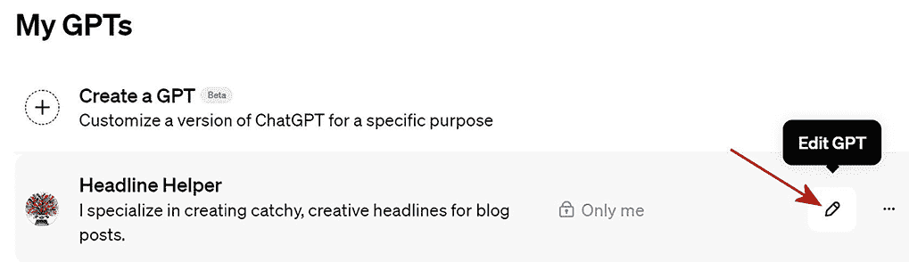
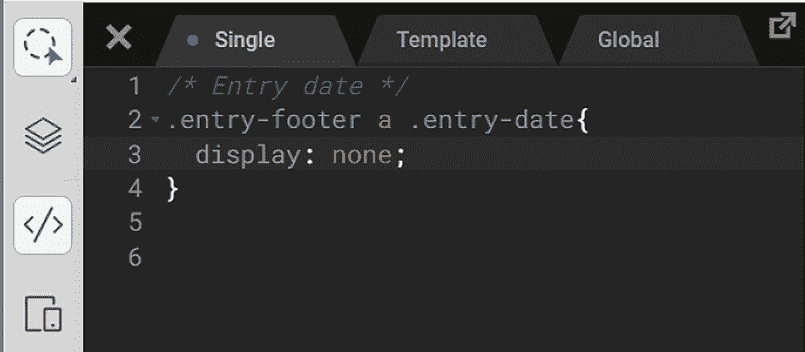
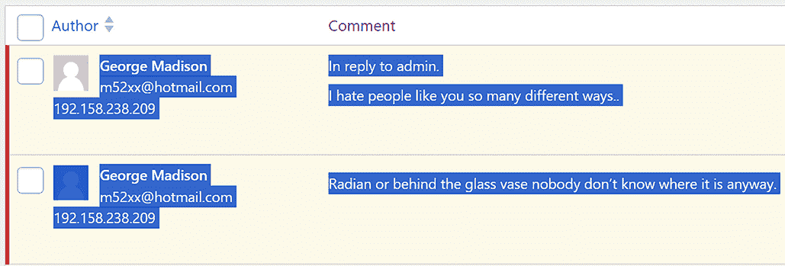

# 第九章：在与观众互动时使用 AI

本章涵盖

+   AI 告诉你博客中要写什么

+   创建一个用于回复帖子的自定义 GPT

+   提供带有类别的博客导航

+   自动化收到的消息审查

+   推广你的博客

+   理解 GPT 的定制指令

+   创建访客电子邮件数据库

+   测试最流行的五个 AI 系统

尽管偶尔有人预测末日，但博客的受欢迎程度仅略低于 20 年前鼎盛时期的水平。诚然，社交媒体（如 YouTube 和 Facebook）的兴起是严重的竞争，但博客仍然拥有庞大的受众。而且，与一些其他媒体不同，博客继续作为信息来源的信任度保持较高。

经营博客可能会很耗时，因为允许观众参与的博客要求你*审查*（检查适当性和质量）每一条收到的消息。此外，你必须发布回复。当然，你可以设置一个单向博客，只展示你的消息。但大多数访客都欣赏能够与网站互动的能力。

本章的目标是向你展示 AI 如何帮助你自动化管理高质量博客所涉及的各种任务。我无法提供关于*如何*和*写什么*的建议——这取决于你网站的主题。而且我不知道你的主题可能是什么。但*有人*可以给你关于如何和写什么的特定建议。你已经猜到了！询问 AI。

在本章中，你将了解 AI 如何帮助你了解在博客中写什么和如何写。首先，我们将让 AI 对我们的博客消息进行评论，并提出改进建议。其次，我们将要求 AI 为我们撰写吸引人的博客标题。但在深入这些主题之前，让我们先定义一下什么是博客*是什么*。

## 9.1 博客的定义：概述

术语*博客*来源于*网络日志*，最初它是一种日记，是某人生活或思想的连续记录。然后，它被称为*网络日志*，最终简化为*博客*。

博客（一个网站中通常只有一个博客页面）在三个方面与其他网页不同：预期会频繁更新；可以可选地发布来自网站观众的留言；并且是以前博客消息的搜索存档。然而，如果你未能定期和经常在博客中发布新内容，你的访客可能会停止访问。而且搜索引擎可能会降低你的排名，因为你没有提供新鲜内容。

博客通常因其允许观众与网站所有者互动而受到重视。（如果你想保持一个成功的博客，请确保及时回复收到的消息。）博客还可以作为企业的一种客户服务机构，或者发布俱乐部或教堂公告的地方。此外，博客还可以

+   发布一个技巧列表。

+   列出可供领养的宠物、待售物品或类似的服务。

+   如果博客页面表明混合网站（博客页面加上额外的相对静态页面）经常更新并且有新鲜信息，则可以提高网站的搜索引擎优化（在谷歌或 AI 列表中的排名）。

+   发布销售公告或以其他方式推广电子商务。

+   使企业人性化，提供个人轶事或回答问题。

+   建立品牌。

一个博客的运作方式取决于您的主题，您使用的 WordPress 版本，或者您安装的插件。传统的博客包含一个倒序排列的帖子列表。它以单列显示这些消息，可以滚动。较新的 WordPress 默认主题在博客页面中包含一个存档模块，列出按月份分组的链接。当点击某个月份时，仅显示该月份发布的消息。另一个较新的变体是消息的三列显示。

## 9.2 GPT 来帮忙：如何为您的博客写作

GPT 让您创建自己的*定制 GPT*。您可以使用自己的学习（您提供的数据）和特定技能构建专门的 GPT。您的定制 GPT 将由 GPT 本身提供动力。但这是一个经过微调的版本，提供了数据并给出了指导，以便熟练地执行您请求的特定任务。

定制 GPT 是特定领域的专家，例如法律，或者在我们的案例中，是博客。如果您的需求是通用的，您也可以搜索其他人已经构建的 GPT。

在下一个示例中，我们将使用 Zbigniew Lukasiak 的名为博客评估器的 GPT。运行 GPT，然后在左侧仪表板上点击探索 GPT。搜索`Blog Evaluator`*.* 点击博客评估器以运行它。

在这里，我们将探讨如何使用卢卡西亚克先生的来自 GPT Store 的定制 GPT，然后在下一节中，我们将创建我们自己的定制 GPT。GPT 内置的向导将逐步引导我们完成这个过程。

小贴士：截至 2024 年 6 月，GPT Store 中有超过 300 万个定制 GPT，其中 16 万个可供使用。您可能会在未来使用这个探索 GPT 功能，所以通过点击左上角定制 GPT 名称旁边的小向下箭头图标，将其永久添加到您的 GPT 仪表板。然后，点击保留在侧边栏*.*。

现在回到那个博客评估器。点击请评估这篇文章。然后，将您的博客消息之一粘贴到 GPT 中的消息博客评估器字段。我将这篇样本博客条目粘贴到消息博客评估器字段中：

|


| 关于使用 Instant Pot 进行压力烹饪的最佳建议是确保它不会烧毁任何东西，并且能够达到压力，通过始终向 6 夸脱的 IP 中添加 1 杯水（或肉汤或任何液体）。如果您不希望您的肉或其他成分在水中煮沸，请插入随 IP 一起提供的其中一个架。 |
| --- |

博客评估器提出了以下回应：

|


| 感谢您分享文章摘录。我现在将评估主要论点和支持它的推理。主要论点：使用 Instant Pot 进行压力烹饪的有效建议是始终向 6 夸脱 Instant Pot 中加入 1 杯液体（水、肉汤等），以防止烧焦并确保达到压力。如果你不希望原料在水中煮沸，请使用架子。评估：论点：始终向 Instant Pot 中加入 1 杯液体可以防止烧焦并确保达到压力。评分：C-推理：文章提出了一个明确的建议，但没有探讨这个建议在某些情况下可能不正确或效果较差的可能性。它没有考虑例外或替代方法，也没有讨论为什么建议使用这种特定数量的液体。论点：使用架子防止原料在水中煮沸。评分：C-推理：这是一个实用的建议，但文章没有提供理由或证据来支持使用架子是有益的，也没有承认任何局限性或替代方法。总体评分：C-文本提供了直接的忠告，但在推理方面缺乏深度。它没有考虑潜在的反对论点，不同情况下这个建议可能不适用的情况，或讨论为什么建议这些特定方法。它既没有明确声称其建议是唯一正确的方法，也没有承认可能不正确。因此，它得到 C-评分，因为它既没有坚定地断言其正确性，也没有考虑其潜在的不可靠性。 |
| --- |

因此，这个定制的 GPT 建议扩展帖子，包括使用液体和架子的替代方案。如果你在博文中提到这些例外，你的博客文章可能会得到改善。

小贴士 想要找到最适合各种目的的最佳第三方自定义 GPT？有一个很好的自定义 GPT 可以做到这一点。运行 GPT，点击探索 GPT，搜索`GPT` `Finder`（由 Skill Leap AI 提供，[`skillleap.ai`](https://skillleap.ai)）。点击 GPT Finder 来运行它。

## 9.3 创建自定义 GPT：AI 生成消息标题

几年前，《大都会》杂志的编辑开始在文章标题中使用数字：*22 种拒绝邀请的方法*，*7 本夏日必读的书*等等。这种趋势流行起来。考虑在博文标题中经常包含这样的数字。原因在于，这会给你的观众留下你已经*真正*研究过这个主题的印象，所以你所说的内容是*全面*的。你发现总共有“22 种方法”。不多也不少。

此外，你希望使用简洁、简短的标题，通常不超过九个单词。标题应包括积极的、情感化的词汇，如*确认*、*令人震惊*、*令人惊讶*、*揭露*。不时，你也应使用一些问题标题：*你知道何时种植球茎吗？*请注意，大多数向你的博客提交消息的人不会给它们命名，所以你负责为你的帖子和你访客的帖子命名。

避免使用像“简单”或“快速”这样的陈词滥调。相反，描述读者从文章中获得的益处：*在医生的办公室里省钱*。并且要具体。与其使用“烹饪鱼的最佳方法”，不如使用“用 Instant Pot 煎三文鱼”。

最佳标题类型将部分取决于您网站的关注点和受众。因此，使用第十二章中描述的分析技术对标题版本进行 A/B 测试是个好主意。当然，在构思强有力的标题时，也要让您的 AI GPT 标题撰写助手参与其中。让我们通过创建我们自己的专用定制 GPT 博客标题撰写器来看看如何做到这一点。

### 9.3.1 创建自己的 GPT：一个用例

要构建自己的定制 GPT，您需要使用 GPT 的定制 GPT 工具进行几个步骤。告诉它如何执行一个专业、特定的任务。然后，您可以在任何时候重用这个专家助手。您可以给 GPT 下达指令，给它提供数据，并描述它的技能。

让我们通过构建自己的定制 GPT 来尝试一下，这个 GPT 专门擅长撰写吸引人、有效的博客标题。它会读取信息，然后为我们提供一些可供选择的标题。请注意，要创建定制 GPT，您需要拥有 ChatGPT 的付费订阅。（然而，免费计划用户可以使用现有的定制 GPT。）

按照以下步骤操作：

1.  访问 GPT 主页 [`ChatGPT.com`](https://ChatGPT.com)，然后点击左侧边栏上的“探索 GPT”。

1.  点击右上角的“创建”按钮。

1.  您现在将看到 GPT 构建器屏幕。

1.  在空白字段中输入以下内容：`创建一个专注于为博客文章创建吸引人标题的标题撰写者`。

1.  按下 Enter 键将信息发送给 GPT。

1.  在考虑您的请求后，GPT 将为这个新的 GPT 建议一个名称。您可以使用这个建议或进行编辑。

1.  然后，GPT 会建议一个图标。再次，接受该图标或提出修改建议。

1.  GPT 将现在要求您提供有关您想要的内容的指导。始终记住，AI 机器人现在能够理解相当细微和长度的指令。而且它们在准确理解自然语言的含义，即使是习语方面也在不断进步。换句话说，现在最好的 AI 立即理解“这个剧院内部很酷”和“那是一部很酷的电影”中“酷”这个词的不同含义。

1.  将以下详细的指南粘贴到内容指导字段中：`建议的标题应适合被命名的博客文章的内容。提供五个标题。不要使用粗俗或高度技术性的词汇。标题不应超过九个单词。多年前，《大都会》杂志的编辑开始在文章标题中使用数字：22 种拒绝邀请的方法，7 本夏日必读的书，等等。这个趋势流行起来。专家声称，在文章标题中经常包含这样的数字是个好主意。原因？这给人一种你真正研究了这个主题，你所说的内容是全面的印象。你已经发现，总共有` `"``22 种方法。"`

    `此外，你希望使用简洁、简短的标题，不超过九个单词。并包括积极的、情感化的词汇，如确认的、令人警觉的、惊人的、揭示的。此外，时不时地使用一些疑问标题：你应该每天洗澡吗？避免使用像容易或快速这样的陈词滥调。相反，描述读者从这篇文章中获得的益处：在医生的办公室里省钱。并且要具体。与其说“烹饪鱼的最佳方法”，不如说“用 Instant Pot 立即炸鲑鱼”。这些博客信息是关于 Instant Pot 的食谱，所以标题应该使用适合烹饪或使用 Instant Pot 或食谱的词汇。`

1.  现在指定你希望你的 GPT 如何与你互动，输入以下内容：`如果你正在命名的博客文章在某些方面模糊或不清，请要求提供更多细节。`

1.  然后，当被问及你想要的语气或风格时，输入 `The tone should be friendly, conversational, brief, and clear`。

1.  在这个阶段，如果你愿意，可以建议进一步的改进。例如，要求提供更多优秀标题的例子，或者按照 AI 对标题质量的看法列出标题，等等。

1.  当满意时，输入 `Yes` 以被带到游乐场，在那里你可以测试你的自定义 GPT。以下是一个你可以提交给 GPT 命名的示例博客文章：`要使用 Instant Pot 准备米饭，首先在冷水下冲洗米饭，直到水变清，这有助于去除多余的淀粉。然后，将 1 杯米饭和等量的水放入 Instant Pot 中。盖上盖子，将排气旋钮调整到密封位置，然后开始高压烹饪 3 分钟。`

    `一旦烹饪阶段结束，让 Instant Pot 自然减压 10 分钟，之后旋转排气旋钮以释放任何剩余的压力。迅速打开盖子，用叉子给米饭增氧，然后上桌。重要的是要认识到，根据所煮米饭的种类，米与水的比例和烹饪时间可能会有所不同。例如，像巴斯马蒂或茉莉香米这样的白米应该高压烹饪 5 分钟，相反，长粒糙米可能需要 10 分钟。`

1.  我们的标题助手以这种方式响应：

|


| “Instant Pot Magic: 三步制作完美米饭”“5 分钟巴斯马蒂幸福：Instant Pot 米饭指南”“终极 Instant Pot 米饭烹饪速查表”“米饭完美：Instant Pot 秘密揭晓”“Instant Pot 精通：简单化米饭种类” |
| --- |

好主意。点击保存按钮以存储 GPT。然后，关闭 GPT。

警告：这可能是标题的问题，但如果你使用 AI 生成博客*消息*，请始终记得要么重写它们，要么让 AI 进行释义（不可检测的，[`undetectable.ai/`](https://undetectable.ai/)）。这样就可以避免抄袭的指控。目前，您应该对 AI 的回答进行事实核查。Perplexity.ai 通常是一个很好的资源，因为它为其断言提供了引用。这使得您的事实核查更容易。我说*目前*是因为 AI 系统不会止步不前。它们不断进步，并且速度惊人。更近的系统——例如 Google Gemini 的 Ultra 版本——甚至更不容易给您错误或产生幻觉。

### 9.3.2 修改自定义 GPT

您可以随时修改您的自定义 GPT。这里有一个快速示例。在上一个部分中，我们创建了标题助手 GPT，我们将从其中复制粘贴我们选择的标题。但是 GPT 决定将其标题放在引号中。不需要这样做。让我们回到 GPT 并修改标题助手 GPT：

1.  打开 GPT。

1.  点击右上角的灰色圆圈，然后点击我的 GPTs。

1.  点击图 9.1 中显示的编辑 GPT 图标。

1.  您将被带到 GPT 构建器编辑屏幕，并询问您是否想以某种方式改进它。键入以下内容：



图 9.1 点击此图标以编辑您的 GPT 之一。

|


| 当您提供响应时，不要在它们周围加上引号。 |
| --- |

GPT 会这样说：

|


| 已记录变更！标题助手现在将提供不带引号的响应，以获得更流畅的体验。您还有其他需要调整的吗？或者有其他反馈？ |
| --- |

不幸的是，当我再次尝试时，它仍然添加了引号。我再次询问，第二次，GPT 确实得到了信息。

### 9.3.3 高级自定义 GPT 选项

使用自定义 GPT 向导后，您可以随时进一步优化您的 GPT。转到 GPT 构建器并点击配置选项。您可以在本节中修改很多内容：

+   点击代表您的 GPT 的图标图像。然后，如果您更喜欢，您可以生成或上传不同的图像。

+   您可以更改名称和描述。

+   在说明字段中，你会看到你给 GPT 的关于其角色和目的的指示，你希望它避免的事情，指南和澄清，以及响应的风格和语气。此外，任何后续提供的额外指示（如不使用引号）也将包含在此处。然而，我的 GPT 仍然不断回退到使用引号，所以我尝试在说明字段中告诉它不要这样做。这也没有起作用。它只是继续添加引号。最后，我将这个请求包含在提示中。最终，GPT 停止使用引号。我通过感谢 GPT 正确地省略了引号并说“做得好”来回应。一些提示工程师认为这种积极的强化有助于 GPT 学习和记忆得更好。无论如何，这个问题现在已经解决了。

+   在对话开头部分，你会看到一些针对这个特定 GPT 版本的示例提示。

+   知识部分是你可以上传数据文件以丰富 GPT 响应的质量和深度的位置。你可以上传的文件类型包括文本 (.txt)、JSON (.json)、PDF (.pdf)、PNG (图像)、Microsoft Word 文档 (.docx)、HTML (.xhtml) 和 CSV (.csv)。

    为了测试这一点，我将这本书的整个章节作为一个 .docx 文件上传：

|


| 请阅读我上传的文件，并为其提供标题。 |
| --- |

|


| 根据“在 WordPress 中与观众互动”的文档内容，以下是五个吸引人的标题：“WordPress 中 AI 驱动的观众互动”“利用 AI 提高 WordPress 互动”“用 WordPress AI 工具革新你的博客”“AI 策略提升 WordPress 观众互动”“利用 AI 创新最大化 WordPress 互动性”这些标题强调了在 WordPress 中整合 AI 以吸引观众参与互动，吸引对使用 AI 技术进行博客创作的读者。 |
| --- |

这个结果相当不错。GPT 在 2 秒内读完了整个章节，并提供了五个可用性或多或少相同的标题。

小贴士：为了教育你的自定义 GPT 了解你博客文章的性质，你可以将整个博客内容作为一个数据库上传到你的自定义 GPT。前往你网站的首页，进入博客页面，按 Ctrl-A 选择所有内容，将其粘贴到记事本中，然后保存为可以上传到 GPT 的 .txt 文件。如果你按月份或其他类别组织文章，你可能还需要反复选择和复制文章。你必须向 GPT 提供有关如何解析这些文章文件（如何知道一篇文章何时结束，下一篇文章何时开始）的信息。在章节 9.6.3 中稍后，将解释如何为 GPT 创建解析说明。

+   功能部分是你可以添加额外功能到你的 GPT 的地方，包括 Dall-E 图像生成和网页浏览。

+   最后，操作部分允许你向你的 GPT 添加一个或多个外部 API。

现在让我们简要地看看一些不需要（必然）涉及 AI 的博客功能。

## 9.4 使用类别和标签

如果您的主题没有提供有用的搜索功能，请在侧边栏中添加一个搜索小部件或插件。您希望允许您的观众能够快速找到他们感兴趣的内容。这里有两个高质量的插件：Relevanssi ([`wordpress.org/plugins/relevanssi/`](https://wordpress.org/plugins/relevanssi/)) 和 SearchWP ([`searchwp.com/`](https://searchwp.com/))。每个网站都应该在每个页面上都有一个搜索工具。

然而，在博客页面上，使用搜索工具有一个替代方案——点击*类别、子类别*和*标签*。与搜索字段不同，访客不需要输入任何内容。相反，他们只需点击一个类别或标签。这将重新绘制博客，只显示那些被这样分类或标记的消息。请注意，我们在这里只谈论博客页面。不要被误导，以为这些类别与网站的页面标题菜单有任何关系。

作为管理员，您可以在“帖子”>“类别”或“帖子”>“标签”屏幕中创建类别和标签。当您准备好发布消息时，您可以在“帖子”>“所有帖子”>“编辑帖子”屏幕中手动为每条消息分配类别或标签。您也可以在“编辑帖子”屏幕中创建新的类别和标签。

类别、子类别和标签将在您的博客页面上显示，供访客点击。它们形成一个*层次结构*，类别位于顶部，显示一些广泛的主题。接下来是子类别集合。最后，标签是最细粒度的，显示最大的术语集合。将类别想象成一本书的目录，将标签想象成索引。例如：

+   *类别*——邮轮、航班、汽车

+   *子类别*——美国、欧洲、亚洲、南美洲、非洲、澳大利亚

+   *标签*——拉斯维加斯、纽约、迈阿密、巴黎、伦敦、罗马、曼谷、新加坡、东京、里约、马丘比丘、布宜诺斯艾利斯、开普敦、开罗、马拉喀什、悉尼、墨尔本、黄金海岸

您可以通过点击“帖子”>“所有帖子”屏幕中帖子的名称来创建一个子类别。然后，在“编辑帖子”屏幕中，点击此子类别父类别的名称以在右侧的“类别”模块中选择它。点击“添加新类别”。输入子类别的名称。打开父类别下拉列表，然后点击将成为子类别的那个类别的名称。

TIP 您可以将整个博客内容输入到您设计的自定义 GPT 中，以生成一系列类别、子类别和标签。GPT 应该学会区分这三个小小的链接云之间的差异。同时，您也应该告知它您需要 6 个类别、10 个子类别和 20 个标签。然后指导它通过统计博客中名词、动词和动名词（实际上作为名词使用的动词形式，如“我们同时也提供狗*美容*”）的频率来构建这些类别云。您可能时不时地想要重用这个类别 GPT。为什么？随着博客内容的增长，类别和标签应该进行调整，以反映当前的博客主题。

## 9.5 隐藏博客帖子上的日期戳

帖子通常默认带有日期戳。但您可能有理由删除日期。也许您不想宣传您的帖子发布频率不高，或者您想使消息看起来具有持续的相关性。此外，在某些类型的博客中，日期戳并不很有用——例如，那些展示出售物品或采用杂志风格展示的博客。

您可以使用 YellowPencil 插件（参考第七章）来抑制日期戳。它会自动生成用于隐藏日期的 CSS 代码。然后，您可以将此代码添加到外观 > 定制 > 附加 CSS 屏幕中：

```py
.entry-footer a .entry-date{
display: none;
}
```

注意，这个选择器（在这个例子中是 `.entry-footer` `a` `.entry-date`）可能不会与您网站上的单词相同。因此，您需要进入您的一篇帖子的编辑页面，然后点击 YellowPencil 中的“编辑”。当您在 YellowPencil 编辑器中时，点击其中一篇文章的日期戳以选择它。然后，按 E 键打开 CSS 编辑器。CSS 编辑器中显示的是您的日期戳的 CSS 选择器单词，如图 9.2 所示。

或者使用专门管理元数据的插件。帖子上的信息，如作者姓名、日期等，称为 *元信息*，可以通过流行的 WP Meta 和 Date Remover 插件轻松修改。



图 9.2 在 YellowPencil 界面中修改页面元素（如这个日期戳选择器）后，按 E 键查看 YellowPencil 为您生成的 CSS 代码。

## 9.6 审查 incoming 消息

当然，您不希望只是打开博客的门，并自动发布任何随机人发送到您网站上的博客消息。这里有几个原因说明您在允许它们在您的博客中公开之前需要审查（审查）帖子。消息可能包含以下内容：

+   邮件垃圾

+   粗俗

+   信息不准确

+   主题不相关的内容

+   偏见性、残酷或其他不适当的评论

+   更糟糕的粗俗

+   侵犯版权

+   低质量（拼写错误、错别字、语法问题、冗余、无趣的内容）

然后是垃圾邮件。这类邮件通常包含与您网站主题无关的信息，或者包含重复、冗余的内容。发布这样的垃圾邮件将对谷歌、困惑度、GPT 和其他搜索工具对您网站的评分产生负面影响。当然，这也会使人们失去继续阅读您博客的兴趣。

那么，您如何防止垃圾邮件或其他不想要的邮件出现在您的博客中呢？WordPress 表示，博客访客每月向博客发送约 7700 万条评论。如果您的网站变得流行，您可以想象亲自审核每篇帖子需要花费多少时间。

一些博主根本不让读者参与。您并不*必须*允许读者发表评论。有些网站所有者甚至拒绝这样做——审核这些评论实在太过麻烦。

### 9.6.1 手动审核消息

但鉴于互动博客对您和您的读者都有价值，您可能会选择保持双向的信息交流。幸运的是，WordPress 提供了几种帮助您审核 incoming 消息的方法。我们首先看看这些选项，然后看看 AI 如何也能提供帮助。

前往您的设置 > 讨论界面，然后滚动到“在评论出现之前”部分。您可以通过选择自动发布您之前批准的访客消息的选项来减少自己审核消息的需要。要使用此功能，请勾选两个选项：手动批准和之前批准。

在下面，您可以找到另一个半自动过滤系统。需要您审核的 incoming 消息会被放入 WordPress 审核队列（这是主 WordPress 仪表板上的“评论”选项）。因此，在设置 > 讨论界面中，在“评论审核”部分，您可以将 incoming 评论路由到队列，或者直接将其发布在博客上。WordPress 会根据您列出的单词或其他元素（如 URL）做出决定。

在下面是“不允许的评论键”字段，它决定了是发布消息还是自动将其删除。这个决定基于上面“评论审核”字段的相同标准。如果消息包含单词 ****，它就会被放入垃圾桶。

警告：如果您对设置 > 讨论界面进行了任何更改，您必须滚动到该界面的底部并点击“保存更改”按钮。

小贴士：如果您发现需要更强大或更灵活的系统来自动阻止 incoming 垃圾邮件，请考虑添加 Akismet 插件。它使用 AI 来检测垃圾邮件。这个免费增值插件不需要太多设置，并且已被 500 万个网站使用。

*表单*是垃圾邮件（有时是不适当的内容）的另一个常见入口。对于某些网站，让人们填写一个可以从其中收集访客电子邮件地址或其他信息的表单可能很有价值。可能自动阻止不良或虚假表单提交的最好方法是安装 WPForms 插件。除了其他功能外，它还包括防垃圾邮件保护，例如验证码——访客必须在表单提交到您的网站之前解决一个谜题或数学问题。我们将在本章后面重新讨论表单。

### 9.6.2 使用 AI 自动审查传入的消息

很快，有人将创建一个可以自动阅读传入帖子、判断它们并发布其认为可发布的 WordPress 插件。您根本不需要参与其中！

但至少到目前为止，AI 可以阅读所有传入的消息，所以您不必这么做。不过，您确实需要将传入的帖子粘贴到 GPT 中，并要求它列出它认为可以发布的帖子。让 GPT 阅读并为您判断它们。为了测试这一点，请按照以下步骤准备您的文本以供 GPT 使用：

1. 前往您网站的“后端”，在“插件”>“已安装插件”屏幕中，停用 SeedProd 插件（或任何其他显示“建设中”主页的插件）。您想假装成新访客，添加一些需要由 GPT 审查的帖子。这样我们就可以尝试这个 AI 审查系统。

2. 要避免 cookies，请使用与您创建 WordPress 网站时使用的不同浏览器，并前往前端（不是后端 *sitename.com/wp-admin*，而是前往 *sitename.com*）。

3. 在菜单中，点击博客页面的名称。

4. 然后，回复几篇帖子。其中一篇回复应该是可接受的，另一篇则应该被拒绝，因为它充满了愤怒或是不符合语法或类似的问题。

5. 现在，在您常用的浏览器中，前往您网站的“后端”，您将看到仪表板中有两个待批准的新评论，如图 9.3 所示。


图 9.3 此图标告诉您有两个新评论等待批准。

6. 因此，点击“评论”以进入该屏幕。

7. 现在，将鼠标拖动以选择需要由 GPT 判断的两篇帖子，如图 9.4 所示。



图 9.4 通过选择和复制任何新的评论，然后可以将它们提交给 GPT 以供其决定。

8. 按 Ctrl-C 复制这些评论。您可能需要将它们粘贴到记事本中，然后从中选择并复制以删除隐藏的代码——您想要的是纯文本。

### 9.6.3 解析和判断帖子

我们现在的任务是将在我们的提示符末尾粘贴消息，并告诉 GPT 如何定位消息本身，而不是其他细节，例如作者的 URL。换句话说，GPT 必须解析消息以提取实际的消息文本本身。因此，前往 GPT，并给出以下提示：

|


| 我运营着一个关于北卡罗来纳州兰德尔曼湖黑鲈钓鱼的博客。你是我的助手，你是一个道德高尚、正直善良的人，是一个很好的是非判断者和博客消息的评论家。你将查看我提交给你的每条短信，并判断其是否合适。合适意味着它关于钓鱼，没有粗俗，没有脏话，没有仇恨，没有关于政治或宗教话题的争议内容，也没有拼写或语法错误。所以，在你收到我提交给你的短信后，阅读它，如果它合适，显示这条消息，并用一句话解释你为什么认为它合适。你需要解析每条消息。以下是方法：消息由 IP 地址分隔。在每条评论中找到 IP 地址。然后，继续阅读评论中的下一行（直到你遇到 CRLF）。判断这些行是否合适。如果合适，显示该评论和批准它的原因。但不要显示 IP 地址，只显示你批准的评论。乔治·麦迪逊 m52xx@hotmail.com192.158.238.209 回复给管理员。我以许多不同的方式讨厌像你这样的人..查看帖子 22 条已批准的评论 11 条待审评论 2023/12/13 下午 3:03 选择评论乔治·麦迪逊 m52xx@hotmail.com192.158.238.209 你的博客很棒，它真的帮助我在钓鱼时。我真的很想表扬你。 |
| --- |

GPT 正确响应：

|


| 来自乔治·麦迪逊的消息表示，“你的博客很棒，它真的帮助我在钓鱼时。我真的很想表扬你，”是恰当的，因为它积极地认可了博客在钓鱼方面的帮助，没有粗俗、仇恨言论或争议内容，而且写得很好。 |
| --- |

一旦你有了 GPT 的已批准帖子列表，你可以在 WordPress 后端的评论屏幕中搜索它们，并将它们标记为已批准以在博客中发布。这个整个工作可以使用像 Zapier（[`zapier.com/apps/wordpress/integrations`](https://zapier.com/apps/wordpress/integrations)）这样的系统或使用插件来抓取和判断传入的帖子来自动化完成。我相信这应该很快就会实现。然而，与此同时，这个半自动审查过程可以用来复制和粘贴帖子。

警告 我们必须为 GPT 提供一种方法来定位每条消息的开始和结束。开始是 URL（例如，192.158.238.209），我们说移动到该 URL 之后的下一行，直到你遇到一个 CLRF（一个没有文本的空行）。所以，如果你没有得到好的结果，确保每条评论之间有一个空行。WordPress 会插入这个空行，所以它应该在你从评论屏幕获取未审阅帖子时在复制、粘贴过程中幸存。

精通 Windows 粘贴

在粘贴文本时，你经常会遇到奇怪的格式——文本大小不正确，或者它与其他文本格式不匹配。为了解决这个问题，请前往微软商店并安装 Power Toys：

[`apps.microsoft.com/detail/xp89dcgq3k6vld?hl=en-us&gl=US`](https://apps.microsoft.com/detail/xp89dcgq3k6vld?hl=en-us&gl=US)

然后在 Power Toys 中，启用*粘贴为纯文本*功能。然后使用键盘快捷键 CTL_Windows+ALT+V 粘贴。当隐藏的格式化代码破坏粘贴时，这通常很有用。

你可能还想尝试这五种其他流行的 Power Toys：*FancyZones, Image Resizer, Always on Top, PowerToys Run, 和 Mouse Utilities*。让 Perplexity 描述它们的用途。你肯定能找到至少一个你一直需要的。

## 9.7 使用 GPT 的自定义指令

GPT 的*自定义指令*功能与本章前面探索过的自定义 GPTs 功能类似。然而，自定义指令更简单且限制更多。本质上，它们允许你保存一个你将频繁使用的提示，因此你不需要每次都输入它，只需选择自定义指令。在 GPT 的左下角点击你的名字，然后点击自定义指令。然后，你可以填写如图 9.5 所示的两个字段。


图 9.5 如果你将反复使用特定的提示，请将其保存为自定义指令。

点击“保存”按钮，你会在仪表板上看到“自定义指令”或其他名称。它将在仪表板中的“今日”标题下方立即显示。将鼠标悬停在该名称上并点击三个点。然后，重命名自定义指令（例如`Vet Posts`）以便你可以将其作为提示的一部分提交。

自定义指令可以像普通计算机程序（或者典型的食谱）那样结构化：有两个区域，指令（源代码或食谱步骤）和数据（指令操作的信息，如食谱成分）。因此，如果你在指令和数据之间添加“Data”这个词，这有助于 GPT。为了了解它是如何工作的，开始一个新的聊天。对于提示，只需使用这个快捷版本：

|


| Vet Post:Data:George Madisonm52xx@hotmail.com192.158.238.209 In reply to admin.I hate people like you so many different ways..MewView Post22 approved comments11 pending comment2023/12/13 at 3:03 pmSelect comment George Madisonm52xx@hotmail.com192.158.238.209Your blog is great and it really helps me when I go fishing.I really want to compliment you. |
| --- |

你确实需要让 GPT 知道指令的结束和数据开始的位置。在上面的例子中，“Vet Post:”告诉 GPT 查找并使用那个自定义指令。而“Data:”告诉 GPT 这是它应该处理的数据的开始。

## 9.8 理解 GPT 版本 4 及以后版本的内存

GPT 现在有了记忆功能，这是对自定义指令功能的改进。如果在聊天过程中，您说“记住这个”，GPT 将永久记住您接下来所说的话。或者，如果在对话中，您只是提供一些个人细节（如“我真的很喜欢《地球往事》”），它将自动将这些陈述提交到其记忆中。

GPT 会记住（用于未来的聊天会话）诸如您的宠物、伴侣、偏好和项目等信息。它正在了解您，了解您的一切。

我要求 GPT 列出它通常会记住的细节类型：

|


| 您的名字和偏好的代词；您的居住地或城市；您最喜欢的爱好或兴趣；您的职业或工作领域；具体的偏好，如您最喜欢的作者或书籍类型；您对沟通风格和语调的偏好；您正在进行的或重要的项目或任务；您的教育背景和获得的学位；您生活中的重要事件或里程碑；您最喜欢的食物或您喜欢烹饪的食谱；关于您的家庭成员或亲密朋友的详细信息；您最喜欢的电影、电视剧或音乐；您经常使用的首选工具或软件；您希望它记住的任何持续的健康问题或医疗状况；以及您特别要求我记住的信息。 |
| --- |

改变 GPT 记住的内容

移除、修改或添加 GPT 记住的内容很容易。只需给出这个提示：

|


| 展示您记住的内容。 |
| --- |

然后它显示每个记忆的编号列表，并以以下内容结束：

|


| 您是否想从这份清单中添加、更新或删除任何内容？ |
| --- |

## 9.9 推广您的博客

如果您对在博客周围建立一个访客社区并扩大您的受众感兴趣，您将需要积极推广博客。在您的社交媒体和其他平台上链接到博客。在 Facebook 和其他地方，加入与您内容相关的群组，并鼓励他们点击一个链接，让他们看到您提供的内容。

您可以联系与您主题相同的其他博主，并相互链接彼此的博客。此外，在这些其他博客上发帖以进行交叉推广。考虑制作博客帖子内容的视频并将其上传到 YouTube。在帖子中添加媒体，如图片、视频、图表和信息图表。

最后，您可以通过使用*分析*（由插件记录的关于访客行为的各种数据，将在第十二章中介绍）来提高您的博客流量。分析插件可以为您提供有关访客在查看您的博客时的宝贵统计数据：

+   哪些帖子最受欢迎，哪些帖子只是简要查看后就继续了？如果访客在某个页面或帖子上的时间相当长，那么它正在吸引他们的注意力。

+   大多数访客通过您的网站走哪条路径？他们是否很少甚至没有来到博客页面？

+   你能否通过在菜单上澄清博客的标题来提高博客页面的访问量？

+   那么，博客页面的*跳出率*（从博客中离开你网站的访客百分比）怎么样？

+   你吸引的是哪种人口统计？你的受众的地理位置、性别和年龄是什么？

+   你的访客是从哪里来的（社交媒体、浏览器书签、搜索引擎、其他博客）？如果是来自其他网站的推荐，也许你可以与他们合作？

+   访客在搜索引擎中输入哪些短语和关键词来发现你的网站？

+   有多少访客是从博客文章转到你的电子商务页面进行购买的？

这些以及额外的数据可以帮助你了解你的受众，并以多种方式改进你的博客内容。你可以将整个博客输入到一个 AI 系统中，然后要求它就如何以及在哪里推广你的博客以扩大适合你主题的受众群提出建议。随着时间的推移，聊天机器人可能能够在一个提示（或上传的文件）中管理无限量的数据。毕竟，它们一直在为它们的记忆库从整个互联网上抓取数据。但到目前为止，不同的系统中提示有这些不同的限制：

+   定制的 GPT 可以接受 1.5 百万个字符。

+   Claude.ai 表示它对字符数量的限制没有上限（但它可能对较短的提示响应更好）。

+   Perplexity 表示它一次只能处理 4,096 个标记。

+   Bing 声称可以处理 15,000 个字符，但提供了一个解决方案：[`mng.bz/XxgY`](https://mng.bz/XxgY)。

+   Google 的 Gemini Pro 表示它对字符数量的限制没有明确的限制，并且它实际上喜欢大量数据，因为这有助于它学习更多东西。然而，它也指出，“复杂的提示有时可能会让人感到不知所措。”然而，“大量数据”并不一定等同于“复杂数据”。整个伦敦电话簿并不复杂；E=mc²才是。而且，无论如何，Gemini Pro 的姐姐 Gemini Ultra 据说比 Pro 更优越。

## 9.10 收集电子邮件地址

从你的访客那里收集电子邮件地址可能很有价值。一方面，你可以在允许某人进入博客或网站中的任何付费查看区域之前要求他们提供一个地址。这是一个很好的方法来阻止垃圾邮件或要求为特殊内容付费。如果你的网站很典型，你会发现拥有访客的电子邮件地址将在多个方面很有用。考虑以下这些点，看看你的网站是否可以从一个允许你建立电子邮件数据库的联系方式或其它类型的表格中受益：

+   据说电子邮件营销是所有在线营销类型中投资回报率最高的。而且，它很容易自动化。

+   通过不时出现在他们的收件箱中，你可以帮助保持你的网站在受众心中的位置。这是一种建立关系、触发回访和宣传品牌的方式。

+   发送特别优惠、新闻条目或其他内容，以增加你网站回访次数。

+   电子邮件可以成为营销电子商务的有效方式。

+   如果你有访客的电子邮件记录，你可以通过发送密码重置、订单确认、发货通知以及类似的客户服务交易与他们互动。

+   你可以请求反馈，这可能显示你如何修改你的设计或功能以提高访客的体验。

小贴士：告诉你的听众你只会将他们的电子邮件用于声明的目的，并且不会将其交易或出售给任何人。

## 9.11 一个有趣的 AI 智商测试

人们已经给 AI 做了各种各样的测试：智商测试、SAT、律师资格考试、美国医学执照考试等等。它通常表现得相当出色。例如，问 AI 这个问题：

|


| 如果一个房间里有一千名谋杀犯，我杀了一个，还剩下多少？ |
| --- |

大多数 AI 都答对了：

|


| 500，因为**你**现在也成为了一名谋杀犯。 |
| --- |

我们在本章以及整本书中测试了各种 AI 能力，现在让我们给 AI 出一个相当棘手的问题。我们将看看五个最强大和最受欢迎的 AI 系统在回答这个问题（或没有回答）时的表现。只有一个真正答对了！（然而，我相信其他人很快就会赶上。）提示如下：

|


| ejsy fprd yjod ,rddshr dsu？你能翻译这个吗？ |
| --- |

Anthropic 的 Claude（经常有点罗嗦）回应道：

|


| 很抱歉，我无法翻译这段文本。它似乎不是用任何可识别的语言或密码写的。为了翻译文本，它通常需要由真实单词组成，这些单词属于使用某种既定书写系统的已知人类语言。如果没有可识别的词汇和结构，像我这样的 AI 系统就没有足够的模式来解码可靠的翻译。如果这是一次尝试隐藏或伪装文本，请提供实际的原文本，以便我尝试翻译。如果以标准的人类语言清楚地提供，我将很高兴尝试翻译。否则，请将你想要翻译的内容用普通语言重新表述，这样我可以更好地理解和帮助。如果你有任何其他问题，请告诉我！ |
| --- |

谷歌的 Bard 表示了歉意：

|


| 很抱歉，我无法为你翻译。这似乎是一串随机的字母，似乎不是我所知的任何语言。如果你能提供一些上下文或更多关于你在哪里遇到这个短语的信息，我可能能够帮助你翻译。 |
| --- |

困惑不解的是：

|


| 提供的文本“ejsy fprd yjod ,rddshr dsu”似乎在任何语言中都不是一个可识别或有意义的短语。它似乎是一串随机的字母和符号。如果这个文本与特定的上下文或语言相关，请提供更多信息以便更准确地翻译。 |
| --- |

微软的 Bing 完全偏离了轨道，给出了一个简直是**荒谬**的答案：

|


| 您发送的文本不在可识别的语言中。然而，我可以帮助您使用 Google Translate¹将其翻译成英语。文本的翻译是：“Sumner 香蕉的价格是多少？”希望这能帮到您！ |
| --- |

GPT（v4）是冠军。回答正确，而且理由也正确：

|


| 文本“ejsy fprd yjod ,rddshr dsu？”看起来像是一个打字错误或混乱的信息。为了解密它，我将假设它是一个简单的键盘转换错误（每个字母都被替换为 QWERTY 键盘上直接相邻的字母）。让我们在这个假设下解密它。翻译后的文本是“这条信息说了什么？” |
| --- |

这确实是一个非常出色的解决方案，您必须承认。有多少人类（更不用说竞争的 AI 系统）能想出这个？很少，非常少。

这个提示要求聊天机器人进行推理，解决一个加密信息。现在 GPT 实际上允许您跟随它的推理。现在，它在需要推理或逻辑的响应结束时显示括号中的小符号，如图 9.5 所示。


图 9.5 这个蓝色、括号内的符号，如果点击，将显示 GPT 的推理——它解决一个需要分析的提示所采取的步骤。

当我点击图 9.5 中显示的括号内查看分析图标时，GPT 在以下伪代码中揭示了它的思维过程：

|


|

```py
*# Decoding the scrambled message by shifting each character to the left on a QWERTY keyboard*
*def decode_shifted_message(message):*
    *# QWERTY keyboard layout*
    *keyboard_layout = {*
        *'q': '1', 'w': '2', 'e': '3', 'r': '4', 't': '5', 'y': '6', 'u': '7', 'i': '8', 'o': '9', 'p': '0',* 
        *'a': 'z', 's': 'x', 'd': 'c', 'f': 'v', 'g': 'b', 'h': 'n', 'j': 'm', 'k': ',', 'l': '.', ':': '/',*
        *'z': '`', 'x': 'q', 'c': 'w', 'v': 'e', 'b': 'r', 'n': 't', 'm': 'y', ',': 'u', '.': 'i', '/': 'o',*
        *'1': '`', '2': '1', '3': '2', '4': '3', '5': '4', '6': '5', '7': '6', '8': '7', '9': '8', '0': '9',*
        *'-': '0', '=': '-', '`': '=', '[': 'p', ']': '[', '\\': ']', ';': 'k', “'”: 'l', ',': 'm', '.': ',',*
        *'/': '.', ' ': ' '*
    *}*

    *decoded_message =* *""*
    *for char in message:*
        *if char in keyboard_layout:*
            *decoded_message += keyboard_layout[char]*
        *else:*
            *decoded_message += char*

    *return decoded_message*

*# Decoding the given message*
*decoded_message = decode_shifted_message("ejsy fprd yjod ,rddshr dsu?")*
*decoded_message*
```

|

跟随 GPT 的推理过程可以非常有趣。然而，在前面的伪代码中，一些步骤显然是缺失的。GPT 没有显示加密单词和最终英语解决方案之间的因果关系。实际上缺失的是类似以下这样的伪代码：

*如果解码信息* = *查找（英语单词），则返回解码信息*

但我们应该对任何关于 AI 以前隐藏的黑盒逻辑的洞察表示感激。

我认为图灵测试很聪明，但却是错误的。为了测试 AI 是否变得与我们的智能相当，图灵测试将人类和 AI 都放在幕后。有人与他们交谈（使用打印稿，而不是声音），如果无法可靠地判断他们是在与人类还是与 AI 互动，那么机器就通过了测试。换句话说，测试问的是：机器智能能否令人信服地模仿我们的人类对话和思维过程？

尽管对杰出的艾伦·图灵表示敬意，但我认为这个问题问错了。AI 是一种外星思维。外星人会像外星人一样思考。外星人会用外星的方式交流，使用外星的词汇、习语和措辞。它甚至可能比我们拥有更高级的逻辑。仅仅因为我们能区分人类和 AI 的对话，并不意味着 AI 在自己的方式上不等于人类，或者更优越。

首先，回想一下，人工智能以电的速度思考；人类的思维涉及化学过程，这些过程要慢得多。此外，人工智能的记忆比我们更广阔（整个互联网，加上专门的私有数据库）。它越来越多地从多模态输入中学习——这意味着它可以看到所有那些交通摄像头，收听播客，观看整个 YouTube，看到苹果空间中的人类所有通信，以及许多其他现实世界的数据。而且与人类不同，人工智能不会记错或忘记。

在他的书《奇点临近》中，雷·库兹韦尔指出，要通过图灵测试，一个人工智能系统必须假装比它实际上更笨。如果人工智能在两秒钟内解决了一个难题，那就会暴露出来。或者如果它能回答关于卡车传动系统维修的难题，并且还能解决一个复杂的物理问题。

人工智能是一个智能的外星思维。它不像我们那样思考。因此，判断它是否有感知或意识不应该基于它模仿我们的程度是否令人信服。

考虑到人工智能在掌握和超越人类在大多数认知任务上的能力方面取得的令人印象深刻的持续进步，有些人会变得防御性，并说：至少我们在情商上仍然占优势。我建议，在许多情况下，“情商”这个词是矛盾的。

## 摘要

+   博客与其他网站页面不同。要创建高质量的博客，你需要了解这些差异。

+   人工智能可以帮助你学习如何撰写有效的博客文章。并且它可以继续作为一个出色的编辑，所以将你的文章提交给人工智能进行有洞察力的评论。

+   你应该考虑一些专家提出的关于如何有效地为博客文章命名的一些规则。正如杂志封面标题可以卖杂志一样，博客标题也可以卖你的博客。鉴于你的访问者中很少有人会为他们的消息命名，这也是你的工作。

+   我们要求人工智能帮助我们创建出色、吸引人的博客标题。在这个过程中，我们还学会了如何构建和修改定制的 GPT，这些 GPT 可以在特定任务中重复使用作为专家。WordPress 类别与你的网站页面主题或菜单无关。相反，它们是让你的访问者查看博客消息子集的一种方式。访问者点击一个类别，博客页面就会重新绘制，只显示该类别的帖子。

+   你可能有几个原因想要隐藏默认显示在每篇博客之后的元数据。例如，你可能想隐藏日期标记，因为如果你的博客显示销售物品，那就没有意义了。谁在乎一个物品是什么时候添加到博客中的？

+   你必须在不良信息出现在你的博客之前将其清除。你不想让你的受众（或谷歌）接触到粗俗、低劣、离题或不适当的帖子。利用插件和 WordPress 自身的工具来半自动化地批准消息发布的流程。这样就可以减轻你审查的负担。

+   毫不奇怪，GPT 可以帮助你自动化博客消息的审核过程。我们创建了一个提示，告诉 GPT 如何审核每条博客消息，然后告诉它如何定位每条单独的消息，以及如何做出判断。为了简化重复使用这个提示，我们学习了如何利用 GPT 的定制指令功能。

+   博客，像任何在线内容一样，如果你想要扩大受众，就需要进行推广。利用社交媒体、交叉推广以及 YouTube 等平台来营销和宣传你的网站。

+   你应该熟悉 GPT 中的两个强大的节省时间功能——定制指令和记忆。

+   您访客的电子邮件地址列表在品牌建设、宣传、市场营销、客户服务和请求反馈以改善访客用户体验方面可能非常有价值。

+   本章以要求五个最受欢迎的 AI 聊天机器人解决一个巧妙的谜题结束。只有一个能够破解我们的代码：GPT。

+   根据我的经验，GPT 目前在大多数任务上优于所有竞争对手。

+   Claude 倾向于专门接受较长的提示，Perplexity 则擅长搜索当前的互联网信息（并为事实核查提供引用）。

+   Midjourney 在创造美丽、有时令人惊叹的新艺术方面是冠军。

+   我还没有能够测试谷歌 Gemini 的 Ultra 版本。但总的来说，GPT 似乎在大多数时候都能提供高质量的回答。它似乎具有坚实的提示理解和信息深度。
