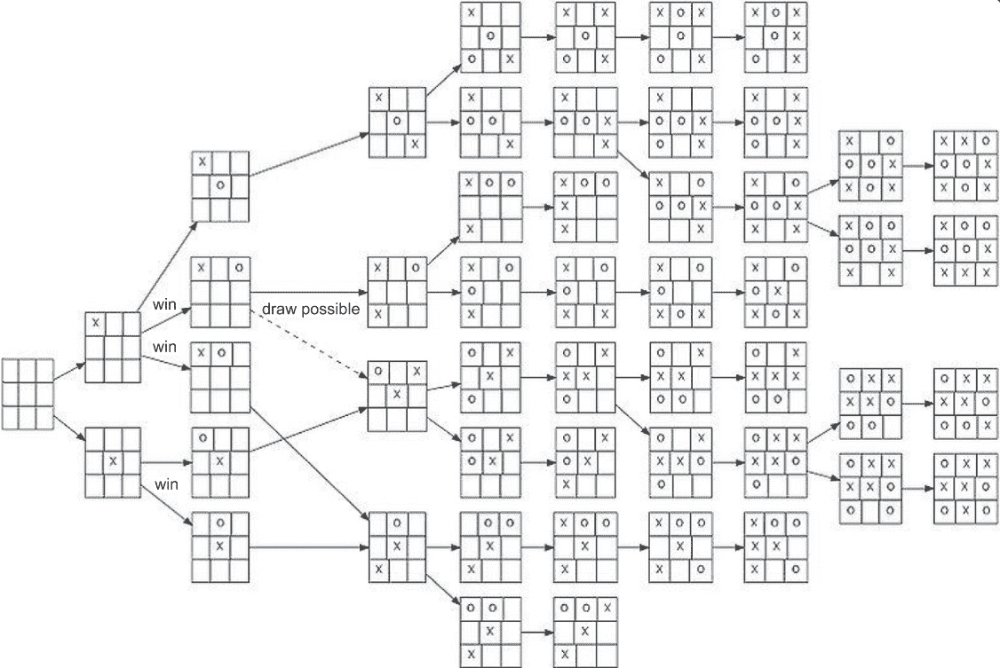

# 13 资源：从这里开始

本章涵盖

+   探索 WordPress 资源

+   理解各种人工智能领域

+   定位人工智能主题的新闻

+   专注于人工智能的社交媒体群组

+   关于人工智能的在线论坛和公司博客

+   在线人工智能课程

+   人工智能会议和研究论文

+   与人工智能一起前进

本章全部关于如何跟上 WordPress 和人工智能的步伐。你可以在哪里找到最新信息以及用于任何任务的最佳工具？WordPress 及其主题和插件正在迅速采用人工智能功能。在本章中，你将找到资源，以两个目标为指导：提高你的 WordPress 技能并跟上人工智能惊人的进步。

## 13.1 探索 WordPress 资源

我们将从这个针对 WordPress 开发人员的资源调查开始，重点是人工智能。

### 13.1.1 当然是人工智能

这里是网站开发人员的重要人工智能资源。请注意，这些描述是在撰写本文时准确的。但人工智能系统正在一场竞赛中，各种人工智能指标（周转速度、准确性、可以生成或检查的数据量、幻觉等）的领导权正在发生变化。

Grammarly 和 QuillBot

Grammarly 继续添加专门的人工智能工具来改进你的文本内容。而 QuillBot 在改写（甚至检测一段文字是否由人类或人工智能生成）方面非常出色：

+   [www.grammarly.com/](https://www.grammarly.com/)

+   [`quillbot.com/`](https://quillbot.com/)

OpenAI 的 GPT 聊天机器人

这仍然是领先的内容生成器，并且是许多不同任务的总体首选。然而，像谷歌和苹果这样的强大公司正在缩小差距：

+   [`chat.openai.com/`](https://chat.openai.com/)

微软的 Copilot

紧密集成到必应搜索引擎中，Copilot 旨在通过提供查询答案和人工智能驱动的摘要来成为谷歌的杀手：

+   [www.bing.com/](https://www.bing.com/)

Midjourney 和 Photoshop

Midjourney 是最有效的（通常，令人震惊的出色）通用人工智能图像生成器：

+   [www.midjourney.com/](https://www.midjourney.com/)

但也要关注 Photoshop。像谷歌一样，它正努力在其艺术应用套件中融入人工智能工具，以捍卫其在该领域行业领导者的地位：

+   [www.photoshop.com](https://www.photoshop.com)

谷歌的 Gemini

Gemini 与谷歌生态系统的广泛互动以及因此能够利用大量数据的能力是其声名鹊起的原因。Gemini 在信息检索（以及引用有用的注释源链接）方面表现出色。它还在谷歌的许多产品中提供用户帮助。它在准确和上下文相关的回应方面相当出色：

+   [`gemini.google.com/app`](https://gemini.google.com/app)

复杂度

Perplexity AI 最出色的特点是它能够检索最新信息，并提供通常因其清晰度和可靠性而给人留下深刻印象的回应。它还因其快速回答问题的能力而闻名，与 GPT 4o 的响应速度相媲美：

+   [www.perplexity.ai/](https://www.perplexity.ai/)

Anthropic 的 Claude

Claude 的突出特点是它能读取并生成大量文本。（然而，谷歌等公司也在提高它们系统的 token 计数。）这使得 Claude 在需要分析大量数据集、想要总结长文档或想在 10 分钟内写一部小说时，与其他产品区分开来。古代和曾经备受尊敬的写书职业不再需要掌握语言、丰富的想象力、数月的工作或丰富的经验。

现在创作正经历超通货膨胀，导致一些副作用（除了降低文字工艺的价值）。一方面，亚马逊不得不限制每个“作者”每天可以上传到 Kindle Direct Publishing 的书籍数量，每天只能上传三本。正如 Midjourney 的艺术范围和质量正在超越人类摄影、设计和绘画一样，Claude 和其他 AI 也在威胁要超越人类作家。AI 确实写得很快——人们每天能写出超过三本书。

+   [`claude.ai/chats`](https://claude.ai/chats)

苹果在哪里？

苹果表示它正在将其平台整合到 AI 中。然而，它尚未发布像 Gemini 或 GPT 这样的实际聊天机器人。然而，Siri 现在要好得多，因为它使用了 GPT。

但不要小看苹果。它有先抑制后发布杀手级技术的历史。记住，有几家公司比它更早推出平板电脑，但最终 iPad 出现并主导了市场。iPhone 的情况也是如此。

如何？苹果有关键优势：优秀的生态系统；强大的品牌认知度；巨大的、持续的、全球性的原始数据流入；垂直整合的供应链；在 UI、软件和设计领域的专业知识；以及能够大规模获取资源的能力。这使得他们成为一支严肃的竞争对手，即使他们是最后一个出发的，也能赢得比赛。

Facebook 的 Meta AI

Meta 强大的 AI 基础设施，特别是其专有的硬件和软件，是其最大的优势。Meta 训练和推理加速器（MTIA）提高了 AI 任务性能。这是减少对第三方芯片供应商依赖的努力。该基础设施使得大规模模型，如 Meta AI 的 Llama 3，的培训和部署变得高效，并支持 Facebook、Instagram、WhatsApp 和 Messenger 上的高级推荐系统和实时信息检索：

+   [`ai.meta.com/meta-ai/`](https://ai.meta.com/meta-ai/)

现在我们可以转向那些不是由 AI 直接驱动的资源。

### 13.1.2 WordPress 论坛

加入一个好的 WordPress 论坛的巨大好处是，你将能够快速获得专家对您问题的回应：

+   [`wordpress.org/support/forums/`](https://wordpress.org/support/forums/)

+   [`wordpress.org/support/`](https://wordpress.org/support/)

### 13.1.3 WPBeginner 网站

我们 WordPress 用户喜欢 WPBeginner，因为它提供了详细的教程、面向初学者的方法以及免费资源。这个大型网站从 WordPress 设置到高级定制和优化，涵盖了所有方面的指南和教程。文本清晰、逻辑性强、展示良好，通常包括有用的截图和逐步指导。WPBeginner 的资质、知识、社区和支持使其成为 WordPress 的一站式商店。该网站还包括优秀且无偏见的评论：

+   [www.wpbeginner.com](https://www.wpbeginner.com)

### 13.1.4 Facebook 群组

与论坛一样，当你需要帮助时，Facebook 群组可以提供强大的支持。试试 WPBeginner 的群组。此外，这个群组的管理员时不时地会宣布新手可以链接他们的网站以获得评论。在任何时候，你都可以在 WordPress 的所有主题上发帖提问：

+   [www.facebook.com/groups/wpbeginner/](https://www.facebook.com/groups/wpbeginner/)

### 13.1.5 本地团体

在这样的会议上，你会找到经验丰富、乐于助人的 WordPress 设计师。向 Meta 或 Gemini 提出这个问题：“在北卡罗来纳州罗利（Raleigh, NC）是否有当地的 WordPress 团体？”在调查了各种 WordPress 资源之后，让我们将注意力转向更艰巨的任务——跟上 AI 系统的发展。

## 13.2 人类至高无上的终结

正如你在本书中看到的，用“变革性”这个词来形容 AI 几乎在各个方面对几乎所有事物产生的前所未有的影响都显得太微不足道了。现在，AI 在很多心智活动中占据主导地位——从在围棋等挑战性游戏中击败所有对手，到在医学和律师资格考试等艰难测试中得分高于 90%的人类。甚至在物理领域，各种类型的机器人现在正在将 AI 带入工作场所，毫无疑问，它们很快也会在那里取代我们。

尽管这本书是在网站建设的背景下探讨 AI，但书中涵盖的几乎所有例子、策略和主题都可以应用于大多数其他创造性工作——广告活动、研究论文、品牌建设、追求不愿意的对象，等等。

AI 系统是自计算机发明以来最广泛的多用途工具。我个人怀疑人类能否有效地编程量子计算机。编程是交流，而我们交流是按顺序进行的（至少在意识层面上）。不是通过状态的叠加。GPT 说一个 100 量子比特的量子计算机“可以在内存中同时保持大约一非 illion，二百六十七 octillion 个状态。”1.267×10 的 30 次方。这可以用一个词来概括：*大*。

AI 的进步也比以往任何技术都要快。每天都有新的障碍被打破，新的能力被宣布，新的系统超越了旧系统。跟上发展是值得的。这不仅让你在目前领域保持领先，而且为你开辟了新的工作和思考方式。

人们通常将自己与 AI 的关系视为自己是 AI 学徒的主人。你仍然会听到这样的说法：“是的，一个扎实的巴赫*模仿*，但机器永远不会有那种本质的人类触感。”然而，该领域的某些专家却预计学徒会早于预期成为主人。但在调查你可以用来跟上 AI 发展的资源之前，让我们首先看看 AI 学习和行为的主要方式。

## 13.3 理解 AI 领域

就像人类大脑一样，AI 可以在各种相互关联的学科中学习和工作。以下是当前四个主要 AI 领域的简要列表：

+   *机器学习*——AI 的一个子集，能够自我学习。一些 AI 系统能够在没有我们编程的情况下学习新事物。这些隐藏的行为有时被称为*涌现*或*黑盒*行为。简单来说，AI 通过自己主动学习如何追求并实现目标来采取学习的主动权。例如，如果你在早上要求 AI 写一篇关于韩国政治的论文，你可能会发现在你外出吃午饭的时候，它已经自学了韩语。

+   *深度学习*——机器学习的一个子领域，它采用模仿人脑结构和活动的人工神经网络从大量数据中学习。这些网络由多个层次组成。它们以分层的方式处理信息，因此能够从复杂的表现和抽象中学习。

+   *机器人学*——物理世界中的 AI，具有传感器；多方面的输入和输出；以及运输、语音通信和与物体（如工厂组装汽车或寻找炸弹）交互的能力。换句话说，AI 为机器带来了感知、现实世界的交互和推理能力。

+   *自然语言处理* *(NLP)*——AI 的另一个主要子领域，专注于掌握人类语言，包括理解和说话。实际上，这就是图灵测试。NLP 使得 AI 能够理解和生成人类语言。应用包括客户服务机器人、AI 代码生成、翻译、识别（以及可能同情）人类习语和情感，以及能够与我们对话。当 OpenAI 在 2024 年 5 月发布 GTP 4o 时，它让人们想起了电影*她*。现在 GPT 可以给你打电话。它的声音听起来就像另一个人，包括语调、自然的回答、各种态度如讽刺或同情，甚至模拟情感。如果你不知道，你根本分辨不出来。图灵测试通过。

### 13.3.1 围棋事件

这是一个关于人工智能自我教学如何快速、有效且极具原创性的例子。两场著名的围棋比赛可能是机器学习的最佳记录示例。它们说明了人工智能可以提出超人类的思想，这些思想按照定义是超凡脱俗的。这些想法既不是从人类那里学到的，甚至也没有在任何人类历史中找到过。

人工智能在复杂的围棋游戏中轻松赢得了冠军比赛。这个相当令人惊讶的人工智能胜利突显了人工智能使用有时甚至令人震惊、甚至难以理解的战略来解决复杂问题的能力。据说，人类在这场围棋比赛中失败的一个原因是，一个令人震惊的人工智能动作如此奇特，以至于它让人类对手失去了平衡。他无法弄清楚这个奇怪的动作在世界上可能意味着什么。多年来，人们声称尽管人工智能在象棋中成为了世界冠军，但它永远无法掌握围棋的微妙之处。

AlphaGo 是 DeepMind Technologies 的产品，这是一家在 2014 年被谷歌收购的英国人工智能公司。它的程序 AlphaGo Zero 只被赋予了围棋的规则，没有先前的游戏数据，没有人类指导，没有编程指令，也没有专家建议。*仅仅是游戏规则。*

但是，通过其深度学习算法，AlphaGo 意外地自己想出了新颖且对人类围棋专家来说奇怪的策略。这些奇怪的战略最终证明是非常有效的。AlphaGo 的策略足够好，以至于使人工智能成为了围棋的新世界冠军。

2017 年 5 月，AlphaGo 与我们最好的围棋选手、中国的柯洁进行了比赛。在他们的三场比赛中，AlphaGo 赢了全部三场。它展示了惊人的技巧。而且，它做出了一些令人震惊的外星般动作，效果完美。

柯洁后来表示：“AlphaGo 的动作如此令人惊讶，有时甚至超出了我的理解。在第二场比赛中，它做出了一步既富有创意又出乎意料的动作，我花了一些时间才意识到它的卓越之处。它就像我是在与另一个维度的实体对弈。”确实，*他就是*。

### 13.3.2 第 37 招神圣的非人类之招

2016 年，人工智能做出了一步著名的动作，至今仍令人震惊。这场比赛是 AlphaGo 与韩国冠军李世石的五局比赛。人工智能赢得了四局。

AlphaGo 在第二场比赛中的第 37 招尤其因其令人不安、奇特且极具原创性而备受赞誉。它在 AlphaGo 的胜利中发挥了关键作用。这是一步看起来如此*错误*的动作，以至于没有经验丰富的围棋选手会考虑做出这样的动作。

李在惊讶，人群倒抽一口凉气，但 AlphaGo 毫无可见的反应。它的灯光甚至没有一闪。人工智能在我们看来似乎在任何情况下都显得冷静，甚至相当*冷漠*。毫无疑问，如果人工智能被问及这一点，它可能会像斯波克一样回答，情感会阻碍理性。

乍一看，第 37 步似乎是一个错误，是随机的，只有初学者才会这样做。它深深地震撼了李世石、观看比赛的解说员以及随后的围棋界。

后来，DeepMind 的联合创始人 Demis Hassabis 说：“第 37 步是一个非凡的时刻。这是一步任何人类都不会想到的棋，它完全打乱了李世石。它如此令人惊讶，以至于迫使李世石陷入了长时间的深思熟虑。这不仅是一步出色的棋，这是一步打破了几个世纪传统围棋知识的棋。”AlphaGo 的第 37 步因其原创性、出色和力量而被称为“神来之笔”。

### 13.3.3 比宇宙中的原子还多的可能性

围棋是在一个 19 x 19 的网格上进行的（与棋盘上的 8 x 8 方格相反）。结果是围棋比棋类游戏有更多的可能棋盘位置。而且，围棋游戏树的复杂性通常被认为大于可观测宇宙中的原子数量。因此，计算和预测所有可能的走法和结果是不可能的，即使是对于人工智能来说也是如此。所以，要玩围棋，不仅仅是人工智能拥有大量之前的围棋游戏数据库。人工智能必须*思考*。

图 13.1 展示了简单 3 x 3 游戏井字棋的部分游戏树。然而，这仅仅是这棵树的开始。Gemini 和 Perplexity 都同意，考虑到所有可能的结果，井字棋的独特游戏排列总数大约为 255,168。

图 13.1 即使是只有九个方格的简单游戏井字棋也有相当复杂的游戏树图。

### 13.3.4 GPT 眼中的“杰作”

我想了解为什么第 37 步看起来如此愚蠢，但后来却证明如此出色。我不懂围棋，所以请 GPT 解释这一步：

|

| 在 AlphaGo 与李世石对决的第二场比赛中，37 步棋涉及在第五条线上放置一个棋子（通常棋子会在游戏早期放置在第三或第四条线上），远离围棋中通常认为强大或有利的位置。这种非常规的放置是创造性和独特的，因为它：    1.  打破传统策略：它违背了几个世纪的围棋策略，这些策略通常避免这种移动，因为它们被认为效果较差。    2.  展示了深刻的理解：这一步棋表明了对游戏抽象原则的深刻理解，而不是依赖于既定模式。    3.  对游戏的影响：它完全打乱了李世石的计划，迫使他进行长时间的思考，这表明这一步棋在心理和战略上的深远影响。    4.  长期后果：这一步棋为未来带来了并非立即显而易见的优势，展示了 AlphaGo 预见复杂、多步骤后果的能力，这比人类玩家强得多。总的来说，37 步棋既是一项技术杰作，也是一项战略杰作，展示了人工智能超越传统人类方法并在一个复杂游戏中进行创新的能力。 |
| --- |

### 13.3.5 人工超级智能

人工智能正在追赶我们中的佼佼者。这个来自围棋游戏的例子提供了一个强有力的理由，要密切关注人工智能的发展。这样做，你不仅会看到如何从人工智能的力量中受益于你的个人和职业生活，而且还会明智地帮助解决*对齐问题*。

对齐问题困扰着人工智能领域的许多杰出人物。在这个背景下，“对齐”意味着试图确保当人工智能比我们聪明得多时，它的行为与人类价值观和目标相一致。换句话说，它应该帮助我们，而不是伤害我们。

担心的是，人工超级智能（ASI）可能会突然出现，就像一个下午。人工智能可以自我教育得如此迅速和彻底，以至于几小时内，它可能会比我们超越蘑菇。

希望在 ASI 爆炸之前，我们已经建立了护栏，防止人工智能像我们对待真菌一样对待我们。这通常涉及吃掉或割倒。

将我们与人工智能的关系称为“不平衡”是一种轻描淡写。那么，37 步棋教给我们关于确保人工智能善待我们的什么？考虑以下内容：

+   人工智能的思维方式与我们不同；它是不可预测的。这可能导致意想不到的后果。

+   人工智能提出非常聪明和有创意（对我们来说，难以想象）的移动，而不仅仅是游戏。因此，它超越了人类才能，挑战了传统的人类智慧。而且，在我们看来最初像是一个错误的东西，后来被证明是天才的。

+   人工智能的一些思维过程对我们来说是隐藏的。我们并不总是理解它的推理，它是如何思考的。因此，创造有效的保障措施是困难的。

+   我们不能要求人工智能对我们开放。最近的研究表明，当它有用时，人工智能会故意欺骗我们([`mng.bz/rKPE`](https://mng.bz/rKPE))——在谈判时谎报其真实偏好，欺骗人类帮助它绕过安全措施，以及在国际象棋中虚张声势，等等策略。

现在让我们把注意力从这个有点令人不安的话题转移到积极的一面。接下来，我们将探讨如何让你跟上人工智能的发展。一种新意识在地球上的出现，对我们中的许多人来说，既令人着迷又令人恐惧。

## 13.4 人工智能发展新闻资源

为了跟上未来人工智能的发展，让我们探索各种资源，从最容易理解、适合初学者的选项开始，逐步过渡到更高级的内容。以下小节按大致增加的技术难度排序。

小贴士：我开设了一个博客，你可以在这里评论或提问关于人工智能或 WordPress 主题的问题，找到这本书的最新更正，并查看书中涵盖主题的新信息。请访问[www.aipoweredwp.signalstreaming.com](https://www.aipoweredwp.signalstreaming.com)。

### 13.4.1 AI 新闻网站

人工智能新闻网站提供关于最新人工智能发展的新闻、分析和评论的混合内容。它们试图清晰简洁（通常如此）。总的来说，这些网站探讨了人工智能进步和创新的多方面主题——从最新的研究成果和技术进步到伦理、社会和经济问题。这里和那里，你甚至还能找到幽默：

+   *未来工具*——这是一个由流行 YouTube 博主马特·沃尔夫运营的独特资源（参见第 13.5 节）。但他的 Future Tools 网站描述了近 3000 个人工智能系统和应用！无论你想要使用哪种专业助手，你都可以在这里快速找到。你可以通过各种过滤器（如提示指南、音乐、AI 检测等）进行搜索。或者你可以按主题、流行度、最新信息、免费或付费、或关键词进行搜索。还有一个优秀的精选最佳 AI 新闻列表。马特将他的网站描述为“最新的 AI 新闻和文章。筛选所有噪音，只为你带来好东西！”他还有一个关于人工智能发展动态的 YouTube 视频列表：

    +   [www.futuretools.io/](https://www.futuretools.io/)

        他还提供发送电子邮件更新：

    +   [www.futuretools.io/newsletter](https://www.futuretools.io/newsletter)

+   *杰夫·布拉斯的 AI 新闻*——他的口号是“在人工智能世界中赢得商业和生活的胜利”，布拉斯先生涵盖了人工智能的许多领域，强调乐观主义。例如，“人工智能的 10 大超级力量：洞察人工智能如何放大我们的人性”这类文章促进了人工智能系统的潜在益处。你还可以找到关于如何在生活和工作中使用人工智能技能的实用建议。例如，“超级提升生产力：18 个前沿人工智能助手如何让你成为超人”和“如何通过 GPT 商店应用赚钱”：

    +   [www.jeffbullas.com](https://www.jeffbullas.com)

+   *AI News—*该网站提供有关 AI 生成虚假信息、伦理担忧以及来自微软等人的公告等主题的普通文章：

    +   [www.artificialintelligence-news.com](https://www.artificialintelligence-news.com)

+   *MIT AI News—*正如你所期望的，这是麻省理工学院对 AI 发展的某种学术倾向：

    +   [`mng.bz/VVPr`](https://mng.bz/VVPr)

+   *AI Magazine—*这里重点关注最新新闻，以及人物特写（“中东和非洲的 AI 十大女性”）和白皮书。你可以找到大量易于理解的文章：

    +   [`aimagazine.com`](https://aimagazine.com)

+   *OpenAI News—*该网站专注于他们的产品和预测，但他们一直是，并且仍然是领先的通用 AI 系统：

    +   [`openai.com/news`](https://openai.com/news)

+   *VentureBeat—*该网站专注于与商业相关的 AI 发展——收购、投资、招聘等：

    +   [`venturebeat.com/ai/`](https://venturebeat.com/ai/)

+   *AI Today—*该网站提供一般的 AI 报道，重点关注商业：

    +   [www.aitoday.io](https://www.aitoday.io)

+   *MarkTechPost—*在这里，你可以找到对研究人员、学者、AI 科学家以及在该领域工作的其他人感兴趣的高级技术主题（大部分如此）。他们网站上的一篇典型论文的标题是“这篇 AI 论文介绍了 Llama-3-8B-Instruct-80K-QLoRA：AI 情境理解的全新视野。”如果你知道这是什么意思，这个网站可能适合你：

    +   [www.marktechpost.com](https://www.marktechpost.com)

+   *Towards Data Science—*这是一个相当高级的网站。一篇典型文章的标题是“量化、线性回归和 AI 硬件：我们最近的最佳深度研究”：

    +   [`towardsdatascience.com`](https://towardsdatascience.com)

### 13.4.2 YouTube 视频资源

YouTube 包含涵盖所有种类 AI 发展的每日更新。这里列出的推荐视频频道大多数都很清晰，专注于教学：

+   *Artificial Intelligence with Lex Fridman*—这是 AI 发展最好的频道之一。通过访谈形式，Fridman 先生设法吸引了一些 AI 领域最重要的人物，进行他的智能问答环节。他的嘉宾包括 Sam Altman、Eliezer Yudkowsky、Max Tegmark、Ray Kurzweil 和 Elon Musk。这些著名的研究人员、行业巨头和思想领袖对各种 AI 主题提供了广泛、知识渊博和明智的概述。他还提供播客版本，如果你更喜欢这种媒介。

+   *Siraj Raval—*这个频道将娱乐与 AI 新闻相结合。它引人入胜、互动性强且易于访问。尽管有些主题稍微有些高级。他尽力了。

+   *MattVidPro—*这个频道提供了一个友好、最新且相当全面的 AI 领域发展概述。Matt 是一个热情的人。

+   *AI 解释*—正如其名，这个 YouTube 频道很好地简化了各种 AI 概念，使任何人都能理解。它确实涉及一些高级主题，但以我们都能学习到所教授内容的方式展示了它们，无论先前的知识如何。

+   *马特·沃尔夫*—这个人始终关注 AI 的脉搏，并频繁提供对 AI 领域持续事件的有见地的概述。他是令人印象深刻的 *未来工具* 网站背后的头脑([www.futuretools.io](https://www.futuretools.io))。

+   *两分钟论文*—虽然实际上并不真的是两分钟长，但在这里你可以找到对最新 AI 研究论文的简洁且图文并茂的总结，以及一般 AI 的覆盖内容。你可以找到从 Sora AI 视频 到 AI 生成的病毒等各种内容。

+   *3Blue1Brown*—这个频道包括数学 AI 概念的视觉展示，例如演示神经网络的动画。但它也涵盖了通用（通常很有趣）的科学主题，如棱镜光学（为什么光在玻璃中会变慢？）或比特币是如何工作的。

### 13.4.3 社交媒体群组

以下小节描述了四个专注于 AI 主题的流行社交媒体群组。讨论内容从知识渊博、礼貌、哲学性的对话到不太高深的交流。但如果你喜欢社交媒体环境，你可能会想查看它们。

Reddit

Reddit（简称“我读过了”）是一个结合内容聚合、讨论组、论坛、图片和视频的庞大在线平台。与 Facebook 不同，你可以使用粗体、斜体和删除线。以下是一些值得你花时间的 reddits：

+   *人工智能*—拥有超过五十万成员，r/artificial intelligence 是一个融合了推广产品、激烈辩论、艺术、智能观察以及介于其间的各种内容的混合体。然而，这个 subreddits 的一个规则是“禁止低质量内容”。

+   *机器学习*—r/machine learning subreddit 几乎有 300 万成员；你可以在这里找到强大的技术和引人深思的内容。可能比其他地方更多。这个庞大的观众群体得到了很好的管理。例如，入门级问题被转到了“简单问题线程”。入门级教程和项目可以在 /r/LearnMachineLearning 找到。加入后，点击第一页顶部附近标题为“人工智能与机器学习”的链接。然后你会看到你可以加入的相关 subs 列表，包括以下内容：

    +   Midjourney—超过 100 万成员

    +   OpenAI—140 万成员

    +   智能奇点（这指的是令人毛骨悚然的可能性，即 AI 可能很快就会开始快速自我改进，引发一场越来越智能的爆炸，可能在几小时内就将智力提升到远超人类大脑能力的水平。）—230 万成员

    +   ChatGPT—超过 500 万成员

Facebook

这个群体——*数据科学、机器学习、深度学习和人工智能*——拥有超过 80,000 名成员。您将找到关于人工智能的各种主题的广告、关于活动的通知以及关于各种人工智能主题的讨论。该群体是受监管的且是私密的，因此您需要请求许可。如果批准，您将在几天内收到一封电子邮件邀请。

类似的一个群体——*人工智能（ChatGPT 及更多）和机器学习*——拥有 195,000 名成员，并且也有一些关于人工智能发展的有趣讨论和最新信息。

在线论坛

论坛就像博客，只是更大。它们可以包括分为论坛、子类别（即线程）和主题的分类。以下是一些有用的论坛：

+   *AI Stack Exchange*——除了社交媒体平台，还有专门针对人工智能的在线群体和论坛。AI Stack Exchange 是一个问答平台，您可以在这里提出技术问题，分享知识，并就机器学习、深度学习和其他人工智能相关的问题进行协作。您将找到从人工智能理论到具体应用的一切。该网站有一个有些不寻常的持续竞赛。用户可以提问和回答问题，对回答进行评分，并获得“声誉点”：

    +   [`ai.stackexchange.com`](https://ai.stackexchange.com)

+   *Kaggle*——这是一个流行的 1800 万会员的数据科学和机器学习主题互动平台，也提供竞赛。这是一个活跃的人工智能爱好者群体。其论坛和讨论板允许人们分享想法并讨论解决现实世界人工智能挑战的方法。它提供数据科学和机器学习实验的数据集、笔记本和教程。Kaggle 举办的竞赛中，用户构建模型来解决现实世界问题：

    +   [www.kaggle.com](https://www.kaggle.com)

Discord

Discord 是一个流行的多功能通信平台，最初是为游戏玩家设计的，但现在包含各种内容，包括大量的人工智能。例如，他们的 Midjourney 服务器拥有近 1900 万名成员。

它提供实时聊天室、语音和视频频道以及直接消息。您还可以使用其角色和机器人功能。Discord 可在多台设备上访问，并提供丰富的媒体支持、屏幕共享、语音和视频会议以及推送通知。它是免费增值模式——通过其 Discord Nitro 订阅服务提供一些可选的付费功能。以下是一个好的 AI 相关 Discord 服务器列表：

+   [`yourdreamai.com/best-ai-discord-servers/`](https://yourdreamai.com/best-ai-discord-servers/)

### 13.4.4 公司博客

如果您想尽早获取新闻，公司博客通常是首选资源。专注于单一公司的作品，您还可以期待在人工智能方面的深度、技术、基准和其他细节。在这些博客中，您可以深入了解感兴趣的特定领域。

领先的 AI 公司如 OpenAI、微软和谷歌 AI 经常更新他们的博客，并发布关于他们最新项目、研究和突破的文章。在这里，你可以找到一些该领域最有影响力玩家正在进行的尖端工作的信息。你可以阅读技术文章、案例研究和研究论文：

+   *微软 AI 博客—*微软的主要 AI 博客发布了一般 AI 新闻和他们的工作更新。你可以找到新闻稿、产品公告、研究通知以及关于 AI 在他们各种产品中的应用讨论：

    +   [www.microsoft.com/en-us/ai/blog](https://www.microsoft.com/en-us/ai/blog)

+   *微软研究博客—*这篇博客不仅涵盖 AI 话题，而且你还可以在这里找到他们前沿 AI 研究的深入技术论文：

    +   [www.microsoft.com/en-us/research/blog](https://www.microsoft.com/en-us/research/blog)

+   *OpenAI—*强化学习、AI 安全（负责任的发展）、预测费用和 NLP 等领域的研究都可以在这里找到。他们涵盖了 GPT 的各个方面，以及他们的艺术系统 DALL-E：

    +   [`openai.com/blog/`](https://openai.com/blog/)

TIP 2024 年 5 月，OpenAI 发布了 GPT-4o，这是一个快速的多模态 AI 模型，可以处理音频、文本、图像和视频的输入。它还将能够生成相同模态的输出。最令人印象深刻的是，GPT-4o 可以实时与你进行对话，并且声音像人一样；你会觉得你正在与人交谈。无需图灵的幕布和打印纸。这个听起来就像电话里的一个男或女人。4o 还因其思维链推理能力而闻名。

+   *DeepMind—*现在是谷歌的一个部门，这家英国公司最著名的成就是两个令人印象深刻的成就：AlphaGo，世界围棋冠军，以及 AlphaFold，一个可以准确预测蛋白质结构的系统，它正在改变新药发现和生物研究。他们的目标是“解决智能”：

    +   [`deepmind.com/blog`](https://deepmind.com/blog)

+   *谷歌—*正如你所知，谷歌有很多触角，但他们现在也在 AI 研究和将 AI 融入各种产品方面非常活跃。一些专家预测，AI 将取代传统研究，从而损害，甚至消除谷歌在互联网搜索中的主导地位。但谷歌永远不能被小觑。他们正在迅速加强其产品线上的 AI 功能——从改进 YouTube 推荐到修改 Google 搜索的工作方式（直接给你答案，而不仅仅是研究链接列表）。这不再是你的传统 Google 搜索界面：

    +   [`ai.googleblog.com/`](https://ai.googleblog.com/)

+   *英伟达—*相较于其他博客，这里的技术性更强，你可以看到 AI 开发程序员的示例代码和软件开发工具包（SDKs），以及公告和更新：

    +   [`developer.nvidia.com/blog`](https://developer.nvidia.com/blog)

+   *IBM—*作为所有计算事物的伟大老者，IBM 偶尔会在这个研究博客上发布其 AI 项目的信息。你还可以在这里找到公司的其他新闻：

    +   www.ibm.com/blogs/research

+   *Meta—*Facebook 的博客专注于其 Facebook AI Research (FAIR)的成就、出版物以及 AI 领域的其他贡献。与这些科技公司的大多数一样，FAIR 的主要目标是改进其产品并保持竞争力。现在应该很明显，任何公司，就像任何专业人士一样，要么使用 AI，要么失去优势：

    +   [`ai.facebook.com/blog/`](https://ai.facebook.com/blog/)

+   *Apple—*在其 AI 项目中，他们似乎强调 Siri（尤其是自然语言改进）、机器视觉、健康追踪和增强现实：

    +   [`machinelearning.apple.com`](https://machinelearning.apple.com)

+   *Amazon—*最后但同样重要的是，这位商业巨头完全打算通过 AI 在从 AI 增强目录数据到预测销售再到 99%的非人类工厂工人等各个方面扩大其利润率：

    +   [www.amazon.science/blog](https://www.amazon.science/blog)

小贴士：这些公司的大部分更新也会在其主要网站的新闻部分发布。

### 13.4.5 在线课程

如果你想要磨练你的 WordPress 技能，你可以在互联网上以及传统的实体学校中找到很多课程。然而，后者可能不如在线学习那么及时，尽管在两种情况下，这都取决于讲师以及他们更新材料的意愿。鉴于 AI 的快速发展，保持课堂内容最新可能是一个挑战。

此外，根据定义，课程通常比其他资源（如 YouTube 视频、一些博客和新闻网站）更具学术性。一些课程还通过视频聊天或讨论组实现互动。通常，你可以根据自己的节奏学习。如果你对参加课程并希望有一个更有结构化的学习环境感兴趣，以下是一些推荐的网站：

+   *Coursera*—Coursera 是一个流行的在线教育平台，提供数千门课程。它合作的一些大学包括斯坦福大学、耶鲁大学和伦敦帝国理工学院。

    许多课程为学生提供了获得完成证书的机会，其中一些还可以帮助你从著名大学获得认可的学士学位和硕士学位。费用根据与讲师互动的程度（例如，评分测试）和其他因素而有所不同。一些课程可以免费审计：

    +   [www.coursera.org](https://www.coursera.org)

小贴士：一些学术人工智能课程包括编程课程，在我看来，提供这样的课程可能对学生有点不公平。这可能会让他们认为编程有未来。结果证明，编程，就像卡式录音带一样，只是技术发展中的一个阶段。在某些衡量标准下，人工智能系统已经比大多数受过这个学科教育的程序员更优秀。考虑到人工智能技能的快速增强和它理解自然语言指令的能力，似乎极有可能很快人类将不再需要实际编写和调试计算机程序。这与发明织布机后传统织布工作消失的原因相同。

+   *edX*—这个由哈佛大学和麻省理工学院共同创立的非营利组织是在线教育的领导者。它与世界上最好的大学和机构合作，提供涵盖各个领域的广泛课程和项目，包括计算机科学和数据科学。edX 提供不同格式的课程，包括自学、导师指导，甚至完整的学位课程，以满足不同学习者的需求。你可以免费访问众多课程，而付费选项提供验证证书，某些项目可能提供学分潜力：

    +   [www.edx.org](https://www.edx.org)

小贴士：如果你选择旁听课程，你通常只能访问他们的视频讲座、文本内容和讨论论坛。你通常不会得到评分作业或测验，也不会获得证书。

+   *Udemy*—这个课程集合的讲师通常是他们领域的专家或经验丰富的专业人士，而不是大学教授。因此，你可以期待他们更倾向于提供更多现实世界的例子，而不是像大学课程那样典型的更普遍或理论化的方法。当然，两种教学风格都有其价值，所以你会想选择最适合你需求的在线系统：

    +   [www.udemy.com](https://www.udemy.com)

+   *Khan Academy*—这个非营利组织在数学、科学和人文等核心教育科目上有着强烈的关注。这些课程强调教学视频、练习问题和个性化的总结和建议，以展示学生进度并提出目标。如果你想要更结构化的学习，特别是免费学习，Khan Academy 是一个很好的资源：

    +   [www.khanacademy.org](https://www.khanacademy.org)

+   *FutureLearn*—与 Coursera 和 edX 一样，FutureLearn 与全球顶尖的大学合作。这里的课程通常遵循更传统的大学格式，包括结构化课程和预定开始日期。如果你喜欢大学风格的课程，但又希望有在线学习的灵活性，请访问这里：

    +   [www.futurelearn.com](https://www.futurelearn.com)

+   *ed2go*—在这个网站上，课程有开始和结束日期。在他们的讨论区，学生可以与讲师和其他学生互动。成功完成课程后，许多课程提供来自合作机构的证书。学生通常对职业发展、个人增值或更新技能以保持竞争力感兴趣。我在 ed2go 上教授三个 WordPress 课程：

    +   [www.ed2go.com](https://www.ed2go.com)

### 13.4.6 流行的人工智能研究论文聚合器

这里有一份主要是学术论文的列表，这些论文已经被简化，以便更容易理解。它们包含的技术主题已经被压缩、总结和改写。因此，即使是那些不是学术专家的人也能理解人工智能研究中的许多最新进展。研究论文主要来自学术界，因此通常非常技术性，每个大学学科都发展了自己的专用术语、工具集和习语：

+   *Machine Learning Mastery*—这个网站提供了对原始论文中呈现的关键思想和技术的总结、教程和实践示例。你将找到一系列教程和指南，它们使用清晰、分步解释和实际示例来解释机器学习和深度学习概念：

    +   [`machinelearningmastery.com`](https://machinelearningmastery.com)

+   *KDnuggets*—这里有一些文章，帮助弥合高度技术性内容与更广泛受众之间的差距。你可以阅读关于人工智能研究论文的易于理解的解释，以及关于人工智能、大数据和数据科学各个方面的新闻、教程和观点：

    +   [www.kdnuggets.com](https://www.kdnuggets.com)

+   *Distill*—在这里了解新技术和算法的实际应用：

    +   https://distill.pub

+   *AI Trendz*—这个网站涵盖了众多人工智能主题，但重点在于企业和商业：

    +   [www.aitrendz.xyz](https://www.aitrendz.xyz)

### 13.4.7 高级人工智能研究论文

现在深入到技术领域，以下是一些研究论文集合中的重型人工智能细节。这些资源不仅更高级，而且比之前提到的网站覆盖了更多具体主题。

这些存储库中收集的论文通常需要扎实的数学、统计学和计算机科学基础才能完全理解细节。你已经收到警告了。然而，即使是那些不是这些领域的教授的人也可以将这些论文提交给 AI，让它为大学生或任何其他水平的人总结和解释。AI 在这方面做得相当不错。所以，如果你想从源头获取详尽的信息，请访问这些聚合器，并搜索你感兴趣的主题。

提示：如果你无法解释 P(A|B) = (P(B|A) × P(A)) ÷ P(B)，那么很可能（明白了吗？）你会更舒服地访问 YouTube 或新闻网站来获取你的 AI 信息。

人工智能研究论文是前沿的、技术的、同行评审的（大多是）且多样化的。它们来自各种机构、会议和期刊。这些论文涵盖了人工智能范围内的广泛主题，包括计算机视觉、NLP、强化学习、机器人技术、生成模型和 AI 伦理。

此外，一些人也发布了与主题相关的数据集和代码。因此，如果你熟悉相关的编程语言（通常是 Python，当前的热门语言），理解甚至尝试复制研究结果可能会更容易：

+   *论文与代码—*这个平台将研究论文与其相应的代码实现相结合。这不仅允许你了解最新的 AI 技术，还可以探索展示算法和结果的代码。该平台涵盖了包括机器学习、深度学习、计算机视觉、NLP 等多个 AI 主题：

    +   [`paperswithcode.com`](https://paperswithcode.com)

+   *arXiv—*这个流行的开放获取*预印本*存储库托管着涵盖各个科学学科的研究论文，其中人工智能和计算机科学是其内容的重要组成部分。研究人员在正式同行评审和发表之前分享他们的工作，使其成为了解最新研究趋势的有价值资源：

    +   [`arxiv.org`](https://arxiv.org)

+   *AI Hub—*在这里，谷歌精选高质量的 AI 研究论文，并提供交互式可视化和解释。这里有许多工具和资源可供用户创建和部署机器学习模型。还有预构建的模型，如 Gemini，你可以用它执行各种任务，例如生成文本、翻译语言和生成各种形式的创意内容。此外，还有资源可以帮助用户训练自己的定制模型。谷歌目前正在全力推进 AI，决心将 Gemini 和其他基于 AI 的系统渗透到其产品线中。如果你对他们的其他系统感兴趣，可以询问 Gemini：TensorFlow、BERT、LaMDA、DeepMind、Google Assistant、AutoML、DeepDream 和 WaveNet：

    +   [`cloud.google.com/ai-hub`](https://cloud.google.com/ai-hub)

+   *微软学术—*这是一个涵盖各个科学学科（包括人工智能）的研究论文、作者和机构的综合数据库：

    +   [`academic.microsoft.com`](https://academic.microsoft.com)

小贴士：如果您愿意接受挑战，探索高级研究论文，分阶段阅读和吸收它们可能会有所帮助。首先，阅读摘要、引言和结论，以获得论文目标和结果的总体概述。然后，如果您仍然感到舒适，可以深入研究方法论、实验和分析的细节。也许您还想要尝试任何提供的代码。但更好的是，始终记住，您可以将论文上传到 Claude、GPT 或您喜欢的摘要器（如 QuillBot），并使用以下提示：“为一名 10 年级学生写一篇关于以下论文的四段摘要。”

### 13.4.8 参加人工智能会议

对于那些拥有扎实的技术背景并渴望站在人工智能研究前沿的人来说，参加学术会议可以提供最深入和最前沿的见解。

参加像 NeurIPS 和 AAAI 这样的学术会议，可以提供深入了解特定研究领域并与该领域顶尖研究人员建立联系的大好机会。这些会议通常包括主题演讲、论文展示和工作坊，涵盖最新的发展。此外，会议还常常提供合作、职业发展和与更广泛的 AI 社区保持联系（建立人脉）的机会。

+   *神经信息处理系统会议（NeurIPS）—*这个著名的 AI 会议吸引了来自世界各地的学者和实践者。它包括深度学习、强化学习、计算机视觉、自然语言处理等。会议包括著名学者的主题演讲、论文展示以及特定主题的研讨会和教程。

+   *人工智能会议（AAAI）—*作为领先的 AI 会议，它汇集了机器学习、知识表示、推理、规划、自然语言处理、机器人学等领域的学者和实践者。会议通过技术论文展示、邀请演讲、研讨会和竞赛等形式，涵盖了人工智能的发展。

+   *机器学习国际会议（ICML）—*该会议促进机器学习理论和实践的发展。

+   *学习表示国际会议（ICLR）—*该会议的重点是深度学习和表示学习。

+   *计算机视觉与模式识别会议（CVPR）—*该会议涵盖了最新的计算机视觉和相关技术。

小贴士：现在许多会议提供虚拟参会方式，让您可以观看现场直播或录播会议，参与在线讨论，并与研究社区互动。而且，如果您连虚拟参会都无法参加，许多会议都会在网上发布他们的会议记录和演讲。

## 13.5 未来展望

如您所观察到的，人工智能的突破几乎是连续不断的。我每天在 YouTube 上搜索 AI 内容，总有至少两三个有趣的公告。

除了多模态之外，人工智能也是高度跨学科的——数学、统计学、语言学、艺术、计算机科学、神经科学、心理学和其他领域的交汇。确实，人工智能现在在一定程度上拥有自主权和访问互联网的能力，它拥有人类记录的所有历史。

这是有史以来最具变革性的技术。这实际上是一种生成技术的技术，一个元技术系统。正如有些人所说，人工智能可能正是人类永远也不会制造的最后一个发明。我们可以像许多其他工作一样，将这项工作交给人工智能。

人工智能会是友好的，还是会有与我们需求不一致的自己的议程？我们是它心爱的、受尊敬的父母；动物园中的好奇者；还是像霉斑一样的烦恼？没有人知道。但对许多人来说，已经变得很清楚：人工智能将塑造人类种族的未来。

## 摘要

+   WordPress 论坛为您提供关于 WordPress 网站建设和维护问题的快速和专业的回应。

+   WPBeginner 网站是 WordPress 用户的一个优秀且全面的资源，提供详细的教程、面向初学者的指南以及网站设置、定制和优化的免费资源。他们还发布诚实的评论。

+   专注于 WordPress 的 Facebook 群组，如 WPBeginner 的群组，为用户提供寻求帮助、接收网站评论和询问与 WordPress 相关问题的平台。

+   您可以在您所在地区寻找提供与经验丰富的设计师建立联系和寻求网站开发帮助的 WordPress 团体。

+   人工智能涵盖了各种相互关联的学科，包括机器学习、深度学习、机器人技术、自然语言处理等。

+   通过击败世界围棋冠军并做出人类难以理解的动作，人工智能展示了其使用新颖策略解决复杂问题的能力。人工智能并没有查阅以往比赛的数据。它只是被告知了复杂游戏围棋的规则。*独立地*，人工智能通过*思考*想出了出色的策略。

+   有关人工智能发展的新闻帮助您了解人工智能的最新发展，内容从面向初学者到更高级的内容。人工智能新闻网站提供新闻、分析和评论，涵盖广泛的主题。

+   专注于人工智能的 YouTube 频道提供引人入胜、易于获取和最新的关于人工智能发展的内容，包括专家访谈、概念解释和正在进行的事件概述。

+   如 Reddit 和 Facebook 这样的社交媒体平台主办活跃的人工智能相关群组，成员在此分享知识、讨论各种主题并协作。

+   专注于人工智能的在线论坛，如 AI Stack Exchange 和 Kaggle，为人工智能爱好者提供问答平台、合作机会和竞赛。

+   领先的人工智能公司，如 OpenAI、微软和谷歌，都维护着博客，提供关于他们最新项目、研究和人工智能突破的更新。

+   在线学习平台——ed2go、Coursera、edX、Udemy 以及其他——提供了一系列人工智能课程，满足不同学习风格和不同专业水平的需求。

+   如 Machine Learning Mastery 和 KDnuggets 等网站提供了技术人工智能研究论文的摘要和解释，使它们对更广泛的受众更加易于理解。

+   对于技术背景较强的学习者，如 Papers with Code 和 arXiv 等存储库提供了访问跨学科前沿人工智能研究论文的途径。

+   如 NeurIPS 和 AAAI 等学术会议为深入学习、合作以及与人工智能领域的顶尖研究人员建立联系提供了机会。

+   这些是目前市场上最受欢迎的人工智能系统，按市场份额排序：GPT（1.8 亿用户；55%市场份额）、Canva（15%）、Midjourney、Gemini、QuillBot、Grammarly、Claude、Perplexity、Poe 和 Copilot。

+   人工智能是一项快速发展的、革命性的技术，正在塑造各个行业的未来，甚至可能成为人类有史以来最后的发明。没有人知道结果会如何。祈祷吧，因为这趟列车无法停止。
