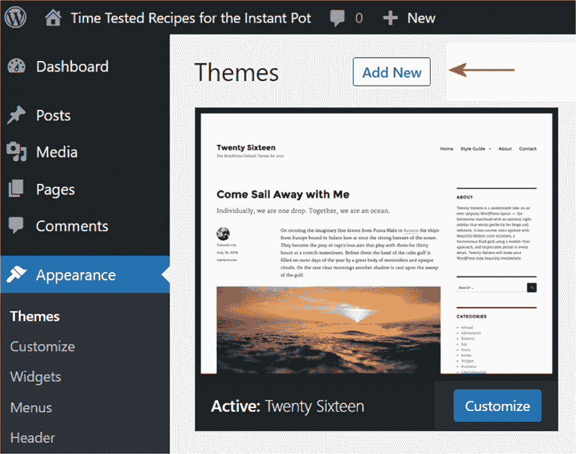
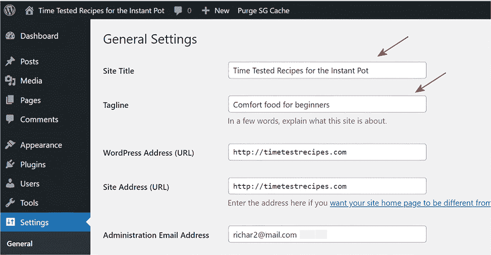

# 附录。设置事项

在本书的前几章中，我详细解释了为什么以及如何为您的网站选择一个优质的托管服务。然后，在为该服务设置账户之后，您可以在该账户上安装一个新的、空白的 WordPress 网站。我们将在这个网站上整本书作为练习网站使用。当然，您也可以在现有的网站上工作，但现在在练习网站上工作可能更容易一些，然后稍后把您学到的知识应用到您的真实网站上。或者，您也可以忽略书中的 WordPress 示例，只专注于学习如何一般性地使用 AI。选择权在您手中。但以下是在您希望更快地设置好一切时的过程简版。

## A.1 设置您的练习网站

书中的一些示例使用了这里描述的设置。如果您决定设置一个练习网站，请按照以下步骤操作：

1. 在托管服务上注册。一个非常不错的选择是 DreamHost。他们通常是 WordPress 自己推荐的顶级托管服务中最便宜的。在注册过程中，您将被要求创建一个用户名/密码对。务必将它们写在纸上。如果您在设置过程中需要任何帮助，可以通过谷歌搜索`dreamhost` `tech` `support`*.*（除了 DreamHost，WordPress 还推荐 Bluehost 和 SiteGround。这两家都是优质的网站托管商。）

2. 在您的新账户上安装一个新的、空白的 WordPress 网站。并且，务必将您为该网站编写的用户名/密码对写在纸上（这不是您为托管服务账户编写的那个对）。通常，在创建托管账户后不久安装一个新的 WordPress 网站相当容易。但再次提醒，如果您需要帮助，所有三个推荐的托管商都有优秀的客服团队。

3. 现在转到您的 WordPress 练习网站的后端。（*前端*是您的观众看到的网站；*后端*是您在幕后构建和更新网站的地方。）后端也被称为您的网站*仪表板*。当您设置托管账户时，您会选择一个独特的互联网地址名称（URL），例如*mysitename.com*。进入后端很简单：只需在后面附加*/wp-admin*即可得到*mysitename.com/wp-admin*。在浏览器的地址栏中输入此内容，提供您写下的 WordPress 用户名/密码，您就进来了！现在，您可以向网站添加页面，修改外观，并自定义网站的行为。

4. 更改主题。每个 WordPress 网站都有一个主题。因此，转到您后端的练习网站的“外观”>“主题”屏幕（如图 A.1 所示）。然后，点击“添加新主题”按钮。

图 A.1 这里是您更改网站主题的地方——它决定了网站的整体默认外观。

5. 在右侧的搜索主题字段中，键入`twenty sixteen`（不带连字符）。

6. 当你看到那个主题时，将鼠标指针移到它上面，然后点击它的安装按钮。最后，点击激活按钮。现在你已经将 Twenty Sixteen 设置为你的实践网站的主题，你在该网站上看到的内容将与书中全书的图示和说明相似。

警告 在下一步中，你会看到两个地址 URL。不要更改它们，否则会引发严重问题。

7. 要更改网站的标题和标语（口号），请转到网站的设置 > 通用屏幕。将“Time Tested Recipes for the Instant Pot”作为你的实践网站标题，将“Comfort food for beginners”作为网站的标语（见图 A.2）。

图 A.2 这里是你为网站添加标题和标语或口号的地方。

小贴士 网站标题和标语非常重要，所以请花些时间找到最合适的词语。眼动追踪研究显示，人们通常以 F 形模式浏览你的网站页面。换句话说，即使在手机上，访客通常会先阅读网站标题（F 模式中的第一条水平线），然后阅读标语（F 模式的第二条水平线），接着扫描页面左侧（F 的茎）。因此，除了完善标题和标语外，你还需要注意，人们在垂直扫描时可能会更关注页面左侧的前几个词。如果你对此感兴趣，可以访问这里了解更多信息：[`mng.bz/KGEn`](https://mng.bz/KGEn)。

需要最后调整一下：转到你的网站插件 > 添加新插件屏幕。搜索“Classic Editor”插件，然后安装并激活它。同时，安装并激活“Classic Widgets”插件。它们将你的网站编辑器从默认的 Gutenberg 块编辑器切换到传统的 WordPress 编辑器。许多专家更喜欢经典编辑器，原因在第一章中描述。然而，你可以通过简单地停用这些插件随时切换到 Gutenberg。经典小部件插件只影响你的后端中的一个屏幕，即外观 > 小部件屏幕。（对于每个涉及 WordPress 的练习，我都提供了经典编辑器和 Gutenberg 的说明。）你现在已经设置好，可以开始第一章了。
